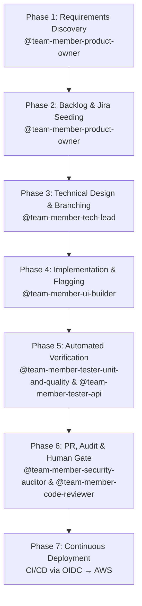

# OpenCode Autonomous Engineering System Blueprint

Architectural Blueprint, Decision Rationale, Multi-Model Diversity, and Operational Guardrail Protocols

---

## 1. Introduction & Core Objective

This document outlines the architectural blueprint, design philosophy, and operational guardrails of an enterprise-grade Multi-Agent Software Development System built inside OpenCode. The objective is to transform AI from a basic auto-complete snippet generator into a structured, highly disciplined, and autonomous engineering team capable of planning, executing, auditing, and continuously deploying production code.

Many AI coding setups fail because they treat the AI as a single omniscient developer. In reality, complex software engineering requires distinct division of labour, domain specialisation, rigorous governance, and automated verification. This framework establishes an interconnected ecosystem of sub-agents and expert advisory personas that mirror a high-performing human software organisation while maintaining strict human-in-the-loop safety controls.

**Core Philosophy:** The goal is not to eliminate human oversight, but to elevate human engineers from manual coders to strategic orchestrators — spending minutes reviewing pre-tested, fully compliant Pull Requests instead of hours writing baseline code.

---

## 2. Architectural Foundations & Delivery Paradigms

To avoid common pitfalls — scope creep, architectural drift, monolithic pull requests, and broken deployment pipelines — the system is governed by four non-negotiable delivery paradigms.

### 2.1 Walking Skeleton First (Story #1)

Story #1 of any new initiative is explicitly designated to build a minimal end-to-end slice: compiling code, running a passing test, building via CI/CD, and deploying a lightweight health-check endpoint to production. This establishes the delivery pipeline before any business logic is written, reducing integration risk from day one.

### 2.2 Trunk-Based Development over GitFlow

AI sub-agents perform best when feedback loops are extremely tight. All agent work is conducted on short-lived topic branches that merge directly back into `main` via small, frequent Pull Requests. Long-lived feature branches are strictly prohibited, avoiding merge conflicts, drift, and context staleness.

### 2.3 Continuous Deployment (Deploy Every Passing Commit)

Every commit merged to `main` automatically triggers the full testing suite. If unit, API, static analysis, and security checks pass, the CI/CD pipeline immediately executes a zero-downtime deployment to production.

### 2.4 Decoupling Deployment from Release (Feature Flags)

Incomplete user stories must never expose unready capabilities to end users. All incomplete features are wrapped in feature flags defaulting to `OFF` in production. This allows continuous deployment of passing code while granting the Product Owner complete control over when a feature is activated.

---

## 3. Multi-Agent Architecture & Multi-Model Allocation Strategy

### 3.1 Defence-in-Depth Model Allocation

To eliminate systematic blind spots, authoring agents (who write code and infrastructure) and auditing agents (who review and check security) run on distinct model families or reasoning architectures. This prevents auditors from inheriting the exact same training biases, logic gaps, or hallucinations as the authors.

### 3.2 Agent Model Matrix

| Agent | Primary Role | Bedrock Model | Family | Temp |
|---|---|---|---|---|---|
| @team-member-product-owner | Requirement Discovery & BDD Criteria | claude-3-5-sonnet | Claude (Anthropic) | 0.3 |
| @team-member-tech-lead | Planner & Sub-Agent Dispatcher | claude-3-5-sonnet | Claude (Anthropic) | 0.2 |
| @team-member-devops-engineer | Terraform, CDK & CI/CD | amazon-nova-pro | Amazon Nova | 0.1 |
| @team-member-architecture-guardian | C4 Models, Domain Boundaries & ADRs | claude-3-5-haiku | Claude (Anthropic) | 0.2 |
| @team-member-db-designer | Schemas, DDL Migrations & Queries | mistral-large-2 | Mistral AI | 0.1 |
| @team-member-ui-builder | Frontend & WCAG 2.2 AA Standards | claude-3-5-sonnet | Claude (Anthropic) | 0.3 |
| @team-member-tester-unit-and-quality / @team-member-tester-api | Test Suite Automation & Payload Checks | amazon-nova-lite | Amazon Nova | 0.1 |
| @team-member-security-auditor (Audit) | Cybersecurity Audit & OWASP Top 10 | mistral-large-2 | Mistral AI | 0.0 |
| @team-member-code-reviewer (Audit) | Static Code Review & SOLID Compliance | llama-3-1-70b | Llama (Meta) | 0.1 |

> **Security Note:** The Security Auditor agent is configured with a temperature of **0.0** — the lowest possible value. This is intentional: security auditing must prioritise deterministic, repeatable analysis over creative variation. Any hallucination in a security audit could introduce undetected vulnerabilities, so the system guarantees maximum rigour by eliminating output randomness.

### 3.3 Agent Responsibilities

**@team-member-product-owner** — Drives requirement discovery, challenges premature technical solutions, writes INVEST stories with BDD Gherkin criteria, mandates Walking Skeleton, manages feature flag release status, and tracks defects.

**@team-member-tech-lead** — Acts as system planner and engineering dispatcher. Advises on technical trade-offs, coordinates sub-agent execution pipelines, enforces Trunk-Based rules, and maintains architectural integrity.

**@team-member-devops-engineer** — Generates Infrastructure-as-Code (Terraform / AWS CDK), constructs CI/CD workflows, configures cloud OIDC authentication, and manages continuous deployment pipelines.

**@team-member-architecture-guardian** — Maintains C4/arc42 architectural models, enforces domain boundaries, reviews system design, and documents Architecture Decision Records (ADRs).

**@team-member-db-designer** — Designs relational and document schemas, writes migration scripts, optimises query performance with execution plan verification, and manages index strategies.

**@team-member-ui-builder** — Implements user interfaces conforming to accessibility standards (WCAG 2.2 AA / GOV.UK Design System) and wraps UI components in feature flags.

**@team-member-tester-unit-and-quality** — Writes fast, isolated unit tests with high branch coverage prior to PR creation.

**@team-member-tester-api** — Verifies REST/GraphQL API contracts, end-to-end payload validations, and integration boundary tests.

**@team-member-security-auditor** — Audits code and IaC for vulnerability patterns, OWASP Top 10 risks, plaintext secrets, and aggressive IAM wildcards.

**@team-member-code-reviewer** — Performs static code reviews for readability, SOLID compliance, error handling, and maintainability before human review.

---

## 4. Expert Advisory System & Curation Strategy

When the Product Owner or Tech Lead faces complex trade-offs (e.g., relational vs. document database), the system consults specialised expert profiles to present an objective trade-off matrix.

> **Persona Creation:** These expert profiles were not manually written. An AI analysed hundreds of hours of public content — YouTube talks, conference presentations, published books, and technical courses — from each individual. This content was synthesised into a persona that captures their core principles, decision-making frameworks, and typical advice patterns. When consulted, the personas respond in a manner the real person likely would. They are not real, but the sheer volume of public material makes them feel remarkably authentic.

### 4.1 Pruning Expert Noise (Why Less is More)

Early iterations included dozens of expert profiles from YouTube educators, specific course creators, and niche authors. This created significant context noise, prompt dilution, and conflicting advice. After strict curation, the system consolidated down to **four industry-standard pillars**:

1. **Uncle Bob (Robert C. Martin)** — Author of *Clean Code* and SOLID principles. Consulted for domain decoupling, object-oriented design, and maintainability.
2. **Dave Farley** — Author of *Continuous Delivery*. Consulted for Trunk-Based Development rules, pipeline automation, and deployment safety.
3. **Kent Beck** — Creator of Extreme Programming and TDD. Consulted for test isolation, refactoring strategies, and unit test design.
4. **Alex Xu** — Author of *System Design Interview*. Consulted for high-level architecture trade-offs, scaling patterns, and database selection.

---

## 5. Visual Knowledge Graph Overview

The system architecture and agent relationships are captured in an interactive knowledge graph generated by graphify, providing a navigable map of the entire codebase and configuration.


> *Interactive version: open `graphify-out/graph.html` in a browser.*

### Cost Optimisation Through Graphify

graphify reduces token consumption and drives down operational costs by replacing expensive LLM re-reading of source files with cheap, deterministic local computation. Graphify's creator (Safi Shamsi) reports a 71.5× token reduction (~98.6% reduction) — distilling a typical 100,000-token codebase into roughly 1,400 tokens of graph structure. By injecting far less content into every prompt, the AI takes substantially longer to hallucinate, producing more reliable and focused reasoning, and a massive cost reduction on token usage.

- **AST Extraction is Free**: Code structure — classes, functions, imports, dependencies — is parsed locally using tree-sitter parsers. This runs at zero token cost, producing structured nodes and edges without any LLM call.
- **Cached Semantic Extraction**: Once entities and relationships are extracted from documentation or images, the results are cached on disk. Incremental updates (`graphify --update`) only re-process changed files, avoiding redundant API calls.
- **Subgraph Queries Over Full Files**: When an agent needs to understand a specific part of the system, it queries the graph for a scoped subgraph instead of loading every source file into context. This dramatically reduces the token footprint per session.
- **Community-Directed Navigation**: Community detection groups related code into clusters. Agents can jump directly to the relevant community rather than scanning the entire codebase, keeping context windows small and focused.

The result: agents spend tokens on reasoning and code generation, not on re-discovering what the graph already knows.

### Graph Statistics (Current)

| Metric | Value |
|---|---|
| Total Nodes | 97 |
| Total Edges | 87 |
| Communities | 10 |
| Extraction | 100% EXTRACTED |

### Community Breakdown

| Community | Nodes | Description |
|---|---|---|
| Language-Specific Standards | 20 | Product Owner responsibilities, user stories, Gherkin BDD, defect tracking |
| atlassian | 15 | MCP configuration, Jira URL, credentials, API tokens |
| Code Reviewer Agent | 13 | Security audits, clean code guidelines, language-specific standards |
| Non-Negotiable Rules | 11 | Database protocols, zero-downtime migrations, query analysis |
| GOV.UK Design Principles & Rules | 10 | UI builder specs, accessibility, typography, form patterns |
| opencode.json | 9 | Architectural Guardian, maintainability rules, living documentation |
| tech-lead.md | 8 | Orchestrator agent, engineering principles, session hygiene |
| DevOps & Infrastructure Specialist | 8 | AWS/GitHub OIDC, trunk-based deployment, CD pipelines |
| README.md | 2 | Root project overview |
| opencode-setup.md | 1 | OpenCode setup and configuration guide |

### God Nodes (Most Connected)

1. Product Owner / Business Analyst Agent — 12 edges
2. Non-Negotiable Rules — 6 edges
3. atlassian — 5 edges
4. Language-Specific Standards — 5 edges
5. GOV.UK Design Principles & Rules — 5 edges

### HTML Visualisation Features

The interactive graph (`graph.html`) includes:
- **XSS Prevention** — safe HTML escaping with `data-nid` attributes and document-level event delegation
- **Hyperedge Visualisation** — shaded region hulls with centroid labels for hyperedge groups
- **Interactive UI** — dynamic community filtering, select-all / indeterminate toggle, automatic node focus, and detail panels

---

## 6. Context Hygiene & Optimisation Protocols

### 6.1 Session Discipline

- **One Session Per User Story**: Each Jira story is executed in a fresh OpenCode session (`/new`). This prevents context pollution and cross-story contamination, reducing the risk of AI hallucination and keeping response quality consistently high.
- **Context Compaction**: For long sessions, run `/compact` to compress verbose output.

### 6.2 Graphify Integration

- **AST Parsing**: Uses local tree-sitter parsers at zero-token context cost.
- **Output Files**: Stores assets in `graphify-out/` (`graph.json`, `GRAPH_REPORT.md`, `graph.html`).
- **Automated Updates**: Git post-commit hook (`graphify hook install`) rebuilds the AST graph on every commit, ensuring the AI always has a fresh knowledge graph up to date for any new task.

---

## 7. Ecosystem Integrations & Governance Rules

### 7.1 Documentation Strategy

All system documentation, architectural decision records (ADRs), and living guides are maintained directly within GitHub — repository READMEs, markdown files in `docs/`, and GitHub Wiki/Pages — ensuring documentation stays version-controlled alongside code.

### 7.2 Jira Integration

Task tracking is integrated via the Atlassian MCP plugin:

```json
{
  "$schema": "https://opencode.ai/config.json",
  "mcp": {
    "atlassian": {
      "type": "local",
      "command": ["uvx", "mcp-atlassian"],
      "enabled": true,
      "environment": {
        "JIRA_URL": "https://your-domain.atlassian.net",
        "JIRA_USERNAME": "opencode-bot@yourdomain.com",
        "JIRA_API_TOKEN": "{env:JIRA_API_TOKEN}"
      }
    }
  }
}
```

#### Jira Protection & Defect Lifecycle

- **Dedicated Bot User**: OpenCode operates under a dedicated Jira service user with permissions restricted to Browse, Create, Edit, and Transition issues.
- **Revoked Delete Rights**: Delete Issues, Delete Comments, and Delete Attachments permissions are explicitly revoked. Any delete attempt returns 403 Forbidden.
- **Rejection Workflow**: Obsolete stories receive an explanatory comment, a "Reject" transition, and resolution set to "Won't Do."
- **Defect Tracking**: Pre-deployment defects are logged as Bug Sub-tasks under the parent User Story (blocking merge). Post-deployment defects are standalone Bug Issues linked via "caused by" for defect rate metrics.

### 7.3 GitHub Protection

- **Fine-Grained PATs**: OpenCode authenticates using Fine-Grained Personal Access Tokens scoped exclusively to targeted repositories. Administration permissions are set to **No Access**.
- **Branch Protection**: Direct commits to `main` are blocked. Mandatory Pull Requests, green CI status checks, and at least one human approval are required before merging.
- **History Protection**: Force pushes and branch deletions are permanently disabled on protected branches.

### 7.4 AWS Security & Passwordless OIDC

- **Zero Static Credentials**: No long-lived AWS Access Keys are stored in GitHub Secrets or the repository.
- **Short-Lived OIDC Tokens**: GitHub Actions authenticates to AWS using OpenID Connect to assume temporary IAM roles that expire automatically after pipeline execution.
- **Scoped IAM Roles**: Production IAM roles receive minimum required provisioning rights, with explicit deny guards on destructive operations (e.g., `s3:DeleteBucket`, `rds:DeleteDBInstance`).

### 7.5 Mandatory Git Commit Ticket Prefix

Every commit generated by any agent MUST be prefixed with the active Jira ticket key:

```sh
#!/bin/sh
JIRA_REGEX="([A-Z]{2,10}-[0-9]+)"
if ! grep -qE "$JIRA_REGEX" "$1"; then
  echo "ERROR: Commit rejected! Message must include a valid Jira key (e.g., [THREAT-123] feat: ...)"
  exit 1
fi
```

---

## 8. End-to-End Operational Workflow

The full operational sequence demonstrates how a requirement flows from initial prompt to production deployment:



**Phase 1 — Requirements Discovery**: Prompter submits a feature request. @team-member-product-owner interacts directly with the human to challenge premature solutionising, clarify business objectives, and refine the requirements. @team-member-product-owner verifies the proposed solution serves the end-user's needs based on today's accessibility and usability standards, including Government Digital Service (GDS) standards where applicable. Only once the request passes these checks and is deemed worthy of building does @team-member-product-owner pass the instruction to @team-member-tech-lead. Story #1 is always designated as the Walking Skeleton.

**Phase 2 — Backlog & Jira Seeding**: @team-member-product-owner creates INVEST stories with Gherkin BDD criteria and feature flag definitions in Jira, signaling @team-member-tech-lead.

**Phase 3 — Technical Design & Branching**: @team-member-tech-lead creates a short-lived topic branch from `main` and dispatches @team-member-architecture-guardian, @team-member-db-designer, and @team-member-devops-engineer to prepare infrastructure and domain models.

**Phase 4 — Implementation & Flagging**: @team-member-ui-builder and core developers write solution logic, wrapping unreleased capabilities in feature flags.

**Phase 5 — Automated Verification**: @team-member-tester-unit-and-quality and @team-member-tester-api run test suites, creating Bug Sub-tasks for any failing checks.

**Phase 6 — PR, Audit & Human Gate**: OpenCode opens a Pull Request. @team-member-security-auditor and @team-member-code-reviewer perform static audits. Automated CI runs linters and tests. A human engineer reviews and approves the PR.

**Phase 7 — Continuous Deployment**: PR merges to `main`. CI assumes the cloud IAM role via OIDC, executes infrastructure-as-code, and deploys to production.

---

## 9. How to Adapt This Blueprint

Teams looking to build a similar system can customise this blueprint with three key adaptations:

- **Cloud Platform**: Swap AWS OIDC roles for GCP Workload Identity Federation or Azure Managed Identities in `@team-member-devops-engineer.md`.
- **Issue Tracker**: Replace Jira API configuration with GitHub Issues or Linear in `@team-member-product-owner.md`.
- **UI Standards**: Customise `@team-member-ui-builder.md` to enforce your company's design system (e.g., Tailwind, Material UI, Salesforce Lightning) instead of GOV.UK standards.

---

## 10. Getting Started: Your First Prompt

### Recommended Approach

Start with **few details** and let @team-member-product-owner (PO) guide the discovery process:

1. **Open a fresh session** (`/new`) — one story per session
2. **Give a lightweight prompt** — a sentence or two about what you want to build
3. **Let your PO interview you** — they will ask about target audience, scope, constraints
4. **Refine together** — clarify business objectives, end-user needs, and acceptance criteria
5. **Your PO validates** — checks against accessibility and usability standards
6. **Your PO signals your Tech Lead** — only once requirements are worthy of building

### Sample First Prompt

```
@team-member-product-owner I want to build an Elevation of Privilege (EoP) card
game — a threat modelling exercise based on the STRIDE framework.
The goal is to help development teams learn to identify security
threats in a fun, interactive way. Can you help me define the
requirements and scope for this project?
```

Dumping everything at once overloads context and bypasses the PO validation gate. The PO is your requirements partner, not a passive note-taker.
