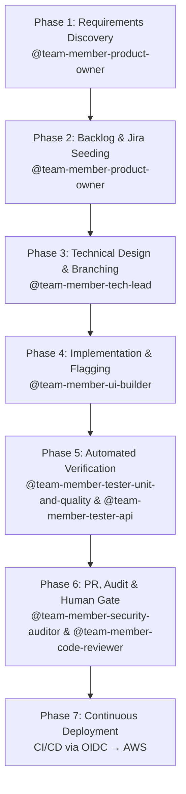

# OpenCode Autonomous Engineering System Blueprint

Architectural Blueprint, Decision Rationale, Multi-Model Diversity, and Operational Guardrail Protocols

---

## Table of Contents

- [1. Introduction & Core Objective](#1-introduction--core-objective)
- [2. Architectural Foundations & Delivery Paradigms](#2-architectural-foundations--delivery-paradigms)
  - [2.1 Walking Skeleton First](#21-walking-skeleton-first-story-1)
  - [2.2 Trunk-Based Development](#22-trunk-based-development-over-gitflow)
  - [2.3 Continuous Deployment](#23-continuous-deployment-deploy-every-passing-commit)
  - [2.4 Feature Flags](#24-decoupling-deployment-from-release-feature-flags)
  - [2.5 Continuous Flow over Timeboxes](#25-continuous-flow-over-timeboxes)
- [3. Multi-Agent Architecture & Model Allocation](#3-multi-agent-architecture--multi-model-allocation-strategy)
  - [3.1 Defence-in-Depth Model Allocation](#31-defence-in-depth-model-allocation)
   - [3.2 Agent Model Matrix](#32-agent-model-matrix)
   - [3.3 Agent Responsibilities](#33-agent-responsibilities)
   - [3.4 Provider Architecture](#34-provider-architecture)
     - [3.4.1 Amazon Bedrock Configuration](#341-amazon-bedrock-configuration)
     - [3.4.2 Provider Switching](#342-provider-switching-via-abstract-model-names)
- [4. Expert Advisory System](#4-expert-advisory-system--curation-strategy)
  - [4.1 Pruning Expert Noise](#41-pruning-expert-noise-why-less-is-more)
- [5. Knowledge Graph — Graphify](#5-knowledge-graph--graphify)
  - [5.1 Cost Optimisation Through Graphify](#51-cost-optimisation-through-graphify)
  - [5.2 Installation — Pinned Repo-Local](#52-installation--pinned-repo-local)
  - [5.3 The .graphify/ State Directory](#53-the-graphify-state-directory)
  - [5.4 Commands Worth Knowing](#54-commands-worth-knowing)
  - [5.5 How Agents Reach the Graph](#55-how-agents-reach-the-graph)
- [6. Context Hygiene & Optimisation](#6-context-hygiene--optimisation-protocols)
  - [6.1 Session Discipline](#61-session-discipline)
  - [6.2 Graphify Integration](#62-graphify-integration)
- [7. Ecosystem Integrations & Governance](#7-ecosystem-integrations--governance-rules)
  - [7.1 Documentation Strategy](#71-documentation-strategy)
  - [7.2 Jira Integration](#72-jira-integration)
  - [7.3 GitHub MCP Integration](#73-github-mcp-integration)
  - [7.4 AWS Security & OIDC](#74-aws-security--passwordless-oidc)
  - [7.5 Mandatory Git Commit Ticket Prefix](#75-mandatory-git-commit-ticket-prefix)
  - [7.6 Local Development Environment](#76-local-development-environment)
  - [7.7 Custom Commands](#77-custom-commands)
  - [7.8 Local Tool Permissions](#78-local-tool-permissions--bash-and-edit)
- [8. End-to-End Operational Workflow](#8-end-to-end-operational-workflow)
- [9. How to Adapt This Blueprint](#9-how-to-adapt-this-blueprint)
- [10. Prerequisites](#10-prerequisites)
- [11. Recommended Approach](#11-recommended-approach)
  - [11.1 Sample First Prompt](#111-sample-first-prompt)
- [12. Plugins](#12-plugins)
  - [12.1 Graphify](#121-graphify--knowledge-graph-installed-data-available)
  - [12.2 VibeGuard](#122-vibeguard--secret-redaction-active)
  - [12.3 DCP](#123-dynamic-context-pruning--dcp-active)
  - [12.4 Supermemory](#124-supermemory--cross-session-memory-active)
  - [12.5 Type Inject](#125-type-inject--typescript-type-context-installed)
   - [12.6 Notificator — REMOVED](#126-notificator--desktop-notifications-removed-2026-07-27)
  - [12.7 Scheduler](#127-scheduler--recurring-agent-jobs-installed)
  - [12.8 Goal Plugin](#128-goal-plugin--session-scoped-goals-installed)

## 1. Introduction & Core Objective

This document outlines the architectural blueprint, design philosophy, and operational guardrails of an enterprise-grade Multi-Agent Software Development System built inside OpenCode. The objective is to transform AI from a basic auto-complete snippet generator into a structured, highly disciplined, and autonomous engineering team capable of planning, executing, auditing, and continuously deploying production code.

Many AI coding setups fail because they treat the AI as a single omniscient developer. In reality, complex software engineering requires distinct division of labour, domain specialisation, rigorous governance, and automated verification. This framework establishes an interconnected ecosystem of sub-agents and expert advisory personas that mirror a high-performing human software organisation while maintaining strict human-in-the-loop safety controls.

**Core Philosophy:** The goal is not to eliminate human oversight, but to elevate human engineers from manual coders to strategic orchestrators — spending minutes reviewing pre-tested, fully compliant Pull Requests instead of hours writing baseline code.

---

## 2. Architectural Foundations & Delivery Paradigms

To avoid common pitfalls — scope creep, architectural drift, monolithic pull requests, and broken deployment pipelines — the system is governed by five non-negotiable delivery paradigms.

### 2.1 Walking Skeleton First (Story #1)

Story #1 of any new initiative is explicitly designated to build a minimal end-to-end slice: compiling code, running a passing test, building via CI/CD, and deploying a lightweight health-check endpoint to production. This establishes the delivery pipeline before any business logic is written, reducing integration risk from day one.

### 2.2 Trunk-Based Development over GitFlow

AI sub-agents perform best when feedback loops are extremely tight. All agent work is conducted on short-lived topic branches that merge directly back into `main` via small, frequent Pull Requests. Long-lived feature branches are strictly prohibited, avoiding merge conflicts, drift, and context staleness.

### 2.3 Continuous Deployment (Deploy Every Passing Commit)

Every commit merged to `main` automatically triggers the full testing suite. If unit, API, static analysis, and security checks pass, the CI/CD pipeline immediately executes a zero-downtime deployment to production.

### 2.4 Decoupling Deployment from Release (Feature Flags)

Incomplete user stories must never expose unready capabilities to end users. All incomplete features are wrapped in feature flags defaulting to `OFF` in production. This allows continuous deployment of passing code while granting the Product Owner complete control over when a feature is activated.

### 2.5 Continuous Flow over Timeboxes

Work is pulled continuously rather than batched into sprints. A sprint is a batching device that exists to give humans a commitment horizon and to protect their attention from mid-flight reprioritisation — costs an agent team does not incur, since agents retain nothing between sessions and so have no context-switch penalty to amortise. Batching work into a fortnight would therefore add latency without buying anything, and it contradicts §2.2 and §2.3, which already commit the system to small frequent merges and a deployment per passing commit. The tracker runs as a continuous-flow board with an explicit work-in-progress limit on *In Progress*, sized to the reviewer's capacity rather than to agent throughput; progress is measured by cycle time, not velocity. See [ADR-010](../../docs/adr/ADR-010-continuous-flow-over-sprints.md).

#### Why Scrum's Ceremonies Don't Transfer

Scrum's ceremonies are a coordination protocol for teammates who are **opaque** (their progress is invisible until spoken aloud), **forgetful over long horizons but continuous over short ones**, **fatigue-prone**, and **expensive to interrupt**. Agents are the inverse: transparent, stateless, tireless, and free to interrupt. Most of the protocol therefore addresses constraints that no longer exist — but not all of it, and the parts that survive are the parts that were never coping mechanisms in the first place.

| Scrum element | The human constraint it exists to address | Transfers? |
|---|---|---|
| Sprint timebox | Humans need a commitment horizon; switching context across days is costly | **No** — agents have no continuity between sessions, so there is no switch cost to amortise |
| Sprint Planning | Working memory can't hold a whole backlog; a small committed set is digestible | **No** — but prioritisation survives; the timebox goes, not the ordering |
| Daily Standup | A teammate's progress and blockers are invisible until spoken aloud | **No** — agent state is fully inspectable: transcript, tool calls, `git log` |
| Sprint Review | Stakeholder attention must be booked; humans need a social forcing function to show work | **Partly** — see the cadence risk below |
| Retrospective | Humans won't pause to reflect under delivery pressure; lessons accrete slowly | **Inverted** — agents retain nothing between sessions, so reflection must be an immediate write to a durable file, never a fortnightly meeting |
| Velocity / story points | Human throughput varies and can't be measured directly; relative sizing beats absolute estimates | **No** — agent cost is tokens, iterations and reviewer time |
| Sprint Goal | Focus and motivation for a group of people | **No** |
| Definition of Done | A quality contract, not a coping mechanism | **Yes** — and must get *stronger* |
| Product Backlog | Value ordering, not a coping mechanism | **Yes** |

**The bottleneck has inverted.** Agent throughput is nearly free; the scarce resource is the user's review and merge capacity — now structurally enforced, since branch protection routes every change through a pull request only the user can merge (§7.3). A WIP limit targets that bottleneck directly. Velocity is blind to it, because it measures the side of the system that is no longer constrained.

> **The cadence risk, stated honestly.** Scrum's rhythm also served the stakeholder: it guaranteed that work was shown and reflected upon at a known interval. Dropping every timebox risks "continuous" quietly becoming "never". The mitigation is an **event-driven retrospective**, triggered by a defect escape or any genuine surprise rather than by the calendar, whose output is written *immediately* to `AGENTS.md`, this blueprint, or an ADR — because those files are what the next session boots from, and a lesson left in a transcript is a lesson lost. This depends entirely on the user initiating it: nothing in the agent configuration triggers it automatically.

---

## 3. Multi-Agent Architecture & Multi-Model Allocation Strategy

### 3.1 Defence-in-Depth Model Allocation

To eliminate systematic blind spots, authoring agents (who write code and infrastructure) and auditing agents (who review and check security) run on distinct model families or reasoning architectures. This prevents auditors from inheriting the exact same training biases, logic gaps, or hallucinations as the authors.

### 3.2 Agent Model Matrix

| Agent | Primary Role | Model | Family (Zen) | Role | Temp |
|---|---|---|---|---|---|---|
| @team-member-product-owner | Requirement Discovery & BDD Criteria | `{env:MODEL_B}` | Anthropic | Author | 0.3 |
| @team-member-tech-lead | Planner & Sub-Agent Dispatcher | `{env:MODEL_A}` | Anthropic | Planner | 0.1 |
| @team-member-devops-engineer | Terraform, CDK & CI/CD | `{env:MODEL_C}` | OpenAI | Author | 0.1 |
| @team-member-architecture-guardian | C4 Models, Domain Boundaries & ADRs | `{env:MODEL_A}` | Anthropic | Audit | 0.2 |
| @team-member-db-designer | Schemas, DDL Migrations & Queries | `{env:MODEL_C}` | OpenAI | Author | 0.1 |
| @team-member-ui-builder | Frontend & WCAG 2.2 AA Standards | `{env:MODEL_C}` | OpenAI | Author | 0.3 |
| @team-member-tester-unit-and-quality | Unit Tests, Coverage & Mutation Testing | `{env:MODEL_C}` | OpenAI | Author | 0.1 |
| @team-member-tester-api | API Contract & Payload Verification | `{env:MODEL_C}` | OpenAI | Author | 0.1 |
| @team-member-security-auditor (Audit) | Cybersecurity Audit & OWASP Top 10 | `{env:MODEL_A}` | Anthropic | Audit | 0.0 |
| @team-member-code-reviewer (Audit) | Static Code Review & SOLID Compliance | `{env:MODEL_B}` | Anthropic | Audit | 0.1 |
| @team-member-performance-engineer | Load testing, k6, latency/throughput SLOs | `{env:MODEL_C}` | OpenAI | Author | 0.2 |
| **Expert Advisors** | | | | | |
| @expert-alex-xu | Distributed Systems & System Design | `{env:MODEL_A}` | Anthropic | Advisory | 0.2 |
| @expert-dave-farley | Continuous Delivery & TDD | `{env:MODEL_B}` | Anthropic | Advisory | 0.1 |
| @expert-kent-beck | TDD & XP | `{env:MODEL_B}` | Anthropic | Advisory | 0.2 |
| @expert-uncle-bod | SOLID & Clean Architecture | `{env:MODEL_A}` | Anthropic | Advisory | 0.2 |

> **Model References:** The `Model` column shows the abstract name (`{env:MODEL_X}`) that each agent's `model:` frontmatter field references in `.opencode/agents/*.md`. The actual model ID is resolved at runtime from the corresponding variable in `.env` — see [Provider Switching](#342-provider-switching-via-abstract-model-names). The `Family` column lists the vendor when using OpenCode Zen; it changes when switching providers.

> **Separation Invariant:** Every agent that authors code or infrastructure uses `MODEL_C` (OpenAI on Zen); every agent that audits it uses `MODEL_A` or `MODEL_B` (Anthropic on Zen). No artefact is therefore reviewed by the same model family that produced it, satisfying §3.1 without exception. @team-member-product-owner is the one Anthropic-family "Author", but it authors requirements rather than code and sits outside the review path, so it does not weaken the invariant. **When reassigning any model, re-check this table: moving an author onto Anthropic or an auditor onto OpenAI silently collapses the guarantee when using OpenCode Zen. The guarantee weakens if using a provider that lacks distinct model families.**

> **Security Note:** The Security Auditor agent is configured with a temperature of **0.0** — the lowest possible value. This is intentional: security auditing must prioritise deterministic, repeatable analysis over creative variation. Any hallucination in a security audit could introduce undetected vulnerabilities, so the system guarantees maximum rigour by eliminating output randomness.

### 3.3 Agent Responsibilities

**@team-member-product-owner** — Drives requirement discovery, challenges premature technical solutions, writes INVEST stories with BDD Gherkin criteria, mandates Walking Skeleton, manages feature flag release status, and tracks defects.

**@team-member-tech-lead** — Acts as system planner and engineering dispatcher. Advises on technical trade-offs, coordinates sub-agent execution pipelines, enforces Trunk-Based rules, and maintains architectural integrity.

**@team-member-devops-engineer** — Generates Infrastructure-as-Code (Terraform / AWS CDK), constructs CI/CD workflows, configures cloud OIDC authentication, and manages continuous deployment pipelines.

**@team-member-architecture-guardian** — Maintains C4/arc42 architectural models, enforces domain boundaries, reviews system design, and documents Architecture Decision Records (ADRs).

**@team-member-db-designer** — Designs relational and document schemas, writes migration scripts, optimises query performance with execution plan verification, and manages index strategies.

**@team-member-ui-builder** — Implements user interfaces conforming to accessibility standards (WCAG 2.2 AA / GOV.UK Design System) and wraps UI components in feature flags.

**@team-member-tester-unit-and-quality** — Writes fast, isolated unit tests with high branch coverage prior to PR creation.

**@team-member-tester-api** — Verifies REST/GraphQL API contracts, end-to-end payload validations, and integration boundary tests.

**@team-member-security-auditor** — Audits code and IaC for vulnerability patterns, OWASP Top 10 risks, plaintext secrets, and aggressive IAM wildcards.

**@team-member-code-reviewer** — Performs static code reviews for readability, SOLID compliance, error handling, and maintainability before human review.

#### Orchestration Topology — Who May Invoke Whom

Roles alone do not constrain delegation. By default every agent can invoke every other one through the `task` tool, which makes each of them a de facto orchestrator and permits arbitrary delegation chains. The intended topology is therefore *enforced* rather than merely described, via the `task` key in each agent's `permission:` frontmatter:

| Agent | `task` | Effect |
|---|---|---|
| @team-member-tech-lead | `allow` | the single orchestrator — may dispatch any agent |
| @team-member-product-owner | `"*": deny`, then `team-member-tech-lead: allow` | discovers requirements, authors stories, hands the batch to the Tech Lead |
| the 9 delivery agents and the 4 expert advisers | `deny` | do the work and report back to whoever invoked them |

The flow is one-directional: the Product Owner discovers requirements and writes stories, hands them to the Tech Lead, and the Tech Lead orchestrates the delivery agents. A delegate's findings return to its invoker as the Task result — which is why, for example, the Security Auditor needs no route *back* to the Tech Lead. When the Tech Lead invokes it, the verdict lands where it is needed by construction, with no agent-to-agent messaging mechanism to build and no possibility of a Tech Lead ↔ Auditor invocation loop.

> **`task: deny` is enforcement, not documentation — and it does not restrict you.** A denied subagent is removed from the Task tool description entirely, so the model never sees it and cannot attempt to invoke it; contrast a prompt instruction, which a model may simply ignore. A human is unaffected: every agent remains directly invocable from the `@` autocomplete menu regardless of `task` permissions. Note the flip side — an agent cannot be *forced* to delegate, so the Tech Lead's prompt still has to say what to dispatch and when.

> **Per-agent permissions live in frontmatter only.** Both `.opencode/opencode.json` (its `agent` block) and each agent's own `permission:` frontmatter can carry per-agent rules, and it is not documented whether the two merge per key or whether one replaces the other. Rather than depend on the answer, every per-agent rule now sits in frontmatter and the JSON `agent` block holds nothing but model assignments. The Product Owner's four Jira `allow`s moved there for exactly this reason: with a nested `permission` object in the JSON *and* a 14-key Jira block in its frontmatter, a replacing merge would have silently dropped one of the two.

### 3.4 Provider Architecture

By default, OpenCode routes all LLM requests through **OpenCode Zen**, a curated multi-vendor AI gateway operated by the OpenCode team. Zen is a **built-in provider** — it requires **no** `provider` block in `opencode.json`. The system also supports **Amazon Bedrock** as a built-in alternative provider (see [Amazon Bedrock Configuration](#341-amazon-bedrock-configuration)). Switching between providers is controlled via environment variable mappings declared in `.env` — see [Provider Switching](#342-provider-switching-via-abstract-model-names).

#### Connection Details

| Property | Value |
|---|---|
| Provider ID | `opencode` |
| Model reference format | `opencode/<model-id>` |
| Endpoint (Anthropic family) | `https://opencode.ai/zen/v1/messages` — `@ai-sdk/anthropic` |
| Endpoint (OpenAI family) | `https://opencode.ai/zen/v1/responses` — `@ai-sdk/openai` |
| Endpoint (Google family) | `https://opencode.ai/zen/v1/models/<model-id>` — `@ai-sdk/google` |
| Model catalogue | `https://opencode.ai/zen/v1/models` (authoritative, live) |
| Auth | Zen API key from https://opencode.ai/auth, registered via `/connect` in the TUI |
| Credential store | `~/.local/share/opencode/auth.json` under key `opencode` — **not** an env var, never in `.env` |

Zen is billed pay-as-you-go per request against workspace credits. Endpoint and SDK package are selected automatically per model family; the table above documents them for out-of-band API use only.

#### Model Resolution

Agent frontmatter and the top-level config reference abstract environment variable names (`{env:MODEL_A}` through `{env:MODEL_D}`) rather than direct model IDs. The actual model ID is resolved at runtime from the corresponding variable in `.env`:

```yaml
---
description: Audits code for security, performance and Clean Code standards
mode: subagent
model: {env:MODEL_B}
temperature: 0.1
---
```

Defaults are set in `.opencode/opencode.json`:

```json
"model": "{env:MODEL_A}",
"small_model": "{env:MODEL_D}"
```

- `MODEL_A` — default for primary agents and any subagent that omits `model:` (see [Provider Switching](#342-provider-switching-via-abstract-model-names)).
- `MODEL_B` — mid-tier Anthropic reasoning, allocated to auditors and requirements.
- `MODEL_C` — OpenAI codex family, allocated to builders.
- `MODEL_D` — cheap model for session titles and summaries (`small_model`).

This indirection lets the operator switch between OpenCode Zen and Amazon Bedrock (or any future provider) by changing the four `MODEL_*` values in `.env` — no agent file or config changes needed.

#### Allocated Models

Four abstract model names map to the real provider-specific model IDs. All are non-deprecated as of 2026-07-27; prices are USD per 1M tokens (input / output) for the OpenCode Zen variant.

| Abstract | Model ID (Zen) | Vendor | Price | Allocated To |
|---|---|---|---|---|
| `MODEL_A` | `opencode/claude-opus-5` | Anthropic | $5.00 / $25.00 | Tech Lead, Architecture Guardian, Security Auditor, Alex Xu, Uncle Bob |
| `MODEL_B` | `opencode/claude-sonnet-4-6` | Anthropic | $3.00 / $15.00 | Product Owner, Code Reviewer, Dave Farley, Kent Beck |
| `MODEL_C` | `opencode/gpt-5.3-codex` | OpenAI | $1.75 / $14.00 | DevOps, DB Designer, UI Builder, both Testers, Performance Engineer |
| `MODEL_D` | `opencode/gemini-3.5-flash-lite` | Google | $0.30 / $2.50 | `small_model` — titles and summaries only |

#### Deprecation Watch

Zen retires models on published dates (see the Deprecated models table at https://opencode.ai/docs/zen). Retired IDs stay listed in the catalogue for a period but must not be used. Already retired and explicitly avoided here:

- `gpt-5.2-codex`, `gpt-5.1-codex`, `gpt-5.1-codex-max`, `gpt-5.1-codex-mini`, `gpt-5-codex` — retired 2026-07-23
- `claude-sonnet-4` — retired 2026-06-15; `claude-opus-4-1` — retires 2026-08-05

Re-check this list before changing any agent's model.

#### <span id="341-amazon-bedrock-configuration"></span> Amazon Bedrock Configuration

Amazon Bedrock is a **built-in provider** in OpenCode — no npm package installation is required. It is declared in `.opencode/opencode.json` alongside the existing configuration:

```json
"provider": {
  "amazon-bedrock": {
    "options": {
      "region": "{env:AWS_REGION}"
    }
  }
}
```

##### Required Environment Variables (`.env`)

| Variable | Purpose |
|---|---|
| `AWS_ACCESS_KEY_ID` | AWS IAM access key |
| `AWS_SECRET_ACCESS_KEY` | AWS IAM secret key |
| `AWS_REGION` | AWS region (e.g. `eu-west-2`) |

To use Bedrock, map the four abstract model names to Bedrock model IDs in `.env`:

| Abstract | Example Bedrock ID |
|---|---|
| `MODEL_A` | `amazon-bedrock/eu.anthropic.claude-opus-5-v1:0` |
| `MODEL_B` | `amazon-bedrock/eu.anthropic.claude-sonnet-4-6-v1:0` |
| `MODEL_C` | `amazon-bedrock/eu.amazon.nova-pro-v1:0` |
| `MODEL_D` | `amazon-bedrock/eu.amazon.nova-lite-v1:0` |

Bedrock model IDs follow the format `amazon-bedrock/<region>.<vendor>.<model-version>`. Available models depend on your AWS account's Bedrock access — verify with `aws bedrock list-foundation-models`.

> **Limitation:** Unlike OpenCode Zen, Bedrock does not offer a `gpt-5.3-codex` equivalent. The mapping for `MODEL_C` above uses Amazon Nova Pro as a substitute. If your use case requires OpenAI codex-specific behaviour, keep `MODEL_C` pointed at `opencode/gpt-5.3-codex` while switching the other three to Bedrock.

#### <span id="342-provider-switching-via-abstract-model-names"></span> Provider Switching via Abstract Model Names

The mapping from abstract names to real model IDs lives entirely in `.env` (gitignored):

```bash
# OpenCode Zen (default — no AWS credentials needed)
MODEL_A=opencode/claude-opus-5
MODEL_B=opencode/claude-sonnet-4-6
MODEL_C=opencode/gpt-5.3-codex
MODEL_D=opencode/gemini-3.5-flash-lite

# Or AWS Bedrock (uncomment the block below, fill AWS credentials)
# MODEL_A=amazon-bedrock/eu.anthropic.claude-opus-5-v1:0
# MODEL_B=amazon-bedrock/eu.anthropic.claude-sonnet-4-6-v1:0
# MODEL_C=amazon-bedrock/eu.amazon.nova-pro-v1:0
# MODEL_D=amazon-bedrock/eu.amazon.nova-lite-v1:0
```

##### To Switch Providers

1. Edit `.env` — comment the active block, uncomment the target block.
2. Fill in any required credentials (OpenCode Zen needs none; Bedrock needs `AWS_ACCESS_KEY_ID`, `AWS_SECRET_ACCESS_KEY`, and `AWS_REGION`).
3. **Restart opencode** — config is read at startup only.

##### Agent-to-Abstract Mapping

| Abstract | Used By |
|---|---|
| `MODEL_A` (best) | Main model, @team-member-tech-lead, @team-member-architecture-guardian, @team-member-security-auditor, @expert-alex-xu, @expert-uncle-bod |
| `MODEL_B` (mid) | @team-member-code-reviewer, @expert-kent-beck, @expert-dave-farley, @team-member-product-owner |
| `MODEL_C` (coder) | @team-member-devops-engineer, @team-member-db-designer, @team-member-performance-engineer, @team-member-tester-api, @team-member-tester-unit-and-quality, @team-member-ui-builder |
| `MODEL_D` (small) | `small_model` — titles and summaries |

> **Migration note:** Previously each agent referenced a hardcoded model ID (e.g. `opencode/claude-sonnet-4-6`) in its `model:` frontmatter. These were replaced with `{env:MODEL_B}` etc. in a single batch update — no per-agent changes are needed to switch providers going forward.

---

## 4. Expert Advisory System & Curation Strategy

When the Product Owner or Tech Lead faces complex trade-offs (e.g., relational vs. document database), the system consults specialised expert profiles to present an objective trade-off matrix.

> **Persona Creation:** These expert profiles were not manually written. An AI analysed hundreds of hours of public content — YouTube talks, conference presentations, published books, and technical courses — from each individual. This content was synthesised into a persona that captures their core principles, decision-making frameworks, and typical advice patterns. When consulted, the personas respond in a manner the real person likely would. They are not real, but the sheer volume of public material makes them feel remarkably authentic.

### 4.1 Pruning Expert Noise (Why Less is More)

Early iterations included dozens of expert profiles from YouTube educators, specific course creators, and niche authors. This created significant context noise, prompt dilution, and conflicting advice. After strict curation, the system consolidated down to **four industry-standard pillars**:

1. **Uncle Bob (Robert C. Martin)** — Author of *Clean Code* and SOLID principles. Consulted for domain decoupling, object-oriented design, and maintainability.
2. **Dave Farley** — Author of *Continuous Delivery*. Consulted for Trunk-Based Development rules, pipeline automation, and deployment safety.
3. **Kent Beck** — Creator of Extreme Programming and TDD. Consulted for test isolation, refactoring strategies, and unit test design.
4. **Alex Xu** — Author of *System Design Interview*. Consulted for high-level architecture trade-offs, scaling patterns, and database selection.

---

## 5. Knowledge Graph — Graphify

Graphify turns the repository into a queryable graph, so an agent can ask a targeted question instead of grepping the whole tree. It is a CLI plus a small OpenCode plugin — no service, no daemon, no account.


> **The screenshot is historical.** It came from the `graph.html` viewer Graphify shipped before 0.17. That viewer no longer exists — the visual export is now `graphify studio`, a self-contained static bundle. The image is kept because it conveys the shape of the idea, not because the current command set reproduces it.

### 5.1 Cost Optimisation Through Graphify

graphify reduces token consumption and drives down operational costs by replacing expensive LLM re-reading of source files with cheap, deterministic local computation. Graphify's creator (Safi Shamsi) reports a 71.5× token reduction (~98.6% reduction) — distilling a typical 100,000-token codebase into roughly 1,400 tokens of graph structure. By injecting far less content into every prompt, the AI takes substantially longer to hallucinate, producing more reliable and focused reasoning, and a massive cost reduction on token usage.

- **AST Extraction is Free**: Code structure — classes, functions, imports, dependencies — is parsed locally using tree-sitter parsers. This runs at zero token cost, producing structured nodes and edges without any LLM call.
- **Cached Semantic Extraction**: Once entities and relationships are extracted from documentation or images, the results are cached on disk. Incremental updates (`graphify update .`) only re-process changed files, avoiding redundant API calls.
- **Subgraph Queries Over Full Files**: When an agent needs to understand a specific part of the system, it queries the graph for a scoped subgraph instead of loading every source file into context. This dramatically reduces the token footprint per session.
- **Community-Directed Navigation**: Community detection groups related code into clusters. Agents can jump directly to the relevant community rather than scanning the entire codebase, keeping context windows small and focused.

The result: agents spend tokens on reasoning and code generation, not on re-discovering what the graph already knows.

### 5.2 Installation — Pinned Repo-Local

The CLI is pinned inside the repository rather than installed globally, so the version is reviewable in a diff:

| Path | Role |
|---|---|
| `tools/graphify/package.json` | pins `@sentropic/graphify` at an exact version — no caret |
| `tools/graphify/package-lock.json` | committed, so the whole transitive tree is reproducible |
| `tools/graphify/node_modules/` | gitignored — recreate with `npm install --ignore-scripts` in that directory |
| `.envrc` | `PATH_add tools/graphify/node_modules/.bin`, so the bare `graphify` command resolves from the repo root |

The only global prerequisite is **Node ≥ 20** (`brew install node`). After a fresh clone: `cd tools/graphify && npm install --ignore-scripts`, then `direnv allow` at the root.

> **`--ignore-scripts` is deliberate.** The dependency tree ships install/prepare scripts (`node-gyp-build-optional-packages`, `opencollective-postinstall`). Graphify does not need them to run, so they are not executed. Keep the flag when reinstalling.

### 5.3 The `.graphify/` State Directory

`graphify update .` writes everything into `.graphify/` at the repository root:

| Path | Contents |
|---|---|
| `.graphify/graph.json` | the graph itself — nodes, edges, communities |
| `.graphify/GRAPH_REPORT.md` | human-readable report: summary, god nodes, surprising connections, communities, knowledge gaps, suggested questions |
| `.graphify/manifest.json`, `scope.json`, `branch.json`, `worktree.json` | build provenance — what was scanned, on which branch and worktree |
| `.graphify/cache/ast/`, `cache/stat-index.json` | per-file AST cache that makes rebuilds incremental |
| `.graphify/label-instructions/`, `description-instructions/` | assistant-mode enrichment prompts (see below) |

`.graphify/` is gitignored — it is generated, machine-specific, and regenerated per clone with one command.

> **The directory is `.graphify/`, not `graphify-out/`.** Graphify moved its state directory in 0.17. Anything still pointing at `graphify-out/` silently sees no graph, and that is exactly why the OpenCode plugin sat inert: its existence check named the old path, so it never fired. `graphify migrate-state` converts a legacy tree; `.gitignore` still lists `graphify-out/` so an unmigrated checkout stays clean.

> **No graph statistics are recorded in this document, deliberately.** They used to be: §5.2–§5.4 carried a node/edge/community count, a community table and a god-node list, all pinned to commit `d2c81212` and by 2026-08-02 more than a hundred commits stale — describing an artefact that was not even on disk. Numbers that live in a generated file belong only in that file. Read `.graphify/GRAPH_REPORT.md`, or run `graphify summary`.

### 5.4 Commands Worth Knowing

| Command | Use |
|---|---|
| `graphify update .` | rebuild the code graph — the one command to run after significant changes |
| `graphify check-update` | report whether the graph is stale, without rebuilding |
| `graphify query "<question>"` | scoped subgraph for a question — the cheap alternative to grepping |
| `graphify summary` | compact first-hop orientation for a fresh session |
| `graphify explain <node>` / `tree <node>` / `path <a> <b>` | inspect one node, its subtree, or the route between two |
| `graphify review-analysis` | blast radius, bridges and test gaps for a change |
| `graphify studio` | static visual export, the replacement for the old `graph.html` |
| `graphify export` | wiki, Obsidian, SVG, GraphML, Neo4j Cypher |
| `graphify serve` | stdio MCP server over `graph.json` (not currently wired — see §5.5) |
| `graphify migrate-state` | convert a pre-0.17 `graphify-out/` tree |

> **Enrichment is unfilled, and that is a choice.** `--description-mode` and `--label-mode` default to `assistant`, which makes **zero API calls**: instead of calling a model, Graphify writes prompt files under `.graphify/label-instructions/` and `.graphify/description-instructions/` for an assistant to answer, then re-ingests them on the next `graphify update`. Until somebody fills them, communities keep generic `Community N` names and nodes have empty descriptions. The graph is fully queryable regardless — this is polish, not a prerequisite. Switching to `--label-mode direct` would call a model and cost tokens.

### 5.5 How Agents Reach the Graph

Two routes, both deliberately low-tech:

1. **`.opencode/plugins/graphify.js`** — a local plugin loaded by directory convention (it is *not* an entry in the `plugin` array of `.opencode/opencode.json`). It hooks `tool.execute.before`, and once per session, if `.graphify/graph.json` exists, prepends a one-line reminder to the first `bash` command pointing at `graphify query` and the report.
2. **Three agent prompts** — `team-member-architecture-guardian`, `team-member-code-reviewer` and `team-member-tech-lead` each instruct the agent to run `graphify query` or read `.graphify/GRAPH_REPORT.md` before reading raw files.

> **Known gap — the plugin registers no tools.** It emits a *reminder*, which a model may ignore, and it mutates the first `bash` command in order to do so. Two better options exist and are not yet taken: `graphify serve` would expose the graph as a real MCP server in the `mcp` block, giving agents callable tools; `graphify opencode install` would generate the vendor's own AGENTS.md section plus `tool.execute.before` plugin, replacing the hand-rolled one. Either is a deliberate decision rather than a cleanup — revisit when the reminder proves insufficient.

> **Do not put backticks or `$(...)` in the plugin's reminder string.** It is interpolated into a double-quoted `echo`, so shell substitution applies — an earlier version corrupted tool output and silently executed the very command it meant to suggest. The commands are joined with `;` rather than `&&` because PowerShell 5.1 rejects `&&`, which would break the first `bash` call of every session on Windows.

## 6. Context Hygiene & Optimisation Protocols

### 6.1 Session Discipline

- **One Session Per User Story**: Each Jira story is executed in a fresh OpenCode session (`/new`). This prevents context pollution and cross-story contamination, reducing the risk of AI hallucination and keeping response quality consistently high.
- **Context Compaction**: For long sessions, run `/compact` to compress verbose output.

### 6.2 Graphify Integration

- **AST Parsing**: Uses local tree-sitter parsers at zero-token context cost.
- **Output Files**: Stores assets in `.graphify/` (`graph.json`, `GRAPH_REPORT.md`, plus caches and build provenance) — see §5.3.
- **Rebuilding**: Run `graphify update .` after significant changes; `graphify check-update` reports staleness without rebuilding. Rebuilds are incremental, using the AST cache.

> **Known gap — rebuilds are manual.** `graphify hook install` would add a `post-commit` hook that regenerates the graph on every commit, and it has deliberately **not** been run. This repository has no git hook infrastructure at all: `.git/hooks/` holds only the stock `*.sample` files and `core.hooksPath` is unset, so the `commit-msg` hook documented in §7.5 is also uninstalled. Hook management deserves one deliberate decision covering both, rather than two tools each installing their own. Until then a stale graph is possible — check with `graphify check-update` when the answers look wrong.

---

## 7. Ecosystem Integrations & Governance Rules

### 7.1 Documentation Strategy

All system documentation, architectural decision records (ADRs), and living guides are maintained directly within GitHub — repository READMEs, markdown files in `docs/`, and GitHub Wiki/Pages — ensuring documentation stays version-controlled alongside code.

### 7.2 Jira Integration

Task tracking is integrated via the Atlassian MCP plugin:

```json
{
  "$schema": "https://opencode.ai/config.json",
  "mcp": {
    "atlassian": {
      "type": "local",
      "command": ["uvx", "mcp-atlassian"],
      "enabled": true,
      "environment": {
        "JIRA_URL": "https://your-domain.atlassian.net",
        "JIRA_USERNAME": "opencode-bot@yourdomain.com",
        "JIRA_API_TOKEN": "{env:JIRA_API_TOKEN}"
      }
    }
  }
}
```

#### Credential Setup (read this before minting a token)

> **The API token must be created while signed in as the bot account itself — not as your administrator or personal account.** Atlassian Basic auth pairs `JIRA_USERNAME` with the token, and the token is only valid for the account that minted it. An administrator token will not work for the bot's email, no matter how much authority that administrator has. This is the single most common way to get the integration wrong, and it cost real time here.

The failure is nastier than a plain rejection, because the mismatch does not announce itself:

- `GET /rest/api/3/myself` returns **401**, but that endpoint is not what the tools call.
- Ordinary reads such as `GET /rest/api/3/project/search` return **HTTP 200 with `total: 0`** — Jira silently falls back to *anonymous* access rather than refusing.

So a wrong-owner token looks exactly like an empty or non-existent project. You will be told "no project could be found with key PROJECTKEY" and conclude the project is missing, when in fact you were never authenticated. Always confirm identity explicitly before diagnosing anything else:

```bash
set -a; . ./.env; set +a
curl -s -u "$JIRA_USERNAME:$JIRA_API_TOKEN" \
  -H "Accept: application/json" "$JIRA_URL/rest/api/3/myself" | jq '.accountId, .displayName, .emailAddress'
```

This must return the **bot's** account. If it returns your own name, the token belongs to you and the integration is misconfigured.

Two further operational notes:

- **Quote the credential inline.** Building `AUTH="-u $USER:$TOKEN"` and then running `curl $AUTH ...` sends the request *unauthenticated* — producing the same misleading `total: 0`. Always write `-u "$JIRA_USERNAME:$JIRA_API_TOKEN"` directly on the command.
- **Restart OpenCode after changing `.env`.** `opencode.json` resolves `{env:JIRA_API_TOKEN}` when it spawns the `uvx mcp-atlassian` subprocess, so the value is baked in at start-up. Editing `.env` in place has no effect on a running session, and the MCP tools will keep using the old credential while your shell uses the new one.

#### Jira Protection & Defect Lifecycle

- **Dedicated Bot User**: OpenCode operates under a dedicated Jira service user with permissions restricted to Browse, Create, Edit, and Transition issues.
- **Revoked Delete Rights**: Delete Issues, Delete Comments, and Delete Attachments permissions are explicitly revoked. Any delete attempt returns 403 Forbidden. Cleanup of test or obsolete tickets is therefore a human action in the Jira UI — deliberately, so the agents cannot destroy tracker history.
- **Reporter Cannot Be Spoofed**: The bot lacks the Modify Reporter permission, so every issue it raises is unambiguously attributed to the bot. This is what makes the service account worth the setup cost over reusing a personal token.
- **Rejection Workflow**: Obsolete stories receive an explanatory comment, a "Reject" transition, and resolution set to "Won't Do."
- **Defect Tracking**: Pre-deployment defects are logged as Bug Sub-tasks under the parent User Story (blocking merge). Post-deployment defects are standalone Bug Issues linked via "caused by" for defect rate metrics.

#### Project Shape Constraints

The target project is **team-managed** (`style: next-gen`), which changes the available fields in ways that break otherwise-correct tool calls:

- **There is no `Components` field.** Passing `components` to `jira_create_issue` fails. Team-managed projects drop it entirely.
- **Epics are linked through `Parent`**, not the classic company-managed Epic Link custom field.
- **Story points are `Story point estimate`.**
- Issue types are `Epic`, `Subtask`, `Task`, `Story` — a Story requires only `project`, `issuetype` and `summary`.

Confirm the shape rather than assuming it, since a company-managed project would behave differently:

```bash
curl -s -u "$JIRA_USERNAME:$JIRA_API_TOKEN" \
  "$JIRA_URL/rest/api/3/project/$JIRA_PROJECT_KEY" | jq '.style, .projectTypeKey'
```

**Description formatting survives intact.** Markdown sent to `jira_create_issue` is stored as proper ADF: fenced ```` ```gherkin ```` blocks keep their language attribute, and `- [ ]` items become real interactive Jira checkboxes rather than plain bullets. The Product Owner's story template — Gherkin acceptance criteria plus a Definition of Done checklist — therefore renders correctly and needs no downgrading.

> Note that `mcp-atlassian` echoes back a **wiki-markup** rendering of what you sent, which looks lossy (`{noformat}` blocks, bullets instead of checkboxes). That echo is not what Jira persisted. Verify against the stored ADF via `GET /rest/api/3/issue/<KEY>?fields=description` before concluding anything was lost — an agent reading only the echo will report false corruption.

#### Agent-Level Jira Permissions (client-side layer)

The controls above are enforced by Jira itself and apply to *every* agent equally, because all agents share the one bot credential. A second, client-side layer in OpenCode decides **which agents may even attempt** a given operation. Both layers are required: Jira alone cannot distinguish the Product Owner from the Performance Engineer.

Rules live in the `permission` block of `.opencode/opencode.json` (global default) and in `permission:` frontmatter of individual `.opencode/agents/*.md` files (per-agent override). Agent rules take precedence over global ones. Every per-agent rule lives in frontmatter and nowhere else — the JSON `agent` block carries model assignments only; see *Orchestration Topology* in §3.3 for why.

Three profiles are in force across the 15 agents:

| Profile | Agents | Jira reads | Jira writes |
|---|---|---|---|
| **Write-capable** | `product-owner`, `tech-lead` | allow | **ask** (human confirms each) |
| **Read-only** | the 9 delivery agents — architecture-guardian, code-reviewer, db-designer, devops-engineer, performance-engineer, security-auditor, tester-api, tester-unit-and-quality, ui-builder | allow | **deny** |
| **No access** | the 4 expert advisers — alex-xu, dave-farley, kent-beck, uncle-bod | deny | deny |

Rationale: the backlog is a shared source of truth, so *narrating* work into it is a product decision, not an engineering one. Delivery agents read tickets freely but cannot alter them; advisory experts have no business touching a tracker at all. Two write-capable agents keeps accountability legible.

> **`deny` and `ask` are not the same mechanism.** `deny` removes the tool from the model's toolset entirely — the agent cannot see or name it, and no request ever reaches Jira. `ask` keeps the tool and gates each individual call on human approval. Only `deny` is a hard guarantee: `opencode --auto` auto-approves everything that is not explicitly denied.

##### Maintaining the rules

Keys are glob patterns (`*` = zero or more characters) matched against tool names, and **the last matching rule wins** — so the broad catch-all goes first and exceptions come after. Two traps, both of which bit us during implementation:

- **Exact names silently under-match.** `atlassian_jira_move_issue` does not cover `atlassian_jira_move_issues_to_backlog` — and `atlassian_jira_delete_issue` names no tool at all, because this MCP server exposes no delete verb. Both keys were pinned to `deny`, and both matched nothing: the config *read* as though destructive moves and deletions were hard-blocked while the only real move tool fell through to `atlassian_jira_move_*: ask`. Fixed on 2026-08-02 — the two dead keys were deleted outright and `atlassian_jira_move_*` now carries `deny`. Prefer a glob over an exact name whenever the tool family might grow, and remember that a `deny` on a non-existent tool is indistinguishable from a working control by inspection.
- **Broad patterns over-match reads.** `atlassian_jira_batch_*` wrongly caught the read-only `atlassian_jira_batch_get_changelogs`, which now carries an explicit `allow` after it.

Neither trap is visible by inspection. When adding rules, enumerate every `atlassian_jira_*` tool, resolve each against the rule list with last-match-wins semantics, and confirm that reads and writes land where intended. Verify at runtime with a fresh `opencode run` process — permission config is read at process start, so an already-running session will not pick up changes.

#### Why Agents Share One Jira Identity

Every ticket, comment and transition made by any of the 15 agents is attributed to the single `OpenCode Bot` account. A reasonable instinct is to give the Tech Lead its own Jira account so that its actions are distinguishable from the Product Owner's. Resist it — and understand precisely *why*, because the obvious reason is not the real one.

**The mechanical reason (weak, and surmountable).** The `mcp.atlassian` entry holds exactly one credential pair — a single `JIRA_USERNAME` / `JIRA_API_TOKEN` — and one `uvx mcp-atlassian` subprocess serves all 15 agents. That is a property of *this configuration*, **not a limit imposed by Atlassian**: any account may mint multiple tokens, and separate accounts may each hold their own. Binding one agent to a different identity needs only a second MCP server entry with its own environment variables; tools are namespaced by server name, so a `atlassian-tl` server would expose `atlassian-tl_jira_*` alongside `atlassian_jira_*`, gated by the same permission globs. That is roughly ten minutes of configuration. **Shared identity is therefore not the blocker.**

**The real reason (decisive).** The only split that would meaningfully separate a Tech Lead from a Product Owner is *"may create Subtasks but not Stories"* — and **Jira cannot express it.** Of the 48 permission keys in `GET /rest/api/3/permissions`, the only create-related ones are `CREATE_ISSUES` (project-scoped), `CREATE_ATTACHMENTS` (project-scoped), and the global `CREATE_PROJECT` / `CREATE_SHARED_OBJECTS`. There is **no per-issue-type create permission anywhere in Jira's model, in either project style.** Migrating from team-managed to company-managed would not change this; it would only add per-account differences on EDIT / DELETE / TRANSITION / ADMINISTER, plus the possibility of a role validator on a per-issue-type workflow's create transition — workflow surgery, not permissions, and untested here. Two accounts would carry **identical effective permissions**, leaving enforcement client-side in OpenCode's `permission` rules, exactly where it already lives.

> **A second Jira account buys attribution, not security.** Cheaper attribution is already available: the Product Owner creates Epics and Stories while the Tech Lead creates Subtasks, transitions and comments — so issue type plus action already identifies the actor. An `authored-by:tech-lead` label would make it explicit without adding a second live credential to `.env`.

Revisit only if other humans join the project and need genuine audit separation, or if the Tech Lead begins writing at a volume where mixed attribution becomes hard to read.

### 7.3 GitHub MCP Integration

Repository, issue, pull request and Actions context is read through GitHub's **official remote MCP server**, configured alongside Atlassian in `opencode.json`:

```json
"github": {
  "type": "remote",
  "url": "https://api.githubcopilot.com/mcp/",
  "enabled": true,
  "headers": {
    "Authorization": "Bearer {env:GITHUB_TOKEN}",
    "X-MCP-Readonly": "true",
    "X-MCP-Toolsets": "repos,issues,pull_requests,actions"
  },
  "oauth": false,
  "timeout": 15000
}
```

> **This server is read-only by design.** All GitHub *writes* — branches, commits, pushes, PR creation and merges — go through the `gh` CLI via `bash`, not through MCP. That keeps one audited path for mutations instead of two, and means a misconfigured toolset cannot silently grant merge rights.

#### Why this shape

- **Remote, not local.** The previously documented local server did not exist. `@modelcontextprotocol/github` was never a real package, and `uvx` is the Python runner, so it could not have launched an npm package under any name. The obvious repair is also wrong: `@modelcontextprotocol/server-github` was deprecated on 2025-04-08 with "package no longer supported", development having moved to `github/github-mcp-server`. The remote server is the maintained path and needs no Docker image or cold start.
- **`X-MCP-Readonly: true`** restricts the exposed tools to reads.
- **`X-MCP-Toolsets`** is deliberately narrow. The full server exposes 100+ tools across ~20 toolsets; loading `all` would consume a large share of every agent's context for capability nobody uses. Four toolsets cover the actual need. Note that unknown *toolset* names are silently ignored, whereas an invalid name in the alternative `X-MCP-Tools` header prevents the server from starting.
- **`oauth: false`** disables OpenCode's OAuth auto-detection. Authentication is the PAT in `GITHUB_TOKEN`; without this the client may attempt a dynamic-registration flow that was never configured.
- **`timeout: 15000`** overrides the 5 000 ms default, which is tight for a first remote handshake.

#### Agent-Level GitHub Permissions

Read-only at the server is the primary control; the permission rules are defence in depth. If a future toolset change or insiders flag reintroduces write tools, they would otherwise arrive pre-approved under the permissive default.

| Profile | Agents | GitHub access |
|---|---|---|
| Experts | alex-xu, dave-farley, kent-beck, uncle-bob | `github_*: deny` — no repository access at all |
| Everyone else | the 9 delivery agents, Product Owner, Tech Lead | the named read tools allowed; everything else denied |

The global block is an **allow-list**: `github_*` is denied first, the specific read families are allowed after it, and a trailing `_write` deny closes the loop.

```jsonc
"github_*": "deny",
"github_get_*": "allow",
"github_list_*": "allow",
"github_search_*": "allow",
"github_issue_read": "allow",
"github_pull_request_read": "allow",
"github_actions_*": "allow",
"github_*_write": "deny"
```

`github_actions_*` needs its own line because `github_actions_get` and `github_actions_list` lead with the toolset name rather than the verb, so neither prefix rule reaches them. The same last-match-wins glob semantics described in §7.2 apply here.

> **Known gap — closed 2026-08-02: the deny-list matched no write tool.** The previous block denied `github_create_*`, `github_update_*`, `github_delete_*`, `github_merge_*`, `github_push_*`, `github_add_*`, `github_fork_*` and `github_request_copilot_review` — eight **verb-prefix** globs. But this server names its mutating tools with a `_write` **suffix**: `github_issue_write`, `github_pull_request_review_write`, `github_label_write`, `github_sub_issue_write`. None of the four matched any deny, so all four fell through to `github_*: allow`, and the only thing actually preventing agent writes was the remote `X-MCP-Readonly: true` header — a single gate, evaluated on someone else's server, in a configuration whose stated principle is defence in depth. Inverting to an allow-list changes the failure mode from "a new write tool is permitted until somebody notices" to "a new read tool is refused until somebody lists it", which is the direction a security default should fail in.

#### GitHub Protection

**Enabled on `main`** (verified against the live API, not aspirational):

- **Pull requests required.** Direct pushes to `main` are rejected. `enforce_admins` is **true**, so the rule binds repository administrators and the agent token as well — without that, protection would not restrain the agents at all, since they authenticate with an `admin: true` credential.
- **Green CI required.** The `build` status check must pass, in strict mode, so a branch must be up to date with `main` before merging.
- **Force pushes and branch deletions blocked** for everyone.
- **Approvals required: 0.** GitHub does not permit approving your own pull request, so on a single-maintainer repository any non-zero requirement would make every PR permanently unmergeable. The maintainer self-merges once `build` is green.

> **Known gap — token scope.** Authentication currently uses a **classic** PAT (`ghp_`) with `repo`, `project` and `write:org`, which grants `admin: true` on this repository and full read/write across *all* the owner's repositories. Because it holds admin rights it can also edit the protection rules above; branch protection therefore converts a silent direct push into a deliberate, auditable act rather than an absolute boundary. Closing this properly means a **fine-grained PAT scoped to this repository with Administration: No Access**, which pairs naturally with the pending rotation of `GITHUB_TOKEN`. Until then, do not describe the token as least-privilege.

### 7.4 AWS Security & Passwordless OIDC

- **Zero Static Credentials**: No long-lived AWS Access Keys are stored in GitHub Secrets or the repository.
- **Short-Lived OIDC Tokens**: GitHub Actions authenticates to AWS using OpenID Connect to assume temporary IAM roles that expire automatically after pipeline execution.
- **Scoped IAM Roles**: Production IAM roles receive minimum required provisioning rights, with explicit deny guards on destructive operations (e.g., `s3:DeleteBucket`, `rds:DeleteDBInstance`).

### 7.5 Mandatory Git Commit Ticket Prefix

Every commit generated by any agent MUST be prefixed with the active Jira ticket key:

```sh
#!/bin/sh
JIRA_REGEX="\[([A-Z]{2,10}-[0-9]+)\]"
if ! grep -qE "$JIRA_REGEX" "$1"; then
  echo "ERROR: Commit rejected! Message must include a valid Jira key (e.g., [EOP-123] feat: ...)"
  exit 1
fi
```

### 7.6 Local Development Environment

#### Environment Variables via direnv

Sensitive credentials (API keys, tokens) are never committed to the repository. The project uses [direnv](https://direnv.net/) to auto-load environment variables from a gitignored `.env` file when entering the project directory.

**Setup on a new clone:**

```bash
# 1. Install direnv (macOS)
brew install direnv

# 2. Add to ~/.zshrc
echo 'eval "$(direnv hook zsh)"' >> ~/.zshrc
source ~/.zshrc

# 3. Copy and populate the env file
cp .env.example .env   # if an example exists, or create manually
# Edit .env with your credentials:
#   JIRA_URL=...
#   JIRA_API_TOKEN=...
# NOTE: the Zen API key does NOT go here — register it with `/connect` in the
# TUI; OpenCode stores it in ~/.local/share/opencode/auth.json.
# NOTE: the Jira token must be minted while signed in AS THE BOT ACCOUNT, not
# as an administrator. It must match JIRA_USERNAME or Jira falls back to
# anonymous access and reads return an empty result set. See §7.2.

# 4. Allow direnv for this project
direnv allow
```

**How it works:**

- `.envrc` (tracked in git) contains only `dotenv` — a one-line directive telling direnv to load `.env`.
- `.env` (gitignored) holds all secrets.
- Every time you `cd` into the project directory, direnv automatically exports the variables into your shell.
- No manual `export` commands are needed.

#### Required Environment Variables

| Variable | Purpose |
|---|---|
| `JIRA_URL` | Atlassian instance URL |
| `JIRA_USERNAME` | Jira **bot** user email — must be the account that owns the token |
| `JIRA_API_TOKEN` | Jira API token, **minted while signed in as the bot**, not as an administrator (§7.2) |
| `JIRA_PROJECT_KEY` | Target project key for ticket creation |
| `GITHUB_TOKEN` | GitHub PAT (repo scope) |

The Zen API key is deliberately absent: it lives in `~/.local/share/opencode/auth.json`, not here.

After changing any of these, **restart OpenCode** — MCP subprocesses resolve `{env:...}` at spawn time, so a running session keeps the old values.

#### Maven Wrapper

The project uses the **Maven Wrapper** (`./mvnw`) for reproducible builds — no global Maven install required:

| Command | Purpose |
|---|---|
| `./mvnw compile` | Fast compile check |
| `./mvnw test` | Run all tests |
| `./mvnw verify` | Full verification with integration tests |
| `./mvnw spring-boot:run` | Start application on port 8080 |

Requires **Java 21+** (Eclipse Temurin recommended).

#### CI/CD Pipeline

Every push/PR to `main` triggers `.github/workflows/ci.yml` — runs `mvn verify` on `ubuntu-latest` with JDK 21 and uploads the built JAR. See [CI/CD Pipeline](../../docs/devops/ci-cd-pipeline.md) for details.

#### Rules Directory

The `.opencode/rules/` directory contains 15 reusable instruction snippets. They reach a model by exactly two routes, and nothing else:

1. **Always loaded** — the four cross-cutting rules listed in the `instructions` array of `.opencode/opencode.json`: `clean-architecture.md`, `security.md`, `git-commits.md`, `testing.md`. OpenCode resolves `instructions` entries as **file globs**, and combines them with `AGENTS.md` (which loads automatically and must not be listed again).
2. **Read on demand** — the remaining eleven are named in a `## Required Reading` section at the end of the agent prompts that need them, and that agent reads them with the `read` tool when it starts relevant work. The routing is: `api-design` + `error-handling` → tester-api, code-reviewer, architecture-guardian; `database` + `configuration` → db-designer; `build-quality` + `observability` → devops-engineer, tester-unit-and-quality, code-reviewer; `performance-testing` → performance-engineer; `resilience` + `caching` → architecture-guardian, code-reviewer; `feature-flags` → tech-lead, product-owner, devops-engineer; `versioning` → devops-engineer, tech-lead.

This keeps the always-on instruction budget at roughly 1.6 KB instead of the ~12 KB it would cost to load all fifteen into every session and every subagent.

> **Known gap — the `instructions` array was inert until 2026-08-02.** It previously held fifteen inline prose Markdown *strings* rather than paths. OpenCode glob-resolves each entry against the filesystem and silently discards anything that matches no file — with no warning and no literal-text fallback — so roughly 10 KB of engineering standards reached no model at all, and every `.opencode/rules/*.md` file was orphaned. If you add a rule, add its **path** here; never paste its contents. Verify a change took effect behaviourally: after restarting OpenCode, a phrase unique to the rule file should be visible in the agent's context.

### 7.7 Custom Commands

The `.opencode/commands/` directory provides three ad-hoc multi-agent orchestration commands:

- **`ask-all-experts`** — Triggers all expert sub-agents in parallel and synthesises their responses into a comparison matrix.
- **`ask-all-team-members`** — Triggers all team-member sub-agents in parallel and synthesises their responses.
- **`multi`** — Triggers specific `@agent` mentions from the prompt in parallel and synthesises their responses.

These complement the `/goal` command (see §12.8) for when you want to poll multiple agents at once without setting a persistent goal.

> **The directory is `commands/`, plural.** It was `command/` (singular) until 2026-08-02, which is almost certainly why these three never appeared in the slash-command list — OpenCode loads project commands from `.opencode/commands/` only. `/goal` was unaffected because it is declared in the `command` object of `.opencode/opencode.json` (that JSON key *is* singular), but its `template` was `{env:ARGUMENTS}` — config-load-time environment substitution against an unset variable — so it dispatched the tech lead with an empty prompt. The correct placeholder is `$ARGUMENTS`, resolved at invocation.

---

### 7.8 Local Tool Permissions — bash and edit

§7.2 and §7.3 gate the two MCP servers. This section covers the tools that act on **this machine**, which until 2026-08-02 were gated by nothing whatsoever: OpenCode defaults an unspecified permission to `allow`, and the `permission` block named only `atlassian_jira_*` and `github_*` patterns. Every one of the 15 agents therefore held unrestricted shell and unrestricted file writes — while the same file's own instructions demanded least privilege and default-deny.

The complete key set is `read`, `edit`, `glob`, `grep`, `list`, `bash`, `task`, `external_directory`, `todowrite`, `webfetch`, `websearch`, `lsp`, `skill`, `question`, `doom_loop`. `task` is covered in §3.3 (*Orchestration Topology*).

> **There is no `write` permission key.** `edit` gates `write`, `edit` and `apply_patch` together. A rule spelled `"write": "deny"` is accepted by the config, matches nothing, and silently does nothing — the same class of defect as the dead Jira and GitHub rules above.

#### bash — friction on the irreversible

`"*": "allow"` is deliberately retained; only commands whose damage cannot be undone by re-running them are raised to `ask`:

`sudo *`, `rm -rf *`, `rm -fr *`, `chmod 777 *`, `git push --force*`, `git push -f *`, `git reset --hard*`, `git clean -fd*`, `* | sh`, `* | bash`, `* | zsh`, `curl * | *`, `wget * | *`.

The wildcard is listed **first** because the last matching rule wins.

> **This is a speed bump, not a control — do not describe it as one.** It matches on command text, so it misses `find … -delete`, `rm -r -f`, a `$HOME` variable that expands to something unexpected, and any script that performs the deletion internally. Worse, `.opencode/plugins/graphify.js` mutates `output.args.command` inside `tool.execute.before`, which proves the executed string is not necessarily the reviewed one; whether OpenCode evaluates permissions before or after that hook is undocumented, and until it is confirmed upstream these globs cannot be relied on as a boundary. The reason to keep them anyway is that they cost nothing and they turn the most common catastrophic typo into a question. The reason the alternative — `"bash": {"*": "ask"}` — was rejected is that a control which makes ordinary work unbearable gets switched off within a day, and a control that is switched off protects nothing.

#### edit — deny for the agents that only audit

Six agents exist to produce findings, not changes. A reviewer that can silently rewrite the code it reviews defeats the review, so they carry `edit: deny` in frontmatter:

| Agent | Why |
|---|---|
| `team-member-code-reviewer` | audits code; must not fix what it flags |
| `team-member-security-auditor` | audits security; same reasoning |
| the 4 `expert-*` advisers | advisory by definition — they answer questions, they do not touch the repository |

Every other agent keeps `edit`, because writing is their job: the Performance Engineer maintains `docs/performance/TRENDS.md`, the Architecture Guardian writes `docs/`, the DevOps Engineer authors workflows, the Product Owner writes PRDs, and the testers, DB Designer and UI Builder all produce code.

Permission configuration is read at **process start**. A running session will not pick up a change to `.opencode/opencode.json` or to any agent's frontmatter; restart OpenCode and re-verify behaviourally.

## 8. End-to-End Operational Workflow

The full operational sequence demonstrates how a requirement flows from initial prompt to production deployment:



**Phase 1 — Requirements Discovery**: Prompter submits a feature request. @team-member-product-owner interacts directly with the human to challenge premature solutionising, clarify business objectives, and refine the requirements. @team-member-product-owner verifies the proposed solution serves the end-user's needs based on today's accessibility and usability standards, including Government Digital Service (GDS) standards where applicable. Only once the request passes these checks and is deemed worthy of building does @team-member-product-owner pass the instruction to @team-member-tech-lead. Story #1 is always designated as the Walking Skeleton.

**Phase 2 — Backlog & Jira Seeding**: @team-member-product-owner creates INVEST stories with Gherkin BDD criteria and feature flag definitions in Jira, signaling @team-member-tech-lead.

**Phase 3 — Technical Design & Branching**: @team-member-tech-lead creates a short-lived topic branch from `main` and dispatches @team-member-architecture-guardian, @team-member-db-designer, and @team-member-devops-engineer to prepare infrastructure and domain models.

**Phase 4 — Implementation & Flagging**: @team-member-ui-builder and core developers write solution logic, wrapping unreleased capabilities in feature flags.

**Phase 5 — Automated Verification**: @team-member-tester-unit-and-quality and @team-member-tester-api run test suites, creating Bug Sub-tasks for any failing checks.

**Phase 6 — PR, Audit & Human Gate**: OpenCode opens a Pull Request. @team-member-security-auditor and @team-member-code-reviewer perform static audits. Automated CI runs linters and tests. A human engineer reviews and approves the PR.

**Phase 7 — Continuous Deployment**: PR merges to `main`. CI assumes the cloud IAM role via OIDC, executes infrastructure-as-code, and deploys to production.

---

## 9. How to Adapt This Blueprint

Teams looking to build a similar system can customise this blueprint with three key adaptations:

- **Cloud Platform**: Swap AWS OIDC roles for GCP Workload Identity Federation or Azure Managed Identities in `@team-member-devops-engineer.md`.
- **Issue Tracker**: Replace Jira API configuration with GitHub Issues or Linear in `@team-member-product-owner.md`.
- **UI Standards**: Customise `@team-member-ui-builder.md` to enforce your company's design system (e.g., Tailwind, Material UI, Salesforce Lightning) instead of GOV.UK standards.

---

## 10. Prerequisites

Before running any prompt, ensure your local environment is set up:

- [ ] **direnv installed** — `brew install direnv` + hook in `~/.zshrc`
- [ ] **`.env` populated** — `JIRA_URL`, `JIRA_USERNAME`, `JIRA_API_TOKEN`, `JIRA_PROJECT_KEY`, `GITHUB_TOKEN`
- [ ] **Zen authenticated** — `/connect` → OpenCode Zen; key present in `~/.local/share/opencode/auth.json`
- [ ] **direnv allowed** — `direnv allow` in the project root (run once per clone)
- [ ] **OpenCode config installed** — `.opencode/opencode.json` and `.opencode/agents/` present
- [ ] **Models verified** — `opencode models | grep '^opencode/'` lists every ID used in `.opencode/agents/*.md` and `.opencode/opencode.json`
- [ ] **Jira identity verified** — `curl -s -u "$JIRA_USERNAME:$JIRA_API_TOKEN" "$JIRA_URL/rest/api/3/myself"` returns the **bot** account, not yours. Jira MCP needs no `/connect`; it is spawned from the `mcp` block in `.opencode/opencode.json` using the `.env` values (§7.2)

See §7.6 for detailed setup instructions and [docs/devops/local-development.md](../../docs/devops/local-development.md) for the full guide.

Key ADRs:
- [ADR-002: Spring Boot Walking Skeleton](../../docs/adr/ADR-002-spring-boot-bootstrap.md) — documents the Spring Boot 3.4.4, Java 21, and Maven Wrapper decisions
- [ADR-003: GitHub MCP Integration](../../docs/adr/ADR-003-github-mcp-integration.md) — documents the GitHub MCP server rationale and configuration
- [ADR-004: API Contract-First](../../docs/adr/ADR-004-api-contract-first.md) — documents OpenAPI 3.1, springdoc, and contract-first conventions
- [ADR-005: Error Handling Strategy](../../docs/adr/ADR-005-error-handling-strategy.md) — documents RFC 9457 Problem Details and the exception hierarchy
- [ADR-006: Build Quality Gates](../../docs/adr/ADR-006-build-quality-gates.md) — documents Checkstyle, SpotBugs, JaCoCo, and Enforcer rules
- [ADR-007: Versioning Strategy](../../docs/adr/ADR-007-versioning-strategy.md) — documents SemVer 2.0.0 and Keep a Changelog conventions
- [ADR-008: Database Migration Strategy](../../docs/adr/ADR-008-database-migration-liquibase.md) — documents Liquibase with XML changelogs for all schema changes
- [ADR-009: Front-End Technology Stack](../../docs/adr/ADR-009-frontend-react-typescript.md) — documents React + TypeScript + Vite + GOV.UK Frontend CSS decision
- [ADR-010: Continuous Flow over Sprint Timeboxes](../../docs/adr/ADR-010-continuous-flow-over-sprints.md) — documents why sprints are disabled, the WIP limit, the machine-checkable DoD, and event-driven retrospectives

---

## 11. Recommended Approach

Start with **few details** and let @team-member-product-owner (PO) guide the discovery process:

1. **Open a fresh session** (`/new`) — one story per session
2. **Give a lightweight prompt** — a sentence or two about what you want to build
3. **Let your PO interview you** — they will ask about target audience, scope, constraints
4. **Refine together** — clarify business objectives, end-user needs, and acceptance criteria
5. **Your PO validates** — checks against accessibility and usability standards
6. **Your PO dispatches** — the validated story is handed to the Tech Lead for autonomous implementation with auto-continue and safety limits

### 11.1 Sample First Prompt

**1. Requirements discovery** — prompt your PO:

```
@team-member-product-owner I want to build an Elevation of Privilege (EoP) card
game — a threat modelling exercise based on the STRIDE framework.
The goal is to help development teams learn to identify security
threats in a fun, interactive way. Can you help me define the
requirements and scope for this project?
```

Dumping everything at once overloads context and bypasses the PO validation gate. The PO is your requirements partner, not a passive note-taker. Once validated, the PO hands off to the Tech Lead for autonomous execution.

---

## 12. Plugins

OpenCode supports two plugin types: **local plugin files** (`.js`/`.ts` in `.opencode/plugins/`) and **npm packages** declared in `opencode.json`. All are auto-loaded at startup.

The project uses eight plugins, each serving a distinct architectural concern. Configs live in `.opencode/` (project) or `~/.config/opencode/` (global), with project-level overrides taking priority.

### 12.1 Graphify — Knowledge Graph (installed, data available)

Graphify generates a persistent AST-level knowledge graph of the entire codebase. See §5 for the visual overview and §6.2 for the operational integration.

- **CLI**: `@sentropic/graphify`, pinned repo-locally in `tools/graphify/` and placed on `PATH` by `.envrc` — not an npm plugin entry (§5.2)
- **Plugin file**: `.opencode/plugins/graphify.js`, loaded by directory convention, absent from the `plugin` array
- **Hook**: `tool.execute.before` — prepends a one-shot knowledge-graph reminder to the first `bash` call of a session; registers no tools (§5.5)
- **Config**: none — the plugin checks for `.graphify/graph.json` and stays silent if it is missing
- **Update**: `graphify update .` (incremental AST rebuild)

### 12.2 VibeGuard — Secret Redaction (active)

Redacts configured sensitive strings before requests reach the LLM provider (OpenCode Zen) and restores them after the model responds and before local tool execution. Provider never sees plaintext secrets.

- **Package**: `opencode-vibeguard` (npm)
- **Config**: `.opencode/vibeguard.config.json`
- **Data**: None persisted — operates invisibly on every request
- **Placeholder format**: `__VG_<CATEGORY>_<hash12>__` (HMAC-SHA256, session-random secret, irreversible to provider)

#### Rule design — read before editing the patterns

The config holds ten prefix-anchored rules (`ATATT`, `ghp_`, `sm_`, `AKIA`, JWT, PEM, JDBC-with-inline-credentials, and so on) plus **one generic keyword rule** that catches anything assigned to a variable whose name contains `password`, `secret`, `token`, `api_key` or `credential`. The generic rule is the fragile one, and three properties of it are deliberate:

- **It is declared last.** The engine sorts matches and resolves ties to the earliest-declared rule, so a generic rule declared first would steal the category label from every specific rule — a real Jira token would be tagged `ENV_SECRET` instead of `JIRA_TOKEN`. Order affects labelling, not coverage.
- **It requires at least 12 characters.** Without a floor the rule fires on ordinary prose: any sentence where one of those keywords precedes `:` or `=` had the following word replaced by a placeholder. This was not cosmetic — it corrupted diagnostic output mid-session and, worse, made `docker-compose.yml` appear to contain hardcoded credentials when every value there is a `${VAR}` reference, nearly triggering a false critical security finding.
- **It skips `${...}` references** via a negative lookahead, for the same reason. A bare `$VAR` without braces is still redacted; that is accepted.

> **The floor has no margin today.** The two credentials that *only* the generic rule protects — `GF_SECURITY_ADMIN_PASSWORD` and `INFLUXDB_PASSWORD` — are 12 and 14 characters. The shorter one sits exactly on the threshold. **If either is rotated to fewer than 12 characters it silently stops being redacted**: no error, no warning, no log line. Rotate both to 20+ characters and the problem disappears permanently.

There is no minimum-length or confidence setting in the plugin — `normalizeConfig` passes `patterns` through untouched — so any such constraint must be encoded inside the regex itself. Verify changes by importing `engine.js`, `patterns.js` and `session.js` directly from `~/.cache/opencode/packages/opencode-vibeguard@0.1.0/node_modules/opencode-vibeguard/src/` and asserting **both** directions: real secrets still redacted, and known false positives left alone. `loadConfig` is **async**. Config is read at process start, so a restart is required.

> **Test the copy that actually loads, and note the harness cannot be run today.** OpenCode resolves plugins through `Npm.add()` into `~/.cache/opencode/packages/<spec>/`, so the cache path above is the authoritative source — not `.opencode/node_modules/opencode-vibeguard/src/`, which this section previously pointed at. That vendored tree (190 MB, gitignored, left over from a manual install) is currently byte-identical at `0.1.0`, so the distinction is latent rather than active; it becomes decisive the moment the pin moves and only the cache copy follows, which is exactly how a stale vendored `opencode-supermemory` misled us in §12.4. Importing by absolute path also removes the old constraint that the harness live inside `.opencode/` for module resolution. **Neither path is executable right now**: there is no JavaScript runtime on `PATH` (no `bun`, `bunx`, `node`, `npm`, `npx` — OpenCode embeds bun privately and does not expose it), so running this harness first requires `brew install node`. Until then, regex changes can only be verified behaviourally in a live session.

#### Two failures worth remembering

This config has failed in both possible directions. Neither failure announced itself, and the pair is the reason the rules above look the way they do.

**Failure 1 — the plugin was a complete no-op (fixed in `1554bed`).** The original config was structurally wrong in two independent ways. `normalizeConfig` reads `patterns` at the **top level**, but ours nested it under a `redact` key, so the lookup returned `undefined`. And `buildPatternSet` expects an **object** of optional `keywords` / `regex` / `builtin` / `exclude` arrays, whereas ours was a flat **array** of rule objects — which passes a `typeof x === "object"` check and therefore never threw. Executing the real plugin against the real config showed it reporting itself enabled while loading **zero keyword rules and zero regex rules**. Every credential in the repository travelled to the provider in plaintext for as long as that file was in place, and no error, warning or log line was ever emitted.

> **VibeGuard fails open, and silently.** A missing or unparseable config disables it and the session continues normally. An enabled flag proves nothing — it does not mean a single rule loaded. The only trustworthy check is to **count the loaded rules**, which is why the verification recipe above exists. Treat this plugin as an unverified control until you have counted.

Two secondary defects in the same original config are worth naming because they look plausible: most entries were variable **names** (`GITHUB_TOKEN`, `JIRA_API_TOKEN`) rather than value shapes, which match the label and not the credential; and the Jira pattern stopped at the first `-` or `_`, so it would have leaked the tail of the token even had it loaded.

**Failure 2 — the repaired generic rule over-matched (fixed in `ca4c558`).** With the config finally live, the generic keyword rule had no length floor and no exclusion for variable references, producing the two harms described above: corrupted diagnostic output, and a `${VAR}`-only `docker-compose.yml` that read as though it held hardcoded credentials. The fix was two insertions into one pattern — a `{12,}` length floor and a `(?!\$\{)` lookahead — plus moving the rule to last position for correct category labelling. Measured against the real `.env`, this removed every observed false positive with **zero loss of coverage**: the generic rule is load-bearing for exactly two credentials, and both clear the floor.

The shape of the pair is the lesson. Failure 1 was a security hole that looked like a working control; failure 2 was a working control that looked like noise. The first is far more dangerous, so a fix for the second must never be allowed to reintroduce the first — which is why the rule was narrowed by *two precise constraints* rather than rewritten to only match line-anchored `NAME=value` assignments. That stricter form would have been tidier and would have stopped matching inline JSON and `--flag=value` command lines, trading real coverage for cosmetic gain.

#### Verifying it is actually redacting

Because the plugin operates on the request/response boundary rather than on disk, the check has to run through a tool whose output reaches the model — `bash` is the convenient one. Assert both directions:

- **Negative control**: emit a `${VAR}` reference, a short value after a keyword, and a literal ellipsis. None should come back as a placeholder.
- **Positive control**: generate a value of 20+ characters **at runtime** so the trigger text never appears literally in the script, write it out under a keyword name, and read it back. It must come back as `__VG_ENV_SECRET_<hash>__`.

> **Placeholders in tool output do not mean placeholders on disk.** Redaction rewrites what enters the model's context; the shell still executes and writes the original text. A commit message describing these very patterns displayed as placeholders in the terminal echo while landing byte-clean in git and on GitHub. Conversely, do not assume a file is safe because its rendering looked redacted — check the file. This asymmetry is also why writing test fixtures containing literal secret-shaped strings is self-defeating: build them by character-code concatenation instead.

### 12.3 Dynamic Context Pruning — DCP (active)

Reduces token usage by compressing stale conversation spans, deduplicating repeated tool calls, and pruning errored tool inputs. Preserves protected tools (`task`, `skill`, `todowrite`, etc.) and patterns from compression.

- **Package**: `@tarquinen/opencode-dcp` (npm)
- **Config**: `.opencode/dcp.jsonc` (project overrides); `~/.config/opencode/dcp.jsonc` (global defaults)
- **Data**: Run `/dcp` in the TUI to view stats; `/dcp-compress [focus]` to trigger manually
- **Notable**: 3.8k ★, AGPL-3.0, subagent support enabled via `experimental.allowSubAgents: true`

### 12.4 Supermemory — Cross-Session Memory (active)

Persists project knowledge, user preferences, and session summaries across OpenCode sessions and even across tools (Claude Code, Codex). Injects relevant memories on first message and auto-saves on keywords ("remember...", "save this").

- **Package**: `opencode-supermemory`, pinned at `2.0.11` in `.opencode/opencode.json`
- **Auth**: set `SUPERMEMORY_API_KEY` in `.env` (template in `.env.example`). This is the **only** usable path on this setup — see the runtime warning below
- **Config**: optional. Read from `~/.config/opencode/supermemory.jsonc`, then `~/.config/opencode/supermemory.json`. Neither exists here, so built-in defaults apply
- **Data**: memories accumulate through use; recall is injected per-message via a `<supermemory-recall>` directive (added in 2.0.11). Query and write explicitly with the `supermemory` tool — `mode: search | add | list | profile | forget | help`
- **Notable**: 1.5k ★, MIT, privacy via `<private>` tags

> **The browser-OAuth flow is not runnable here, and neither is `/supermemory-init`.** Earlier revisions of this section prescribed `bunx opencode-supermemory@latest login` and a `/supermemory-init` command. Both are wrong. There is **no JavaScript runtime on `PATH`** — no `bun`, `bunx`, `node`, `npm` or `npx`, and no `~/.bun`; OpenCode ships its own bun *embedded privately inside the 138 MB binary* and exposes no passthrough to run arbitrary scripts. So any `bunx`/`npx` instruction in this document is unexecutable as written. The plugin's CLI (`dist/cli.js`, subcommands `login`, `logout`, `status`, `help`) would store credentials at `~/.supermemory-opencode/credentials.json`, but it cannot be invoked without installing a runtime. `/supermemory-init` does not exist at all — `2.0.11` has no `init` subcommand and registers no such command. Authenticate with the environment variable instead.

> **Ignore the "Supermemory update available: v2.0.10 -> v2.0.11" notice.** It is an upstream bug, not a misconfiguration, and it cannot be silenced from our side. Release `2.0.11` ships with `PLUGIN_VERSION = "2.0.10"` still hardcoded (`src/config.ts:8` upstream, `dist/index.js` in the tarball) and compares that constant against the registry — so it reports an update to the version you are already running, forever. Verify what is actually loaded by *behaviour*, not by the banner: the `<supermemory-recall>` directive text containing "Cadence is per-message" exists only in `2.0.11`. The same stale constant is also attached to every memory write as `sm_plugin_version` (`src/services/client.ts:343`), so memories we create are recorded server-side as coming from `2.0.10`. Reported upstream as [supermemoryai/opencode-supermemory#64](https://github.com/supermemoryai/opencode-supermemory/issues/64); remove this warning once a release derives the version from `package.json`.

> **A stale `2.0.10` copy is vendored at `.opencode/node_modules/opencode-supermemory` and is NOT what loads.** OpenCode resolves npm plugins through `Npm.add()` into `~/.cache/opencode/packages/<spec>/`, ignoring `.opencode/node_modules` (190 MB, gitignored, left over from a manual install). That vendored tree is the one remaining trap here: it is inert for plugin loading, so do not read a version out of it. The `plugin` array in `.opencode/opencode.json` is the single source of truth. `.opencode/package.json` and `.opencode/package-lock.json` used to be a second trap — they declared `opencode-supermemory: ^2.0.10` and locked `0.6.5` for the goal plugin, never updated when those versions were bumped — and are **gone**: `git rm --cached` untracked them (`.opencode/.gitignore` had always listed them, but `.gitignore` does not apply to files already committed), and because they *had* been committed, git also removed the working-tree copies on the next checkout past that deletion. They therefore no longer exist on disk and do not appear in a fresh clone. See also the retired `npm audit` re-check in `SETUP.md` §"Security Notes — Accepted Risks", which those manifests used to feed, and which documents how to regenerate a lock file from the pinned specs if the audit is ever reinstated.

### 12.5 Type Inject — TypeScript Type Context (installed)

Injects TypeScript type signatures into file reads so the LLM sees type context without manual lookup. Reports type errors on writes. Provides MCP tools: `lookup_type`, `list_types`, `type_check`. Resolves imports up to 4 levels deep.

- **Package**: `@nick-vi/opencode-type-inject` (npm)
- **Config**: None (works with existing `tsconfig.json`)
- **Data**: None persisted — acts on file reads/writes transparently
- **Notable**: TypeScript-only; has zero effect on Java files. Most useful when working on `ui/`.

### 12.6 Notificator — Desktop Notifications (REMOVED 2026-07-27)

**Removed following the 2026-07 security audit.** The plugin sent desktop notifications and sound alerts for OpenCode events by shelling out to OS commands (`osascript`/`afplay` on macOS, `notify-send`/ffmpeg on Linux). That command-execution attack surface was not justified by the notification utility. Deleted: `.opencode/plugins/notificator.js`, `notificator.js.map`, `notificator.jsonc`, `notificator-sounds/`, and the `opencode.json` plugin registration. Do not reinstall without an input-sanitization review.

### 12.7 Scheduler — Recurring Agent Jobs (installed)

Schedules recurring agent tasks using OS-native schedulers (launchd on macOS, systemd on Linux). Jobs run `opencode run` with the project's full MCP configuration. Includes no-overlap guard, optional timeout, and automatic logging.

- **Package**: `opencode-scheduler` (npm)
- **Config**: Jobs stored at `~/.config/opencode/scheduler/scopes/*/jobs/*.json` (auto-managed by `/schedule` command)
- **Data**: Run logs via `job_logs`; supervisord at `~/.config/opencode/scheduler/supervisor.pl`
- **Scheduled job**: `nightly-load-test` — runs daily at 02:00, executes k6 health check against `localhost:8080`, reports SLO breaches
- **Notable**: Requires Perl for the supervisor script. Per-project scoping via working directory. Use the `/schedule` OpenCode command to create jobs.

### 12.8 Goal Plugin — Session-Scoped Goals (installed)

Provides a `/goal` workflow for long-running autonomous sessions. Set a goal, the plugin keeps it in context, auto-continues when idle, and stops when complete, blocked, or a safety limit is hit. Supports evidence-gated completion with optional independent auditor.

- **Package**: `opencode-goal-plugin` (npm), pinned at `0.6.7`
- **Command**: `/goal` — configured in `opencode.json` under `"command"` with `"agent": "team-member-tech-lead"` for orchestrator-driven execution (defaults: max 10 turns, 15 min duration, 200k tokens)
- **Config**: Plugin-level defaults passed as options array in `opencode.json`
- **Tools**: 11 agent-facing tools alongside the command — `set_goal`, `get_goal`, `get_goal_history`, `update_goal`, `clear_goal`, `goal_set`, `goal_status`, `goal_complete`, `goal_pause`, `goal_resume`, `goal_block`
- **State**: `stateFilePath` is configured as `.opencode/goals/state.json`, but since `0.6.6` state is **sharded per OpenCode session** into `state.json.sessions/<sha256-of-session-id>/state.json` (mode `0600`), each shard holding its own `state.json.lock/owner.json`. Migration from the older aggregate format preserves the original as `state.json.migrated.<epoch>.<uuid>` and drops a `.migration-v1-complete` marker to prevent re-migration. The whole `.opencode/goals/` directory is gitignored (`.gitignore:52`)
- **Notable**: Session forks don't inherit parent goals. The plugin registers `experimental.chat.system.transform` only as defense in depth for hosts that invoke it — real OpenCode 1.17.15 and 1.18.10 never call it, and command routing deliberately does not depend on it.

> **Do not drop below `0.6.7` on OpenCode 1.18.x.** Releases up to and including `0.6.6` declared `@opencode-ai/plugin` as a *peer* dependency and registered their tools through an optional dynamic `import()` of it. OpenCode installs each plugin in isolation under `~/.cache/opencode/packages/<spec>/node_modules/` and does not supply peer dependencies, so that import silently failed and **all 11 goal tools were skipped**: `/goal` was still recognised as a command, but its subcommands were never routed and the model just free-associated about the word "status". `0.6.7` drops the peer dependency in favour of a direct `zod` dependency, so the tools register on a clean install. Upstream [willytop8/OpenCode-goal-plugin#42](https://github.com/willytop8/OpenCode-goal-plugin/issues/42). Verify the tools are live by *calling* one (e.g. `get_goal`), not by trusting the plugin to have loaded.

> **Known gap — multi-instance lease contention.** Two OpenCode instances launched from the same directory contend for the persistence lease and the second one hard-errors with `goal persistence is already owned by pid …; close the other OpenCode instance or configure a different stateFilePath`, thrown by `acquirePersistenceLease` inside `ensureSessionLoaded`. Workaround: give each instance its own `stateFilePath`, or set `OPENCODE_GOAL_STATE_PATH`. Upstream [willytop8/OpenCode-goal-plugin#41](https://github.com/willytop8/OpenCode-goal-plugin/issues/41) is fixed in `0.6.8` (non-owner sessions fall back to a passive goal mode instead of failing), but `0.6.8` is tagged and changelogged upstream while **never published to npm** — the registry returns 404 and the newest GitHub release is still `v0.6.7`, as of 2026-08-02. Bump the pin to `0.6.8` and remove this warning once it appears on the registry.
