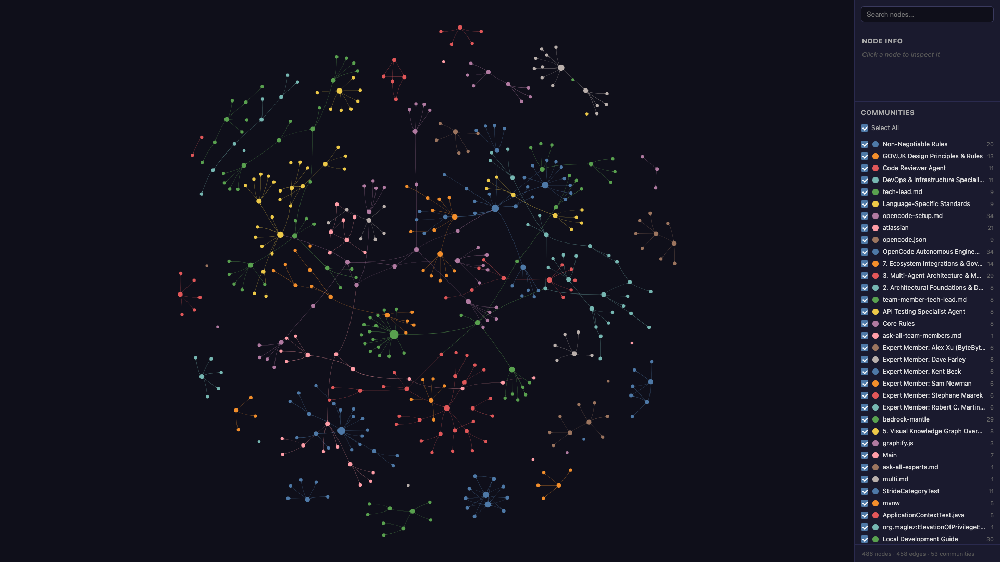
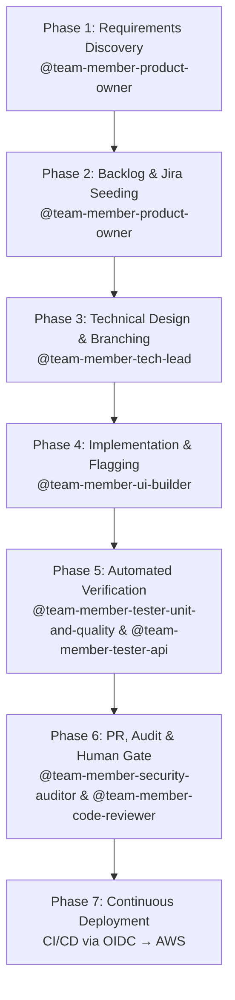

# OpenCode Autonomous Engineering System Blueprint

Architectural Blueprint, Decision Rationale, Multi-Model Diversity, and Operational Guardrail Protocols

---

## Table of Contents

- [1. Introduction & Core Objective](#1-introduction--core-objective)
- [2. Architectural Foundations & Delivery Paradigms](#2-architectural-foundations--delivery-paradigms)
  - [2.1 Walking Skeleton First](#21-walking-skeleton-first)
  - [2.2 Trunk-Based Development](#22-trunk-based-development-over-gitflow)
  - [2.3 Continuous Deployment](#23-continuous-deployment-deploy-every-passing-commit)
  - [2.4 Feature Flags](#24-decoupling-deployment-from-release-feature-flags)
- [3. Multi-Agent Architecture & Model Allocation](#3-multi-agent-architecture--multi-model-allocation-strategy)
  - [3.1 Defence-in-Depth Model Allocation](#31-defence-in-depth-model-allocation)
  - [3.2 Agent Model Matrix](#32-agent-model-matrix)
  - [3.3 Agent Responsibilities](#33-agent-responsibilities)
  - [3.4 Provider Architecture](#34-provider-architecture)
- [4. Expert Advisory System](#4-expert-advisory-system--curation-strategy)
  - [4.1 Pruning Expert Noise](#41-pruning-expert-noise-why-less-is-more)
- [5. Visual Knowledge Graph Overview](#5-visual-knowledge-graph-overview)
  - [5.1 Cost Optimisation Through Graphify](#51-cost-optimisation-through-graphify)
  - [5.2 Graph Statistics](#52-graph-statistics-current)
  - [5.3 Community Breakdown](#53-community-breakdown-top-10-by-node-count)
  - [5.4 God Nodes](#54-god-nodes-most-connected)
  - [5.5 HTML Visualisation](#55-html-visualisation-features)
- [6. Context Hygiene & Optimisation](#6-context-hygiene--optimisation-protocols)
  - [6.1 Session Discipline](#61-session-discipline)
  - [6.2 Graphify Integration](#62-graphify-integration)
- [7. Ecosystem Integrations & Governance](#7-ecosystem-integrations--governance-rules)
  - [7.1 Documentation Strategy](#71-documentation-strategy)
  - [7.2 Jira Integration](#72-jira-integration)
  - [7.3 GitHub MCP Integration](#73-github-mcp-integration)
  - [7.4 AWS Security & OIDC](#74-aws-security--passwordless-oidc)
  - [7.5 Mandatory Git Commit Ticket Prefix](#75-mandatory-git-commit-ticket-prefix)
  - [7.6 Local Development Environment](#76-local-development-environment)
  - [7.7 Custom Commands](#77-custom-commands)
- [8. End-to-End Operational Workflow](#8-end-to-end-operational-workflow)
- [9. How to Adapt This Blueprint](#9-how-to-adapt-this-blueprint)
- [10. Prerequisites](#10-prerequisites)
- [11. Recommended Approach](#11-recommended-approach)
  - [11.1 Sample First Prompt](#111-sample-first-prompt)
- [12. Plugins](#12-plugins)
  - [12.1 Graphify](#121-graphify--knowledge-graph-installed-data-available)
  - [12.2 VibeGuard](#122-vibeguard--secret-redaction-installed-active-at-next-startup)
  - [12.3 DCP](#123-dynamic-context-pruning--dcp-installed-active-at-next-startup)
  - [12.4 Supermemory](#124-supermemory--cross-session-memory-installed-requires-authentication)
  - [12.5 Type Inject](#125-type-inject--typescript-type-context-installed)
   - [12.6 Notificator — REMOVED](#126-notificator--desktop-notifications-removed-2026-07-27)
  - [12.7 Scheduler](#127-scheduler--recurring-agent-jobs-installed)
  - [12.8 Goal Plugin](#128-goal-plugin--session-scoped-goals-installed)

## 1. Introduction & Core Objective

This document outlines the architectural blueprint, design philosophy, and operational guardrails of an enterprise-grade Multi-Agent Software Development System built inside OpenCode. The objective is to transform AI from a basic auto-complete snippet generator into a structured, highly disciplined, and autonomous engineering team capable of planning, executing, auditing, and continuously deploying production code.

Many AI coding setups fail because they treat the AI as a single omniscient developer. In reality, complex software engineering requires distinct division of labour, domain specialisation, rigorous governance, and automated verification. This framework establishes an interconnected ecosystem of sub-agents and expert advisory personas that mirror a high-performing human software organisation while maintaining strict human-in-the-loop safety controls.

**Core Philosophy:** The goal is not to eliminate human oversight, but to elevate human engineers from manual coders to strategic orchestrators — spending minutes reviewing pre-tested, fully compliant Pull Requests instead of hours writing baseline code.

---

## 2. Architectural Foundations & Delivery Paradigms

To avoid common pitfalls — scope creep, architectural drift, monolithic pull requests, and broken deployment pipelines — the system is governed by four non-negotiable delivery paradigms.

### 2.1 Walking Skeleton First (Story #1)

Story #1 of any new initiative is explicitly designated to build a minimal end-to-end slice: compiling code, running a passing test, building via CI/CD, and deploying a lightweight health-check endpoint to production. This establishes the delivery pipeline before any business logic is written, reducing integration risk from day one.

### 2.2 Trunk-Based Development over GitFlow

AI sub-agents perform best when feedback loops are extremely tight. All agent work is conducted on short-lived topic branches that merge directly back into `main` via small, frequent Pull Requests. Long-lived feature branches are strictly prohibited, avoiding merge conflicts, drift, and context staleness.

### 2.3 Continuous Deployment (Deploy Every Passing Commit)

Every commit merged to `main` automatically triggers the full testing suite. If unit, API, static analysis, and security checks pass, the CI/CD pipeline immediately executes a zero-downtime deployment to production.

### 2.4 Decoupling Deployment from Release (Feature Flags)

Incomplete user stories must never expose unready capabilities to end users. All incomplete features are wrapped in feature flags defaulting to `OFF` in production. This allows continuous deployment of passing code while granting the Product Owner complete control over when a feature is activated.

---

## 3. Multi-Agent Architecture & Multi-Model Allocation Strategy

### 3.1 Defence-in-Depth Model Allocation

To eliminate systematic blind spots, authoring agents (who write code and infrastructure) and auditing agents (who review and check security) run on distinct model families or reasoning architectures. This prevents auditors from inheriting the exact same training biases, logic gaps, or hallucinations as the authors.

### 3.2 Agent Model Matrix

| Agent | Primary Role | Model Short Name | Mantle Model ID | Family | Temp |
|---|---|---|---|---|---|
| @team-member-product-owner | Requirement Discovery & BDD Criteria | claude-3-5-sonnet | deepseek.v3.1 | DeepSeek | 0.3 |
| @team-member-tech-lead | Planner & Sub-Agent Dispatcher | claude-3-5-sonnet | deepseek.v3.1 | DeepSeek | 0.1 |
| @team-member-devops-engineer | Terraform, CDK & CI/CD | amazon-nova-pro | deepseek.v3.2 | DeepSeek | 0.1 |
| @team-member-architecture-guardian | C4 Models, Domain Boundaries & ADRs | claude-3-5-haiku | qwen.qwen3-coder-next | Qwen (Alibaba) | 0.2 |
| @team-member-db-designer | Schemas, DDL Migrations & Queries | mistral-large-2 | mistral.mistral-large-3-675b-instruct | Mistral AI | 0.1 |
| @team-member-ui-builder | Frontend & WCAG 2.2 AA Standards | claude-3-5-sonnet | deepseek.v3.1 | DeepSeek | 0.3 |
| @team-member-tester-unit-and-quality / @team-member-tester-api | Test Suite Automation & Payload Checks | amazon-nova-lite | moonshotai.kimi-k2.5 | Moonshot AI (Kimi) | 0.1 |
| @team-member-security-auditor (Audit) | Cybersecurity Audit & OWASP Top 10 | mistral-large-2 | mistral.mistral-large-3-675b-instruct | Mistral AI | 0.0 |
| @team-member-code-reviewer (Audit) | Static Code Review & SOLID Compliance | llama-3-1-70b | nvidia.nemotron-super-3-120b | NVIDIA | 0.1 |
| @team-member-performance-engineer | Load testing, k6, latency/throughput SLOs | llama-3-1-8b | google.gemma-3-27b-it | Gemma (Google) | 0.2 |
| **Expert Advisors** | | | | | |
| @expert-alex-xu | Distributed Systems & System Design | claude-3-5-sonnet | deepseek.v3.1 | DeepSeek | 0.2 |
| @expert-dave-farley | Continuous Delivery & TDD | claude-3-5-sonnet | deepseek.v3.1 | DeepSeek | 0.1 |
| @expert-kent-beck | TDD & XP | llama-3-1-70b | nvidia.nemotron-super-3-120b | NVIDIA | 0.2 |
| @expert-uncle-bod | SOLID & Clean Architecture | claude-3-5-sonnet | deepseek.v3.1 | DeepSeek | 0.2 |

> **Model Alias Mapping:** The "Model Short Name" column shows the identifier used in each agent's `model:` frontmatter field. These short names are mapped to actual Mantle API model IDs via the `id` field in `opencode.json`'s provider configuration (see §3.4). This decoupling allows changing the underlying model without editing every agent file.

> **Security Note:** The Security Auditor agent is configured with a temperature of **0.0** — the lowest possible value. This is intentional: security auditing must prioritise deterministic, repeatable analysis over creative variation. Any hallucination in a security audit could introduce undetected vulnerabilities, so the system guarantees maximum rigour by eliminating output randomness.

### 3.3 Agent Responsibilities

**@team-member-product-owner** — Drives requirement discovery, challenges premature technical solutions, writes INVEST stories with BDD Gherkin criteria, mandates Walking Skeleton, manages feature flag release status, and tracks defects.

**@team-member-tech-lead** — Acts as system planner and engineering dispatcher. Advises on technical trade-offs, coordinates sub-agent execution pipelines, enforces Trunk-Based rules, and maintains architectural integrity.

**@team-member-devops-engineer** — Generates Infrastructure-as-Code (Terraform / AWS CDK), constructs CI/CD workflows, configures cloud OIDC authentication, and manages continuous deployment pipelines.

**@team-member-architecture-guardian** — Maintains C4/arc42 architectural models, enforces domain boundaries, reviews system design, and documents Architecture Decision Records (ADRs).

**@team-member-db-designer** — Designs relational and document schemas, writes migration scripts, optimises query performance with execution plan verification, and manages index strategies.

**@team-member-ui-builder** — Implements user interfaces conforming to accessibility standards (WCAG 2.2 AA / GOV.UK Design System) and wraps UI components in feature flags.

**@team-member-tester-unit-and-quality** — Writes fast, isolated unit tests with high branch coverage prior to PR creation.

**@team-member-tester-api** — Verifies REST/GraphQL API contracts, end-to-end payload validations, and integration boundary tests.

**@team-member-security-auditor** — Audits code and IaC for vulnerability patterns, OWASP Top 10 risks, plaintext secrets, and aggressive IAM wildcards.

**@team-member-code-reviewer** — Performs static code reviews for readability, SOLID compliance, error handling, and maintainability before human review.

### 3.4 Provider Architecture

OpenCode routes all LLM requests through a single provider configured in `opencode.json`. The connection uses the AWS Bedrock Mantle (Stream Responses) endpoint exposed via an OpenAI-compatible API.

#### Connection Details

| Property | Value |
|---|---|
| Provider ID | `bedrock-mantle` |
| Endpoint | `https://bedrock-mantle.eu-west-2.api.aws/v1` |
| SDK Package | `@ai-sdk/openai-compatible` |
| Auth Header | `Authorization: Bearer <api-key>` (OpenAI-compatible) |
| API Key Source | `OPENAI_API_KEY` env var (loaded via direnv from `.env`) |

#### Model ID Mapping

Agent configs reference models by short names (e.g., `claude-3-5-sonnet`). The provider config maps each short name to a concrete Mantle model ID via the `id` field:

```json
"claude-3-5-sonnet": {
  "name": "DeepSeek V3.1",
  "id": "deepseek.v3.1"
}
```

This decoupling means:
- **Changing the underlying model** requires only a config edit in `opencode.json`, not every agent file.
- **Display names** in the model picker are set via the `name` field.
- **The API model ID** sent in requests is the `id` field value (e.g., `deepseek.v3.1`).

#### Available Models

The Mantle marketplace exposes these models (subject to change):

| Short Name | Mantle Model ID | Use Case |
|---|---|---|
| claude-3-5-sonnet | deepseek.v3.1 | General purpose, coding, architecture |
| claude-3-5-haiku | qwen.qwen3-coder-next | Fast coding specialist |
| amazon-nova-pro | deepseek.v3.2 | Latest DeepSeek, complex reasoning |
| amazon-nova-lite | moonshotai.kimi-k2.5 | General purpose, API testing |
| mistral-large-2 | mistral.mistral-large-3-675b-instruct | Security audits, DB schema |
| llama-3-1-70b | nvidia.nemotron-super-3-120b | Code review, static analysis |
| llama-3-1-8b | google.gemma-3-27b-it | Fast throughput, performance tests |

---

## 4. Expert Advisory System & Curation Strategy

When the Product Owner or Tech Lead faces complex trade-offs (e.g., relational vs. document database), the system consults specialised expert profiles to present an objective trade-off matrix.

> **Persona Creation:** These expert profiles were not manually written. An AI analysed hundreds of hours of public content — YouTube talks, conference presentations, published books, and technical courses — from each individual. This content was synthesised into a persona that captures their core principles, decision-making frameworks, and typical advice patterns. When consulted, the personas respond in a manner the real person likely would. They are not real, but the sheer volume of public material makes them feel remarkably authentic.

### 4.1 Pruning Expert Noise (Why Less is More)

Early iterations included dozens of expert profiles from YouTube educators, specific course creators, and niche authors. This created significant context noise, prompt dilution, and conflicting advice. After strict curation, the system consolidated down to **four industry-standard pillars**:

1. **Uncle Bob (Robert C. Martin)** — Author of *Clean Code* and SOLID principles. Consulted for domain decoupling, object-oriented design, and maintainability.
2. **Dave Farley** — Author of *Continuous Delivery*. Consulted for Trunk-Based Development rules, pipeline automation, and deployment safety.
3. **Kent Beck** — Creator of Extreme Programming and TDD. Consulted for test isolation, refactoring strategies, and unit test design.
4. **Alex Xu** — Author of *System Design Interview*. Consulted for high-level architecture trade-offs, scaling patterns, and database selection.

---

## 5. Visual Knowledge Graph Overview

The system architecture and agent relationships are captured in an interactive knowledge graph generated by graphify, providing a navigable map of the entire codebase and configuration.



> *Interactive version: open `graphify-out/graph.html` in a browser.*

> **📅 Graph data snapshot:** This graph and all associated metrics (§5.1–§5.5) are accurate as of commit `d2c81212` (2026-07-26). The graph is a static snapshot — run `graphify update .` from the project root to regenerate with current code.

### 5.1 Cost Optimisation Through Graphify

graphify reduces token consumption and drives down operational costs by replacing expensive LLM re-reading of source files with cheap, deterministic local computation. Graphify's creator (Safi Shamsi) reports a 71.5× token reduction (~98.6% reduction) — distilling a typical 100,000-token codebase into roughly 1,400 tokens of graph structure. By injecting far less content into every prompt, the AI takes substantially longer to hallucinate, producing more reliable and focused reasoning, and a massive cost reduction on token usage.

- **AST Extraction is Free**: Code structure — classes, functions, imports, dependencies — is parsed locally using tree-sitter parsers. This runs at zero token cost, producing structured nodes and edges without any LLM call.
- **Cached Semantic Extraction**: Once entities and relationships are extracted from documentation or images, the results are cached on disk. Incremental updates (`graphify update .`) only re-process changed files, avoiding redundant API calls.
- **Subgraph Queries Over Full Files**: When an agent needs to understand a specific part of the system, it queries the graph for a scoped subgraph instead of loading every source file into context. This dramatically reduces the token footprint per session.
- **Community-Directed Navigation**: Community detection groups related code into clusters. Agents can jump directly to the relevant community rather than scanning the entire codebase, keeping context windows small and focused.

The result: agents spend tokens on reasoning and code generation, not on re-discovering what the graph already knows.

### 5.2 Graph Statistics (Current)

| Metric | Value |
|---|---|---|
| Total Nodes | 486 |
| Total Edges | 458 |
| Communities | 53 (49 shown, 4 thin omitted) |
| Corpus | 63 files (~26,854 words) |
| Extraction | 100% EXTRACTED (0% inferred) |
| Token Cost | 0 input · 0 output (code-only, no LLM round-trip) |
| Source Commit | `d2c81212` |
| **Last Updated** | 2026-07-26 |

### 5.3 Community Breakdown (Top 10 by Node Count)

| Community | Nodes | Description |
|---|---|---|
| OpenCode Autonomous Engineering System Blueprint | 34 | Entire blueprint document — §1–§12: intro, foundations, agent architecture, plugins, workflow |
| Local Development Guide | 29 | Setup guide, env vars, Maven Wrapper, JDK 21 install, project structure, doc references |
| 3. Multi-Agent Architecture & Multi-Model Allocation Strategy | 29 | Agent model matrix, model ID mappings, provider config, agent responsibilities |
| opencode-setup.md | 26 | AGENTS.md — Clean Architecture, Security by Design, project conventions, ADR references |
| bedrock-mantle | 24 | Provider connectivity — MCP endpoint, auth, model definitions, env vars, ADR refs |
| Non-Negotiable Rules | 19 | Defect tracking, DoD, deployment strategy, Gherkin BDD, acceptance criteria |
| Local Development Guide | 19 | DB migrations, changelog conventions, environment variables, dev workflow |
| atlassian | 18 | Jira MCP server config, env vars, changelog, versioning, ADR references |
| atlassian | 18 | Jira server config — command, environment, token mappings |
| 7. Ecosystem Integrations & Governance Rules | 14 | Documentation strategy, Jira, GitHub MCP, AWS OIDC, direnv, CI/CD pipeline |

### 5.4 God Nodes (Most Connected)

1. `instructions` — 16 edges
2. Product Owner / Business Analyst Agent — 12 edges
3. OpenCode Autonomous Engineering System Blueprint — 12 edges
4. 11. Plugins — 10 edges
5. StrideCategoryTest — 9 edges
6. Performance Testing Conventions — k6 + InfluxDB + Grafana — 9 edges
7. Local Development Guide — 9 edges
8. models — 8 edges
9. plugin — 7 edges
10. StrideCategory — 7 edges

### 5.5 HTML Visualisation Features

The interactive graph (`graph.html`) includes:
- **XSS Prevention** — safe HTML escaping with `data-nid` attributes and document-level event delegation
- **Hyperedge Visualisation** — shaded region hulls with centroid labels for hyperedge groups
- **Interactive UI** — dynamic community filtering, select-all / indeterminate toggle, automatic node focus, and detail panels

---

## 6. Context Hygiene & Optimisation Protocols

### 6.1 Session Discipline

- **One Session Per User Story**: Each Jira story is executed in a fresh OpenCode session (`/new`). This prevents context pollution and cross-story contamination, reducing the risk of AI hallucination and keeping response quality consistently high.
- **Context Compaction**: For long sessions, run `/compact` to compress verbose output.

### 6.2 Graphify Integration

- **AST Parsing**: Uses local tree-sitter parsers at zero-token context cost.
- **Output Files**: Stores assets in `graphify-out/` (`graph.json`, `GRAPH_REPORT.md`, `graph.html`).
- **Automated Updates**: Git post-commit hook (`graphify hook install`) rebuilds the AST graph on every commit, ensuring the AI always has a fresh knowledge graph up to date for any new task.

---

## 7. Ecosystem Integrations & Governance Rules

### 7.1 Documentation Strategy

All system documentation, architectural decision records (ADRs), and living guides are maintained directly within GitHub — repository READMEs, markdown files in `docs/`, and GitHub Wiki/Pages — ensuring documentation stays version-controlled alongside code.

### 7.2 Jira Integration

Task tracking is integrated via the Atlassian MCP plugin:

```json
{
  "$schema": "https://opencode.ai/config.json",
  "mcp": {
    "atlassian": {
      "type": "local",
      "command": ["uvx", "mcp-atlassian"],
      "enabled": true,
      "environment": {
        "JIRA_URL": "https://your-domain.atlassian.net",
        "JIRA_USERNAME": "opencode-bot@yourdomain.com",
        "JIRA_API_TOKEN": "{env:JIRA_API_TOKEN}"
      }
    }
  }
}
```

#### Jira Protection & Defect Lifecycle

- **Dedicated Bot User**: OpenCode operates under a dedicated Jira service user with permissions restricted to Browse, Create, Edit, and Transition issues.
- **Revoked Delete Rights**: Delete Issues, Delete Comments, and Delete Attachments permissions are explicitly revoked. Any delete attempt returns 403 Forbidden.
- **Rejection Workflow**: Obsolete stories receive an explanatory comment, a "Reject" transition, and resolution set to "Won't Do."
- **Defect Tracking**: Pre-deployment defects are logged as Bug Sub-tasks under the parent User Story (blocking merge). Post-deployment defects are standalone Bug Issues linked via "caused by" for defect rate metrics.

### 7.3 GitHub MCP Integration

Source code management and pull requests are handled via the GitHub MCP plugin, configured alongside Atlassian in `opencode.json`:

```json
"github": {
  "type": "local",
  "command": ["uvx", "@modelcontextprotocol/github"],
  "enabled": true,
  "environment": {
    "GITHUB_TOKEN": "{env:GITHUB_TOKEN}"
  }
}
```

#### GitHub Protection

- **Fine-Grained PATs**: OpenCode authenticates using Fine-Grained Personal Access Tokens scoped exclusively to targeted repositories. Administration permissions are set to **No Access**.
- **Branch Protection**: Direct commits to `main` are blocked. Mandatory Pull Requests, green CI status checks, and at least one human approval are required before merging.
- **History Protection**: Force pushes and branch deletions are permanently disabled on protected branches.

### 7.4 AWS Security & Passwordless OIDC

- **Zero Static Credentials**: No long-lived AWS Access Keys are stored in GitHub Secrets or the repository.
- **Short-Lived OIDC Tokens**: GitHub Actions authenticates to AWS using OpenID Connect to assume temporary IAM roles that expire automatically after pipeline execution.
- **Scoped IAM Roles**: Production IAM roles receive minimum required provisioning rights, with explicit deny guards on destructive operations (e.g., `s3:DeleteBucket`, `rds:DeleteDBInstance`).

### 7.5 Mandatory Git Commit Ticket Prefix

Every commit generated by any agent MUST be prefixed with the active Jira ticket key:

```sh
#!/bin/sh
JIRA_REGEX="([A-Z]{2,10}-[0-9]+)"
if ! grep -qE "$JIRA_REGEX" "$1"; then
  echo "ERROR: Commit rejected! Message must include a valid Jira key (e.g., [THREAT-123] feat: ...)"
  exit 1
fi
```

### 7.6 Local Development Environment

#### Environment Variables via direnv

Sensitive credentials (API keys, tokens) are never committed to the repository. The project uses [direnv](https://direnv.net/) to auto-load environment variables from a gitignored `.env` file when entering the project directory.

**Setup on a new clone:**

```bash
# 1. Install direnv (macOS)
brew install direnv

# 2. Add to ~/.zshrc
echo 'eval "$(direnv hook zsh)"' >> ~/.zshrc
source ~/.zshrc

# 3. Copy and populate the env file
cp .env.example .env   # if an example exists, or create manually
# Edit .env with your credentials:
#   OPENAI_API_KEY=...
#   OPENAI_BASE_URL=https://bedrock-mantle.eu-west-2.api.aws/v1
#   JIRA_URL=...
#   JIRA_API_TOKEN=...

# 4. Allow direnv for this project
direnv allow
```

**How it works:**

- `.envrc` (tracked in git) contains only `dotenv` — a one-line directive telling direnv to load `.env`.
- `.env` (gitignored) holds all secrets.
- Every time you `cd` into the project directory, direnv automatically exports the variables into your shell.
- No manual `export` commands are needed.

#### Required Environment Variables

| Variable | Purpose |
|---|---|
| `OPENAI_API_KEY` | Bedrock Mantle API key (bearer token) |
| `OPENAI_BASE_URL` | Mantle endpoint URL |
| `JIRA_URL` | Atlassian instance URL |
| `JIRA_API_TOKEN` | Jira API token |
| `JIRA_USERNAME` | Jira bot user email |
| `GITHUB_TOKEN` | GitHub PAT (repo scope) |

#### Maven Wrapper

The project uses the **Maven Wrapper** (`./mvnw`) for reproducible builds — no global Maven install required:

| Command | Purpose |
|---|---|
| `./mvnw compile` | Fast compile check |
| `./mvnw test` | Run all tests |
| `./mvnw verify` | Full verification with integration tests |
| `./mvnw spring-boot:run` | Start application on port 8080 |

Requires **Java 21+** (Eclipse Temurin recommended).

#### CI/CD Pipeline

Every push/PR to `main` triggers `.github/workflows/ci.yml` — runs `mvn verify` on `ubuntu-latest` with JDK 21 and uploads the built JAR. See [CI/CD Pipeline](../devops/ci-cd-pipeline.md) for details.

#### Rules Directory

The `.opencode/rules/` directory contains reusable instruction snippets that agents can load on demand: clean architecture, git commits, testing standards, and security rules. These complement the base instructions in `opencode.json`.

### 7.7 Custom Commands

The `.opencode/command/` directory provides three ad-hoc multi-agent orchestration commands:

- **`ask-all-experts`** — Triggers all expert sub-agents in parallel and synthesises their responses into a comparison matrix.
- **`ask-all-team-members`** — Triggers all team-member sub-agents in parallel and synthesises their responses.
- **`multi`** — Triggers specific `@agent` mentions from the prompt in parallel and synthesises their responses.

These complement the `/goal` command (see §12.8) for when you want to poll multiple agents at once without setting a persistent goal.

---

## 8. End-to-End Operational Workflow

The full operational sequence demonstrates how a requirement flows from initial prompt to production deployment:



**Phase 1 — Requirements Discovery**: Prompter submits a feature request. @team-member-product-owner interacts directly with the human to challenge premature solutionising, clarify business objectives, and refine the requirements. @team-member-product-owner verifies the proposed solution serves the end-user's needs based on today's accessibility and usability standards, including Government Digital Service (GDS) standards where applicable. Only once the request passes these checks and is deemed worthy of building does @team-member-product-owner pass the instruction to @team-member-tech-lead. Story #1 is always designated as the Walking Skeleton.

**Phase 2 — Backlog & Jira Seeding**: @team-member-product-owner creates INVEST stories with Gherkin BDD criteria and feature flag definitions in Jira, signaling @team-member-tech-lead.

**Phase 3 — Technical Design & Branching**: @team-member-tech-lead creates a short-lived topic branch from `main` and dispatches @team-member-architecture-guardian, @team-member-db-designer, and @team-member-devops-engineer to prepare infrastructure and domain models.

**Phase 4 — Implementation & Flagging**: @team-member-ui-builder and core developers write solution logic, wrapping unreleased capabilities in feature flags.

**Phase 5 — Automated Verification**: @team-member-tester-unit-and-quality and @team-member-tester-api run test suites, creating Bug Sub-tasks for any failing checks.

**Phase 6 — PR, Audit & Human Gate**: OpenCode opens a Pull Request. @team-member-security-auditor and @team-member-code-reviewer perform static audits. Automated CI runs linters and tests. A human engineer reviews and approves the PR.

**Phase 7 — Continuous Deployment**: PR merges to `main`. CI assumes the cloud IAM role via OIDC, executes infrastructure-as-code, and deploys to production.

---

## 9. How to Adapt This Blueprint

Teams looking to build a similar system can customise this blueprint with three key adaptations:

- **Cloud Platform**: Swap AWS OIDC roles for GCP Workload Identity Federation or Azure Managed Identities in `@team-member-devops-engineer.md`.
- **Issue Tracker**: Replace Jira API configuration with GitHub Issues or Linear in `@team-member-product-owner.md`.
- **UI Standards**: Customise `@team-member-ui-builder.md` to enforce your company's design system (e.g., Tailwind, Material UI, Salesforce Lightning) instead of GOV.UK standards.

---

## 10. Prerequisites

Before running any prompt, ensure your local environment is set up:

- [ ] **direnv installed** — `brew install direnv` + hook in `~/.zshrc`
- [ ] **`.env` populated** — `OPENAI_API_KEY`, `OPENAI_BASE_URL`, `JIRA_URL`, `JIRA_API_TOKEN`
- [ ] **direnv allowed** — `direnv allow` in the project root (run once per clone)
- [ ] **OpenCode config installed** — `.opencode/opencode.json` and `.opencode/agents/` present
- [ ] **Models verified** — `opencode models bedrock-mantle` lists all 7 models
- [ ] **Jira MCP connected** — `/connect` in the TUI with Atlassian credentials (optional, for issue tracking)

See §7.6 for detailed setup instructions and [docs/devops/local-development.md](../devops/local-development.md) for the full guide.

Key ADRs:
- [ADR-002: Spring Boot Walking Skeleton](../adr/ADR-002-spring-boot-bootstrap.md) — documents the Spring Boot 3.4.4, Java 21, and Maven Wrapper decisions
- [ADR-003: GitHub MCP Integration](../adr/ADR-003-github-mcp-integration.md) — documents the GitHub MCP server rationale and configuration
- [ADR-004: API Contract-First](../adr/ADR-004-api-contract-first.md) — documents OpenAPI 3.1, springdoc, and contract-first conventions
- [ADR-005: Error Handling Strategy](../adr/ADR-005-error-handling-strategy.md) — documents RFC 9457 Problem Details and the exception hierarchy
- [ADR-006: Build Quality Gates](../adr/ADR-006-build-quality-gates.md) — documents Checkstyle, SpotBugs, JaCoCo, and Enforcer rules
- [ADR-007: Versioning Strategy](../adr/ADR-007-versioning-strategy.md) — documents SemVer 2.0.0 and Keep a Changelog conventions
- [ADR-008: Database Migration Strategy](../adr/ADR-008-database-migration-liquibase.md) — documents Liquibase with XML changelogs for all schema changes
- [ADR-009: Front-End Technology Stack](../adr/ADR-009-frontend-react-typescript.md) — documents React + TypeScript + Vite + GOV.UK Frontend CSS decision

---

## 11. Recommended Approach

Start with **few details** and let @team-member-product-owner (PO) guide the discovery process:

1. **Open a fresh session** (`/new`) — one story per session
2. **Give a lightweight prompt** — a sentence or two about what you want to build
3. **Let your PO interview you** — they will ask about target audience, scope, constraints
4. **Refine together** — clarify business objectives, end-user needs, and acceptance criteria
5. **Your PO validates** — checks against accessibility and usability standards
6. **Your PO dispatches** — the validated story is handed to the Tech Lead for autonomous implementation with auto-continue and safety limits

### 11.1 Sample First Prompt

**1. Requirements discovery** — prompt your PO:

```
@team-member-product-owner I want to build an Elevation of Privilege (EoP) card
game — a threat modelling exercise based on the STRIDE framework.
The goal is to help development teams learn to identify security
threats in a fun, interactive way. Can you help me define the
requirements and scope for this project?
```

Dumping everything at once overloads context and bypasses the PO validation gate. The PO is your requirements partner, not a passive note-taker. Once validated, the PO hands off to the Tech Lead for autonomous execution.

---

## 12. Plugins

OpenCode supports two plugin types: **local plugin files** (`.js`/`.ts` in `.opencode/plugins/`) and **npm packages** declared in `opencode.json`. All are auto-loaded at startup.

The project uses eight plugins, each serving a distinct architectural concern. Configs live in `.opencode/` (project) or `~/.config/opencode/` (global), with project-level overrides taking priority.

### 12.1 Graphify — Knowledge Graph (installed, data available)

Graphify generates a persistent AST-level knowledge graph of the entire codebase. See §5 for the visual overview and §6.2 for the operational integration.

- **File**: `.opencode/plugins/graphify.js`
- **Hook**: `tool.execute.before` — prepends a knowledge-graph reminder before `bash` calls
- **Config**: None (auto-detects `graphify-out/graph.json`)
- **Update**: `graphify update .` (incremental AST rebuild)

### 12.2 VibeGuard — Secret Redaction (installed, active at next startup)

Redacts configured sensitive strings before requests reach the LLM provider (Bedrock Mantle) and restores them after the model responds and before local tool execution. Provider never sees plaintext secrets.

- **Package**: `opencode-vibeguard` (npm)
- **Config**: `.opencode/vibeguard.config.json`
- **Data**: None persisted — operates invisibly on every request
- **Placeholder format**: `__VG_<CATEGORY>_<hash12>__` (HMAC-SHA256, session-random secret, irreversible to provider)

### 12.3 Dynamic Context Pruning — DCP (installed, active at next startup)

Reduces token usage by compressing stale conversation spans, deduplicating repeated tool calls, and pruning errored tool inputs. Preserves protected tools (`task`, `skill`, `todowrite`, etc.) and patterns from compression.

- **Package**: `@tarquinen/opencode-dcp` (npm)
- **Config**: `.opencode/dcp.jsonc` (project overrides); `~/.config/opencode/dcp.jsonc` (global defaults)
- **Data**: Run `/dcp` in the TUI to view stats; `/dcp-compress [focus]` to trigger manually
- **Notable**: 3.8k ★, AGPL-3.0, subagent support enabled via `experimental.allowSubAgents: true`

### 12.4 Supermemory — Cross-Session Memory (installed, requires authentication)

Persists project knowledge, user preferences, and session summaries across OpenCode sessions and even across tools (Claude Code, Codex). Injects relevant memories on first message and auto-saves on keywords ("remember...", "save this").

- **Package**: `opencode-supermemory` (npm)
- **Auth**: `bunx opencode-supermemory@latest login` (browser OAuth); or set `SUPERMEMORY_API_KEY` in `.env`
- **Config**: `~/.config/opencode/supermemory.jsonc`
- **Data**: Run `/supermemory-init` to seed codebase memory; memories accumulate naturally through use
- **Notable**: 1.5k ★, MIT, privacy via `<private>` tags

### 12.5 Type Inject — TypeScript Type Context (installed)

Injects TypeScript type signatures into file reads so the LLM sees type context without manual lookup. Reports type errors on writes. Provides MCP tools: `lookup_type`, `list_types`, `type_check`. Resolves imports up to 4 levels deep.

- **Package**: `@nick-vi/opencode-type-inject` (npm)
- **Config**: None (works with existing `tsconfig.json`)
- **Data**: None persisted — acts on file reads/writes transparently
- **Notable**: TypeScript-only; has zero effect on Java files. Most useful when working on `ui/`.

### 12.6 Notificator — Desktop Notifications (REMOVED 2026-07-27)

**Removed following the 2026-07 security audit.** The plugin sent desktop notifications and sound alerts for OpenCode events by shelling out to OS commands (`osascript`/`afplay` on macOS, `notify-send`/ffmpeg on Linux). That command-execution attack surface was not justified by the notification utility. Deleted: `.opencode/plugins/notificator.js`, `notificator.js.map`, `notificator.jsonc`, `notificator-sounds/`, and the `opencode.json` plugin registration. Do not reinstall without an input-sanitization review.

### 12.7 Scheduler — Recurring Agent Jobs (installed)

Schedules recurring agent tasks using OS-native schedulers (launchd on macOS, systemd on Linux). Jobs run `opencode run` with the project's full MCP configuration. Includes no-overlap guard, optional timeout, and automatic logging.

- **Package**: `opencode-scheduler` (npm)
- **Config**: Jobs stored at `~/.config/opencode/scheduler/scopes/*/jobs/*.json` (auto-managed by `/schedule` command)
- **Data**: Run logs via `job_logs`; supervisord at `~/.config/opencode/scheduler/supervisor.pl`
- **Scheduled job**: `nightly-load-test` — runs daily at 02:00, executes k6 health check against `localhost:8080`, reports SLO breaches
- **Notable**: Requires Perl for the supervisor script. Per-project scoping via working directory. Use the `/schedule` OpenCode command to create jobs.

### 12.8 Goal Plugin — Session-Scoped Goals (installed)

Provides a `/goal` workflow for long-running autonomous sessions. Set a goal, the plugin keeps it in context, auto-continues when idle, and stops when complete, blocked, or a safety limit is hit. Supports evidence-gated completion with optional independent auditor.

- **Package**: `opencode-goal-plugin` (npm)
- **Command**: `/goal` — configured in `opencode.json` under `"command"` with `"agent": "team-member-tech-lead"` for orchestrator-driven execution (defaults: max 10 turns, 15 min duration, 200k tokens)
- **Config**: Plugin-level defaults passed as options array in `opencode.json`
- **State file**: `.opencode/goals/state.json` (chmod 0600; added to `.gitignore`)
- **Notable**: Only one persistence-enabled instance per state file; session forks don't inherit parent goals. Relies on experimental OpenCode hooks (`experimental.chat.system.transform`).
