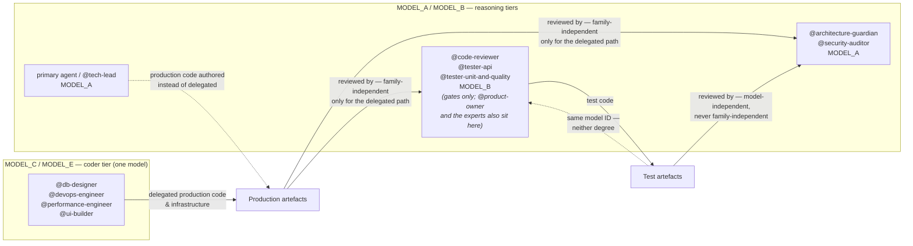

# ADR-022: Model Tiers Are Allocated By Definition-of-Done Role, Not By Artefact Type

**Status:** Accepted (rule 1 superseded 2026-08-21 by ADR-046)
**Date:** 2026-08-11
**Deciders:** @architecture-guardian, @tech-lead

## Context

Delivery in this repository is performed by a team of agents defined in `.opencode/agents/`,
each pinned to one of five abstract model tiers (`MODEL_A`–`MODEL_E`) resolved from the
environment by `.opencode/opencode.json`. The tiering exists to serve one architectural
constraint, stated in the Blueprint as the **Separation Invariant**: an artefact must not be
reviewed by the same model *family* that produced it, because a model asked to find fault with
its own output reliably finds none. Blueprint §12.8 carries the full rationale, including the
completion auditor's own shortfall against it.

Throughout this ADR, **"independent" is never used unqualified**, because the word covers two
degrees of protection that the current pins deliver very differently. The definitions are
Blueprint §3.1's:

- **Family-independent** — reviewer and author sit in different model families or reasoning
  architectures. This is what the Separation Invariant asks for, and the only degree that
  defends against a bias the whole family shares. When this ADR was written the sole family
  boundary on the Bedrock mapping was `MODEL_C`/`MODEL_E` (Qwen) against
  `MODEL_A`/`MODEL_B`/`MODEL_D` (Anthropic Claude). A second boundary was added 2026-08-21 by
  ADR-046: `MODEL_F` (`minimax.minimax-m2.5`) sits outside both.
- **Model-independent** — different model IDs from the same family, as `MODEL_A`
  (`claude-opus-5`) is to `MODEL_B` (`claude-sonnet-4-6`). Different weights and reasoning scale
  catch the author's particular mistakes but not its family's shared blind spots. This is the
  **weaker** guarantee, and it is the most that any review conducted wholly inside the reasoning
  tiers can provide.

A review where both sides resolve to the *same* model ID is neither, and `/trace` reports it as
`RISK … self-review`. The distinction is load-bearing: it is what makes the difference between a
true and a false claim in the Consequences below.

That invariant was originally operationalised by asking a question about **artefact type** —
*does this agent write files?* Agents that wrote files were classified "Author" and pinned to
the coder tier (`MODEL_C`/`MODEL_E`); agents that judged files were classified "Audit" and
pinned to the reasoning tiers (`MODEL_A`/`MODEL_B`).

Applied to `@tester-unit-and-quality` and `@tester-api`, that question gave the wrong answer.
Both write files, so both were classified Authors and pinned to `MODEL_C`. But both are also
named gates in the Definition of Done: a story cannot complete without an explicit verdict from
each. The classification optimised for the artefact they emit and ignored the authority they
hold.

The cost was paid twice, in production:

- `@tester-unit-and-quality` on `MODEL_C` needed three dispatches to return a verdict at all,
  and on one of them recommended merging a red build.
- `@tester-api` on `MODEL_C`, under story EOP-26, returned `VERDICT: APPROVE` on four
  consecutive dispatches while producing none of its contracted evidence — no severity-tagged
  findings, no literal command output, once substituting headings of its own for the brief's
  required outputs, and once asserting that its evidence had been compiled into a markdown
  document it had no permission to write.

The second failure is the instructive one, because the remedy for the first was already written
down. `AGENTS.md` carried the rule *"a review gate must not share weights with an agent that
writes production code"* before EOP-26 began. The rule existed; the pin contradicted it; nothing
detected the contradiction. A hollow `APPROVE` is worse than a `REJECT`, because it consumes the
gate's authority without exercising it — the story proceeds believing it was examined.

The reason the contradiction survived is where the rules were kept. Tier allocation was
described in four places — `AGENTS.md`, `.env.example`, `.opencode/opencode.json` and
`.opencode/docs/OpenCode_Autonomous_Engineering_System_Blueprint.md` — and **none of them is an
ADR**. All four are living reference documents, amended in place. Each describes the current
state; none records the reasoning that produced it, the alternatives weighed, or the risks
accepted. So when the classification of the testers was set, and again when it was questioned,
there was nothing to supersede and nothing to cite: the rationale was overwritten rather than
revised, which is precisely the drift ADRs exist to prevent. The governance layer that decides
who is permitted to approve this project's work was the one layer with no decision record.

## Decision

Tier allocation is governed by an agent's **role in the Definition of Done**, not by whether it
emits files.

1. **Any agent named as a Definition-of-Done gate is pinned to `MODEL_A` or `MODEL_B`. No DoD
   gate may sit on `MODEL_C` or `MODEL_E`.** This holds regardless of whether the gate also
   authors artefacts.

   > **Superseded 2026-08-21 by [ADR-046](ADR-046-gate-model-capability-floor.md).** The original
   > text is left standing per this index's own instruction not to edit a superseded decision.
   > Rule 1 is a whitelist of tier *names*, which is a proxy for the capability it never states,
   > so it breaks the moment a third capable tier is wanted — as it was when both `MODEL_A` gates
   > had to move off the tier that authors Java. ADR-046 replaces the whitelist with a capability
   > floor, a family requirement and a mandatory passing probe. `MODEL_C`/`MODEL_E` remain
   > ineligible, but as a *consequence* of the floor (they are not reasoning-capable) rather than
   > by name. **Rules 2 to 6 below are unaffected.**
2. The five gates are `@tester-unit-and-quality`, `@tester-api`, `@security-auditor`,
   `@code-reviewer` and `@architecture-guardian`. `@tester-api` moves to `MODEL_B`, joining
   `@tester-unit-and-quality`, which moved earlier for the identical reason.
3. `@performance-engineer` remains on `MODEL_C` and is **not** a gate. It carries no Sign-off
   Contract, and dispatching it as a gate is unsupported.
4. Tier is necessary but not sufficient. Each of the five gates additionally carries a
   **Sign-off Contract** in its own definition — a mandatory terminal `VERDICT:` line,
   severity-tagged findings citing `file:line`, actual command output rather than stated intent,
   an obligation to answer a brief's enumerated outputs *in addition to* rather than instead of
   its own findings, an acknowledgement that its reply is the only deliverable that exists, and
   a prohibition on approving a red build. These obligations belong in the agent definition
   because a behaviour enforced only by whatever the dispatching prompt happens to mention is
   not enforced.
5. **This narrows the Separation Invariant, and the narrowing is accepted deliberately rather
   than denied.** The invariant holds for *delegated* production code and infrastructure. It has
   two documented exceptions and must always be cited with them: it does **not** hold for test
   code (this decision), and it does **not** hold for production code the primary agent or
   `@tech-lead` authors itself instead of delegating, since both run on `MODEL_A` alongside two
   of the five gates. Stating it as unconditional — for any artefact class — is the specific
   error this ADR exists to stop.

   > **Amended 2026-08-21 by [ADR-046](ADR-046-gate-model-capability-floor.md).** The second
   > exception is **closed**: `@architecture-guardian` and `@security-auditor` moved to `MODEL_F`,
   > so no gate shares a family with the tier that authors production code directly. **One
   > exception remains — test code — and from that date onward the invariant must be cited with
   > one exception, not two.**
6. Reversing any part of this allocation requires a superseding ADR. It may not be done by
   editing the tier tables, which is how the previous classification came to contradict a rule
   the project had already written down.

The diagram below depicts the allocation as decided on 2026-08-11 and is retained as the
historical record, not as a description of the current pins. For the arrangement in force since
2026-08-21, see the diagram in [ADR-046](ADR-046-gate-model-capability-floor.md).

Read each edge's own label rather than inferring the degree from its line style: solid means the
path is the norm and dashed means it is one of the two documented exceptions, but the degree of
independence is stated per edge because it does not follow from the style. Only the two
`PROD --> G1`/`G2` edges are family-independent, and only where the production artefact was
delegated to the coder tier — that is the whole of what the invariant guarantees. Both exceptions
are at best model-independent: `@tech-lead`/primary-agent production code shares `MODEL_A` with
`G1` and is model-independent of `G2` only, while tester-authored test code is model-independent of
`G1` and shares its exact model ID with `@code-reviewer` in `G2`, where neither degree applies.

## Consequences

**Accepted gains.**

- Gate verdicts are produced by a tier that has demonstrated it can hold the Sign-off Contract.
  This is the whole point: the gate's output is a decision, and a decision from a model that
  cannot reliably follow the contract governing it is not a decision.
- `MODEL_B` authors no production code, so the family-independence of review for *delegated*
  production artefacts is untouched by the move.
- The rule is now numbered and citable. A future pin that puts a gate on the coder tier
  contradicts ADR-022 rather than contradicting a bullet in a reference manual.
- Any agent later promoted to gate status inherits the constraint automatically, because the
  rule is expressed in terms of DoD role rather than as a list of names.

**Accepted costs, stated plainly.**

- **The Separation Invariant is now conditional, and it has two exceptions — test code and
  primary-agent-authored production code.** With the
  current Bedrock mapping, `@code-reviewer` and both testers resolve to the *same model ID* —
  `amazon-bedrock/eu.anthropic.claude-sonnet-4-6` — not merely the same family. Test code
  authored by a tester and reviewed by `@code-reviewer` is therefore reviewed by identical
  weights, which is neither degree of independence defined above. The mitigation is real but
  strictly the weaker degree: `@architecture-guardian` and `@security-auditor`, both on
  `MODEL_A`, are **model-independent** of any test authored on `MODEL_B`, so tests are not wholly
  unreviewed — but neither is **family-independent**, because `MODEL_A` and `MODEL_B` are both
  Anthropic Claude. No reviewer of
  a tester-authored test sits outside the author's family, so for test code the family-level
  guarantee §3.1 asks for is absent entirely, not merely reduced. Any claim that
  `@code-reviewer` *and* `@architecture-guardian` both provide independence for tester-authored
  tests is false — `@code-reviewer` shares the author's exact model ID — and a test authored by
  the primary agent on `MODEL_A` is reviewed model-independently only by the `MODEL_B` gates, with
  `@architecture-guardian` and `@security-auditor` sharing its exact model ID.
  The trade was accepted because a gate that cannot hold its contract blocks or corrupts every
  story, whereas same-model review of test code degrades one artefact class that is itself
  never shipped.

  > **Amended 2026-08-21 by [ADR-046](ADR-046-gate-model-capability-floor.md).** Three claims in
  > the paragraph above are now false. There is **one** exception rather than two. "No reviewer of
  > a tester-authored test sits outside the author's family … absent entirely" no longer holds:
  > `@architecture-guardian` and `@security-auditor` moved to `MODEL_F`, which is a different
  > family from `MODEL_B`, so tester-authored tests gained a family-independent reviewer for the
  > first time. And the final clause about a test authored by the primary agent on `MODEL_A` is
  > obsolete, since neither gate sits on `MODEL_A` any more. What survives unchanged is the
  > overlap the next bullet describes: `@code-reviewer` and both testers still share one model ID.
- `/trace` will report that overlap as a `RISK … self-review` line on any story where a tester
  writes a test. **That finding is a true positive and must not be silenced.** It is the
  visible price of this decision, and suppressing it would restore the blindness this ADR was
  written to remove.
- `AUDITOR_AGENTS` in `tools/agent-trace.py` was consumed for two different purposes: detecting
  same-model review, and detecting an agent that edited files when its role forbids it. The two
  testers belong in the first check and not in the second, because they legitimately author
  files. Holding both meanings in one set made the permission check emit a false alarm for
  every tester that did its job. **The sets are separated in the same commit that records this
  ADR:** `READ_ONLY_AGENTS` now backs the write check and holds only the gates that declare
  `permission.edit: deny`. What remains optional refinement, not required work, is *deriving*
  that set from the frontmatter instead of hand-maintaining it — the membership is correct
  today but nothing fails if a future `permission.edit` change desynchronises it.
- Gate work runs on more expensive models. Five gates per story on reasoning tiers is a real
  and recurring cost increase over the coder tier.
- The guarantee remains a property of the `.env` values rather than of any table. `MODEL_E` is
  currently the *same model ID* as `MODEL_C`, so "`MODEL_C`/`MODEL_E`" names one model, and a
  future operator who points `MODEL_C` at an Anthropic model collapses the invariant entirely
  without editing a single agent definition.
- Tier changes take effect only after an OpenCode restart, because configuration is read at
  session start. A pin corrected mid-session is not in force for that session.

## Related

- [ADR-046](ADR-046-gate-model-capability-floor.md) — supersedes rule 1 of this ADR, replacing
  the tier-name whitelist with a capability floor, a family requirement and a mandatory probe,
  and closes the second exception to the Separation Invariant by moving both `MODEL_A` gates to
  `MODEL_F`
- [ADR-006](ADR-006-build-quality-gates.md) — mechanical build gates; this ADR governs the
  agent gates that sit alongside them, and the same reasoning applies: a gate that cannot fail
  is not a gate
- [ADR-011](ADR-011-graphify-knowledge-graph.md) — precedent for recording a decision about the
  development toolchain, rather than the application, as an ADR
- [ADR-003](ADR-003-github-mcp-integration.md) — likewise: agent tooling recorded as an
  architectural decision
- [ADR-010](ADR-010-continuous-flow-over-sprints.md) — the delivery process these gates
  terminate
- `.opencode/docs/OpenCode_Autonomous_Engineering_System_Blueprint.md` §3.1, §3.4, §12.8 — the
  Separation Invariant, the tier catalogue, and the Definition of Done that names the five gates
- `AGENTS.md` — the operational statement of this rule for day-to-day work
- `tools/agent-trace.py` — `/trace`, which detects violations of the invariant after the fact
- EOP-46 (this decision), EOP-26 (the `@tester-api` failure that forced it)
