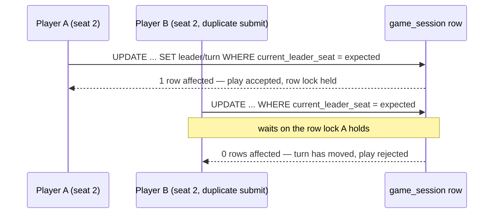
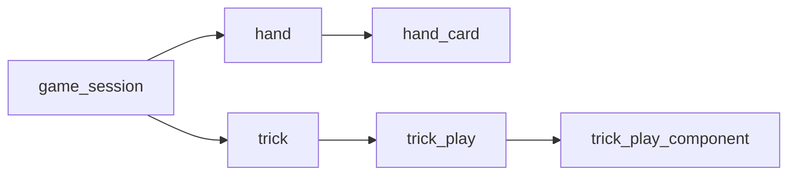

# ADR-023: Every Card Is Dealt, and the Current Leader's Seat Lives on `game_session`

**Status:** Accepted
**Date:** 2026-08-12
**Deciders:** @tech-lead, @architecture-guardian

## Context

EOP-14 is the core game mechanic and the largest story in the backlog: deal the
deck, lead a trick, enforce follow-suit, resolve the winner, pass the lead. Two
questions it depends on were never answered — not by the PRD, not by the ticket,
not by either primary source. They are answered here, having been confirmed with
the product owner on 2026-08-12, because both would otherwise be settled by
whoever typed the first implementation and settled differently by whoever typed
the second.

**The deck does not divide evenly.** It is 78 cards — six suits of thirteen ranks
— seeded by EOP-13 from `cards.yaml`. Against the PRD's supported range of three
to six players (§4, ADR-019) that arithmetic is:

| Players | Cards each | Remainder |
|---|---|---|
| 3 | 26 | 0 |
| 4 | 19 | **2** |
| 5 | 15 | **3** |
| 6 | 13 | 0 |

EOP-14 requires that "any remainder when the deck does not divide evenly must be
handled explicitly and the same way every time" — and stops there, without saying
how. Two of the four supported table sizes are affected, and the two that are
affected are the middle of the tested range rather than an edge case.

**There is no entity to hold whose turn it is.** PRD §5 lists a `GameState`
block — `currentLeader`, `currentTrick`, `completedTricks` — described as being
"within a Session", but no such aggregate exists in the code and none is
specified. `GameSession` is an immutable aggregate root whose every mutation
returns a new instance, so "the current leader" has no obvious home, and the
turn-order rule that ADR-019 made load-bearing has nothing to read.

Both gaps land in the same story, and both bear on the same requirement: EOP-14
demands "a genuinely concurrent test proving two simultaneous plays cannot both
be accepted for the same seat." A rule with no total definition and a turn
pointer with no single row cannot be proved concurrent; they can only be
asserted to be.

**One correction carried in from the ticket.** EOP-14's description closes with
"Also needs the concurrency-control decision, number 017." That reference is
wrong. ADR-017 is *Front-end Delivery Topology*; concurrency control is
[ADR-020](ADR-020-session-concurrency-control.md). PRD §9 reconciles the drift in
full. The distinction matters here because ADR-020 exists chiefly to warn that
the `@Version` column on `GameSessionJpaEntity` is bookkeeping and **not** the
enforcement mechanism, and decision 2 below is built directly on that warning.

## Decision

### 1. Every card is dealt, and the remainder goes to seats in ascending order

The whole deck is dealt. After each player has received `78 / n` cards, the
remaining `78 mod n` cards are dealt one each to seats `0, 1, 2, …` in ascending
seat order — the stable `seatOrder` assigned at join and never re-derived
(ADR-019), in which the facilitator holds seat 0. No card is set aside, and there
is no draw pile and no discard.

| Players | Hands |
|---|---|
| 3 | 26, 26, 26 |
| 4 | **20, 20**, 19, 19 |
| 5 | **16, 16, 16**, 15, 15 |
| 6 | 13, 13, 13, 13, 13, 13 |

**The reason is that the rejected alternative makes the opening-lead rule
partial.** Dealing evenly and setting the remainder aside undealt is the obvious
alternative and it carries a latent defect. EOP-14 and PRD §3.3 both require that
the holder of the lowest-ranked Tampering card *present in the deck* leads the
first trick. If two or three cards are set aside, the lowest-ranked Tampering card
can be among them — and then that rule has **no holder**. The opening lead would
need a fallback branch that no requirement describes, that no source sanctions,
and that would be reached only at certain player counts, with certain shuffles.
That is the worst available failure profile: rare, non-deterministic, dependent on
table size, and invisible in any test that happens to shuffle kindly. Dealing
every card makes the rule **total** — it resolves at every player count, for every
shuffle, always.

Two further arguments support it rather than carry it. It is how the physical deck
is actually dealt: players deal the whole deck out, they do not measure it first.
And it keeps maximum threat coverage in play, which is the entire purpose of the
deck — every card withheld is a threat prompt the group never discusses, and the
deck is a threat library before it is a game component.

**The accepted cost, stated plainly: hands are unequal, so the final trick is
short.** At four players two people hold 20 cards and two hold 19; at five, three
hold 16 and two hold 15. The last trick of the game therefore has fewer cards in
it than there are players at the table. This is not a defect to be corrected
later: it is already sanctioned by the PRD §3.3 end condition, where play
continues "until players run out of time, cards, or ways to connect their threats
to the system."

The direct domain consequence must be built in from the first line of Slice A:

> **A trick is one card from each player who still holds cards — not a fixed
> count of cards, and not one card per seat.**

A reader who assumes trick size equals player count will write a defect that
appears only in the last trick of a four- or five-player game. Trick completion is
therefore "no seat that still holds a card is yet to play into this trick", and the
same qualifier applies to turn advancement — see the note on ADR-019's formula
below.

An earlier revision of this ADR phrased completion as "every player who held a
card *at the start of this trick* has played one". That is the same rule but it
cannot be expressed by the domain, because `Trick.isComplete` is handed the set of
seats holding cards *now* rather than a snapshot taken when the trick opened. The
two readings agree — a seat that has just emptied its hand is excluded by having
already played, not by still holding a card — but the at-start-of-trick phrasing
invited an implementer to build a snapshot that nothing needs. The current-set
semantics are pinned in `Trick.isComplete`'s Javadoc so the choice is not left to
be inferred a third time.

### The opening lead is derived from the cards dealt, never written down

The rule is *the holder of the lowest-ranked Tampering card present in the deck
leads the first trick*. It is evaluated at runtime against the hands actually
dealt: find the lowest-ranked Tampering card among all dealt cards, and its holder
leads. **A literal `2` or `3` anywhere in the implementation is a defect** and is
grounds for rejection in review, per EOP-14 and PRD §3.3.

This is worth stating as a decision rather than an instruction, because the rule
has two contradictory sources and both of them are right. The shipped instruction
card says the 3 of Tampering; the whitepaper says the 2. The printed 74-card deck
has no 2 of Tampering, so 3 is its lowest; the 78-card `cards.yaml` deck does have
one, so 2 is ours. Neither document is in error and neither can be preferred.

Derivation is the only treatment that is correct for *both* decks, and that is the
point: a constant would encode which deck the author happened to be reading, and
would silently become wrong the day the deck content changes — which has already
happened once, in EOP-13, when the placeholder deck was replaced. Deriving the
lead means the seeded card data is the single source of truth for a rule the prose
states two ways, and a future deck edit cannot make the game start with the wrong
player.

### 2. The current leader's seat is stored on the `game_session` row

The seat of the player leading the current trick is persisted as a column on
`game_session`. It is unset while the session is in `LOBBY`, written when the deal
completes with the derived opening leader's seat, and advanced as each trick
resolves — to the winner's seat when the winner still holds a card, and otherwise
to the next seat clockwise from the winner that does.

> **The winner does not always lead the next trick, and an earlier revision of
> this ADR said it did.** It read "advanced to the winner's seat as each trick
> resolves", full stop. Decision 1 makes hands unequal, so a seat can play its
> final card into a trick and win that trick. At four players seats 2 and 3 hold
> nineteen cards while seats 0 and 1 hold twenty: if seat 2 or seat 3 takes trick
> nineteen, the winner is out of cards while two other seats each still hold one.
> Handing the lead to the winner regardless would open trick twenty on a seat that
> can never play into it. `Trick.seatToPlay` would report that nobody may play,
> `isComplete` would report the trick incomplete because it holds no plays, and the
> game would simply stop — with no exception, no error and nothing to log. That is
> precisely the failure profile this ADR exists to prevent: correct at three and
> six players, correct for every trick but the last, wrong only at four and five.
> The rule is therefore stated as a rule and implemented as one, in
> `Trick.nextLeaderSeat(Collection<Integer> seatsHoldingCards)`, which returns no
> seat at all when nobody holds a card — one of PRD §3.3's three end conditions,
> rather than a state to recover from. The bare `winningSeat()` accessor is
> deliberately *not* called `nextLeaderSeat`, so that reaching for the winner and
> using it as the next leader is no longer the path of least resistance.

**Rejected: derive the current leader from the winner of the last resolved
trick.** It looks like the cheaper option — no schema change, no mutable state,
the answer computed from the trick history that has to exist anyway. It was
rejected because it is not actually cheaper. The *opening* leader has to be
persisted somewhere regardless: there is no prior trick to derive it from, and
recomputing it by re-deriving the lowest Tampering card on every read would make
the answer depend on hands that are being emptied as play proceeds. So the
derive-only design still needs the column for trick 1, and then adds a *second*
code path for tricks 2..n. Two paths where one suffices, in the code that decides
whose turn it is — the one question in this story that must never have two
answers.

**The deciding reason is ADR-020.** Concurrency in this application is controlled
by status-guarded conditional `UPDATE` with a rows-affected check — compare-and-
set — plus unique constraints. It is *not* controlled by JPA optimistic locking. A
single mutable row is exactly the shape that mechanism needs. With the leader's
seat on `game_session`, the turn-order guard has one row to compare-and-set
against: the update names the seat the caller believes is on turn, and the
database applies the play only if that belief is still true when the statement
executes. One means accepted, zero means the turn moved. The `UPDATE` also takes
the row lock that serialises two simultaneous plays before either inserts into
`trick_play`, which is the same shape as `touchWhileInStatus` in ADR-020 — the
statement whose visible purpose looks like housekeeping and is in fact the lock
acquisition.

That is what makes EOP-14's concurrency requirement **provable rather than
asserted**. Two threads submitting a play for the same seat in the same instant
are ordered by the database; the loser reads a world the winner has finished
changing, and gets a rejection it can be tested for.



**Repeating ADR-020's warning, because an implementer arriving at this ADR is
about to write concurrent code:** `GameSessionJpaEntity` maps a `@Version` column
and that column is **not** the gate. Nothing in the repository handles
`OptimisticLockingFailureException`, no method carries `@Lock`, and the version is
hand-incremented inside the conditional JPQL rather than maintained by Hibernate's
locking machinery. Do not add a version-checked read-modify-write here on the
assumption that the framework already covers it; that would install a second gate
beside a working one. If the two ever need reconciling, reconcile them in a new
ADR.

**The column is decided here and created elsewhere.** Liquibase owns the schema
(ADR-008), and the column arrives in changeset `004` alongside `hand`, `trick` and
`trick_play`, in Slice B of EOP-14, before the JPA entities. This ADR decides that
the field exists and why; it does not create it.

**The domain aggregate stays immutable.** Storing a mutable seat on a row does not
make `GameSession` mutable: advancing the leader returns a new instance, exactly as
every other mutation does, and the compare-and-set lives in the persistence
adapter where the SQL guard belongs. Nothing about the version-free, framework-free
domain aggregate changes — which is also why the leader is stored as a **seat
number** rather than as a player id, narrowing PRD §5's `currentLeader: Player`.
Seat order is the stable, constraint-protected identifier that turn order is
computed from (ADR-019); a player id would be a second key to the same fact and
could disagree with the first.

### Turn order, restated for the short trick

Play remains clockwise by the stable seat order from ADR-019. ADR-019 states the
derivation as "the current leader's seat plus the number of cards already in the
trick". That formula is correct for every trick but the last, because it assumes
every seat still holds a card. Under decision 1 it must be read as **the next seat
clockwise that still holds a card**. This is not a contradiction of ADR-019 — its
premise simply did not include unequal hands, because dealing was not in its story
— but it is a defect waiting in any implementation that copies the formula
literally.

### Lock ordering, now that two tables are written in one transaction

ADR-020 recorded as neutral that "no deadlock ordering policy is written down",
because only `game_session` was locked, and predicted that EOP-14 would make this
a real decision. It has. A play now compares-and-sets `game_session` and inserts
into `trick`/`trick_play` in one transaction, so the acquisition order is fixed
here: **`game_session` first, then `trick`, then `trick_play`** — parent before
child, in every write path, without exception. The guard has to be taken before
the insert anyway for the serialisation to mean anything, so the ordering costs
nothing and removes the only currently constructible lock cycle.

> **Corrected 2026-08-12.** The order is not a chain, and stating it as one left out the
> branch Slice C writes first. Two amendments in *Consequences* below add tables the
> original sentence could not have known about: `trick_play_component` as a child of
> `trick_play`, and `hand_card` as a child of `hand`. What changeset `004` actually builds
> is a tree rooted on `game_session`, so the acquisition order is a tree too.



**Lock order, as amended 2026-08-12: acquire left to right along every path in the tree
above, and where one transaction touches both branches, take the `hand` branch before the
`trick` branch.** Parent before child still holds on each path, in every write path,
without exception; the branch order is fixed by the order in which a session's rows come
into existence, since a card has to be dealt before it can be played. Naming a four-link
chain was worse than naming three, not better: it stopped one table short of the schema it
was written to govern, and "without exception" made the omission look deliberate. The
omitted `hand` branch is the more damaging of the two, because Slice C's dealing use case
writes `hand` and `hand_card` *before* anything touches `trick` — so the chain gave the
next author no order at all for the first transaction they will write.

## Consequences

**Neutral — `Trick` holds no session reference, so Slice B must carry the session
explicitly.** PRD §5 gives `Trick` a `session` field and specifies `sequence` as
1-based *within the session*. The domain type deliberately holds neither: keeping
foreign keys out of entities is the house style, and `Trick.reconstitute` cannot
round-trip a column the entity does not carry. The consequence is that `sequence`
uniqueness is an invariant no entity can check — two tricks in one session can
share a sequence number with nothing in the domain objecting. Slice B must
therefore enforce the invariant with a `uq_trick_session_sequence` constraint in changeset
`004`, and the session must reach storage through the port signature
(`save(UUID sessionId, Trick)` rather than `save(Trick)`). Decide this before the
changeset is written, not after.

> **Reassigned 2026-08-12.** The constraint is Slice B's and shipped in changeset `004`;
> the port signature is **Slice C's** and was never deliverable here. Slice B is
> schema-only — it introduces no port, no adapter and no use case, so there is no signature
> in the tree for the instruction to bind, and the sentence as written made a schema-only
> slice look incomplete for declining work it could not do. Slice C owns
> `save(UUID sessionId, Trick)` because Slice C is where the persistence port and its
> adapter first exist. What Slice B owed was to leave that decision *takeable*: the column
> `trick.game_session_id` and the constraint over it are in place, so Slice C adds a
> parameter rather than a migration.

**Neutral — the rest of what Slice B's changeset owes, decided here rather than
discovered there.** `Trick.reconstitute` is deliberately not a validating gate for
the rules of play: it re-runs the invariants a trick can check from its plays alone
— one play per seat, one card per trick, one player across the plays, one identifier
per play, the first play belonging to the leading seat, plays running clockwise from
it, and a winner drawn from the plays — and it cannot check follow-suit, because that
is a question about a hand and a trick holds no hands. Every one of those invariants
that *can* have a storage counterpart must get one, or the domain's guarantee stops
at the boundary of whatever the adapter happens to write:

- `hand` unique on `(session_id, seat_order)` — the executable form of the
  seat-collision guard `Hands.deal` now applies in memory.
- `hand_card` with `PRIMARY KEY (hand_id, card_id)` — the table that stores `Hand.cards`
  at all, and the composite key is simultaneously the counterpart of one-card-per-hand.
  Added to this inventory 2026-08-12; see the note below on why it was missing.
- `trick_play` unique on `(trick_id, seat_order)` and on `(trick_id, card_id)` — the
  counterparts of one-play-per-seat and one-card-per-trick.
- `trick_play` unique on `(trick_id, player_id)` — the counterpart of one player
  across the plays, which is the stored form of the seat-impersonation defect
  EOP-14 Slice A had to fix twice.
- `trick_play_component` unique on `(trick_play_id, ordinal)` — the counterpart of the
  20-element bound on `TrickPlay.components`, and the reason that table exists at all.
  Decided in the 2026-08-12 amendment below, which this ADR originally left open.
- `player` unique on `(id, seat_order)` — `uq_player_id_seat`, added 2026-08-12 by changeset
  `008`. It is the sixth unique constraint and the odd one out in this list, because it is
  **not** the counterpart of a domain invariant: `player.id` is the primary key, so the pair is
  unique for free and the constraint forbids nothing that was previously possible. It exists
  solely to give `fk_hand_player_seat` and `fk_trick_play_player_seat` a referenceable target.
  Two consequences a reader must not have to work out: it is **not** redundant under the
  prefix rule below, and because `player` is created by the merged and immutable
  `003-session-lifecycle.xml`, changeset `004` here constrains **a table it does not own** —
  so rolling `004` back must drop `uq_player_id_seat` and leave `player` itself standing, which
  is what `TrickPlaySchemaRoundTripTest.rollbackRemovesSchemaAddedBy004` now asserts in both
  directions. Ordering is safe because Liquibase executes changesets in document position, not
  by id, and `008` sits after the tables that reference it.
- `hand (player_id, seat_order)` and `trick_play (player_id, seat_order)` composite foreign
  keys to `player (id, seat_order)` — `fk_hand_player_seat` and `fk_trick_play_player_seat`,
  the storage counterpart of the seat-impersonation defect above, and the two keys that make
  the bullet before it more than a formality. Enumerated with the referential-integrity
  paragraph below rather than argued twice.

Referential integrity is a second, separate obligation, and changeset `004` carries ten
foreign keys in total. Two of them are worth naming here because they close a defect rather
than merely wiring a child to a parent, and two more because their delete behaviour is a
decision rather than a default:

- `fk_hand_player_seat` on `hand (player_id, seat_order)` and `fk_trick_play_player_seat` on
  `trick_play (player_id, seat_order)`, both → `player (id, seat_order)`, both
  `ON DELETE CASCADE`. Without them a hand or a play could name a player that does not exist —
  a ghost-player row that every uniqueness constraint above would happily accept, since
  `uq_trick_play_trick_player` constrains only that the identifier appears once, not that it
  resolves — and, worse, could name a seat its player does not hold. Added 2026-08-12 in
  response to @security-auditor's `E3`, `E8`, `S1` and `S2`. The cascade is the same direction
  as the lock tree: a player's rows have no meaning once the player is gone. They reference
  `(id, seat_order)` rather than `(id)` because both engines require a referenced column list
  to be backed by a declared primary key or unique constraint, which is the whole purpose of
  `uq_player_id_seat` in changeset `008`; neither engine accepts a reference to
  `(id, seat_order)` on the strength of the primary key on `id` alone.
  > **Reversed 2026-08-12.** These were single-column keys — `fk_hand_player` and
  > `fk_trick_play_player`, both `hand.player_id`/`trick_play.player_id` → `player(id)` — and
  > **the single-column forms are deliberately not declared alongside the composite ones. They
  > are subsumed, not omitted.** Both columns of each composite key are `NOT NULL`, so the
  > default `MATCH SIMPLE` semantics offer no partial-null escape: a row that satisfies
  > `(player_id, seat_order) → player(id, seat_order)` necessarily has a `player_id` that
  > resolves to a `player` row. **That subsumption is contingent on the `NOT NULL` constraints,
  > not unconditional:** make either `seat_order` column nullable and `MATCH SIMPLE` will pass a
  > row with a null seat and an unresolvable `player_id`, at which point the single-column keys
  > stop being redundant and have to come back. Anyone relaxing a `NOT NULL` here owes that
  > check. Declaring both today would buy a second referential check on every
  > insert for no additional enforcement — the same duplication argument that dropped five
  > indexes further down this document. A reader who finds `hand.player_id` with no key of its
  > own and "restores" one has added cost and no guarantee; that is what this note exists to
  > prevent. The reversal itself — why the seat binding these keys carry was first deferred and
  > then enforced — is recorded in *What changeset `004` deliberately does not enforce* below.
- `fk_hand_card_card` on `hand_card.card_id` → `card(id)` and `fk_trick_play_card` on
  `trick_play.card_id` → `card(id)`, both deliberately with **no** `onDelete`. The card
  catalogue is seeded reference data, inserted by changesets `001`/`002` and never deleted
  at runtime, so there is no legitimate delete to cascade or nullify. Leaving these at the
  default `NO ACTION` means an attempt to delete a card that has been dealt or played fails
  loudly, which is the correct answer to an operation no application path performs.

> **Amendment, 2026-08-12. This inventory omitted `hand_card`, the table that stores the
> deal this ADR is named after.** It was discovered mid-slice, while changeset `004` was
> being written, when `Hand.cards` turned out to have nowhere to go: `hand` as enumerated
> above carries `game_session_id`, `player_id` and `seat_order` and no cards at all. The
> consequence is sharper than a missing table. This ADR's headline decision is that every
> card is dealt, `20, 20, 19, 19` across four seats — and with no `hand_card` table that
> rule was **unstorable**, so the slice would have shipped a schema in which the central
> decision of the document governing it could not be written down, let alone asserted. The
> omission is the same class of error as the `trick_play_component` one amended below, and
> from the same cause: the inventory was assembled by walking `Trick.reconstitute`'s
> invariants, which is a complete account of what a *trick* must store and silent on hands.
> Both amendments are recorded rather than quietly folded in, because the pattern — an
> inventory that looks exhaustive because it was derived exhaustively from the wrong
> starting point — is the reusable lesson.

Two obligations have no constraint available and must be met in code instead. The
clockwise-order invariant cannot be expressed as a constraint at all, so row *order*
is load-bearing: the adapter must select `trick_play` in a deterministic order rather
than relying on insertion order. And the text columns must be sized in
*characters*, matching `MAX_COMPONENT_NAME_LENGTH` and `MAX_NOTES_LENGTH` directly:
`varchar(200)` and `varchar(2000)`.

> **Corrected 2026-08-12.** An earlier revision of this ADR said the bounds count `char`
> values rather than bytes, that 200 characters is up to 800 UTF-8 bytes, and therefore
> that the columns should be sized *in bytes*. The premise is wrong and the instruction
> that followed from it was worse. PostgreSQL's `character varying(n)` counts characters,
> not bytes, and so does H2 — so there is no asymmetry between the test database and the
> production one, and `varchar(200)` accepts a 200-character name whatever those
> characters cost to encode. Had Slice B followed the old instruction it would have
> written columns four times looser than the domain, on a false premise, out of the one
> document that exists to stop it guessing. Caught by @architecture-guardian.
>
> The genuine byte-denominated limit nearby is a different one: PostgreSQL refuses a
> B-tree index entry over roughly 2704 bytes, which `MAX_NOTES_LENGTH` can exceed once
> multi-byte characters are involved. So the real obligation is the opposite of the old
> one — size in characters, and do not index the free-text columns.

Three further questions belong to that changeset and are answered here rather than
discovered there.

**`trick` gets no `led_suit` column.** `Trick.ledSuit()` reads the suit off the first
play, so a stored column would be a second authority for a fact the domain already
derives — and one no write path would ever populate, because the entity has no setter for
it and is not going to acquire one. PRD §5 modelled it as stored and has been corrected
to say derived. If a later story wants it stored for query performance it needs a
constraint tying it to the first play's suit, and that is a new decision rather than an
oversight to fill in.

**A reconstitution-invariant failure is a server fault, not a client error.**
`Trick.reconstitute` throws `IllegalArgumentException` when a stored row set is one no
legal play could have produced, and `GlobalExceptionHandler` maps
`IllegalArgumentException` to 400 with the exception's own message as the detail. Once
Slice B makes that path reachable, corrupt data would blame the caller for the server's
corruption and disclose an internal invariant message while doing it. Slice B must give
reconstitution failures their own type, mapped to 500 with a fixed detail, on the pattern
of the `NoTamperingCardDealtException` mapping Slice A added.

> **Reassigned 2026-08-12.** This one belongs to **Slice C**, and the premise that dated it
> to Slice B was wrong. Slice B ships DDL and migration tests only: no adapter reads a row,
> so nothing calls `Trick.reconstitute`, so the 400-with-internal-message path this
> paragraph is about is not reachable in the tree Slice B leaves behind. It becomes
> reachable in Slice C, with the first reading adapter, and that is the slice that must
> land the exception type, its `GlobalExceptionHandler` mapping to 500 with a fixed detail,
> and the per-type handler unit test `.opencode/rules/error-handling.md` requires. Slice B
> creating the exception type early would have shipped an unreachable branch and an
> untestable mapping. The reassignment changes nothing about the decision itself — a
> reconstitution failure is still a server fault, and still must not echo its own message.

**`PlayerMismatchException.getMessage()` must never reach a problem detail.** The message
names a seat and nothing else, precisely so that it is safe to log; the two player
identifiers are reachable only through the accessors. Slice A's handler returns a fixed
detail and takes no exception argument at all. A later handler that reached for
`getMessage()` by reflex would be safe today and would silently become a disclosure the
moment anyone put an identifier back into the message.

> **Amendment, 2026-08-12. This ADR enumerated everything changeset `004` owes and was
> silent on `TrickPlay.components`.** That silence was the last open question blocking the
> changeset: the field is a `List<String>` on a record, and every one of the three
> obvious storage shapes leads somewhere different. It is answered here rather than in a
> new ADR because it is the same changeset, the same slice and the same argument as the
> row-order obligation recorded above — one level deeper — and because a changeset's
> brief split across two documents is a brief the writer of the changeset reads half of.
> Nothing above is retracted; this fills a hole this ADR left in itself and dated notes
> are added where it makes an earlier paragraph incomplete.

Components are stored one row per component in a child table of `trick_play`:

```
trick_play_component
  trick_play_id  UUID         NOT NULL  FK -> trick_play(id) ON DELETE CASCADE
  ordinal        INT          NOT NULL
  component_name VARCHAR(200) NOT NULL
  PRIMARY KEY (trick_play_id, ordinal)
  CHECK  (ordinal >= 0 AND ordinal <= 19)
```

The 20-element bound is enforced in three layers, deliberately and not by accident:

| Layer | Mechanism | Status |
|---|---|---|
| Domain | `TrickPlay`'s compact constructor, `components.size() > MAX_COMPONENTS` | shipped in Slice A |
| Storage | `PRIMARY KEY (trick_play_id, ordinal)` + `CHECK (ordinal BETWEEN 0 AND 19)` | changeset `004` |
| Boundary | `@Size(max = 20)` on the request DTO | Slice D |

**The ordinal is load-bearing, and it rests on a premise this ADR must state first:
component order is preserved as the player typed it, and is never canonicalised.**
`TrickPlay`'s constructor strips, bounds and character-checks each name and then calls
`.toList()`, preserving arrival order (`TrickPlay.java:109-123`). Because `TrickPlay` is a
record, its generated `equals` compares `List<String> components` order-sensitively, and
`Trick.reconstitute` rebuilds plays from stored rows. So a round trip through a table with
no ordinal is only equal to what went in if the engine happens to return rows in insertion
order — which PostgreSQL does not promise and H2 will usually appear to. That is the same
reasoning applied above to `trick_play` row order, one level down.

The premise has to be written down because the codebase contains the opposite treatment,
and a reader who finds it will otherwise conclude the ordinal is machinery nobody needed.
`Hand` canonicalises: it sorts its cards by suit then rank in its constructor
(`Hand.java:40-44`) precisely so that "two hands holding the same cards compare equal
whatever order they arrived in" (`Hand.java:54-57`), which is why `hand_card` — created by
changeset `004`, keyed on `(hand_id, card_id)` — carries **no** ordinal. The two are
different because dealing order
carries no meaning and typing order does: the components a facilitator reads back are the
words a person said, in the order they said them, and this application exists to record
that conversation. Sorting them instead would have removed this column, and was rejected
for a second reason as well — ordering user-supplied text requires a collation decision
(`Café` against `Cafe`) that would have to hold identically in a Java comparator and on two
database engines, which is a worse cross-engine coupling than an `INT`.

**`PRIMARY KEY` + `CHECK (ordinal <= 19)` enforces "at most 20 rows per parent" with no
trigger.** No engine expresses a row-count constraint directly; bounding a unique ordinal
to twenty values achieves exactly that by pigeonhole, which is what makes the storage layer
cheap enough to be worth having. Two limits of that trick must be recorded with it, because
both are the kind of thing an adapter author assumes the other way:

- **It does not enforce density.** Ordinals `{0, 5, 17}` satisfy every constraint. The cap
  and the ordering survive a sparse set, so nothing is unsafe, but the adapter must rebuild
  the list with `ORDER BY ordinal ASC` and must never treat an ordinal as an index into the
  reconstituted list. Positional addressing is the defect this permits.
- **The `19` is a literal derived from a Java constant Liquibase cannot read.** Raising
  `MAX_COMPONENTS` would leave storage *stricter* than the domain, which turns a legal play
  into a 500 — the identical failure shape this amendment rejects `(trick_play_id,
  component_name)` uniqueness for, and the mirror image of the byte-sizing mistake corrected
  above. A test must pin the changeset's `CHECK` to `TrickPlay.MAX_COMPONENTS` so the two
  cannot drift; reading a resource file from a test to hold documentation and code together
  is already house practice (`AdrIndexConsistencyTest`).

**This is defence in depth, not duplication.** The domain check refuses bad input; the
constraints refuse bad *writes* — a future adapter bug, a hand-run `INSERT`, a repair script
— none of which pass through `TrickPlay`. This ADR already committed to giving every domain
invariant a storage counterpart wherever one is expressible, and this is one that is.

**`(trick_play_id, component_name)` must not be unique.** The constructor strips, bounds and
character-checks each name and never dedupes, so a play naming the same component twice is
legal domain state. A uniqueness constraint there would be stricter than the domain and would
convert a legal play into a constraint violation, i.e. a 500 blamed on the server for obeying
its own rules.

**`varchar(200)` now lands on `trick_play_component.component_name`, not on `trick_play`.**
The character-sizing instruction above predates this decision and does not say which table
`varchar(200)` belongs to; a reader would reasonably have put it on `trick_play`. It sizes the
component name here and `notes` on `trick_play`. The bound is also safe in the one direction
that matters: `MAX_COMPONENT_NAME_LENGTH` is checked with `String.length()`, which counts
UTF-16 code units, while both engines count characters — and a string of 200 code units is at
most 200 characters. `varchar(200)` therefore cannot refuse a name the domain accepted.

**No surrogate identifier, which narrows ADR-018.** ADR-018 requires UUID v7 for "every
runtime-inserted primary key", and this table's primary key is the composite
`(trick_play_id, ordinal)`. That is deliberate: a component is a `String` in a bounded list,
not an entity. It has no domain identity, `List<String>` has nowhere to carry an identifier,
and a minted UUID here would be a column written on every insert that nothing ever reads and
no code could round-trip — a second identity for a row already identified by its parent and
its position. ADR-018 governs the identifiers of rows that *have* one; it is qualified rather
than broken, and carries a dated note saying so. A table with **no** primary key at all is
not the alternative and is not sanctioned here: the composite key is the primary key, not
merely a unique constraint, and a separate index on `trick_play_id` alone is redundant
because it is the leading column of that key.

**That last clause is the general rule, not an observation about one table: do not create an
index whose column list is a prefix of an existing primary key or unique constraint on the
same table.** Both engines can serve such a query from the existing key's B-tree, so the
extra index buys nothing and costs a write on every insert, update and delete. Applied
across changeset `004` it removed five indexes that an earlier draft had created —
`idx_hand_game_session`, `idx_hand_card_hand`, `idx_trick_game_session`,
`idx_trick_play_trick` and `idx_trick_play_component_trick_play`, each duplicating the
leading column of `uq_hand_session_seat`, `pk_hand_card`, `uq_trick_session_sequence`,
`uq_trick_play_trick_seat` and `pk_trick_play_component` respectively. Three indexes survive
because they are not prefixes of anything: `idx_hand_player` and `idx_trick_play_player`
(`player_id` is the *trailing* column of `uq_trick_play_trick_player`, so that key cannot
serve a lookup by player, which is what the cascade from `player` needs), and
`idx_trick_winner_play` on the nullable `trick.winner_play_id`, which no key covers.

> **Amendment, 2026-08-12. `uq_player_id_seat` does not violate this rule, and must not be
> deleted by anyone applying it.** The constraint is on `player (id, seat_order)` and
> `pk_player` is on `(id)`. `(id, seat_order)` is therefore **not a prefix of** the primary
> key — the containment runs the other way, the primary key is a prefix of *it* — and the rule
> above forbids only the first direction. The distinction is not pedantry: a B-tree on `(id)`
> cannot satisfy a foreign-key reference to the *pair*, which is precisely why both engines
> reject `REFERENCES player (id, seat_order)` until a key over exactly those two columns is
> declared. Deleting `uq_player_id_seat` as a perceived duplicate does not cost a redundant
> index; it drops `fk_hand_player_seat` and `fk_trick_play_player_seat` with it and reopens
> seat forgery. Note also that the rule as stated is about *indexes* and this is a *constraint*
> carrying an index as a side effect, which is a second reason it falls outside the rule: the
> index here is not the point of the object.

The rule has a counter-instance already in the tree, and it is recorded here rather than
smoothed over. Changeset `003` creates `idx_player_game_session` on
`player(game_session_id)` (`003-session-lifecycle.xml:161-163`) directly beside
`uq_player_session_seat` on `(game_session_id, seat_order)` (`:146-149`) — a prefix index of
exactly the kind this rule forbids, justified by a comment observing that PostgreSQL does
not index a foreign key automatically, which is true and does not bear on whether *this*
index is needed, because the unique constraint already indexes that column. **Changeset
`003` is not being changed by this slice**: it is merged, it is a released migration, and
rewriting history to drop an index is a change with its own risk and its own justification
to write. So the rule as stated is forward-looking — it binds changeset `004` and every
changeset after it, and `003` is a known, deliberate exception rather than evidence that the
rule is already universally observed. A reader comparing the two tables will find the
inconsistency; this paragraph exists so they find the reason with it.

`ON DELETE CASCADE` because a component row has no meaning outside its play, and cascading
from parent to child is the same direction as the lock order above.

**Rejected: one delimited column on `trick_play`.** The strongest alternative, and it is
**not** forgeable — contrary to first impression. `TrickPlay.rejectUnsafeText` refuses every
`Character.isISOControl` character plus the bidirectional formatting block
(`TrickPlay.java:239-268`), so a delimiter such as `\u001f` is provably absent from any
accepted component name.

It loses on two counts. First, it makes both remaining bounds unenforceable in storage: a
single column cannot constrain the length of an element inside it, nor how many elements it
holds, so the storage layer of the table above collapses to nothing and the 200- and
20-limits exist in Java only. Second, and worse, it silently couples the storage format to a
validation rule in another class. Relax `rejectUnsafeText` one day — for a legitimate reason,
in a story about text handling, with every test green — and the storage format becomes
forgeable with nothing anywhere failing. A hidden coupling whose failure mode is a security
defect is worse than a table. The delimited column would also run to `20 × 200 + 19 = 4019`
characters, which the B-tree note above puts permanently out of reach of an index.

**Rejected: `jsonb` or a native array column.** Not portable. Tests run on H2 and production
on PostgreSQL 17, and changeset `003`'s header makes cross-engine validity binding. Neither
type constrains element length or element count on either engine, so this loses the same
storage layer as the delimited column while adding custom Hibernate mapping under
`ddl-auto=validate`. There is also zero precedent to follow:

```
$ grep -rnE "ElementCollection|JsonType|jsonb|@Convert|columnDefinition" src/main/java src/main/resources
$ echo $?
1
```

A child table, by contrast, is the shape every other relationship in this schema already uses.

**Positive — the *opening*-lead rule is total.** It resolves for every player count
and every shuffle, with no fallback branch, no unreachable-in-practice code path,
and nothing that behaves differently at four players than at six. The rule that
would have been hardest to debug is now the one that cannot fail.

The emphasis is load-bearing, and an earlier revision of this section did not
carry it. Totality was achieved for the *opening* lead, not for turn order in
general: the lead-*passing* rule is the partial one, because the winner of a trick
may hold no cards, and it was the sentence above — read as though it covered turn
order generally — that let that gap sit unnoticed one section away from where it
was described. Both rules are now total, but they are two rules and only one of
them was ever argued for here. Nothing enforces that `Hands.deal` is handed the
*whole* deck either: `deal` accepts any list of cards and only checks it is at
least as large as the seat count, so "the lowest Tampering card present in the
deck" and "the lowest Tampering card actually dealt" coincide by convention rather
than by construction. Slice C's dealing use case must assert that the deck it
fetched is the complete seeded deck; until it does, this ADR's central argument for
decision 1 lives in prose and in no executable place.

**Positive — the deck is fully in play.** All 78 threat prompts are held by
someone, so the group's threat coverage is maximal at every table size. Nothing is
withheld from a session whose purpose is to surface threats.

**Positive — turn order has exactly one home and one guard.** One row, one
compare-and-set, one rejection path. The concurrent double-play test EOP-14
demands has something to assert against, and the winner of a race is chosen by the
database rather than by application logic that could be refactored away.

**Positive — the lock order is written down before the deadlock happens.** Parent
before child, decided in this ADR rather than discovered as an intermittent
failure in Slice D.

**Negative — hands are unequal, and the final trick is short.** At four and five
players some players hold one more card than others. Any code, test, DTO or UI
that assumes `trick.plays.size() == players.size()` is wrong. This is the single
most likely defect to come out of this decision, which is why the domain defines a
trick as one card from each player who *still holds cards*.

**Negative — the extra cards go to the lowest seats, and seat 0 is the
facilitator.** Ascending seat order was chosen for determinism and testability,
but it means the facilitator systematically receives one of the extra cards at
four and five players. Under EOP-15's scoring (1 point per linked threat, +1 for
taking the trick) the extra card is worth up to **2** points, not the 1 point an
earlier revision of this section implied by calling it "one card in nineteen": an
extra card is an extra chance to link a threat *and* an extra chance to take a
trick. The shape of the effect also differs by player count, which that phrasing
obscured. At four players seats 0 and 1 gain a card and seats 2 and 3 do not; at
five players seats 0, 1 and 2 gain one, so it is the *minority* — seats 3 and 4 —
who are disadvantaged rather than one person who is favoured. What is constant is
that the facilitator is never on the losing side of it, because the facilitator
always holds seat 0. Accepted for now: the effect is small against a 60–90 minute
collaborative exercise whose scoring exists to drive participation rather than to
be won, it is visible rather than hidden, and the alternative — rotating the start
seat, as a physical dealer would — adds state that has to be persisted and
reasoned about for a fairness gain nobody has measured. If EOP-15 shows it
matters, rotate the start seat in a new ADR rather than by quietly changing the
deal.

**Negative — a mutable turn pointer now sits beside a `@Version` column that is
not the gate.** ADR-020 already named this hazard for `status`; decision 2
extends the same hazard to a second field on the same row. The mitigation is
documentation only. There is no compiler check preventing a contributor from
calling `save()` on a managed `GameSessionJpaEntity`, silently getting Hibernate's
version check, and concluding the turn guard is redundant.

**Neutral — turn order remains clockwise by the stable seat order from
ADR-019.** Nothing in this ADR re-derives, re-sorts or reassigns seats. Seats are
still assigned once at join, protected by `uq_player_session_seat`, and the
facilitator still holds seat 0. Only the *next-player* formula is qualified, to
skip seats that have run out of cards.

**Neutral — this ADR decides a column it does not create.** `current_leader_seat`
lands in Liquibase changeset `004` in Slice B, before the entities (ADR-008). An
ADR that is accepted before its schema exists is normal here; the index's
"Implemented?" column carries the difference.

**Neutral — scoring is untouched.** The unequal-hand consequence has an obvious
bearing on fairness, and fairness is a scoring concern. EOP-15 owns it. This ADR
records the input, not the answer.

### What changeset `004` deliberately does not enforce

*Added 2026-08-12, when changeset `004` was written.* Everything above says what storage
guarantees. This section says what it does **not**, because three invariants were considered,
were constructible, and were deliberately left out — and a deferral that lives only in an XML
comment inside the changeset that declines it is not a record anyone will find. Each entry
names what is unenforced, why it was declined, and who owns it instead.

**Nothing in this section is reachable by application code today, and the reason is not a
feature flag.** Slice B ships five tables with no mapping above them: `@Table` appears on
exactly three classes in the whole source tree — `CardJpaEntity`, `GameSessionJpaEntity` and
`PlayerJpaEntity` — so `hand`, `hand_card`, `trick`, `trick_play` and `trick_play_component`
have no entity, no repository, no adapter, no controller and no route, and there is no code
path that can insert a row into any of them. That is also why `ddl-auto: validate` starts
clean against them: validation checks mapped tables, and none of these five is mapped. Being
exact about this matters, because this slice has been described elsewhere as shipping behind
`eop.features.trick-play`, false by default: **that flag does not exist.** `application.yml`
declares exactly one flag, `features.session-lifecycle: false`, and the containment a flag
would give is *weaker* than the containment that actually holds — a flag gates a bean, whereas
there is no bean, no mapping and no SQL to gate. Every gap measured below was reached through
a raw JDBC connection the auditor opened itself, which no part of the application can imitate.
The consequence is a scheduling one and it is the reason to read on: **Slice C adds the flag
and the entities in the same commit**, at which point every gap in this section becomes
reachable at once, and the flag will not be the thing holding them shut.

> **Corrected 2026-08-13, EOP-14 Slice C1.** The two paragraphs above are no longer true and
> are kept for the record. `@Table` now appears on eight classes, not three: Slice C1 mapped
> `hand`, `hand_card`, `trick`, `trick_play` and `trick_play_component`, added the
> `HandRepository` and `TrickRepository` ports and one `TrickPlayRepositoryAdapter`
> implementing both. `ddl-auto: validate` therefore no longer starts clean against these five
> tables by vacuity — it validates every column and type on all eight at every context start,
> which `MappedSchemaValidationIntegrationTest` pins. Every gap enumerated below is
> consequently reachable by any bean that injects either port, and the containment is now the
> absence of a *use case and route*, which C2 adds behind `eop.features.trick-play`. Slice C1
> also did **not** add the flag with the entities; see the amendment of 2026-08-12 at the end
> of this ADR.
>
> This note is deliberately placed against the claim it corrects rather than in date order
> with the reversal below, because the defect a review found here was not that the record was
> wrong — records go stale — but that its correction sat 520 lines away, where a reader who
> stopped at the false sentence would never reach it.

> **Reversed 2026-08-12, on the same day and inside the same slice.** One of those three
> invariants is no longer deferred: **seat binding is enforced in storage**, by changesets
> `008` and `009` of `004`. Two remain unenforced — cross-session containment and
> card-scoping, both below. A **fourth** gap, which this section never considered when it
> counted three, was found by audit afterwards and is recorded below with the others:
> nothing confines a trick's winning play to that trick. The entry that follows has been
> rewritten to show the decision
> being *corrected* rather than quietly replaced by its outcome, because what went wrong was
> not a fact about constraints but a fault in reasoning: two protections with different
> constructions and very different costs were argued as one inseparable problem, so a sound
> objection to the expensive half silently carried the cheap half with it. A record that
> shows only the answer teaches nobody how that happens.

**Enforced — a hand or a play cannot claim a seat its player does not hold.** `hand` and
`trick_play` each carry both `player_id` and `seat_order`, and changeset `004` binds the pair
rather than constraining the two columns separately: `fk_hand_player_seat` on
`hand (player_id, seat_order)` and `fk_trick_play_player_seat` on
`trick_play (player_id, seat_order)`, both referencing `player (id, seat_order)`, both
`ON DELETE CASCADE`, and both made possible by `uq_player_id_seat` from changeset `008`. A
stored `seat_order` that disagrees with that player's own `player.seat_order` is now
structurally unrepresentable rather than merely unlikely. Neither table declares a
single-column key to `player(id)` as well, because the composite key subsumes it — the
argument is in the referential-integrity paragraph above, and it is there rather than here so
that a reader who notices the absence finds the reason beside the other foreign keys.

Neither key declares `ON UPDATE`, so both engines default to `NO ACTION`, and that is the
deliberate reading of ADR-019's "seat order assigned once at join and never re-derived":
`PlayerJpaEntity` exposes no setter for `seatOrder` at all, so no write path can change one, and
a whole-row `UPDATE` on reconnect is unaffected because both engines skip the referential check
when the referenced key columns do not change value. The cost to name is a *future* one: a story
that ever reseats a player — filling a vacancy, swapping two seats — now has three tables to
move rather than one, and a swap needs a temporary seat value or a dropped constraint, because
`uq_player_session_seat` already forbids the intermediate state where two players share a seat.
That is the right trade while seats are immutable, and it is the first thing to re-examine if
they stop being.

**This was deferred first, and the deferral was wrong. Recorded as a reversal, because the
error is reusable and the outcome is not.** The audit trail, in order:

1. **The original decision.** This section shipped seat forgery and cross-session writes as a
   *single* deferred entry, headed "nothing binds a play to the seat its player actually
   holds, and nothing stops a play by a player from another session", on the stated ground
   that "closing either in storage requires the same construction: denormalise
   `game_session_id` onto `trick_play` and add a composite foreign key binding
   `(player_id, seat_order)` back to `player(id, seat_order)`". Against that construction the
   document raised an objection it had already made once for `hand_card`: **a denormalised
   column that can disagree with its parent enforces less than it appears to** — a
   `trick_play.game_session_id` is a second authority for a fact `trick.game_session_id`
   already holds, so a composite key over it constrains the copy and not the truth. That
   recommendation was made by @architecture-guardian and **declined by the user**,
   deliberately, in favour of enforcement in Slice C's play use case.
2. **The finding.** @architecture-guardian then raised, as a MAJOR finding against its own
   previously-recorded deferral, that the objection does not reach the seat half, because the
   seat half **needs no denormalised column at all**. `seat_order` is already on `hand` and on
   `trick_play`, carried for reasons of their own; nothing new is added. And where
   `game_session_id` on `trick_play` *would* create a copy that can disagree with its parent,
   a composite key on `(player_id, seat_order)` is precisely the constraint that **forbids**
   the disagreement — it answers the objection instead of incurring it. Arguing the two
   together let a correct objection to the expensive half veto the cheap half without ever
   being tested against it. A second, smaller defect in the same sentence points the same way:
   it claimed `uq_player_session_seat` made `player(id, seat_order)` referenceable, which is
   false — that constraint is on `(game_session_id, seat_order)` — so the record misdescribed
   the seat half's one real cost as free while stating its construction as unaffordable.
3. **The reversal.** Put back to the user with the two protections and their costs
   distinguished, **the user reversed the earlier decision**: seat binding is enforced in
   storage, cross-session containment stays deferred. The earlier decision is not
   retrospectively recast as a mistake — it was sound for the half it was actually argued
   about, and remains in force for that half.
4. **What it cost.** One unique constraint that adds no invariant — `uq_player_id_seat` on
   `player (id, seat_order)`, unique for free because `id` is the primary key, and declared
   only because both engines demand a primary key or unique constraint behind a referenced
   column list — plus one composite foreign key per table. The per-insert referential check is
   a *substitution* rather than an addition, since each table would otherwise have carried a
   single-column check to `player(id)`; the genuine residual costs are one extra B-tree on
   `player`, maintained on every join, and a changeset that reaches into a table changeset
   `004` does not own. Against the exploit it closes, that is cheap, and saying so is the
   point: the cost was never the reason to decline it, and nobody had priced it.

**What the reversal closes, and the one qualification that matters.** @security-auditor's
`S1`/`S2` chain is closed in storage **against an attacker inside the session**: a player writing
a play in another player's seat, and then `uq_trick_play_trick_seat` locking the legitimate
occupant out of a seat they hold — impersonation escalating to denial of service — requires a
`trick_play` row whose `(player_id, seat_order)` pair does not exist on `player`, which no longer
inserts. Ghost-player rows go with it as a side effect: an invented `player_id` matches no
`(id, seat_order)` pair either, which is what the two dropped single-column keys were added for.

It is worth being exact about what the composite key proves, because the flat claim "seat forgery
is closed" is too strong: it proves the pair exists on *some* `player` row, not that that player
is at this trick's table. Seats are numbered from `0` in **every** session, over the range
`0..5` — `GameSession.MAXIMUM_PLAYERS` is 6 (`GameSession.java:35`) and changeset
`003-session-lifecycle.xml:97` documents the column as "0 through 5"; an earlier revision of
this paragraph said `0..3`, which understated the shared seat range by two and with it the
collision surface — so a player who holds seat 2 in session B satisfies
`fk_trick_play_player_seat` while writing into session A's trick at
seat 2 — and can therefore still take session A's seat 2 out of play through
`uq_trick_play_trick_seat`. The seat-lockout denial of service is **narrowed to cross-session
attackers, not eliminated**, and it is eliminated only when the deferral below is discharged.
That is the honest reading, and it is here rather than in the deferral because a reader who stops
after the good news is the one who needs it.

**Still deferred — nothing confines a play to its own session.** `trick_play` has no session
column at all; it reaches `game_session` only through `trick`. So storage still accepts a play
by a player belonging to an entirely different session, provided that player exists and holds
the seat named — seat binding narrows this attack but does not close it, because a player in
another session can genuinely hold seat 3 there. Closing it in storage does require the
denormalised `game_session_id` and the objection of step 1 above applies to it undiminished.
Storage is also the weaker of the two places to enforce it: a constraint can only reject a row
after the use case has decided to write it, whereas resolving the acting player from the
identity token means the forged value is never in the row at all, and a request field that is
never read cannot be forged.

**The same gap on the deal path — `hand` has it identically, and that was recorded nowhere.**
The paragraph above is written entirely about `trick_play`, because that is where the
seat-lockout chain was found, and a reader could fairly conclude that `hand` escapes it by
carrying its own `game_session_id`. It does not. `fk_hand_player_seat` proves the pair
`(player_id, seat_order)` exists on *some* `player` row, exactly as its `trick_play` twin does,
and nothing ties `hand.game_session_id` to the session that player actually belongs to.
Measured by @security-auditor against the deployed schema over raw JDBC: a `hand` row in
session A, owned by a session-B player holding seat 1, is **accepted** (`S5`); the legitimate
occupant of session A's seat 1 is then **refused their own deal** (`S5b`, `23505` on
`uq_hand_session_seat`, whose columns are `(game_session_id, seat_order)`). The availability
consequence therefore reaches the *deal*, not only the play — and dealing happens once, at the
start, so this denial blocks a game before it begins rather than stalling one seat mid-trick.
Slice C's dealing use case owes the same session check as its play use case, for the same
reason and with no separate argument.

**A second availability vector, and it is not seat-shaped at all — cross-session card
blocking.** The narrowing above ("cross-session attackers, not eliminated") is about seats, and
it does not bound the damage, because `uq_trick_play_trick_card` is a second lockout surface
that seat binding never touched. Measured by @security-auditor: a session-B player, sitting in
its **own legitimate seat**, plays card K into session A's trick — **accepted** (`X1`); session
A's seat-0 occupant can then no longer play card K in that trick (`X2`, `23505` on
`uq_trick_play_trick_card`). Note what this does *not* require: the attacker forges no seat, so
`fk_trick_play_player_seat` is satisfied honestly, and the seat it denies is **not** the seat it
occupies. Every card in the deck is a lockout token against any seat at the victim's table, so
the reachable denial is materially broader than "the same seat number in another session" — a
single foreign player can exhaust a trick's playable cards rather than one seat of it. This is
the same class of defect as the deferral above (nothing confines a `trick_play` row to its own
session) and it closes with the same fix, which is why it is recorded here rather than as a new
decision; it is recorded *at all* because the narrowing sentence above, read alone, understates
the blast radius.

**A deletion hazard as well as a write hazard — the player cascade crosses the session
boundary.** The consequence recorded below is about writes. It is not only writes.
`fk_trick_play_player_seat` is `ON DELETE CASCADE`, and once a foreign player's row sits inside
a victim's trick, the cascade follows the *player*, not the session. Measured by
@security-auditor: a session-B player plants a play in session A's trick, session A's trick
resolves to that play, and deleting the session-B player then reaches into session A —
`trick_play` count for session A's trick falls to `0` and its `winner_play_id` becomes `null`,
so a resolved trick in an untouched session silently reads as unresolved (the `SET NULL`
recorded further down, firing correctly, on a row that should never have been there). Two
qualifications, both in the attacker's favour and stated because the finding is weaker without
them: the victim loses no row of its own — only the foreign row and the resolution that pointed
at it — and the damage is **self-healing on the attacker's teardown**, so this is a transient
denial and an integrity surprise rather than data loss. It still belongs on the record: it means
the cross-session gap must be reasoned about on the *delete* path too, and a use case that
merely refuses foreign writes at admission is exactly the fix, because a row that never lands
cannot later be cascaded away.

**Consequence, recorded as a consequence rather than a caveat.** Until Slice C lands that
resolution, the schema's guarantee about *which session* a play belongs to is weaker than the
constraint names suggest: `fk_trick_play_player_seat` reads like it closes impersonation
generally, and it closes impersonation *within* a session only.
@architecture-guardian's position on record is that this is the right *place* to enforce it and
a real risk to carry meanwhile, because that protection rests entirely on one use case being
written correctly, with no second, independent check behind it — a departure from the
defence-in-depth this ADR asserts everywhere else, and the reason it is written here in full
rather than noted in passing. Four obligations follow, and they are Slice C's, not optional:

1. Slice C's play use case **must** derive the acting player and seat from the authenticated
   identity, must reject any seat supplied by the caller rather than reconciling it, and must
   verify that the resolved player belongs to the same session as the trick. Seat binding in
   storage does not discharge any of this: a constraint proves the pair `(player_id,
   seat_order)` is genuine, and cannot prove the *caller* is that player. **The dealing use
   case owes the identical check**, because `hand` has the identical gap — see the `S5`/`S5b`
   measurement above; this obligation is not confined to the play path.

   The two refusals are **different exceptions carrying different statuses**, and naming them
   is part of the obligation rather than a detail left to the implementer:

   - A caller who *is* a member of the session but names a seat it does not hold is refused
     with the existing `NotYourSeatException` → **403**. 403 and not 400 or 422 because the
     request is well-formed and every value in it resolves; what fails is the caller's
     authority to act as that seat, and there is no input for the caller to correct. That type
     is today thrown only from the domain (`Trick.java:372`), so reaching for it here is reuse
     of the type at a new call site and **not** evidence the check already exists — the
     identity-derived refusal is unwritten.
   - A caller who is **not** a member of the session at all is refused with a new
     `PlayerNotInSessionException`, and it maps to **404**, deliberately indistinguishable from
     the 404 `SessionNotFoundException` already produces. 403 would be wrong here even though
     the fault is authorisation and not absence, because the status is itself the disclosure: a
     403 tells a stranger that the session id they guessed exists. This is defence in depth
     applied to the response, and it is what makes the ordering below achievable rather than
     decorative. (This 404 is @architecture-guardian's; @tester-api named 403 for the
     forged-seat family and left non-membership open.)

     > **Corrected 2026-08-12 — parity means the body, not only the status.** As first written
     > this bullet required only that the status match, and grounded itself in "the status is
     > itself the disclosure". That is a status-only reading, and an author could satisfy it
     > literally — return 404, title it `"Player not in session"` — and rebuild the very oracle
     > the 404 was chosen to remove. It is the failure mode this same amendment was written to
     > fix, one level down: an obligation that names a check but not its answer gets discharged
     > as a check that returns 500, and an obligation that names a status but not a body gets
     > discharged as a 404 that is a serviceable oracle. Found by @security-auditor against an
     > obligation @architecture-guardian wrote; the four requirements below are binding, not
     > advisory.
     >
     > 1. **Body parity.** The `PlayerNotInSessionException` 404 must be identical in `status`,
     >    `title` **and** `detail` to what a non-existent session produces — title exactly
     >    `"Session not found"`, detail exactly `"No session found with identifier " + sessionId`,
     >    matching `GlobalExceptionHandler.handleSessionNotFound` and `SessionNotFoundException`.
     >    No field may name the player, the seat, membership or authorisation, and no field may
     >    vary with *why* the lookup failed. The exception must therefore carry the session id
     >    and nothing else that reaches the response; the only part of the body that varies is
     >    the id the caller itself supplied.
     > 2. **Copy the pattern that already exists, and copy the right one.** The shape to follow
     >    is `handleUnknownJoinCode` (`GlobalExceptionHandler.java:121-127`): fixed strings, the
     >    exception's own message deliberately unused, and its reasoning at `:100-116` —
     >    including the `instance` analysis, which applies here for the same reason. Do not mint
     >    a fresh title. Note the one deliberate difference: that handler blanks the identifier
     >    because a join code is roughly thirty bits, whereas echoing a session id back is safe
     >    by its own argument since the caller supplied it, which is what makes exact parity
     >    with the candid 404 achievable rather than forcing a blanked detail.
     > 3. **Scope the counter-argument, because it is an argument and not a silence.**
     >    `GlobalExceptionHandler.java:85-87` and `SessionNotFoundException.java:8-11` both argue
     >    candour from the same 122-bit premise, and both are correct **in their own scope** — a
     >    direct lookup of an id the caller supplied tells the caller only what it already had.
     >    They do **not** govern the membership answer, where the question is whether a
     >    *different* session exists. The premise the 404 actually rests on is ids that are
     >    *obtained* — leaked, shared, recycled — rather than guessed, where 404-versus-403 is
     >    exactly the separation between "names a live session" and "names nothing" that a holder
     >    of bulk ids is fishing for. Slice C owes a one-line cross-reference in that Javadoc;
     >    it is deliberately not added here, because `src/main/java` is unchanged since
     >    `cebd2fb` and editing it would detach the green build from the reviewed tree.
     > 4. **The test must be able to fail.** The handler unit test `error-handling.md` already
     >    mandates must assert **equality of the two `ProblemDetail` bodies** — a non-member
     >    request against a live session, and a request against an unknown session — not merely
     >    that both are 404. A status-only assertion cannot fail on the single non-compliance
     >    this bullet exists to prevent, which is the same argument obligation 2 makes about
     >    asserting the status rather than that something was thrown.

   **Ordering, not merely presence — found by @tester-api.** The membership check must run
   *before* any response that could reveal the victim session's state, and in particular before
   the insert whose constraint violation obligation 4 answers with a 409. If Slice C attempts
   the play and translates `uq_trick_play_trick_card`'s `23505` to a 409 before it has
   established membership, that 409 confirms to a stranger that the card has been played in a
   session they should not know exists: the `X1`/`X2` gap re-emerging through the error channel,
   with the constraint that cannot see across sessions replaced by a status that can. Getting
   the order right is what makes obligation 4's 409s unreachable except by members, which is in
    turn what entitles them to be specific.

    > **Partly discharged 2026-08-13, EOP-14 Slice C1 — and not in the layer this obligation
    > names.** `TrickPlayRepositoryAdapter.assertSeated` now throws both `NotYourSeatException`
    > (403) and `PlayerNotInSessionException` (404), with the body parity this obligation
    > requires. That is a check on the **row** — does the player a row names hold the seat that
    > row claims — and not on the **requester**. It runs in `recordDeal` and `appendPlay` only;
    > `openTrick` and `recordResolution` make no membership check, and the three reads cannot
    > make one because the ports carry no acting-player parameter. Deriving the acting player
    > from authenticated identity, refusing a caller-supplied seat, and running that check
    > before any port method is called remain wholly outstanding and remain C2's. The adapter's
    > own exceptions must not be mistaken for their discharge. ADR-024 records why the ports
    > cannot enforce this and why no C1 test can fail for its absence.
2. That behaviour needs tests naming both attacks — a play claiming another player's seat, and
   a play by a player from a different session — so the enforcement has a regression guard in
   the layer that performs it. Add a third: the **cross-session card block** (`X1`/`X2` above),
   which no seat-shaped test would catch, because the attacker's own seat is honest and the
   seat it denies is someone else's. For the cross-session attacks those tests are the only
   thing that will notice if the use case stops checking, because storage cannot fail closed
   there. For the seat attack there is now a second guard as well
   (`TrickPlayForeignKeyTest.trickPlayForgedSeatExploitIsRejected` and
   `handForgedSeatExploitIsRejected`, which assert SQL state `23506`), and the use-case test is
   still owed: a 500 from a constraint violation is not the 403-shaped rejection a forged
   request should get.

   Those use-case tests must assert the **status**, not merely that something was thrown. A test
   satisfied by any refusal cannot tell the 403 and 404 obligation 1 requires apart from the 500
   the adapter produces today (obligation 4), which is precisely the failure this list exists to
   prevent.
3. Slice C's **resolve-trick** use case must verify that the winning play it records belongs to
   the trick it is resolving. This is the fourth gap named in the blockquote at the head of this
   section, it is **not** an instance of the cross-session deferral — it needs no second session
   and no second player — and it is recorded in full under *`fk_trick_winner_play` confines the
   winner to no trick and no session* below, which is the one authority for it. It is listed here
   because this numbered list is what Slice C will read, and an obligation recorded only beside
   the constraint it protects is an obligation nobody schedules.

   Its refusal is `WinningPlayNotInTrickException` → **422**, and 422 rather than the 409 the
   duplicate refusals in obligation 4 take. 409 tells a caller that its request conflicts with
   the current state and could succeed against a different one, which entitles a client to
   retry; retrying cannot help here, because a play belonging to another trick will never come
   to belong to this one. 400 is wrong for the same reason as in obligation 1: the identifiers
   are well-formed and resolve. What fails is a rule of the game, which is where
   `MustFollowSuitException` and `CardNotInHandException` already sit at 422. Unlike the
   refusals in obligation 1 this one will have **no** storage backstop in Slice C — the
   composite key that would provide it collides with the `SET NULL` rule, as recorded below —
   so the use-case check is the only check there will ever be, and its test is the only guard.
4. Slice C **must extend the constraint-name translation in the persistence adapters**, and this
   is a distinct obligation from 1 because a use-case check and a storage backstop are not the
   same mechanism and only the first was described here. Found by @tester-api against the code:
   `SessionRepositoryAdapter` catches `DataIntegrityViolationException` and translates exactly
   two constraint names — `uq_game_session_join_code` → `JoinCodeUnavailableException`
   (`SessionRepositoryAdapter.java:87-91`) and `uq_player_session_seat` →
   `SeatAlreadyTakenException` (`:111-115`) — and rethrows everything else.
   `GlobalExceptionHandler` declares no `DataIntegrityViolationException` handler, so every
   constraint changeset `004` adds currently falls through to `handleUnexpected`
   (`GlobalExceptionHandler.java:376-379`) and answers **500**. That is the mechanism by which
   the gaps above become defects rather than merely unfinished work, and nothing scheduled the
   catch clauses before this amendment. Each constraint that a client request can reach needs a
   named translation:

   | Constraint | SQLSTATE | Domain exception | Status |
   | --- | --- | --- | --- |
   | `fk_hand_player_seat`, `fk_trick_play_player_seat` | `23506` | `NotYourSeatException` | 403 |
   | `uq_trick_play_trick_seat`, `uq_trick_play_trick_player` | `23505` | `AlreadyPlayedInTrickException` | 409 |
   | `uq_trick_play_trick_card` | `23505` | `CardAlreadyPlayedException` | 409 |
   | `uq_hand_session_seat` | `23505` | `HandAlreadyDealtException` | 409 |
   | `uq_trick_session_sequence` | `23505` | `TrickAlreadyOpenException` | 409 |
   | `chk_trick_play_component_ordinal`, `pk_trick_play_component` | `23514`, `23505` | server fault, fixed detail | 500 |

   **This table is not an inventory of how each exception is raised, only of how each *constraint* is translated,** and it must not be read as the former. **Nine** exceptions on the trick-play write paths are raised with no constraint violated at all, so no row here can cover any of them. Nine counts *domain refusals* — the vocabulary a caller can earn. It excludes `IllegalStateException` and `IllegalArgumentException`, which those paths can also raise and which are server faults rather than refusals, and which is why the number is nine rather than eleven.

   `TrickPlayExceptionOriginTest` derives that set from the adapter by position and asserts this paragraph names exactly it — equal, not merely contained, so an origin the code gains and a name the prose invents both fail the build. This paragraph stated the count four times and got it wrong three: two, then three, then six. Nine is the fourth statement and the first correct one. An earlier version of that test hard-coded the list and would have stayed green while the adapter grew a tenth origin, and it now derives instead.

   **Seven are raised from a rows-affected count of zero,** which is not a violation of anything. Five are the five answers of the single shared `sessionMoved` helper, which every write calls when its conditional update matches no row: `SessionNotFoundException`, `SessionNotJoinableException`, `HandAlreadyDealtException` (the deal-once gate, when `current_leader_seat` is already set), its deliberate mirror `HandNotDealtException` (when the column is still null and a trick or a play needs a turn order no deal has established), and `OutOfTurnException`. Naming one half of that mirror pair and omitting the other is how the undercount was first caught; omitting three of the same helper's five answers is how it survived, and `OutOfTurnException` was omitted every time. The other two are `TrickAlreadyResolvedException`, from the `winner_play_id IS NULL` predicate on a replayed resolution, and `CardNotInHandException`, from a conditional DELETE matching no row — which is a rows-affected count of zero and belongs here, not in the group below, where an earlier version of this paragraph filed it against its own stated criterion.

   **Two are raised from a read this adapter makes itself,** before the insert a constraint would otherwise refuse: `PlayerNotInSessionException` and `NotYourSeatException`, both from the session-scoped seat lookup in `assertSeated`.

   Two of the nine are *dual* — they appear both as a row of this table and as a non-constraint origin, and reading either list alone will mislead. `NotYourSeatException` is one, and the superseding note below is why its constraint route became a 500 backstop rather than the 403 the row promises. `HandAlreadyDealtException` is the other: `uq_hand_session_seat` translates to it, *and* the deal-once gate raises it with no constraint involved. [ADR-020](ADR-020-session-concurrency-control.md) records that duality.

   Six of the nine have an origin recorded in [ADR-020](ADR-020-session-concurrency-control.md), which owns the conditional statements they come from: the five `sessionMoved` answers and `TrickAlreadyResolvedException`. The remaining three — `CardNotInHandException`, `PlayerNotInSessionException` and `NotYourSeatException` — are this ADR's, and an earlier version of this sentence said "three" and named the wrong three.

    > **Superseded 2026-08-13, EOP-14 Slice C1, for the two seat foreign keys only.** The rest
    > of this table shipped as written. The two seat-binding keys did not:
    > `TrickPlayRepositoryAdapter.assertSeated` reads the session's seats *before* the insert and
    > refuses a wrong seat as `NotYourSeatException` (403) or an unknown player as
    > `PlayerNotInSessionException` (404) itself, so the keys are a backstop rather than the
    > check. `dealFailure` and `playFailure` route them to `backstopFired`, which logs the
    > constraint name at WARN and rethrows, answering a server fault — because a backstop that
    > fires means a check above it was missed, and that is not the caller's mistake. The reason
    > for checking first is that a raised constraint violation makes the transaction
    > rollback-only, after which the read that distinguishes 403 from 404 can no longer be
    > trusted; and checking first is safe only because `seat_order` is mapped non-updatable, so
    > unlike seat *allocation* there is no window to narrow. Do not implement the 403
    > translation this row originally required. The WARN-with-constraint-name half of the row
    > stands. The paragraph immediately below, which argues the 403, is superseded with the row
    > and is kept because its reasoning about *who* a status is owed to survives its conclusion.

    Three things in that table are load-bearing rather than bookkeeping. The `23506` row answers
   **403** and not 500 even though reaching it means obligation 1's check is missing or wrong:
   the status owed to a caller is decided by what the caller attempted, not by which layer
   happened to notice, and the alternative here is exactly the 500 that is the defect. It must
   also be logged at WARN with the constraint name, because a backstop that fires is a use-case
   bug and a structured log is where that becomes visible to operations rather than to nobody.
   The `23505` rows answer **409** and not 422 because a duplicate genuinely *is* a conflict
   with current state — a double-submit or a race, either of which a different state resolves —
   and they are answerable that specifically only if obligation 1's ordering holds. The last row
   keeps its **500** deliberately and is not an oversight: neither constraint can be reached by
   any legal play, so one firing is a server fault and not a client one, and it takes the same
   treatment as the reconstitution failure recorded under *Reassigned* above — a fixed detail
   with no caller input echoed back.

   Every row is a mapped exception type, so `.opencode/rules/error-handling.md` applies to each:
   "Every known exception must have a unit test verifying its HTTP status mapping" and "The
   `GlobalExceptionHandler` itself must be unit-tested for every mapped exception type". Each
   new type is therefore two tests, not one, and the same requirement covers
   `PlayerNotInSessionException`, `AlreadyPlayedInTrickException`, `CardAlreadyPlayedException`,
   `HandAlreadyDealtException` and `WinningPlayNotInTrickException`. That requirement is restated
   inside the obligation on purpose, so it does not depend on a rule file being re-read.

   **Amended 2026-08-12 — the table was one row short (@architecture-guardian).** The
   `uq_trick_session_sequence` row above was added by this amendment; as first written the table
   omitted it, while stating the rule that catches it — "each constraint that a client request can
   reach needs a named translation". `004-trick-play-schema.xml:280-282` creates that constraint on
   `trick (game_session_id, sequence)`, and a request can reach it: two concurrent requests that
   both try to open trick *N+1* for one session both insert `sequence = N+1`, and the loser raises
   `23505`. Untranslated it falls through to `handleUnexpected` and answers **500**, which is
   precisely the defect this obligation exists to close. It is a conflict a different state
   resolves, so it is a **409**, and `AlreadyPlayedInTrickException` is the wrong type for it
   because no play is involved — hence a sixth type, `TrickAlreadyOpenException`, with the two
   tests `error-handling.md` requires.

   The constraints the table still omits are omitted deliberately, and the reasoning is the last
   row's: `pk_hand_card`, `fk_hand_card_card`, `fk_trick_play_card`, `pk_hand`, `pk_trick` and
   `pk_trick_play` cannot be reached by a client, because a card arriving at storage was resolved
   out of a hand (`Trick.java:375-383`) and `Hands.java:57-64` already refuses one card at two
   seats. One of those firing is a server fault, so 500 is the correct answer for them.

   A second correction to this table's SQLSTATE column, measured rather than argued while
   implementing changeset `005`: **H2 reports a CHECK violation as `23513`, not `23514`.**
   PostgreSQL uses `23514`. The last row names only `23514`, so translation code written against
   this table alone would fail to recognise the H2 case and every migration test would be asserting
   a code production never sees. Any translation of a CHECK violation must accept both codes. The
   value is pinned by `SeatAndSequenceBoundsTest`, which asserts `23513` directly against H2, and
   the same pair applies to `chk_player_seat_order`, `chk_trick_sequence` and
   `chk_game_session_current_leader_seat` when they are reached from the adapter.

**Amendment, 2026-08-12 — the obligations now name their exceptions and their statuses
(@tester-api).** As first written this list said "reject" and "verify" and named no exception
type and no HTTP status. @tester-api's Slice B API review filed that as four MAJOR findings and
one MINOR: no exception types named, so `error-handling.md`'s per-type handler requirement had
nothing to bind to; no statuses named, so the 403/409/422 distinctions were lost; the leakage
ordering unstated; and `SessionRepositoryAdapter`'s two-constraint translation leaving every new
constraint at 500 — with the missing status for the wrong-trick winner as the MINOR. It approved
Slice B, on the reasoning that the gaps are in this planning document and not in the tree. That
reasoning is right, and is why the fix lands here rather than in `src/`. The obligations were
extended in place instead of appended as a note, because an obligation that names a check but not
its answer gets discharged as a check that returns 500, and the answer has to be where Slice C
will actually read it. Obligation 4 is new. The 404 for non-membership in obligation 1 is
@architecture-guardian's and is attributed there.

If Slice C finds it cannot resolve the acting player from identity for some reason not visible
today, that reopens this decision rather than excusing it, and the denormalised
`game_session_id` plus a composite key to `hand`/`trick` is the fallback to reach for — the
construction the seat half turned out not to need.

**Deferred — nothing scopes a card to one hand or one trick per session.** `hand_card`'s
`PRIMARY KEY (hand_id, card_id)` stops a card appearing twice in *one* hand, and
`uq_trick_play_trick_card` stops a card being played twice in *one* trick. Neither stops the
same card being dealt into two different hands in the same session, or played in two
different tricks of it — which is precisely the "every card is dealt, exactly once" property
decision 1 rests on. Enforcing it in storage needs `game_session_id` denormalised onto
`hand_card` (or `trick_play`) plus a composite foreign key to `hand(id, game_session_id)`,
and it is declined for the reason given above: the denormalised copy becomes a second
authority that can disagree with `hand.game_session_id`. This deferral was previously
recorded only in a comment in changeset `004` and is repeated here so it survives the file.
**Slice C's dealing use case owns it**, and this ADR already gives that slice the matching
obligation to assert the complete seeded deck across the dealt hands — that assertion is what
substitutes for the missing constraint, so it is load-bearing rather than a nicety.

**Decided by measurement — `fk_trick_winner_play` is `ON DELETE SET NULL`, not `NO ACTION`.**
`trick.winner_play_id` points at a `trick_play` row, so the two tables reference each other
and the delete behaviour is a real choice. An earlier revision left it at the default
`NO ACTION` with a comment claiming the restrict could never fire on a legitimate path. The
claim was false and measurement falsified it: @security-auditor's `D3` showed that on H2,
deleting a *resolved* trick failed with `23503`, because the trick's own cascade to
`trick_play` cannot run while the trick still points at one of those plays. Once
`fk_trick_play_player_seat` was added, `NO ACTION` broke session deletion too, by the same
mechanism one level up. `SET NULL` is now verified by test in both directions: deleting a
resolved trick succeeds, and deleting a winning play while its trick survives nulls
`winner_play_id` and leaves the trick unresolved.

The cost is stated rather than hidden: **a directly-deleted winning play silently unresolves
its trick.** `winner_play_id` becomes null and the trick reads as unresolved instead of
pointing at a row that no longer exists. That is a consistent state rather than a dangling
pointer, it is the failure mode the alternatives all shared in worse form, and no application
path deletes a single play — plays are removed only by cascade, when the trick or the session
above them goes. The lesson worth keeping is the general one: a comment asserting that a
constraint never fires on the legitimate path is a claim about behaviour, and it needs a test
rather than a comment.

**Not enforced, and not covered by any deferral above — `fk_trick_winner_play` confines the
winner to no trick and no session.** The comment above the column argues that a foreign key
cannot dangle, which is true and is a smaller claim than it reads as. What the key proves is
that `winner_play_id` names *some* `trick_play` row. Measured by @security-auditor against the
deployed schema: a trick pointed at a play belonging to a **different trick** is accepted
(`W1`), and a trick pointed at a play belonging to a trick in a **different session** is
accepted (`W2`). This is a separate gap from the cross-session deferral above and is not
discharged by it: `W1` needs no second session and no second player at all, only two tricks in
one session. (`W2` self-evidently involves two sessions; the point is that the gap does not
*depend* on a second session, so no cross-session fix bounds it.)

**What confining it in storage would actually cost, because an earlier draft of the changeset
comment priced it wrongly and this ADR is the authority.** That draft said the fix "needs the
trick denormalised onto `trick_play` and a composite key back, which is the construction ADR-023
declines". It did not, and this is the *same reusable error* the reversal at the head of this
section exists to record: **`trick_play.trick_id` already exists**
— it is `NOT NULL`, it carries `fk_trick_play_trick`, and it is the leading column of
`uq_trick_play_trick_seat`, `uq_trick_play_trick_card` and `uq_trick_play_trick_player`. Nothing
would be denormalised. The construction is a composite key from
`trick (id, winner_play_id)` to `trick_play (trick_id, id)`, whose referenceable target is a
unique constraint on `trick_play (trick_id, id)` that is unique **for free** because `id` is
already the primary key — the identical device `uq_player_id_seat` uses on `player`. Confining
the winner to its own trick also confines it to its own session as a consequence, since a play
of this trick is in this trick's session by `fk_trick_play_trick`, so one key would close both
`W1` and `W2`. As with the seat half, the objection about a copy that can disagree with its
parent does not reach this at all: a composite key here *forbids* the disagreement rather than
creating room for one. The comment itself has since been corrected in place and now carries the
retraction and the real obstacle rather than the mispricing
(`004-trick-play-schema.xml:241-255`); this paragraph remains the authority, and the draft is
quoted above only because the error it made is the reusable one.

**The real obstacle, which is a different one and is unpriced.** It collides with the delete
rule this ADR decided by measurement. A composite foreign key declared
`ON DELETE SET NULL` nulls **every** referencing column, and one of them here would be
`trick.id` — the primary key, `NOT NULL` — so deleting a winning play would fail exactly where
`D3` proved it must succeed. PostgreSQL 15+ can restrict the action to one column
(`ON DELETE SET NULL (winner_play_id)`); Liquibase cannot express that through
`addForeignKeyConstraint`, whose `onDelete` is a single-valued attribute of type
`fkCascadeActionOptions` with no column list (verified in `dbchangelog-latest.xsd` shipped in
liquibase-core 5.0.3), so it would need raw `<sql>` with a per-engine variant, and whether H2
accepts the column-list form at all is **not measured**. That is the honest price of this
constraint: not the denormalisation objection, but an engine-and-tooling collision with the
`SET NULL` decision above, and it must be *measured* before Slice C chooses storage over the
use case — which is the same lesson as the paragraph before this one, applied to the fix rather
than to the defect.

**Owner, and why nothing can produce it today.** `Trick.winningPlay()` (`Trick.java:440`, and
private) computes the winner from the trick's own plays, `Trick.reconstitute` (`Trick.java:437`)
is the only caller, and no adapter, repository or entity maps `trick` at all — see the
containment paragraph at the head of this section. So this is unreachable until Slice C, and
Slice C's resolve-trick use case owns the check that the winner play belongs to the trick it
resolves. It is the third obligation in the numbered list above, where it now also carries its
exception type and its 422, and it is not a restatement of any of the other three.

> **Corrected 2026-08-13, EOP-14 Slice C1.** The sentence above — "no adapter, repository or
> entity maps `trick` at all" — **is now false**, and so is the conclusion "this is unreachable
> until Slice C" if read as *all* of Slice C. `TrickJpaEntity` maps the table,
> `TrickJpaRepository` reads and writes it, and `TrickPlayRepositoryAdapter.openTrick` inserts
> rows into it. The gap itself is **still open**, but it is now held shut by something weaker
> than the absence of a mapping: `winnerAmong` (`TrickPlayRepositoryAdapter.java:482`) refuses a
> recorded winner that is not among the trick's own plays, on every read, and
> `refusesAWinnerFromAnotherTrick` proves it. That is a *revalidation on read*, not the
> structural impossibility this paragraph claimed. What remains genuinely unreachable is a
> route: no use case and no controller calls either trick-play port, which is now the whole of
> the containment. The owner is unchanged and is Slice C2's resolve-trick use case.
> `WinningPlayNotInTrickException` exists and is mapped to 422, with no thrower yet — see
> [ADR-024](ADR-024-trick-play-persistence-boundary.md). This correction is written here, at the
> claim, rather than only at the head of the section, because a reader who stops at a false
> sentence never follows a pointer.

> **Amended 2026-08-13, EOP-14 Slice C2 — the owner named above has discharged it.** The last two
> sentences of the correction directly above are now out of date in both halves. The check has a
> thrower: `ResolveTrickUseCase.java:126-132` raises `WinningPlayNotInTrickException` when the
> resolved winning play is not among the plays of the trick being resolved, so "with no thrower
> yet" no longer holds and neither does "the owner is unchanged and is Slice C2's resolve-trick
> use case" — that owner has written the check. Two qualifications keep this honest rather than
> triumphant. The check is **unreachable through `Trick.resolved()` as the domain stands**,
> because `Trick`'s constructor already refuses a winner foreign to the trick, so it guards
> against a future defect of ours rather than against any caller; and the *storage* gap this
> paragraph is about is untouched — `fk_trick_winner_play` still admits a play from another
> trick and from another session, exactly as obligation 3 says it always will, because the
> composite key that would close it cannot be expressed in Liquibase. What changed is that the
> revalidation on read in `winnerAmong` is now joined by a refusal on the write path, one layer
> higher, where the trick and its plays are both in hand. Containment is also no longer only
> "no route": since Slice C2 there are callers of the trick-play ports, and what withholds them
> is `eop.features.trick-play`, declared `false` at `application.yml:86` and gating all three
> use-case beans (`UseCaseConfiguration.java:195-248`). A flag is weaker than an absent class
> and is named as such rather than presented as equivalent. See
> [ADR-025](ADR-025-dealing-is-its-own-use-case.md).

**No range CHECK on any seat or sequence column, which bounds what the composite keys prove.**
@security-auditor measured `player.seat_order = -7`, `trick.sequence = -5` and
`game_session.current_leader_seat = 9999` all **accepted** by storage, while the domain refuses
every one of them (`GameSession.MAXIMUM_PLAYERS = 6`, and `Trick`/`TrickPlay` reject a seat
outside `0..5` — `Trick.java:50`, `TrickPlay.java:115`). @architecture-guardian's ruling is that
this is correctly Slice C's, with the adapter that first writes these columns, and it is recorded
here rather than left in the audit for one reason the audit did not state: the seat range on
`hand` and `trick_play` is **inherited**, not independent. `fk_hand_player_seat` and
`fk_trick_play_player_seat` bind those columns to `player (id, seat_order)`, so whatever
`player.seat_order` is allowed to hold, a hand and a play are allowed to hold too — a nonsense
seat on `player` propagates into both child tables *through the very keys this section
celebrates*. The composite keys therefore prove consistency with the parent, never validity, and
a `CHECK (seat_order BETWEEN 0 AND 5)` on `player` is the single place that would fix all three.
That change reaches into a table changeset `004` does not own, which is a real cost and the
reason it is not smuggled in here; it belongs in a named changeset of its own alongside Slice C's
adapter, with the domain constant as the authority for the bound.

One qualification on that ownership argument, because it does not cover all three columns:
`game_session.current_leader_seat` is **added by this changeset**
(`004-trick-play-schema.xml:38`, nullable `INT`, with the `dropColumn` rollback at line 42), so a
range CHECK on *that* column would have reached into nothing foreign at all — it is `004`'s own
column, mapped by no entity, written by no code. Deferring it is therefore a **choice** here and
not an ownership constraint, and the choice is defensible only on the narrower ground that the
column is unwritten until Slice C's adapter and that splitting one validity rule across two
changesets is worse than landing it whole. Slice C should land all three bounds together —
`player.seat_order`, `trick.sequence` and `current_leader_seat` — and if it lands only some, this
paragraph is the record of which one had no excuse.

> **Corrected and discharged 2026-08-13, EOP-14 Slice C1.** Two things about the paragraph
> above. First, "it is `004`'s own column, mapped by no entity, written by no code" **is now
> false**: `GameSessionJpaEntity` maps `current_leader_seat`, and `claimDeal`
> (`GameSessionJpaRepository.java:92`) and `advanceLeaderSeat` (`:143`) both write it. Second,
> the self-test this paragraph set has been **passed, not failed**. Changeset
> `005-seat-and-sequence-bounds.xml` lands **all three** bounds together, as demanded:
> `player.seat_order` (`005:64`), `trick.sequence` (`005:99`) and
> `game_session.current_leader_seat` (`005:136`). The bound is derived from
> `GameSession.MAXIMUM_PLAYERS` rather than hard-coded, and `SeatAndSequenceBoundsTest` pins it
> to that constant, rejects each of the three exact values @security-auditor measured as
> accepted (`-7`, `-5`, `9999`), and asserts SQL state `23513` specifically — H2 reports a CHECK
> violation as `23513`, not the `23514` an earlier draft of this ADR assumed. So there is no
> column that "had no excuse"; the record this paragraph asked for is a clean one.
>
> One bound the paragraph did not ask for is still missing, and is recorded here so it is not
> mistaken for part of the discharge: **`trick.leader_seat` has no CHECK constraint**, so
> `trick.leader_seat = 9999` remains insertable — the same class of value `005` closed for the
> other three columns. The domain refuses it on read (`Trick.java:50`, on both `open` and
> `reconstitute`), so the defence sits one layer higher here than for the other three rather
> than being absent. Slice C2 owns adding it, in the changeset that accompanies the use cases.
>
> **Reassigned 2026-08-13, EOP-14 Slice C2 — that owner is wrong and this is who owns it now.**
> Slice C2 shipped **no Liquibase changeset at all**: `git diff main...HEAD --name-only` for the
> slice lists no file under `src/main/resources/db/`, so the sentence above points at a changeset
> that does not exist and would have left the obligation orphaned rather than outstanding. The
> reassignment is deliberate and not an oversight. C2 is the use-case slice; C1 owned the
> persistence work and Slice B owned the schema, and adding a migration to a pull request whose
> entire claim is that it changes no adapter and no schema would make the claim false and put a
> column constraint in the one slice with no reviewer looking at the database. **The obligation
> now belongs to the next EOP-14 slice that ships a Liquibase changeset — Slice E, the resolution
> and stream wiring — or to a standalone follow-up story if Slice E turns out to need no
> changeset either.** It must not be closed by a reader assuming C2 did it. What must land is a
> range CHECK on `trick.leader_seat` derived from `GameSession.MAXIMUM_PLAYERS` in the same shape
> as `005:64`, `005:99` and `005:136`, with a test in the manner of `SeatAndSequenceBoundsTest`
> rejecting `9999` and asserting SQL state `23513`. Nothing fails while it is missing, which is
> the whole reason it is recorded at the claim and reassigned in writing rather than carried in a
> Jira comment: `Trick.java:50` refuses the value on both `open` and `reconstitute`, so the
> defence is real, sits one layer higher than for the other three columns, and is invisible to
> the build.

## Related

- [ADR-019](ADR-019-session-lifecycle-and-join-codes.md) — seat order assigned once at join and never re-derived, clockwise play, and the next-player formula this ADR qualifies for the short final trick
- [ADR-020](ADR-020-session-concurrency-control.md) — compare-and-set on a single row is why the leader's seat is stored rather than derived; the `@Version` warning repeated above; and the deadlock-ordering decision it predicted EOP-14 would have to make
- [ADR-008](ADR-008-database-migration-liquibase.md) — Liquibase owns the schema; `current_leader_seat` arrives in changeset `004` before the entities
- [ADR-018](ADR-018-uuid-v7-identifiers.md) — identifiers for `hand`, `trick` and `trick_play` are minted in the use case, not at flush. Narrowed by the 2026-08-12 amendment above: `trick_play_component` and `hand_card` carry no UUID, because their rows are values in a bounded list and a set membership respectively, rather than entities
- [ADR-013](ADR-013-feature-flags.md) — every slice of EOP-14 that adds a route or changes behaviour a player can see will ship behind `eop.features.trick-play`, false by default. **That flag does not exist**, in this slice or any other: `application.yml` declares one flag, `features.session-lifecycle: false`. Slice A is pure domain with nothing to gate and **Slice B is schema with nothing to gate either** — its five tables have no entity, adapter or route, which is a stronger containment than a flag and is not to be described as one (see the containment paragraph in *What changeset `004` deliberately does not enforce*). **Corrected 2026-08-13, EOP-14 Slice C1:** the clause "its five tables have no entity, adapter or route" is now false in two of its three terms — all five tables are mapped by JPA entities and reached by `TrickPlayRepositoryAdapter`. Only "no route" survives, and it now carries the containment on its own, together with the absence of any use case calling either port. That is still stronger than a flag, because a flag can be flipped and a route that does not exist cannot; but it is a weaker claim than the one this bullet made, and the sentence is not to be quoted in its original form. The flag is created in Slice C, in the same commit as the entities, when dealing is first wired into session start
- [ADR-005](ADR-005-error-handling-strategy.md) — where an out-of-turn play and a follow-suit violation become RFC 9457 problem details
- [ADR-014](ADR-014-realtime-transport.md) — events carry no state and reconnection is a re-read, so the stored leader seat is what a reconnecting client sees
- [PRD §3.3](../requirements/PRD-eop-card-game.md) — dealing, the derived opening lead, and the "time, cards, or ways to connect" end condition that sanctions the short final trick
- [PRD §5](../requirements/PRD-eop-card-game.md) — the `GameState` block with no entity, and `seatOrder` described as load-bearing
- [PRD §9](../requirements/PRD-eop-card-game.md) — why "decision 017" in EOP-14's description means ADR-020
- EOP-13 (the 78-card deck this arithmetic depends on), EOP-14 (this story), EOP-15 (scoring, which inherits the unequal-hand consequence)

## Amendment, 2026-08-12 — the flag lands with the route, not with the entities

The ADR-013 bullet above dates `eop.features.trick-play` to "the same commit as the entities", and
the containment paragraph in *What changeset `004` deliberately does not enforce* repeats it more
strongly still. Slice C was subsequently split for reviewability into **C1** — the JPA entities, the
persistence ports and adapter, the constraint-name translation, the new exception types and their
handler mappings, and changeset `005` — and **C2**, the dealing, play and resolve-trick use cases
with the controller and its DTOs. The flag is created in **C2**. This is a deliberate deviation from
the wording above rather than an oversight, and both sentences stand unedited so the record shows
what was decided and what changed.

The wording above pinned the flag to the entities because, when it was written, the entities and the
route were expected to arrive together. Once they do not, the entities are the wrong anchor.
ADR-013 settles which anchor is right: a flag "protects a live production surface from a
half-finished feature" (`ADR-013:50-53`), and flagging begins with "the first story with a
user-visible write surface" (`ADR-013:55-57`). C1 adds no controller, no route and no bean a request
can reach, so a flag there would gate nothing. Worse, it could not be tested as the rules require:
`.opencode/rules/feature-flags.md:13` mandates that the off-position test assert the bean is absent
*and* the routes 404, and C1 has neither a controller bean nor a route, so the mandated test cannot
be written at all. A flag whose off-position test cannot be written is not containment.

The containment argument this ADR already makes for Slice B therefore extends to C1 in the one
respect that matters — no player-reachable path exists — but with one narrower claim than Slice B's.
C1 does add JPA mappings, so `ddl-auto: validate` stops being free: from C1 onwards Hibernate
validates five more tables and every column and type on them at every context start, on H2 in the
suite and PostgreSQL in production. C1 owns proving the context still starts, and that proof is a
first-class deliverable of C1 rather than something an existing context test covers incidentally.

The clause "when dealing is first wired into session start" is also withdrawn as a dating anchor,
independently of the split. `StartSessionUseCase.java:10-13` records the merged decision that
dealing is deliberately *not* behind the start call, because "putting it behind the same call would
make two very different failures indistinguishable to the caller". Dealing arrives as its own call.
The flag is dated by **the first player-reachable trick-play route**, whichever call that turns out
to be, and that route may not be merged unflagged. Amending the bullet to say "C2" while leaving
this clause intact would have left a second contradiction behind.

One live fact for whoever writes C2: `SessionController.java:51` already carries
`@ConditionalOnProperty(prefix = "eop.features", name = "session-lifecycle")`. Routes added to that
class would inherit that gate, and inheriting it is not a substitute for `trick-play` —
`ADR-013:44-48` deletes a flag once its feature ships, so `session-lifecycle` will be removed and
take the inherited gate with it. C2 needs its own flag, and its own `@ConditionalOnProperty` class
if the controllers are separate beans.

Binding consequence: C2 may not merge without `eop.features.trick-play` present in
`application.yml` defaulted to `false`, recorded in ADR-013 per `.opencode/rules/feature-flags.md:16`,
and covered by an off-position test asserting the controller bean is absent as well as the routes
404-ing.

