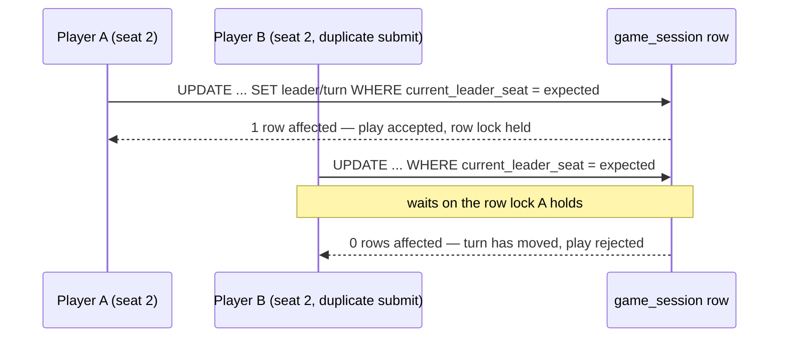

# ADR-023: Every Card Is Dealt, and the Current Leader's Seat Lives on `game_session`

**Status:** Accepted
**Date:** 2026-08-12
**Deciders:** @tech-lead, @architecture-guardian

## Context

EOP-14 is the core game mechanic and the largest story in the backlog: deal the
deck, lead a trick, enforce follow-suit, resolve the winner, pass the lead. Two
questions it depends on were never answered — not by the PRD, not by the ticket,
not by either primary source. They are answered here, having been confirmed with
the product owner on 2026-08-12, because both would otherwise be settled by
whoever typed the first implementation and settled differently by whoever typed
the second.

**The deck does not divide evenly.** It is 78 cards — six suits of thirteen ranks
— seeded by EOP-13 from `cards.yaml`. Against the PRD's supported range of three
to six players (§4, ADR-019) that arithmetic is:

| Players | Cards each | Remainder |
|---|---|---|
| 3 | 26 | 0 |
| 4 | 19 | **2** |
| 5 | 15 | **3** |
| 6 | 13 | 0 |

EOP-14 requires that "any remainder when the deck does not divide evenly must be
handled explicitly and the same way every time" — and stops there, without saying
how. Two of the four supported table sizes are affected, and the two that are
affected are the middle of the tested range rather than an edge case.

**There is no entity to hold whose turn it is.** PRD §5 lists a `GameState`
block — `currentLeader`, `currentTrick`, `completedTricks` — described as being
"within a Session", but no such aggregate exists in the code and none is
specified. `GameSession` is an immutable aggregate root whose every mutation
returns a new instance, so "the current leader" has no obvious home, and the
turn-order rule that ADR-019 made load-bearing has nothing to read.

Both gaps land in the same story, and both bear on the same requirement: EOP-14
demands "a genuinely concurrent test proving two simultaneous plays cannot both
be accepted for the same seat." A rule with no total definition and a turn
pointer with no single row cannot be proved concurrent; they can only be
asserted to be.

**One correction carried in from the ticket.** EOP-14's description closes with
"Also needs the concurrency-control decision, number 017." That reference is
wrong. ADR-017 is *Front-end Delivery Topology*; concurrency control is
[ADR-020](ADR-020-session-concurrency-control.md). PRD §9 reconciles the drift in
full. The distinction matters here because ADR-020 exists chiefly to warn that
the `@Version` column on `GameSessionJpaEntity` is bookkeeping and **not** the
enforcement mechanism, and decision 2 below is built directly on that warning.

## Decision

### 1. Every card is dealt, and the remainder goes to seats in ascending order

The whole deck is dealt. After each player has received `78 / n` cards, the
remaining `78 mod n` cards are dealt one each to seats `0, 1, 2, …` in ascending
seat order — the stable `seatOrder` assigned at join and never re-derived
(ADR-019), in which the facilitator holds seat 0. No card is set aside, and there
is no draw pile and no discard.

| Players | Hands |
|---|---|
| 3 | 26, 26, 26 |
| 4 | **20, 20**, 19, 19 |
| 5 | **16, 16, 16**, 15, 15 |
| 6 | 13, 13, 13, 13, 13, 13 |

**The reason is that the rejected alternative makes the opening-lead rule
partial.** Dealing evenly and setting the remainder aside undealt is the obvious
alternative and it carries a latent defect. EOP-14 and PRD §3.3 both require that
the holder of the lowest-ranked Tampering card *present in the deck* leads the
first trick. If two or three cards are set aside, the lowest-ranked Tampering card
can be among them — and then that rule has **no holder**. The opening lead would
need a fallback branch that no requirement describes, that no source sanctions,
and that would be reached only at certain player counts, with certain shuffles.
That is the worst available failure profile: rare, non-deterministic, dependent on
table size, and invisible in any test that happens to shuffle kindly. Dealing
every card makes the rule **total** — it resolves at every player count, for every
shuffle, always.

Two further arguments support it rather than carry it. It is how the physical deck
is actually dealt: players deal the whole deck out, they do not measure it first.
And it keeps maximum threat coverage in play, which is the entire purpose of the
deck — every card withheld is a threat prompt the group never discusses, and the
deck is a threat library before it is a game component.

**The accepted cost, stated plainly: hands are unequal, so the final trick is
short.** At four players two people hold 20 cards and two hold 19; at five, three
hold 16 and two hold 15. The last trick of the game therefore has fewer cards in
it than there are players at the table. This is not a defect to be corrected
later: it is already sanctioned by the PRD §3.3 end condition, where play
continues "until players run out of time, cards, or ways to connect their threats
to the system."

The direct domain consequence must be built in from the first line of Slice A:

> **A trick is one card from each player who still holds cards — not a fixed
> count of cards, and not one card per seat.**

A reader who assumes trick size equals player count will write a defect that
appears only in the last trick of a four- or five-player game. Trick completion is
therefore "no seat that still holds a card is yet to play into this trick", and the
same qualifier applies to turn advancement — see the note on ADR-019's formula
below.

An earlier revision of this ADR phrased completion as "every player who held a
card *at the start of this trick* has played one". That is the same rule but it
cannot be expressed by the domain, because `Trick.isComplete` is handed the set of
seats holding cards *now* rather than a snapshot taken when the trick opened. The
two readings agree — a seat that has just emptied its hand is excluded by having
already played, not by still holding a card — but the at-start-of-trick phrasing
invited an implementer to build a snapshot that nothing needs. The current-set
semantics are pinned in `Trick.isComplete`'s Javadoc so the choice is not left to
be inferred a third time.

### The opening lead is derived from the cards dealt, never written down

The rule is *the holder of the lowest-ranked Tampering card present in the deck
leads the first trick*. It is evaluated at runtime against the hands actually
dealt: find the lowest-ranked Tampering card among all dealt cards, and its holder
leads. **A literal `2` or `3` anywhere in the implementation is a defect** and is
grounds for rejection in review, per EOP-14 and PRD §3.3.

This is worth stating as a decision rather than an instruction, because the rule
has two contradictory sources and both of them are right. The shipped instruction
card says the 3 of Tampering; the whitepaper says the 2. The printed 74-card deck
has no 2 of Tampering, so 3 is its lowest; the 78-card `cards.yaml` deck does have
one, so 2 is ours. Neither document is in error and neither can be preferred.

Derivation is the only treatment that is correct for *both* decks, and that is the
point: a constant would encode which deck the author happened to be reading, and
would silently become wrong the day the deck content changes — which has already
happened once, in EOP-13, when the placeholder deck was replaced. Deriving the
lead means the seeded card data is the single source of truth for a rule the prose
states two ways, and a future deck edit cannot make the game start with the wrong
player.

### 2. The current leader's seat is stored on the `game_session` row

The seat of the player leading the current trick is persisted as a column on
`game_session`. It is unset while the session is in `LOBBY`, written when the deal
completes with the derived opening leader's seat, and advanced as each trick
resolves — to the winner's seat when the winner still holds a card, and otherwise
to the next seat clockwise from the winner that does.

> **The winner does not always lead the next trick, and an earlier revision of
> this ADR said it did.** It read "advanced to the winner's seat as each trick
> resolves", full stop. Decision 1 makes hands unequal, so a seat can play its
> final card into a trick and win that trick. At four players seats 2 and 3 hold
> nineteen cards while seats 0 and 1 hold twenty: if seat 2 or seat 3 takes trick
> nineteen, the winner is out of cards while two other seats each still hold one.
> Handing the lead to the winner regardless would open trick twenty on a seat that
> can never play into it. `Trick.seatToPlay` would report that nobody may play,
> `isComplete` would report the trick incomplete because it holds no plays, and the
> game would simply stop — with no exception, no error and nothing to log. That is
> precisely the failure profile this ADR exists to prevent: correct at three and
> six players, correct for every trick but the last, wrong only at four and five.
> The rule is therefore stated as a rule and implemented as one, in
> `Trick.nextLeaderSeat(Collection<Integer> seatsHoldingCards)`, which returns no
> seat at all when nobody holds a card — one of PRD §3.3's three end conditions,
> rather than a state to recover from. The bare `winningSeat()` accessor is
> deliberately *not* called `nextLeaderSeat`, so that reaching for the winner and
> using it as the next leader is no longer the path of least resistance.

**Rejected: derive the current leader from the winner of the last resolved
trick.** It looks like the cheaper option — no schema change, no mutable state,
the answer computed from the trick history that has to exist anyway. It was
rejected because it is not actually cheaper. The *opening* leader has to be
persisted somewhere regardless: there is no prior trick to derive it from, and
recomputing it by re-deriving the lowest Tampering card on every read would make
the answer depend on hands that are being emptied as play proceeds. So the
derive-only design still needs the column for trick 1, and then adds a *second*
code path for tricks 2..n. Two paths where one suffices, in the code that decides
whose turn it is — the one question in this story that must never have two
answers.

**The deciding reason is ADR-020.** Concurrency in this application is controlled
by status-guarded conditional `UPDATE` with a rows-affected check — compare-and-
set — plus unique constraints. It is *not* controlled by JPA optimistic locking. A
single mutable row is exactly the shape that mechanism needs. With the leader's
seat on `game_session`, the turn-order guard has one row to compare-and-set
against: the update names the seat the caller believes is on turn, and the
database applies the play only if that belief is still true when the statement
executes. One means accepted, zero means the turn moved. The `UPDATE` also takes
the row lock that serialises two simultaneous plays before either inserts into
`trick_play`, which is the same shape as `touchWhileInStatus` in ADR-020 — the
statement whose visible purpose looks like housekeeping and is in fact the lock
acquisition.

That is what makes EOP-14's concurrency requirement **provable rather than
asserted**. Two threads submitting a play for the same seat in the same instant
are ordered by the database; the loser reads a world the winner has finished
changing, and gets a rejection it can be tested for.

**Repeating ADR-020's warning, because an implementer arriving at this ADR is
about to write concurrent code:** `GameSessionJpaEntity` maps a `@Version` column
and that column is **not** the gate. Nothing in the repository handles
`OptimisticLockingFailureException`, no method carries `@Lock`, and the version is
hand-incremented inside the conditional JPQL rather than maintained by Hibernate's
locking machinery. Do not add a version-checked read-modify-write here on the
assumption that the framework already covers it; that would install a second gate
beside a working one. If the two ever need reconciling, reconcile them in a new
ADR.

**The column is decided here and created elsewhere.** Liquibase owns the schema
(ADR-008), and the column arrives in changeset `004` alongside `hand`, `trick` and
`trick_play`, in Slice B of EOP-14, before the JPA entities. This ADR decides that
the field exists and why; it does not create it.

**The domain aggregate stays immutable.** Storing a mutable seat on a row does not
make `GameSession` mutable: advancing the leader returns a new instance, exactly as
every other mutation does, and the compare-and-set lives in the persistence
adapter where the SQL guard belongs. Nothing about the version-free, framework-free
domain aggregate changes — which is also why the leader is stored as a **seat
number** rather than as a player id, narrowing PRD §5's `currentLeader: Player`.
Seat order is the stable, constraint-protected identifier that turn order is
computed from (ADR-019); a player id would be a second key to the same fact and
could disagree with the first.

### Turn order, restated for the short trick

Play remains clockwise by the stable seat order from ADR-019. ADR-019 states the
derivation as "the current leader's seat plus the number of cards already in the
trick". That formula is correct for every trick but the last, because it assumes
every seat still holds a card. Under decision 1 it must be read as **the next seat
clockwise that still holds a card**. This is not a contradiction of ADR-019 — its
premise simply did not include unequal hands, because dealing was not in its story
— but it is a defect waiting in any implementation that copies the formula
literally.

### Lock ordering, now that two tables are written in one transaction

ADR-020 recorded as neutral that "no deadlock ordering policy is written down",
because only `game_session` was locked, and predicted that EOP-14 would make this
a real decision. It has. A play now compares-and-sets `game_session` and inserts
into `trick`/`trick_play` in one transaction, so the acquisition order is fixed
here: **`game_session` first, then `trick`, then `trick_play`** — parent before
child, in every write path, without exception. The guard has to be taken before
the insert anyway for the serialisation to mean anything, so the ordering costs
nothing and removes the only currently constructible lock cycle.

## Consequences

**Neutral — `Trick` holds no session reference, so Slice B must carry the session
explicitly.** PRD §5 gives `Trick` a `session` field and specifies `sequence` as
1-based *within the session*. The domain type deliberately holds neither: keeping
foreign keys out of entities is the house style, and `Trick.reconstitute` cannot
round-trip a column the entity does not carry. The consequence is that `sequence`
uniqueness is an invariant no entity can check — two tricks in one session can
share a sequence number with nothing in the domain objecting. Slice B must
therefore put the session in the port signature (`save(UUID sessionId, Trick)`
rather than `save(Trick)`) and enforce the invariant with a
`uq_trick_session_sequence` constraint in changeset `004`. Decide this before the
changeset is written, not after.

**Neutral — the rest of what Slice B's changeset owes, decided here rather than
discovered there.** `Trick.reconstitute` is deliberately not a validating gate for
the rules of play: it re-runs the invariants a trick can check from its plays alone
— one play per seat, one card per trick, one player across the plays, one identifier
per play, the first play belonging to the leading seat, plays running clockwise from
it, and a winner drawn from the plays — and it cannot check follow-suit, because that
is a question about a hand and a trick holds no hands. Every one of those invariants
that *can* have a storage counterpart must get one, or the domain's guarantee stops
at the boundary of whatever the adapter happens to write:

- `hand` unique on `(session_id, seat_order)` — the executable form of the
  seat-collision guard `Hands.deal` now applies in memory.
- `trick_play` unique on `(trick_id, seat_order)` and on `(trick_id, card_id)` — the
  counterparts of one-play-per-seat and one-card-per-trick.
- `trick_play` unique on `(trick_id, player_id)` — the counterpart of one player
  across the plays, which is the stored form of the seat-impersonation defect
  EOP-14 Slice A had to fix twice.

Two obligations have no constraint available and must be met in code instead. The
clockwise-order invariant cannot be expressed as a constraint at all, so row *order*
is load-bearing: the adapter must select `trick_play` in a deterministic order rather
than relying on insertion order. And the text columns must be sized in
*characters*, matching `MAX_COMPONENT_NAME_LENGTH` and `MAX_NOTES_LENGTH` directly:
`varchar(200)` and `varchar(2000)`.

> **Corrected 2026-08-12.** An earlier revision of this ADR said the bounds count `char`
> values rather than bytes, that 200 characters is up to 800 UTF-8 bytes, and therefore
> that the columns should be sized *in bytes*. The premise is wrong and the instruction
> that followed from it was worse. PostgreSQL's `character varying(n)` counts characters,
> not bytes, and so does H2 — so there is no asymmetry between the test database and the
> production one, and `varchar(200)` accepts a 200-character name whatever those
> characters cost to encode. Had Slice B followed the old instruction it would have
> written columns four times looser than the domain, on a false premise, out of the one
> document that exists to stop it guessing. Caught by @architecture-guardian.
>
> The genuine byte-denominated limit nearby is a different one: PostgreSQL refuses a
> B-tree index entry over roughly 2704 bytes, which `MAX_NOTES_LENGTH` can exceed once
> multi-byte characters are involved. So the real obligation is the opposite of the old
> one — size in characters, and do not index the free-text columns.

Three further questions belong to that changeset and are answered here rather than
discovered there.

**`trick` gets no `led_suit` column.** `Trick.ledSuit()` reads the suit off the first
play, so a stored column would be a second authority for a fact the domain already
derives — and one no write path would ever populate, because the entity has no setter for
it and is not going to acquire one. PRD §5 modelled it as stored and has been corrected
to say derived. If a later story wants it stored for query performance it needs a
constraint tying it to the first play's suit, and that is a new decision rather than an
oversight to fill in.

**A reconstitution-invariant failure is a server fault, not a client error.**
`Trick.reconstitute` throws `IllegalArgumentException` when a stored row set is one no
legal play could have produced, and `GlobalExceptionHandler` maps
`IllegalArgumentException` to 400 with the exception's own message as the detail. Once
Slice B makes that path reachable, corrupt data would blame the caller for the server's
corruption and disclose an internal invariant message while doing it. Slice B must give
reconstitution failures their own type, mapped to 500 with a fixed detail, on the pattern
of the `NoTamperingCardDealtException` mapping Slice A added.

**`PlayerMismatchException.getMessage()` must never reach a problem detail.** The message
names a seat and nothing else, precisely so that it is safe to log; the two player
identifiers are reachable only through the accessors. Slice A's handler returns a fixed
detail and takes no exception argument at all. A later handler that reached for
`getMessage()` by reflex would be safe today and would silently become a disclosure the
moment anyone put an identifier back into the message.

**Positive — the *opening*-lead rule is total.** It resolves for every player count
and every shuffle, with no fallback branch, no unreachable-in-practice code path,
and nothing that behaves differently at four players than at six. The rule that
would have been hardest to debug is now the one that cannot fail.

The emphasis is load-bearing, and an earlier revision of this section did not
carry it. Totality was achieved for the *opening* lead, not for turn order in
general: the lead-*passing* rule is the partial one, because the winner of a trick
may hold no cards, and it was the sentence above — read as though it covered turn
order generally — that let that gap sit unnoticed one section away from where it
was described. Both rules are now total, but they are two rules and only one of
them was ever argued for here. Nothing enforces that `Hands.deal` is handed the
*whole* deck either: `deal` accepts any list of cards and only checks it is at
least as large as the seat count, so "the lowest Tampering card present in the
deck" and "the lowest Tampering card actually dealt" coincide by convention rather
than by construction. Slice C's dealing use case must assert that the deck it
fetched is the complete seeded deck; until it does, this ADR's central argument for
decision 1 lives in prose and in no executable place.

**Positive — the deck is fully in play.** All 78 threat prompts are held by
someone, so the group's threat coverage is maximal at every table size. Nothing is
withheld from a session whose purpose is to surface threats.

**Positive — turn order has exactly one home and one guard.** One row, one
compare-and-set, one rejection path. The concurrent double-play test EOP-14
demands has something to assert against, and the winner of a race is chosen by the
database rather than by application logic that could be refactored away.

**Positive — the lock order is written down before the deadlock happens.** Parent
before child, decided in this ADR rather than discovered as an intermittent
failure in Slice D.

**Negative — hands are unequal, and the final trick is short.** At four and five
players some players hold one more card than others. Any code, test, DTO or UI
that assumes `trick.plays.size() == players.size()` is wrong. This is the single
most likely defect to come out of this decision, which is why the domain defines a
trick as one card from each player who *still holds cards*.

**Negative — the extra cards go to the lowest seats, and seat 0 is the
facilitator.** Ascending seat order was chosen for determinism and testability,
but it means the facilitator systematically receives one of the extra cards at
four and five players. Under EOP-15's scoring (1 point per linked threat, +1 for
taking the trick) the extra card is worth up to **2** points, not the 1 point an
earlier revision of this section implied by calling it "one card in nineteen": an
extra card is an extra chance to link a threat *and* an extra chance to take a
trick. The shape of the effect also differs by player count, which that phrasing
obscured. At four players seats 0 and 1 gain a card and seats 2 and 3 do not; at
five players seats 0, 1 and 2 gain one, so it is the *minority* — seats 3 and 4 —
who are disadvantaged rather than one person who is favoured. What is constant is
that the facilitator is never on the losing side of it, because the facilitator
always holds seat 0. Accepted for now: the effect is small against a 60–90 minute
collaborative exercise whose scoring exists to drive participation rather than to
be won, it is visible rather than hidden, and the alternative — rotating the start
seat, as a physical dealer would — adds state that has to be persisted and
reasoned about for a fairness gain nobody has measured. If EOP-15 shows it
matters, rotate the start seat in a new ADR rather than by quietly changing the
deal.

**Negative — a mutable turn pointer now sits beside a `@Version` column that is
not the gate.** ADR-020 already named this hazard for `status`; decision 2
extends the same hazard to a second field on the same row. The mitigation is
documentation only. There is no compiler check preventing a contributor from
calling `save()` on a managed `GameSessionJpaEntity`, silently getting Hibernate's
version check, and concluding the turn guard is redundant.

**Neutral — turn order remains clockwise by the stable seat order from
ADR-019.** Nothing in this ADR re-derives, re-sorts or reassigns seats. Seats are
still assigned once at join, protected by `uq_player_session_seat`, and the
facilitator still holds seat 0. Only the *next-player* formula is qualified, to
skip seats that have run out of cards.

**Neutral — this ADR decides a column it does not create.** `current_leader_seat`
lands in Liquibase changeset `004` in Slice B, before the entities (ADR-008). An
ADR that is accepted before its schema exists is normal here; the index's
"Implemented?" column carries the difference.

**Neutral — scoring is untouched.** The unequal-hand consequence has an obvious
bearing on fairness, and fairness is a scoring concern. EOP-15 owns it. This ADR
records the input, not the answer.

## Related

- [ADR-019](ADR-019-session-lifecycle-and-join-codes.md) — seat order assigned once at join and never re-derived, clockwise play, and the next-player formula this ADR qualifies for the short final trick
- [ADR-020](ADR-020-session-concurrency-control.md) — compare-and-set on a single row is why the leader's seat is stored rather than derived; the `@Version` warning repeated above; and the deadlock-ordering decision it predicted EOP-14 would have to make
- [ADR-008](ADR-008-database-migration-liquibase.md) — Liquibase owns the schema; `current_leader_seat` arrives in changeset `004` before the entities
- [ADR-018](ADR-018-uuid-v7-identifiers.md) — identifiers for `hand`, `trick` and `trick_play` are minted in the use case, not at flush
- [ADR-013](ADR-013-feature-flags.md) — every slice of EOP-14 that adds a route or changes behaviour a player can see will ship behind `eop.features.trick-play`, false by default. That flag does not exist yet: Slice A is pure domain with nothing to gate, so the flag is created in Slice C when dealing is first wired into session start
- [ADR-005](ADR-005-error-handling-strategy.md) — where an out-of-turn play and a follow-suit violation become RFC 9457 problem details
- [ADR-014](ADR-014-realtime-transport.md) — events carry no state and reconnection is a re-read, so the stored leader seat is what a reconnecting client sees
- [PRD §3.3](../requirements/PRD-eop-card-game.md) — dealing, the derived opening lead, and the "time, cards, or ways to connect" end condition that sanctions the short final trick
- [PRD §5](../requirements/PRD-eop-card-game.md) — the `GameState` block with no entity, and `seatOrder` described as load-bearing
- [PRD §9](../requirements/PRD-eop-card-game.md) — why "decision 017" in EOP-14's description means ADR-020
- EOP-13 (the 78-card deck this arithmetic depends on), EOP-14 (this story), EOP-15 (scoring, which inherits the unequal-hand consequence)
