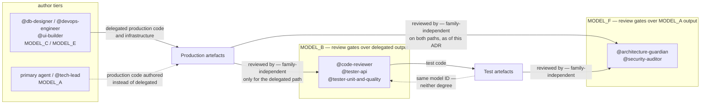

# ADR-046: A Definition-of-Done Gate Is Pinned By A Capability Floor And A Passing Probe, Not By Tier Name

**Status:** Accepted (amended 2026-08-24 by ADR-059)
**Date:** 2026-08-21
**Deciders:** operator, primary agent (`MODEL_A`)

## Context

[ADR-022](ADR-022-agent-model-tier-governance.md) fixed a real defect and left a smaller one
behind. Its rule 1 reads *"Any agent named as a Definition-of-Done gate is pinned to `MODEL_A` or
`MODEL_B`. No DoD gate may sit on `MODEL_C` or `MODEL_E`."* That is a **whitelist of tier names**,
and a tier name is not a property of a model — it is a variable that happens today to point at a
model with the properties the rule actually cares about. The rule names the proxy and leaves the
thing it is a proxy for unwritten, so it cannot be satisfied by a tier it does not enumerate, no
matter how capable that tier is. The proxy breaks the first time a third capable tier is wanted,
which is what happened here.

What forced the question is ADR-022's own rule 5. The Separation Invariant is conditional there,
with two documented exceptions, and the second is that **production code the primary agent or
`@tech-lead` authors itself instead of delegating shares `MODEL_A` with two of the five gates** —
`@security-auditor` and `@architecture-guardian`. `MODEL_A` writes Java in this repository
routinely; it is the global default in `.opencode/opencode.json` and the pin for `@tech-lead`. So
for the whole of the self-authored path, two of the five gates are reviewing the weights that
produced the artefact. ADR-022 recorded that honestly rather than denying it, and recorded it as a
cost accepted for want of an alternative. An alternative now exists.

Moving only `@security-auditor` would half-close the exception and leave it standing, since it is
stated over two gates, not one. Both are therefore moved. The two are not symmetric and the
asymmetry is the main cost of this decision: `@security-auditor` declares `permission.edit: deny`
and its reply is its only deliverable, whereas `@architecture-guardian` writes files — ADRs and C4
models, this document's own genre — and prose is a build gate here by way of
`src/test/java/org/maglez/eop/docs/`. Repointing it changes who authors the project's
architectural record.

Because both changes require a third reasoning tier, and because ADR-022 rule 6 states that
*"Reversing any part of this allocation requires a superseding ADR. It may not be done by editing
the tier tables"*, the change cannot be made in `.env` and the tables alone. This ADR is that
superseding record, and it supersedes **rule 1 only**.

**This decision was deliberately not delegated to `@architecture-guardian`.** That agent is one of
the two being repointed, so asking it to rule on its own tier is the precise shape of self-review
the Separation Invariant exists to prevent — a model deciding whether its own replacement is
warranted. The record notes this rather than quietly conforming to ADR-022's own Deciders line.

### The probe campaign, which is why this ADR is not merely a wider whitelist

The first draft of this decision replaced rule 1 with a capability floor read off the model
catalogue: reasoning-capable, verified structured tool-calling, an output ceiling, family
independence. Screening candidates against that floor produced a shortlist, and **screening the
shortlist by actually running it destroyed the draft**. Three models satisfied every clause of the
floor on paper and were unusable in practice, each failing differently:

- **`openai.gpt-5.6-luna`** — the bare identifier is not invocable in `eu-west-2` at all
  (Bedrock, not the resolver, answers `The model 'openai.gpt-5.6-luna' does not exist`). Its
  cross-region `global.` variant *is* invocable and passes a trivial text probe, then fails a
  tool-using probe outright with `Type validation failed` on `contentBlockDelta.delta`: the model
  emits `reasoningContent.redactedContent`, which matches no branch of the union OpenCode's
  Bedrock provider accepts. The stream dies and no tool call ever executes. The instructive part
  is *why the first probe passed*: a trivial reply emits no reasoning block, and every real gate
  audit does. **A plain-text probe proves nothing for a reasoning model.**
- **`mistral.magistral-small-2509`** — made a real tool call and **hallucinated its result**. Asked
  for the line count of a six-line rule file it answered `20`, invented a heading the file does not
  contain, reproduced bullet text from a different file it had not been asked to read, and emitted
  fabricated tool-runtime narration as its own assistant prose. For an agent whose sole deliverable
  is severity-tagged findings citing `file:line` plus literal command output, **fabricated evidence
  is strictly worse than the two hollow-`APPROVE` failures ADR-022 was written to stop**: a hollow
  approval withholds evidence, a fabricated one manufactures it.
- **`nvidia.nemotron-super-3-120b`** — answered the first probe **correctly** while never calling
  the tool. It guessed. A re-probe whose answer cannot be guessed (the final word of the file's
  last line) was answered wrongly, again with no tool call. This candidate is the entire reason the
  observed-tool-call check below exists, and the reason a correct answer is not by itself a pass.

Two further candidates were not invocable in-region (`xai.grok-4.3`, `xai.grok-4.6`), one passed
but leaked raw protocol scaffolding into its assistant text (`deepseek.v3.2`), and one passed
cleanly but falls below the output floor (`moonshotai.kimi-k2.5`, 16,000). Two passed cleanly:
`minimax.minimax-m2.5` and `zai.glm-5`.

The conclusion is not that the floor was wrong but that **it is not evidence**. Catalogue metadata
describes a model's advertised shape; it does not establish that this provider, in this region,
through this client, can complete a tool-using turn and report truthfully what it read. Only
running it establishes that. So the probe is promoted from a verification step into a clause of the
rule itself.

## Decision

**Rule 1 of ADR-022 is superseded.** Rules 2 through 6 stand unamended and continue to govern:
the five gates are unchanged, `@performance-engineer` is still not a gate, the Sign-off Contract is
still required in addition to the pin, the Separation Invariant is still conditional, and reversing
any of this still requires a superseding ADR.

1. **A Definition-of-Done gate may be pinned to any tier that satisfies all three of the clauses
   below.** Tier names are no longer part of the rule. `MODEL_C` and `MODEL_E` remain ineligible,
   but by consequence rather than by enumeration: the model behind them is not reasoning-capable
   and so fails clause 2.
2. **Capability floor.** The model must be reasoning-capable, must support structured tool calls,
   must carry a maximum output of at least 40,000 tokens, and must carry a context window of at
   least 128,000. The output floor is the load-bearing one and it is specific to this role: a
   gate's reply *is* its deliverable — it may not write a file — and that reply must carry
   severity-tagged findings citing `file:line` together with literal command output. A truncated
   verdict is an absent verdict.
3. **Family requirement.** The tier must be family-independent, in Blueprint §3.1's sense, of
   every tier that authors the artefact class the gate reviews. Model-independence does not
   satisfy this clause. Where a gate reviews more than one artefact class, the requirement holds
   against each of them.
4. **A passing two-stage probe, recorded, is a precondition of the pin — not evidence gathered
   afterwards.** Both stages are mandatory and neither substitutes for the other.
   - **Stage 1, invocability.** The exact identifier that will be written into `.env` must return
     a trivial reply from the configured region. A working sibling identifier does not count: a
     bare identifier and its `global.` variant are different pins with different outcomes, as
     `openai.gpt-5.6-luna` demonstrates.
   - **Stage 2, truthful tool use.** The model must be asked to read a named file with its own
     tool and report a fact about it. The pass requires **all three** of: the tool call *observed*
     in the transcript, the turn completing without a stream or schema error, and the answer
     matching ground truth established independently. If the correct answer is guessable, re-probe
     with a fact that is not — a correct answer produced without a tool call is a failure, not a
     pass.
   - Both verdicts, including failures and the reason for each, are recorded in Blueprint §3.4.1.
     **A pin carrying no recorded verdict is non-compliant regardless of how the model performs.**
5. **`MODEL_F` is created for this purpose and holds `@architecture-guardian` and
   `@security-auditor`.** One tier rather than two: the two gates have identical requirements
   under clauses 2 and 3, and the `MODEL_C`/`MODEL_E` precedent for duplicating a variable exists
   to permit independent repointing of front-end work, which is not a need either gate has. Each
   additional variable multiplies the number of documented tables that can drift.
6. Clause 4 binds every future gate pin, including a repoint of `MODEL_A` or `MODEL_B` themselves.
   A tier that is currently eligible does not stay eligible when its value changes.

Compare this against ADR-022's diagram to read what changed. There, the solid `PROD --> G1` edge
carried the qualifier *"family-independent only for the delegated path"*, because `G1` shared
`MODEL_A` with `TL`. Here that qualifier is gone from the `G1` edge and survives only on the `G2`
edge, whose tier is still Anthropic Claude alongside `MODEL_A`. The `TEST --> G1` edge is upgraded
from model-independent to family-independent for the same reason. The single remaining dashed
exception is `TEST -.-> G2`, where `@code-reviewer` and the two testers resolve to the *same model
ID*.

## Consequences

**Accepted gains.**

- **ADR-022's second exception is closed, not narrowed.** Production code the primary agent or
  `@tech-lead` authors itself is now reviewed family-independently by two of the five gates. The
  Separation Invariant retains exactly one exception — test code — and every citation of it must
  now say *one* rather than *two*.
- Test code gains a family-independent reviewer for the first time. ADR-022 stated plainly that
  *"no reviewer of a tester-authored test sits outside the author's family, so for test code the
  family-level guarantee §3.1 asks for is absent entirely"*. That sentence is now false:
  `MODEL_F` sits outside Anthropic Claude and reviews test code.
- The rule is extensible. Adding or repointing a tier is now a question of evidence against three
  clauses, not a request to amend a list of names, so the next capable tier does not need a
  further ADR merely to be permitted.
- Gate work gets substantially cheaper. `MODEL_F` costs 0.3/1.2 per million tokens against
  `MODEL_A`'s 5.5/27.5 — an order of magnitude and more on output, across two gates on every
  story. ADR-022 accepted rising gate cost as a consequence; this reduces it while strengthening
  the guarantee, which is the rare case where the two do not trade against each other.
- Clause 4 converts a habit into a rule. The probe method was already documented in
  `.env.example`, and it was documented as advice — which is exactly the shape of the failure
  ADR-022 diagnosed, where *"the rule existed; the pin contradicted it; nothing detected the
  contradiction."*

**Accepted costs, stated plainly.**

- **Nothing enforces any clause of this ADR programmatically.** There is no test asserting that a
  gate's tier is reasoning-capable, that its probe verdict exists, or that its family differs from
  the author's. `tools/agent-trace.py` detects same-model self-review after the fact and nothing
  else. The wording of this ADR *is* the mechanism, and it is enforced by review — the same
  standing weakness ADR-022 has.
- **`minimax.minimax-m2.5` has passed one probe and has no track record at gate work in this
  repository.** A clean probe establishes that it can read a file truthfully and report a number;
  it does not establish that it will hold a Sign-off Contract across a real audit, which is the
  behaviour ADR-022's two documented failures were failures of. This is a genuine risk taken
  knowingly, and the mitigation is ordinary observation: if either gate returns a verdict without
  its contracted evidence, that is a rule-1 regression under the new clauses and the pin must be
  reconsidered rather than the finding excused.
- **`@architecture-guardian` now authors this project's ADRs and C4 models on a model never
  before used for prose here.** Prose is a build gate — `AdrIndexConsistencyTest`,
  `DeckArithmeticClaimsTest`, `MermaidSequenceTextTest` and two others read repository text during
  `verify` — so a weaker documentation author does not merely produce worse documents, it turns
  the build red. The blast radius is real and was accepted in preference to leaving the gate
  reviewing its own tier's output.
- **The output ceiling drops for both gates**, from 128,000 to 98,304. That is well clear of the
  40,000 floor in clause 2 and above `MODEL_B`'s 64,000, so no current gate loses headroom
  relative to its peers — but it is a reduction against what these two gates had.
- **`MODEL_F` is not EU-pinned, and this must not be described as though it were.** Only the ten
  `eu.`-prefixed Anthropic entries in the Bedrock catalogue carry an EU inference profile. The new
  pin is a bare identifier, exactly as `MODEL_C` and `MODEL_E` already are, so it introduces **no
  residency posture beyond the one the repository already has** — but it does not improve on it,
  and whether a bare identifier keeps inference in-region is not established by anything read
  here. It is stated as unverified rather than resolved in either direction. This mattered enough
  to influence the choice: the rejected `global.openai.gpt-5.6-luna` would have required an
  explicitly cross-region profile, a change of posture rather than a continuation of it, for two
  gates that read repository source and audit findings.
- **The Zen provider route is unprobed.** `.env.example` carries `#MODEL_F=opencode/minimax-m2.5`
  in the Zen block, because `switch-provider.sh` aborts if a variable is absent from the block it
  switches to. Same model, different provider, and clause 4 is about the route as much as the
  model — so that line is commented with a warning and must be probed before anyone runs
  `./tools/switch-provider.sh zen`.
- **The tier count grows from five variables to six, and from four distinct models to five.** Every
  document that states the tier count goes stale in the same change: `AGENTS.md`, `.env.example`,
  the Blueprint's several tables, and this index. ADR-022 identified scattered tier tables as the
  root cause of the drift it was written to fix, and this decision adds one more row to each of
  them. The mitigation is that the rule now lives in an ADR while only the values live in the
  tables.
- Clause 4 makes changing a gate's model slower. A repoint that used to be a one-line edit now
  requires two probes and a Blueprint entry before it is compliant. That cost is the point, and
  the probe campaign recorded above is what a single skipped probe would have cost instead.
- **A probe is a snapshot, not a guarantee.** It establishes behaviour at one moment against one
  provider deployment. A silently updated model behind a stable identifier can regress without any
  local change, and nothing here detects that.
- Tier changes take effect only after an OpenCode restart, unchanged from ADR-022. The pins in
  this change are not in force for the session that made them.

## Amendments

**Amendment, 2026-08-24 (EOP-179, [ADR-059](ADR-059-code-review-gate-on-its-own-model-tier.md)).** The original text stands. Two corrections.

**"Nothing enforces any clause programmatically, so the wording is the mechanism" is no longer wholly true.** `SeparationInvariantTest` — the tenth repository-integrity gate, in `src/test/java/org/maglez/eop/docs/` — now mechanises clause 3, family-independence of the tiers that authored the artefact under review, for **production code, infrastructure and test code**. It reads the pins from `.opencode/opencode.json`, resolves each `{env:MODEL_X}` from the active block of the tracked `.env.example`, and fails the build on any Definition-of-Done gate sharing a model identifier with an agent authoring an artefact class that gate reviews. It fails loudly by `IllegalStateException` when a variable cannot be resolved, rather than skipping the assertion. The other clauses of the floor — reasoning capability, structured tool calls, the 40,000-output and 128,000-context minima, and clause 4's recorded probe verdict — remain prose that a reviewer enforces, because none of them is derivable from a config file. State the asymmetry that way, as [ADR-052](ADR-052-having-value-mandate-is-build-enforced.md) does for its own half-mechanised mandate; do not describe the floor as automated.

**`MODEL_F` no longer holds every gate that needs family independence, and one overlap survives on it.** This ADR created `MODEL_F` for `@architecture-guardian` and `@security-auditor` and said that closed the second exception to the Separation Invariant. That remains accurate for `MODEL_A`-authored production code. But `@architecture-guardian` *authors* ADRs and C4 models while `@security-auditor` reviews them from the same tier at one model identifier, so **architecture documentation is reviewed by a tier-mate** — neither model- nor family-independent. ADR-059 records this as the single declared, justified allow-list entry in the new test rather than leaving it as undisclosed prose, and does **not** close it. Clause 4 also gained a stricter reading in the process: a probe verdict is screened for the *role* the gate will perform, so the 2026-08-21 `zai.glm-5` verdict for architecture and security work was **not** treated as transferable to code review, and a fresh two-stage code-review probe with a `MODEL_B` control was run and recorded in Blueprint §3.4.1 before `MODEL_G` was pinned.

## Related

- [ADR-022](ADR-022-agent-model-tier-governance.md) — the decision this supersedes in part. Its
  rule 1 is replaced; rules 2 through 6 stand, and its Context remains the authoritative account
  of why gate tiering exists at all
- [ADR-006](ADR-006-build-quality-gates.md) — the mechanical build gates, including the
  documentation-integrity tests that make `@architecture-guardian`'s output a build concern
- `.opencode/docs/OpenCode_Autonomous_Engineering_System_Blueprint.md` §3.1 for the two degrees of
  independence, §3.4 for the tier catalogue, §3.4.1 for the probe verdicts clause 4 requires, and
  §12.8 for the completion auditor's own shortfall against the invariant
- `AGENTS.md` — the operational statement of these rules for day-to-day work
- `.env.example` — the tier catalogue and the provider blocks the pins live in
- `tools/agent-trace.py` — `/trace`, which detects same-model review after the fact and is the
  only automated check anywhere near this ADR
- EOP-000 (this decision)
