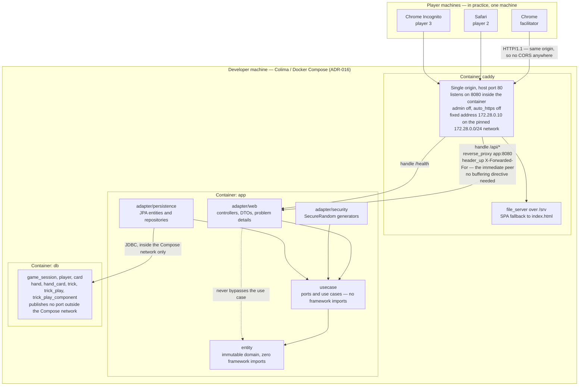
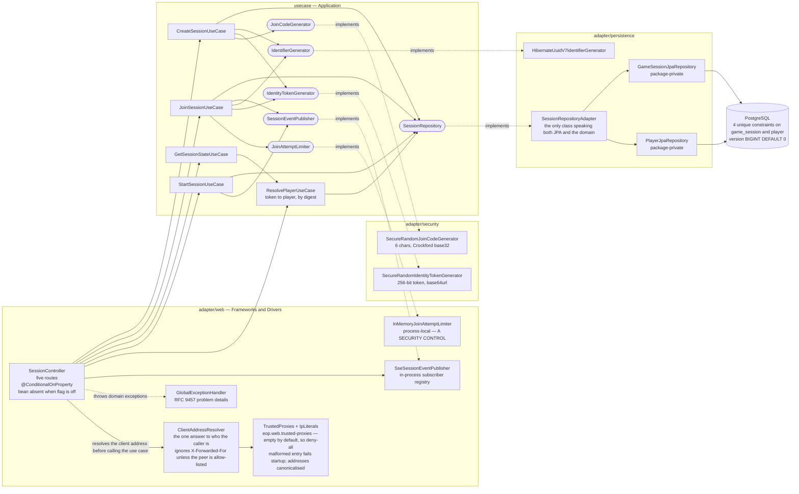
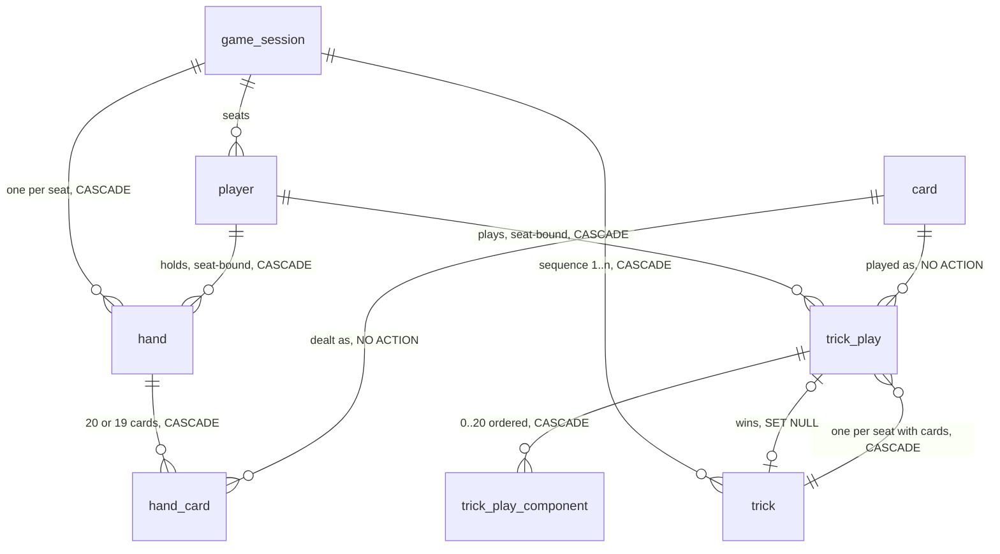

# C4 Diagrams

Visual architecture for the EoP threat-modelling card game, in
[Mermaid](https://mermaid.js.org) so that it version-controls and reviews as text.

**Scope of this document.** It contains the **C4 Level 2 (Container) view**, a Level 2
component detail for the session lifecycle, and — as of EOP-14 Slice B — one
entity-relationship view of the database schema, which is not a C4 level and says so where it
sits. No Level 1, and no Level 3 beyond the one component detail.

- **Level 1 (System Context) is deliberately deferred**, along with
  `building-blocks.md`, to a follow-up ticket. They are not missing by accident. A
  context diagram for this system is nearly trivial today — one facilitator, two to
  five other players, three browsers on one machine, no external system of any kind
  — and drawing it now would mostly restate the PRD. It becomes worth having when
  something external appears, which the PRD's "future capability — issue-tracker
  references" (§5) suggests is the first candidate.
- Dynamic behaviour lives in [`runtime-view.md`](runtime-view.md). This file shows
  what exists and how it is wired; that file shows what happens in what order.

Everything below reflects the code as it stands after **EOP-14 Slice B** (the trick-play
schema, Liquibase changeset `004`), including the client-address resolution introduced by
EOP-26 (ADR-021) and the session lifecycle from EOP-10. Slice B is schema-only: it adds
tables, constraints — including one on `player`, a table it does not create — and migration
tests, and adds **no** component, port, adapter, route or runtime behaviour. So the two
diagrams below are unchanged in structure from EOP-10 and only their database nodes move — if a
future slice changes that, this sentence is the first thing to correct. Where a diagram would flatter the design, the prose underneath says so instead.

---

## Level 2 — Containers

Three containers, one origin, one process each.

Three things to read off this diagram rather than infer.

**One origin, therefore no CORS.** Caddy serves the built front end and proxies
`/api/*` and `/health` to the application, so the browser never makes a cross-origin
request. There is consequently **no CORS configuration anywhere in this project**, and
that is a property of the topology, not an omission (ADR-017). Splitting the origins
later would require CORS to be designed, not merely switched on.

**All arrows into `usecase` point inward, and `adapter/web` has no arrow to
`adapter/persistence`.** That is the Clean Architecture constraint holding: the web
layer talks to use cases, use cases talk to ports, and the persistence adapter
implements those ports. The dotted line to `entity` is drawn only to state that it is
not used as a shortcut.

**Caddy's address on the diagram is a fact the application depends on, not decoration.**
The Compose default network is pinned to `172.28.0.0/24` and the `caddy` service to
`172.28.0.10` so that the application has something stable to allow-list; the `app`
service carries `EOP_WEB_TRUSTED_PROXIES: 172.28.0.10/32` a few lines away in the same
file. `X-Forwarded-For` is read **only** from that peer, and the default is to trust
nobody, so this arrow is the whole trust boundary for client-address resolution
(ADR-021). The single-origin topology makes only Caddy *reachable in practice*; it does
not make the peer *provably* Caddy, and the application no longer assumes it does.

---

## Level 2 detail — the session-lifecycle components added by EOP-10

The container view above is too coarse to show what this story actually introduced.
This is the same `app` container, opened up.

The dotted `implements` edges are the important ones: **every arrow of dependency
still points inward**, and the outward-pointing arrows are inversions. `usecase`
declares six ports; nothing in `usecase` names a Spring type, an HTTP type or a JPA
type.

### `SessionController` — five routes that may not exist at all

| Method | Path | Purpose |
|---|---|---|
| `POST` | `/api/v1/sessions` | create; returns session id, join code, identity token |
| `POST` | `/api/v1/sessions/{joinCode}/players` | join by code |
| `GET` | `/api/v1/sessions/{sessionId}` | read state — **the reconnect path** |
| `GET` | `/api/v1/sessions/{sessionId}/events` | `text/event-stream` |
| `POST` | `/api/v1/sessions/{sessionId}/start` | facilitator closes the lobby |

The class is annotated `@ConditionalOnProperty(prefix = "eop.features", name = "session-lifecycle")`
with **`matchIfMissing` left at its default of `false`**. This is drawn as one node
rather than two because there is no second state to draw: with the flag off **the bean
does not exist**, no handler is mapped, and Spring's own no-handler response — already
rendered as a problem detail — returns 404 for all five paths.

That distinction is worth being pedantic about. Flag-off behaviour is **not a runtime
branch that could be implemented incorrectly**; it is the absence of a bean. There is
no `if (enabled)` anywhere, and therefore no possibility of a half-enabled controller
(ADR-013, ADR-019).

### `SseSessionEventPublisher` — a broadcast registry, and not a presence list

Implements the `SessionEventPublisher` port and `DisposableBean`. Its state:

- `ConcurrentHashMap` keyed by `sessionId`, each value a `CopyOnWriteArrayList` of
  `SseEmitter`. Copy-on-write because the list is iterated on every publish and
  mutated rarely, and because iteration must not fail while a dying subscriber is
  removed from it.
- A single-threaded scheduler on a **daemon** thread named `sse-heartbeat`, firing at
  `eop.realtime.heartbeat-interval`. Daemon so it can never hold the JVM open.
- Every emitter is constructed `new SseEmitter(0L)` — **no container timeout at all**.
  That is only safe because of the heartbeat: detecting a dead peer is this class's
  job, and a container timeout would otherwise close healthy idle lobbies where
  nothing has happened for a while, which is most of a lobby's life.
- `onCompletion` and `onTimeout` both deregister the emitter.

Three deliberate absences, all of which a tidier diagram would hide:

**There is no event log.** Nothing persists what was published. A client that
reconnects with `Last-Event-ID` is asking for something the server never kept, so the
header is not honoured and reconnection is a full re-read instead (ADR-014). The
registry is the only record that a subscriber exists, and it is in memory.

**The registry is emphatically not a presence list.** An SSE server discovers a broken
client only when it next attempts a write, so **the subscriber list over-reports** —
measured in the EOP-8 spike, where a count of two was reported for two already-dead
clients. Anything resembling "who is connected" must therefore be treated as a display
hint that will sometimes be wrong, never as an input to a game rule. This is why the
node in the diagram says *subscriber registry* and not *presence*.

**Restart empties it.** Every connected client is dropped on every rebuild and must
reconnect. The `assemble` path in `SessionRepositoryAdapter` takes both of its reads
from the database precisely so that the first request after a restart is
indistinguishable from any other.

### `InMemoryJoinAttemptLimiter` — process-local mutable state that is a security control

This is the component most likely to be misread as incidental, so the diagram labels
it in capitals.

It holds two sliding windows of failed-attempt timestamps in `ConcurrentHashMap`s —
one keyed by client address, one keyed by the **join code being tried** — with an
injected `Clock` so the window is testable without sleeping. Per-code as well as
per-IP because an attacker spread across many addresses is still enumerating one
keyspace.

It is not a cache, and the project's caching rule ("never manual `ConcurrentHashMap`")
does not apply to it: there is no expensive computation being memoised and nothing here
may be silently evicted for capacity. It is enforcement state.

**Why it is load-bearing:** a join code is six Crockford base32 characters, about
thirty bits of entropy, chosen short deliberately because humans read it aloud on a
video call. Thirty bits is unguessable *only while guessing is slow*. The limiter is
therefore a **primary control, not defence in depth** (ADR-019). Lengthening the code
is a precondition for weakening the limiter, not an alternative to it.

**Which makes the key it counts against part of the control.** Until EOP-26 the client
address came from `X-Forwarded-For` unconditionally, so a caller could pick its own
bucket and rotate it once per request; the limiter ran and enforced nothing.
`ClientAddressResolver` now reads that header only when the peer is on the
`eop.web.trusted-proxies` allow-list, which is empty by default, and canonicalises the
result before it becomes a map key — because two spellings of one address are two
buckets, which is the same defect by another route ([ADR-021](../adr/ADR-021-trusted-proxy-forwarded-for.md)).

**And why the diagram must not smooth this over:** the state is in process memory, so
**a restart forgets every counter, and protection is at its weakest in the moments
immediately after a restart.** Accepted rather than solved, on the stated ground that
a restart is operator-initiated and an attacker cannot trigger one. That argument is
sound today and depends on the deployment being local and manual; if this ever
restarts automatically — a crash loop, an orchestrator, a scale-out — the reasoning
expires and the limiter needs shared state.

### `SessionRepositoryAdapter` — one class, two package-private repositories

`GameSessionJpaRepository` and `PlayerJpaRepository` are **package private on purpose**,
so nothing above `adapter.persistence` can reach a Spring Data type. The adapter is the
only class that speaks both JPA and the session domain; `DataIntegrityViolationException`,
`OffsetDateTime` and the JPA entities all stop at its boundary.

Its writes are conditional `UPDATE`s that report rows affected, and zero rows means the
world moved — turned into `SessionNotJoinableException` or `SessionNotFoundException`
after one disambiguating read. **The `@Version` column mapped on
`GameSessionJpaEntity` is not the enforcement mechanism**, and nothing anywhere handles
`OptimisticLockingFailureException`. The diagram shows `version BIGINT DEFAULT 0` on the
database node for exactly that reason — so a reader asks the question and finds the
answer in [ADR-020](../adr/ADR-020-session-concurrency-control.md) rather than assuming
optimistic locking is active.

The node's constraint count is qualified as **"on `game_session` and `player`"** as of
EOP-14 Slice B, and the qualification is the point: changeset `004` adds five of its six unique
constraints to `hand`, `trick` and `trick_play`, and no component in this diagram touches any of
them. An unqualified "4 unique constraints" would read as a claim about the whole database and be
wrong by five. The trick-play tables are covered in their own section below rather than added
here, because this diagram is the EOP-10 component view and Slice B adds no component to it.

The count on this node did have to move, from three to **four**, and it is the only number in
this diagram that Slice B changes. Changeset `004` adds `uq_player_id_seat` on
`player (id, seat_order)` — a table it does not create and the only one of its constraints that
lands on a table this component view already draws. It exists purely as the referenceable
target for the two composite foreign keys described in the schema section below, and it adds no
invariant of its own, because `player.id` is already the primary key. No adapter, repository or
use case above changes as a result: `PlayerJpaEntity` has no setter for `seatOrder` at all
(`PlayerJpaEntity.java:145-147` is the only accessor and the class declares no setters), so no
write path in this diagram can produce a seat change for the new constraint to reject.

### `adapter/security` — two generators, one reason to be separate

`SecureRandomIdentityTokenGenerator` (256 bits, base64url, the plaintext leaving the
server exactly once) and `SecureRandomJoinCodeGenerator` (six Crockford base32
characters, `I`/`L`/`O`/`U` excluded). They sit in their own package rather than in
`adapter/persistence` or `adapter/web` because they are neither storage nor transport:
they are the two places where the security of the whole system reduces to the quality
of a random number source. Keeping them together makes "what generates our secrets"
answerable by listing one directory.

---

## Data model — the trick-play schema added by EOP-14 Slice B

This is an **entity-relationship view, not a C4 level**, and it is here rather than in
`building-blocks.md` only because that file does not exist yet (see the scope note at the top).
When `building-blocks.md` lands, this section moves there and this heading becomes a link.

It exists because Slice B's whole deliverable is schema: a slice that creates five tables, alters
one, constrains a sixth and adds no components at all would otherwise leave no trace in this
document, which is the staleness the freshness sentence above is meant to prevent. `erDiagram`
rather than `flowchart` because what matters here is cardinality and the delete behaviour on each
edge.

**The counts this diagram must agree with, and does:** changeset `004` touches **7 tables**
(`hand`, `hand_card`, `trick`, `trick_play` and `trick_play_component` created; `game_session`
altered to add `current_leader_seat`; `player` given one unique constraint and otherwise
untouched) and creates **6 unique constraints**, **2 composite primary keys** (`pk_hand_card`,
`pk_trick_play_component`) and **10 foreign keys**. `card` appears above as a referenced parent
and is **not** modified by `004`. `player` is the one table `004` reaches into without owning:
it is created by the merged, immutable `003-session-lifecycle.xml`, so `uq_player_id_seat` on
`player (id, seat_order)` arrives in a changeset of its own (`008`) and the rollback of `004`
must drop that constraint while leaving `player` standing.

Four edges carry a decision rather than a default, and all four are the reason this diagram is
worth its space:

- **`player → hand` and `player → trick_play`, both `ON DELETE CASCADE`, and both keyed on the
  *pair* `(player_id, seat_order)` → `player (id, seat_order)`** — `fk_hand_player_seat` and
  `fk_trick_play_player_seat`. They do two jobs. Without any key there, a hand or a play could
  reference a player that does not exist, and no uniqueness constraint would notice, because
  uniqueness constrains how often an identifier appears and not whether it resolves. Because the
  key is composite, they additionally make a hand or a play at a seat its player does not hold
  **unrepresentable**, which closes @security-auditor's seat-forgery chain in storage rather than
  leaving it to a use case. The single-column forms — `fk_hand_player`, `fk_trick_play_player` —
  are deliberately **not** declared alongside them: both columns are `NOT NULL`, so satisfying
  the composite key already implies a resolvable `player_id`, and declaring both would buy a
  second referential check per insert for no extra guarantee. They are two of the ten foreign
  keys, not two more on top.
- **`card → hand_card` and `card → trick_play`, deliberately `NO ACTION`** — the card
  catalogue is seeded reference data and is never deleted at runtime, so a delete that would
  orphan a dealt or played card should fail loudly rather than cascade or nullify.
- **`trick.winner_play_id → trick_play`, `ON DELETE SET NULL`** — the one cycle in the
  diagram, and the only edge whose behaviour was decided by measurement rather than argument.
  Under `NO ACTION` a *resolved* trick could not be deleted at all (H2 raised `23503`, because
  the trick's own cascade to its plays cannot run while the trick still points at one of
  them), and once `player → trick_play` cascaded, session deletion broke the same way one
  level up. **The cost, stated because it is a real one:** deleting a winning play directly
  nulls `winner_play_id` and silently leaves its trick *unresolved*. That is a consistent
  state rather than a dangling pointer, and no application path deletes a single play — plays
  go only by cascade, with their trick or their session.

**What this schema deliberately does not enforce.** Nothing confines a play to its own session:
`trick_play` has no session column and reaches `game_session` only through `trick`, so storage
accepts a play by a player from a different session, provided that player exists and holds the
seat named there — and since seats are numbered `0..3` in every session, that is an easy
condition to meet, so such a play can still take this session's occupant of that seat out of play
through `uq_trick_play_trick_seat`. Seat binding narrows the seat-lockout denial of service to
cross-session attackers; it does not eliminate it. Closing it needs `game_session_id` denormalised
onto `trick_play`, which was
constructible and was declined, because a copy that can disagree with `trick.game_session_id`
constrains the copy rather than the truth; enforcement is Slice C's play use case, which resolves
the acting player from the identity token instead of trusting a request field. Nor is a card
scoped to one hand or one trick *per session* — only per hand and per trick — which is the other
half of the same hand-off.

> **Reversed 2026-08-12.** This block previously listed seat binding here too, as constructible
> and declined for the same reason. **Seat binding is now enforced**, by the composite foreign
> keys above: a play or a hand at a seat its player does not hold cannot be stored. The
> denormalisation objection turned out not to reach that half at all, because `seat_order` is
> already on both tables and the composite key *forbids* the disagreement rather than creating
> the opportunity for one. The full audit trail — original deferral, the finding against it, the
> user's reversal, and what it cost — is in
> [ADR-023](../adr/ADR-023-deal-remainder-and-turn-order.md).

Read the diagram above as referential integrity, per-trick uniqueness **and** seat binding, and
not as a guarantee about which session a play belongs to. The full reasoning and the obligations
the remaining hand-off creates are in
[ADR-023](../adr/ADR-023-deal-remainder-and-turn-order.md).

**Two things that are not on the diagram, deliberately.** The **write and lock order** is a
tree rooted on `game_session` and is recorded once, in ADR-023 — not restated here, because a
second copy of an ordering rule is a second authority that can drift from the first. And the
schema carries only **three indexes** (`idx_hand_player`, `idx_trick_play_player`,
`idx_trick_winner_play`): five more were written and then dropped —
`idx_hand_game_session`, `idx_hand_card_hand`, `idx_trick_game_session`,
`idx_trick_play_trick`, `idx_trick_play_component_trick_play` — because each duplicated the
leading column of a primary key or unique constraint already on that table, which buys nothing
and costs a write on every insert. The three survivors are not prefixes of any key.

---

## Related

- [`runtime-view.md`](runtime-view.md) — the reconnect, subscribe and create/join/start sequences
- [ADR-023](../adr/ADR-023-deal-remainder-and-turn-order.md) — the decisions behind the trick-play schema above: the lock-order tree, the `SET NULL` on the winner and its cost, the redundant-index rule that dropped five indexes, the reversal that put seat binding into storage after first deferring it, and the cross-session invariant still left to Slice C
- [ADR-018](../adr/ADR-018-uuid-v7-identifiers.md) — why `hand`, `trick` and `trick_play` carry UUID v7 keys while `hand_card` and `trick_play_component` carry composite natural keys and no UUID
- [ADR-008](../adr/ADR-008-database-migration-liquibase.md) — Liquibase changeset `004` is the only authority for the schema drawn above
- [ADR-017](../adr/ADR-017-frontend-delivery-topology.md) — Caddy, one origin, and why there is no CORS
- [ADR-016](../adr/ADR-016-local-container-runtime.md) — the local container runtime this all runs on
- [ADR-014](../adr/ADR-014-realtime-transport.md) — SSE, the heartbeat, and the over-reporting subscriber list
- [ADR-019](../adr/ADR-019-session-lifecycle-and-join-codes.md) — the five routes, the join code, and why the limiter is a primary control
- [ADR-020](../adr/ADR-020-session-concurrency-control.md) — compare-and-set on `status`, and why `@Version` is not the gate
- [ADR-021](../adr/ADR-021-trusted-proxy-forwarded-for.md) — the trusted-proxy allow-list, the pinned Compose subnet, and why the limiter's key is part of the control
- [ADR-013](../adr/ADR-013-feature-flags.md) — the flag that decides whether `SessionController` exists
- [PRD §5](../requirements/PRD-eop-card-game.md) — the domain concepts these containers persist
