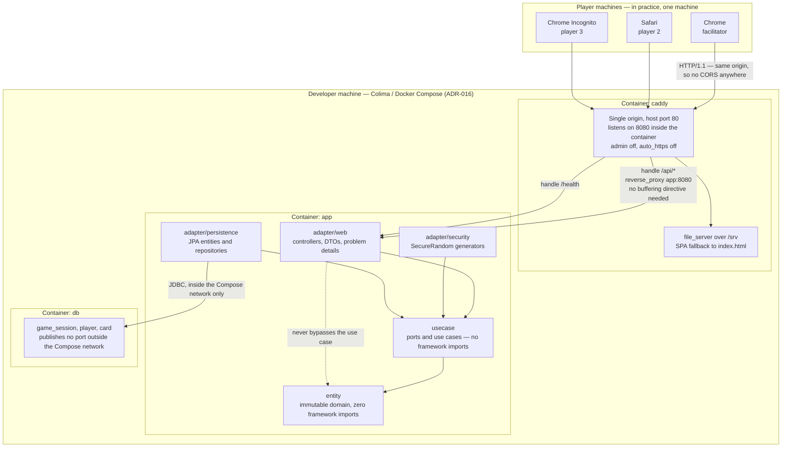
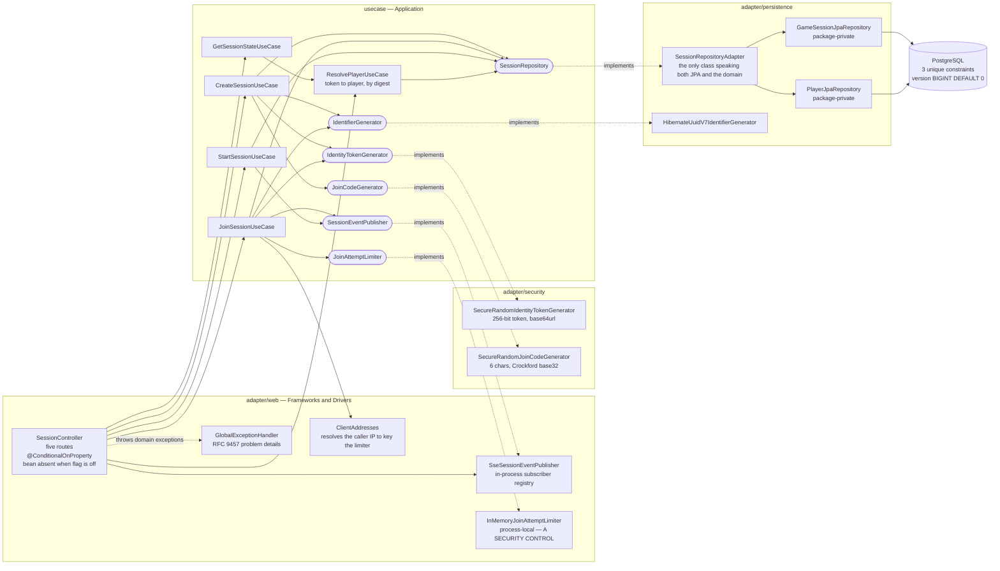

# C4 Diagrams

Visual architecture for the EoP threat-modelling card game, in
[Mermaid](https://mermaid.js.org) so that it version-controls and reviews as text.

**Scope of this document.** It contains the **C4 Level 2 (Container) view** only.

- **Level 1 (System Context) is deliberately deferred**, along with
  `building-blocks.md`, to a follow-up ticket. They are not missing by accident. A
  context diagram for this system is nearly trivial today — one facilitator, two to
  five other players, three browsers on one machine, no external system of any kind
  — and drawing it now would mostly restate the PRD. It becomes worth having when
  something external appears, which the PRD's "future capability — issue-tracker
  references" (§5) suggests is the first candidate.
- Dynamic behaviour lives in [`runtime-view.md`](runtime-view.md). This file shows
  what exists and how it is wired; that file shows what happens in what order.

Everything below reflects the code as it stands after EOP-10. Where a diagram would
flatter the design, the prose underneath says so instead.

---

## Level 2 — Containers

Three containers, one origin, one process each.

Two things to read off this diagram rather than infer.

**One origin, therefore no CORS.** Caddy serves the built front end and proxies
`/api/*` and `/health` to the application, so the browser never makes a cross-origin
request. There is consequently **no CORS configuration anywhere in this project**, and
that is a property of the topology, not an omission (ADR-017). Splitting the origins
later would require CORS to be designed, not merely switched on.

**All arrows into `usecase` point inward, and `adapter/web` has no arrow to
`adapter/persistence`.** That is the Clean Architecture constraint holding: the web
layer talks to use cases, use cases talk to ports, and the persistence adapter
implements those ports. The dotted line to `entity` is drawn only to state that it is
not used as a shortcut.

---

## Level 2 detail — the session-lifecycle components added by EOP-10

The container view above is too coarse to show what this story actually introduced.
This is the same `app` container, opened up.

The dotted `implements` edges are the important ones: **every arrow of dependency
still points inward**, and the outward-pointing arrows are inversions. `usecase`
declares six ports; nothing in `usecase` names a Spring type, an HTTP type or a JPA
type.

### `SessionController` — five routes that may not exist at all

| Method | Path | Purpose |
|---|---|---|
| `POST` | `/api/v1/sessions` | create; returns session id, join code, identity token |
| `POST` | `/api/v1/sessions/{joinCode}/players` | join by code |
| `GET` | `/api/v1/sessions/{sessionId}` | read state — **the reconnect path** |
| `GET` | `/api/v1/sessions/{sessionId}/events` | `text/event-stream` |
| `POST` | `/api/v1/sessions/{sessionId}/start` | facilitator closes the lobby |

The class is annotated `@ConditionalOnProperty(prefix = "eop.features", name = "session-lifecycle")`
with **`matchIfMissing` left at its default of `false`**. This is drawn as one node
rather than two because there is no second state to draw: with the flag off **the bean
does not exist**, no handler is mapped, and Spring's own no-handler response — already
rendered as a problem detail — returns 404 for all five paths.

That distinction is worth being pedantic about. Flag-off behaviour is **not a runtime
branch that could be implemented incorrectly**; it is the absence of a bean. There is
no `if (enabled)` anywhere, and therefore no possibility of a half-enabled controller
(ADR-013, ADR-019).

### `SseSessionEventPublisher` — a broadcast registry, and not a presence list

Implements the `SessionEventPublisher` port and `DisposableBean`. Its state:

- `ConcurrentHashMap` keyed by `sessionId`, each value a `CopyOnWriteArrayList` of
  `SseEmitter`. Copy-on-write because the list is iterated on every publish and
  mutated rarely, and because iteration must not fail while a dying subscriber is
  removed from it.
- A single-threaded scheduler on a **daemon** thread named `sse-heartbeat`, firing at
  `eop.realtime.heartbeat-interval`. Daemon so it can never hold the JVM open.
- Every emitter is constructed `new SseEmitter(0L)` — **no container timeout at all**.
  That is only safe because of the heartbeat: detecting a dead peer is this class's
  job, and a container timeout would otherwise close healthy idle lobbies where
  nothing has happened for a while, which is most of a lobby's life.
- `onCompletion` and `onTimeout` both deregister the emitter.

Three deliberate absences, all of which a tidier diagram would hide:

**There is no event log.** Nothing persists what was published. A client that
reconnects with `Last-Event-ID` is asking for something the server never kept, so the
header is not honoured and reconnection is a full re-read instead (ADR-014). The
registry is the only record that a subscriber exists, and it is in memory.

**The registry is emphatically not a presence list.** An SSE server discovers a broken
client only when it next attempts a write, so **the subscriber list over-reports** —
measured in the EOP-8 spike, where a count of two was reported for two already-dead
clients. Anything resembling "who is connected" must therefore be treated as a display
hint that will sometimes be wrong, never as an input to a game rule. This is why the
node in the diagram says *subscriber registry* and not *presence*.

**Restart empties it.** Every connected client is dropped on every rebuild and must
reconnect. The `assemble` path in `SessionRepositoryAdapter` takes both of its reads
from the database precisely so that the first request after a restart is
indistinguishable from any other.

### `InMemoryJoinAttemptLimiter` — process-local mutable state that is a security control

This is the component most likely to be misread as incidental, so the diagram labels
it in capitals.

It holds two sliding windows of failed-attempt timestamps in `ConcurrentHashMap`s —
one keyed by client address, one keyed by the **join code being tried** — with an
injected `Clock` so the window is testable without sleeping. Per-code as well as
per-IP because an attacker spread across many addresses is still enumerating one
keyspace.

It is not a cache, and the project's caching rule ("never manual `ConcurrentHashMap`")
does not apply to it: there is no expensive computation being memoised and nothing here
may be silently evicted for capacity. It is enforcement state.

**Why it is load-bearing:** a join code is six Crockford base32 characters, about
thirty bits of entropy, chosen short deliberately because humans read it aloud on a
video call. Thirty bits is unguessable *only while guessing is slow*. The limiter is
therefore a **primary control, not defence in depth** (ADR-019). Lengthening the code
is a precondition for weakening the limiter, not an alternative to it.

**And why the diagram must not smooth this over:** the state is in process memory, so
**a restart forgets every counter, and protection is at its weakest in the moments
immediately after a restart.** Accepted rather than solved, on the stated ground that
a restart is operator-initiated and an attacker cannot trigger one. That argument is
sound today and depends on the deployment being local and manual; if this ever
restarts automatically — a crash loop, an orchestrator, a scale-out — the reasoning
expires and the limiter needs shared state.

### `SessionRepositoryAdapter` — one class, two package-private repositories

`GameSessionJpaRepository` and `PlayerJpaRepository` are **package private on purpose**,
so nothing above `adapter.persistence` can reach a Spring Data type. The adapter is the
only class that speaks both JPA and the session domain; `DataIntegrityViolationException`,
`OffsetDateTime` and the JPA entities all stop at its boundary.

Its writes are conditional `UPDATE`s that report rows affected, and zero rows means the
world moved — turned into `SessionNotJoinableException` or `SessionNotFoundException`
after one disambiguating read. **The `@Version` column mapped on
`GameSessionJpaEntity` is not the enforcement mechanism**, and nothing anywhere handles
`OptimisticLockingFailureException`. The diagram shows `version BIGINT DEFAULT 0` on the
database node for exactly that reason — so a reader asks the question and finds the
answer in [ADR-020](../adr/ADR-020-session-concurrency-control.md) rather than assuming
optimistic locking is active.

### `adapter/security` — two generators, one reason to be separate

`SecureRandomIdentityTokenGenerator` (256 bits, base64url, the plaintext leaving the
server exactly once) and `SecureRandomJoinCodeGenerator` (six Crockford base32
characters, `I`/`L`/`O`/`U` excluded). They sit in their own package rather than in
`adapter/persistence` or `adapter/web` because they are neither storage nor transport:
they are the two places where the security of the whole system reduces to the quality
of a random number source. Keeping them together makes "what generates our secrets"
answerable by listing one directory.

---

## Related

- [`runtime-view.md`](runtime-view.md) — the reconnect, subscribe and create/join/start sequences
- [ADR-017](../adr/ADR-017-frontend-delivery-topology.md) — Caddy, one origin, and why there is no CORS
- [ADR-016](../adr/ADR-016-local-container-runtime.md) — the local container runtime this all runs on
- [ADR-014](../adr/ADR-014-realtime-transport.md) — SSE, the heartbeat, and the over-reporting subscriber list
- [ADR-019](../adr/ADR-019-session-lifecycle-and-join-codes.md) — the five routes, the join code, and why the limiter is a primary control
- [ADR-020](../adr/ADR-020-session-concurrency-control.md) — compare-and-set on `status`, and why `@Version` is not the gate
- [ADR-013](../adr/ADR-013-feature-flags.md) — the flag that decides whether `SessionController` exists
- [PRD §5](../requirements/PRD-eop-card-game.md) — the domain concepts these containers persist
