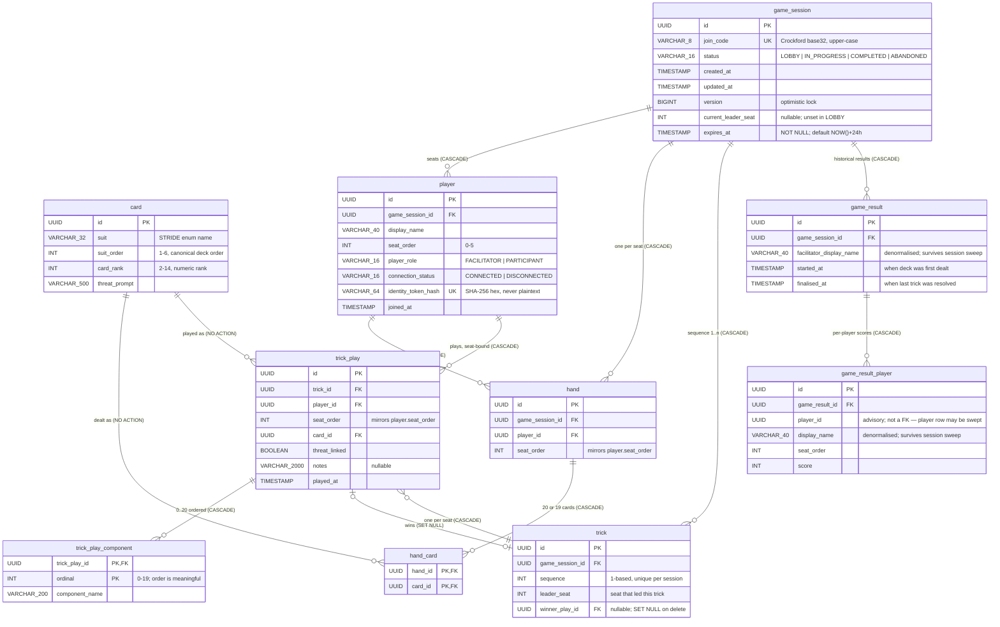

# Database Schema

Entity-relationship diagram for the EoP threat-modelling card game, derived directly from the
Liquibase changelogs under `src/main/resources/db/changelog/changes/`. **This file is the
authoritative visual reference for the schema.** The partial ER diagram in `C4-Diagrams.md`
(added by EOP-14 Slice B) covers only the trick-play tables and carries no column detail; this
file supersedes it as the complete picture.

**Freshness rule.** Every Liquibase changeset that creates a table, adds a column, or alters a
constraint must be reflected here in the same commit. The diagram is Mermaid `erDiagram` syntax
so it version-controls and reviews as text.

---

## Full entity-relationship diagram

---

## Tables at a glance

| Table | Rows at runtime | Notes |
|---|---|---|
| `card` | 74 (seeded, immutable) | STRIDE reference deck; never deleted at runtime |
| `game_session` | one per active game | Aggregate root; expires after 24 h |
| `player` | 2–6 per session | No cross-session identity |
| `hand` | one per seated player | Created at deal |
| `hand_card` | 20 or 19 per hand | Composite PK `(hand_id, card_id)` |
| `trick` | one per trick played | 1-based sequence per session |
| `trick_play` | one per seat per trick | Seat-bound to `player` via composite FK |
| `trick_play_component` | 0–20 per play | Ordinal is load-bearing (user-typed order) |
| `game_result` | one per completed game | Survives session sweep |
| `game_result_player` | one per seated player per game | `player_id` is advisory, not a FK |

---

## Key design decisions (summary)

- **Seat binding is structural, not probabilistic.** `fk_hand_player_seat` and
  `fk_trick_play_player_seat` reference `player (id, seat_order)` — a play or hand claiming a
  seat its player does not hold cannot be represented. See ADR-023.

- **`card` rows are never deleted.** Both `fk_hand_card_card` and `fk_trick_play_card` carry
  `NO ACTION` (the default) so a delete that would orphan a dealt or played card fails loudly.

- **`trick.winner_play_id` is `ON DELETE SET NULL`.** The one cycle in the diagram. Deleting a
  winning play clears the winner rather than blocking the cascade. No application path deletes a
  single play — plays go only by cascade. See ADR-023.

- **`game_result_player.player_id` is not a foreign key.** The result must survive session sweep
  (which deletes `player` rows). `display_name` is denormalised for the same reason.

- **Identifiers are UUIDv7, generated in the application.** No column defaults; the application
  always supplies the value. See ADR-018.

- **`join_code` widened to 8 characters** by migration `2026-08-22--widen-join-code-to-8-characters.xml`.
  The column is `VARCHAR(8)` in production; the original `VARCHAR(6)` is historical.
