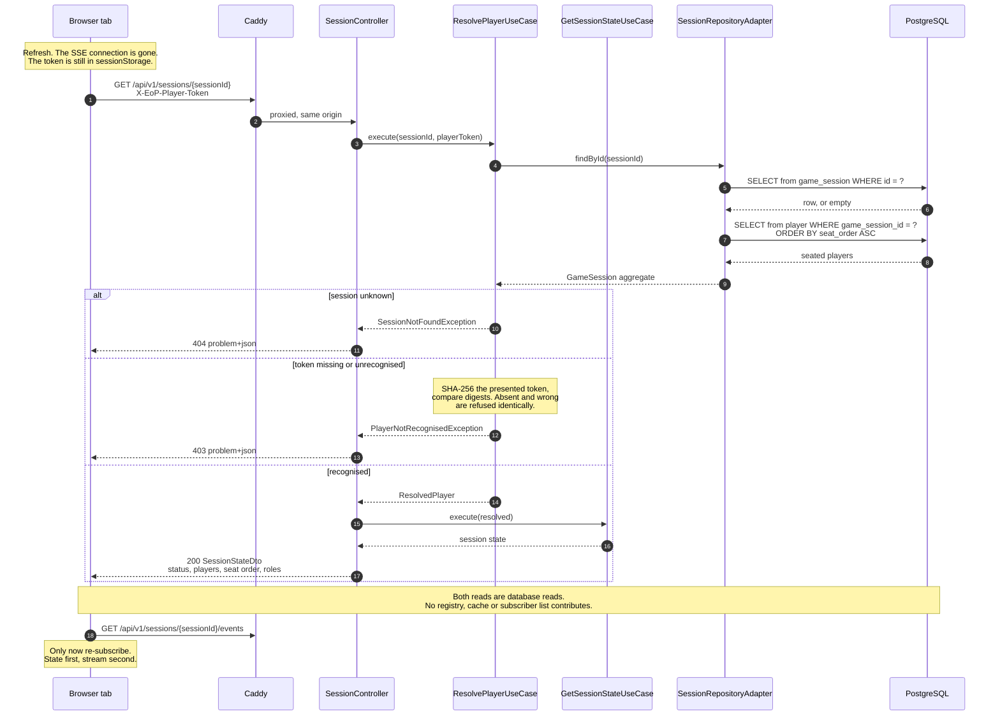
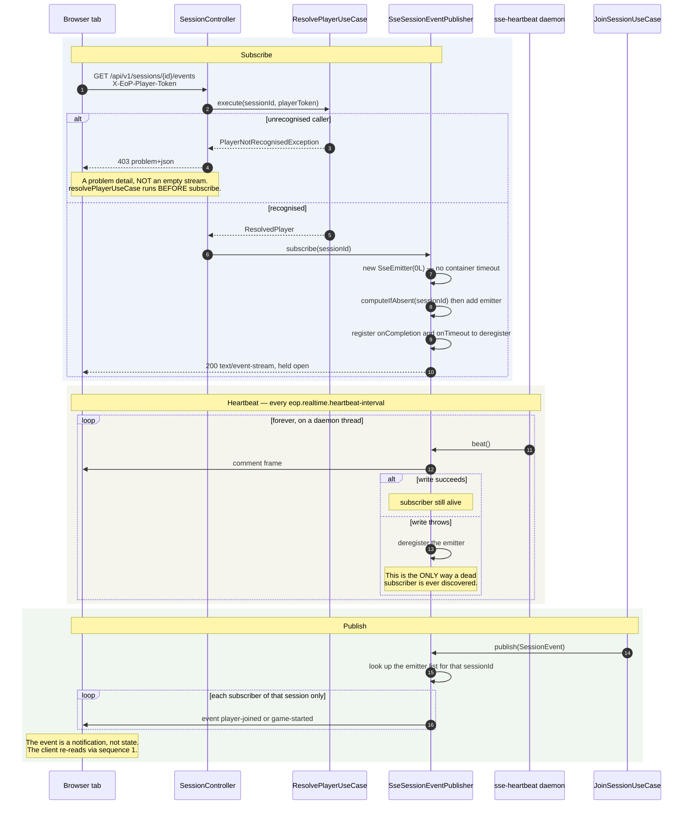
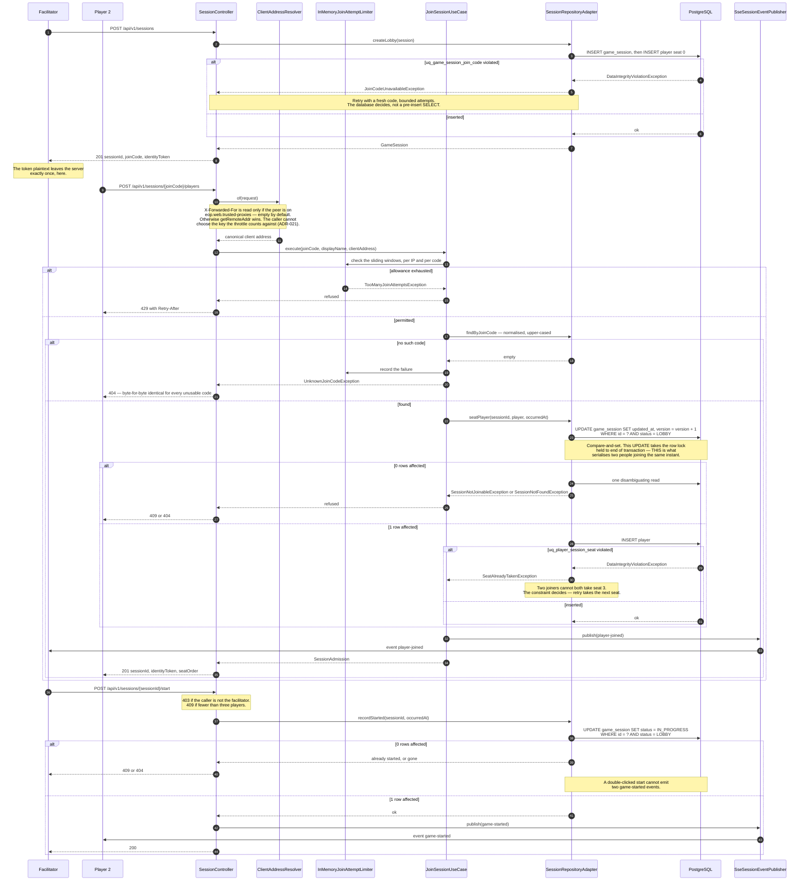
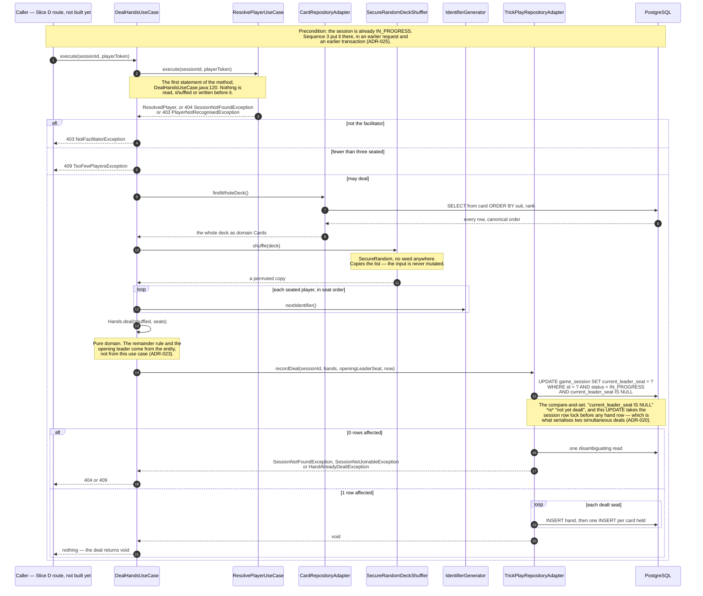
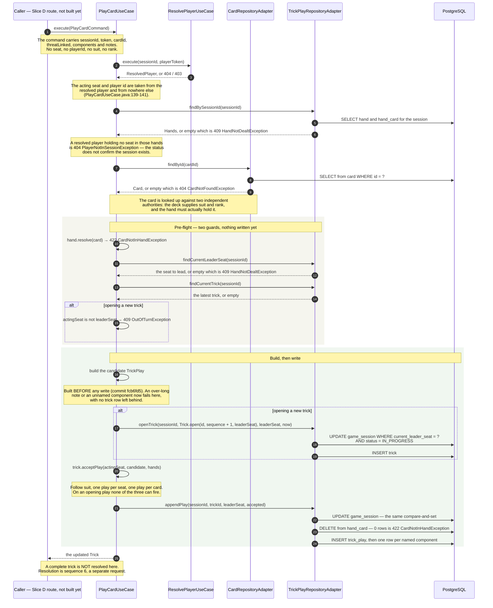

# Runtime View

Dynamic behaviour of the session lifecycle, in Mermaid `sequenceDiagram` form. The
static counterpart — what exists and how it is wired — is
[`C4-Diagrams.md`](C4-Diagrams.md).

Everything here reflects the code as it stands after **EOP-14 Slice C2** (the trick-play use-case
layer, gated on `eop.features.trick-play`), on top of Slice C1's persistence layer (Liquibase
changeset `005`), Slice B's trick-play schema (changeset `004`) and the client-address resolution
from EOP-26 (ADR-021). Sequences 1 to 3 are still the EOP-10 session lifecycle and **Slice C2
alters none of them.** Sequences 4, 5 and 6 are new, and they are the three this document said it
was owed: dealing, playing and resolving.

**They begin at a caller that does not exist yet, and the diagrams say so.** Slice C2 adds no
route, no controller method and no DTO — `SessionController` still has the same five routes — and
the three new use cases are Spring beans only while `eop.features.trick-play` is `true`, which
`application.yml` leaves `false`. The first participant of each new sequence is therefore drawn as
a caller a later slice supplies; everything to the right of it is implemented and covered by tests,
and everything to the left of it is Slice D. The refusals are real all the same:
`GlobalExceptionHandler` maps every exception drawn below, including the two Slice C2 adds —
`NoTrickToResolveException` at `GlobalExceptionHandler.java:452` and `TrickNotCompleteException` at
`:486`, both 409. What is missing from these three sequences is the route, not the answer.

Slice B changed the *failure mode* of writes that already have sequences below: a forged seat and a
ghost player are rejected by the database rather than reaching it, which
[ADR-023](../adr/ADR-023-deal-remainder-and-turn-order.md) records — in the second and fourth of
the four Slice C obligations under *What changeset `004` deliberately does not enforce* — as owing
a use-case-level rejection, so the caller sees a 403-shaped refusal rather than a constraint
violation. **Slice C2 discharges that on the play path by construction rather than by a check.**
`PlayCardCommand` has no seat component and no player component at all
(`PlayCardCommand.java:35-41`, argued at `:10-17`), so `PlayCardUseCase` derives the acting seat
from the resolved player (`PlayCardUseCase.java:139-141`): a caller cannot name a seat it does not
hold, which makes the 403 with `NotYourSeatException` inexpressible from the outside rather than
merely refused. A caller outside the session is refused with `PlayerNotInSessionException`
(`PlayCardUseCase.java:147-149`), a 404 chosen so the status does not itself disclose that the
session exists. If a future slice adds or alters an interaction, this paragraph is the first thing
to correct — one version of it claimed EOP-10 two stories after that stopped being the whole truth,
and the version before this one claimed Slice C1 one slice after the same thing.

Where a sequence has a weakness, the prose says so rather than leaving the diagram to imply
everything is fine.

---

## 1. The reconnect path — a re-read, never a replay

This is the most important sequence in the application, and the one whose absence from
the documentation was most costly: it is load-bearing in **both** ADR-014 and ADR-019,
and neither ADR draws it.

A player refreshes, or their laptop wakes, or the container was rebuilt underneath
them. They call `GET /api/v1/sessions/{sessionId}` and get the complete current state
back. **No events are replayed, because none were ever kept.**



### Why this shape, and what it buys

**The reconnect path and the first-load path are the same request.** There is no
separate recovery endpoint and no recovery-only code. Consequently the recovery path is
exercised by every page load, rather than only when something has already gone wrong —
which is the opposite of how recovery code normally rots. This was the property ADR-014
was aiming at; this sequence is it, made concrete.

**`Last-Event-ID` is deliberately not honoured.** The browser sends it on an automatic
SSE reconnect, and the server ignores it. Honouring it would mean persisting an event
log — a second source of truth alongside the game state it describes — and after a
restart the log would be empty anyway. The EOP-8 spike confirmed the failure directly:
the event counter had reset to zero and the subscriber list was empty, so a client
reconnecting with `Last-Event-ID: 47` was asking for events the server had no memory
of.

**State first, stream second.** The client fetches state and only then subscribes. The
reverse order has a gap: an event arriving between subscribing and the state response
being rendered describes a change the client cannot yet place. Fetching first means the
stream only ever reports changes *after* a known-good baseline. There is still a
narrow window — an event fired between the state read committing and the subscription
being registered is lost — and the cost is bounded precisely because events carry no
state: the client's remedy is another re-read, which is this same sequence.

**Both reads are database reads, on purpose.** `SessionRepositoryAdapter.assemble`
reads the session row and then the player rows. Nothing is served from the emitter
registry or from any cache, which is what makes the first request after a restart
behave exactly like the thousandth request before it.

**403 rather than 401, and identical refusals.** There is no authentication scheme here
— no realm, nothing to retry differently — so a 401 with `WWW-Authenticate` would
advertise a challenge that does not exist. A missing token and a wrong token produce the
same 403, so the endpoint cannot be used to confirm which tokens are real.

### The weakness in this path today

The token has to come from somewhere, and **on the client it currently comes from
nowhere.** `ui/` holds only a health-check shell; `sessionStorage` appears nowhere in
it. So the sequence above is fully implemented server-side and cannot yet be executed by
the real front end — it is exercised by tests and by `curl -H`. EOP-11 delivers the
custody half. Until then, "a player refreshes and resumes" is a property of the server,
not an observable behaviour of the product (ADR-015).

---

## 2. The SSE stream — subscribe, heartbeat, publish

Three interleaved lifecycles on one connection. The ordering in the first four steps is
the part worth being precise about.



### Why `resolvePlayerUseCase` runs before `subscribe`

The handler body is two statements, in this order, and the order is the design:

```java
resolvePlayerUseCase.execute(sessionId, playerToken);
return sessionEventPublisher.subscribe(sessionId);
```

Subscribing first and authorising afterwards would mean the response had already
committed as `200 text/event-stream` before the refusal was known. The only remaining
way to reject would be to complete the stream with an error — or worse, to leave it open
and never write to it. An unrecognised caller would receive **an empty stream that looks
like a quiet lobby**, which is indistinguishable from a working connection to a session
where nothing is happening. That is the single most confusing failure this endpoint
could have.

Resolving first means the refusal happens while the response is still a normal HTTP
exchange, so it goes through `GlobalExceptionHandler` and arrives as an RFC 9457
problem detail with a 403 — the same refusal every other endpoint gives.

The credential arrives in the `X-EoP-Player-Token` **header**, and there is no
query-parameter fallback and no code path that would read one. The cost is that the
browser's `EventSource` cannot set headers, so the client must stream with `fetch`; the
alternative was writing a bearer credential into the proxy access log, the browser
history and the address bar of a screen being shared during the very meeting this game
is played in (ADR-019).

### Why the emitter has no timeout

`new SseEmitter(0L)` disables the servlet container's own timeout entirely. That is safe
**only** because the heartbeat exists. A lobby waiting for a third player is idle by
nature, sometimes for minutes; a container timeout would close healthy connections and
present as a flaky server. So detecting a dead peer is deliberately this class's job
rather than the container's — and the heartbeat is the mechanism, not a nicety.

### What this sequence cannot do

**A dead subscriber is invisible until the next write.** The `alt` branch in the
heartbeat block is the *only* place a broken connection is ever discovered. Between the
moment a client disappears and the next heartbeat, the registry still lists it. The
subscriber list therefore **over-reports** — measured in the EOP-8 spike, where two
already-dead clients were still counted as two — and must never be used as a presence
list or as an input to a game rule. `connectionStatus` in the state DTO is a display
hint that will sometimes say `CONNECTED` about someone who has gone away.

**A restart drops every subscriber and there is nothing to resume from.** The registry is
in memory and the heartbeat thread is a daemon. On restart both are gone, every client
reconnects, and every reconnect runs sequence 1 from scratch.

**Events are broadcast to a session, not to a player.** Every subscriber of a session
receives every event for it, including the player whose own action caused it. Clients
must tolerate seeing their own change echoed back — once as the HTTP response, once as
the event.

---

## 3. Create, join, start — and where concurrency is actually settled

Included because it is where [ADR-020](../adr/ADR-020-session-concurrency-control.md)
becomes visible, which no other diagram shows.



### What to take from this one

**The `UPDATE` before the `INSERT` is not housekeeping.** It looks like it only bumps
`updated_at`. It is in fact the lock acquisition that orders concurrent joiners on the
parent row before any of them inserts a child row, and it is the most
deletable-looking load-bearing statement in the story. Removing it would leave "two
players join while the facilitator starts" as a genuine race.

**Rows affected is the entire protocol.** One means the caller's assumption held; zero
means the world moved. Zero is not a statement failure — it is an answer, disambiguated
into 404 or 409 by one extra read that is only ever paid on a path already failing.

**Two guarantees come from the schema, not from Java.** `uq_game_session_join_code` and
`uq_player_session_seat` make duplicate codes and double-booked seats impossible. The
adapter writes optimistically and interprets the violation. A pre-insert `SELECT` would
narrow the race window without closing it.

**The limiter is checked first, and it is a primary control.** Six Crockford base32
characters is about thirty bits — unguessable only while guessing is slow. The 404 for
an unusable code is byte-for-byte identical whether the code never existed, was
mistyped, or belonged to an abandoned session, so the endpoint is not an oracle. But the
limiter's counters are in process memory, so **immediately after a restart every
attacker starts with a full allowance** (ADR-019).

**And the key it counts against is resolved before it, deliberately.** A throttle whose
bucket the caller can choose is not a throttle. Until EOP-26 `X-Forwarded-For` was
believed from anyone, so rotating it once per request gave a fresh empty window every
time; the header is now read only from a peer on the `eop.web.trusted-proxies`
allow-list, which is empty unless a deployment says otherwise (ADR-021).

---

## 4. Dealing the hands — a second write that claims the deal

The first of the three sequences EOP-14 Slice C2 owed this document. It begins where
sequence 3 ends: the session is already `IN_PROGRESS`, because
`StartSessionUseCase` committed that transition in a separate request.
[ADR-025](../adr/ADR-025-dealing-is-its-own-use-case.md) argues that seam.



### What this sequence settles, and the window it leaves

**The deal is a second write, and nothing in the diagram hides that.** Between the
`UPDATE` in sequence 3 that sets `status = IN_PROGRESS` and the `UPDATE` here that claims
`current_leader_seat`, there is a state the product has never had before: **started but
undealt**. It is observable — every trick-play read answers `HandNotDealtException` with a
409 — and it is recoverable, because the `current_leader_seat IS NULL` predicate makes a
repeated deal idempotent rather than a double deal. ADR-025 records both, and now also
records that the seam is a *choice* with a stated cost rather than a physical necessity.

**No pre-check guards a state the conditional write already arbitrates.** There is no
"is it started?" read and no "is it already dealt?" read before `recordDeal`. Adding
either would introduce a check-then-act window that the single conditional `UPDATE` does
not have, and would make the refusal depend on a read taken at a different instant from
the write it justifies (ADR-020).

**The shuffle is drawn as a participant because it is a security control.** Deck
composition is published reference data, so a predictable permutation is a predictable
hand. `SecureRandomDeckShuffler` takes no seed in any constructor, and the use case holds
the `DeckShuffler` port rather than a `java.util.Random`, so no caller can weaken the
choice by passing a seeded generator.

**The whole deck is read in one call, deliberately not a page.** `findWholeDeck()` returns
every card in canonical order (suit, then ascending rank); randomising is the use case's
job. A paginated deal would be one forgotten loop away from a truncated deck, and a
canonical order means a test can pin a deal by pinning the shuffler.

**Nothing is broadcast.** `DealHandsUseCase` takes no `SessionEventPublisher`. A client
learns that hands exist by re-reading — sequence 1 — and wiring the SSE notification is
Slice E's work, recorded as decision 8 of ADR-025.

---

## 5. Playing a card — build the play, then open the trick

The ordering in the "build, then write" block is the whole point of this sequence, and it
is what commit `fcb6fd5` fixed: the candidate `TrickPlay` is constructed **before**
`openTrick` commits a trick row, so a play that the domain will refuse for a bad note or
a bad component name cannot leave an open trick behind it.



### Why the pre-flight duplicates the domain, and why that is not belt-and-braces

**The two pre-flight guards buy ordering, not safety.** `Trick.acceptPlay` and `Hand`
already refuse a card the seat does not hold and a play out of turn; checking first
changes nothing about what is *permitted*. What it changes is what is *left behind*.
Without the turn-order guard, an out-of-turn opening play would commit a trick row and
only then be refused, leaving an open trick nobody may play into. Without
`hand.resolve(card)`, an end-of-hand play would surface as an `IllegalStateException` and
a 500 instead of a 422.

**The leader seat always comes from the read, never from the caller.** It is the
compare-and-set witness of ADR-020: `openTrick`, `appendPlay` and `recordResolution` all
compare `current_leader_seat` against the value this use case read, so a stale request
loses the race rather than overwriting it. A caller-supplied witness would let a client
choose which race it wins.

**The window that remains, and what closes it.** `openTrick` still commits before
`acceptPlay` runs, so a refusal from `acceptPlay` on an *opening* play would still orphan
a trick row. That path is argued closed by exhaustion over `Trick.acceptPlay`'s current
refusals — on an opening play there is no led suit to follow and the trick is empty, so the
duplication invariants in `Trick`'s constructor have nothing to duplicate; `NotYourSeatException`
is inexpressible because the candidate is built with the acting seat itself; `PlayerMismatchException`
cannot fire because the seat-to-player map is frozen once the session leaves `LOBBY`; and the
remainder are pre-flighted above. The
argument is only as good as that list: **any refusal added to `acceptPlay` or to `Trick`'s
constructor reopens
the window**, which is why ADR-025 records the reasoning rather than only the conclusion — as a
table, row by row against the method, in its decision 9.

**Nothing is broadcast here either.** No `SessionEventPublisher` reaches this use case, so
the other players at the table learn of a play by re-reading. That is the second half of
what Slice E owes.

---

## 6. Resolving a trick — mechanical, and open to any member

```mermaid
sequenceDiagram
    autonumber
    participant CL as Caller — Slice D route, not built yet
    participant RT as ResolveTrickUseCase
    participant RP as ResolvePlayerUseCase
    participant TPRA as TrickPlayRepositoryAdapter
    participant DB as PostgreSQL

    CL->>RT: execute(sessionId, playerToken)

    RT->>RP: execute(sessionId, playerToken)
    RP-->>RT: ResolvedPlayer, or 404 / 403
    Note over RT,RP: Membership only — the resolved player is not<br/>otherwise used. Any member may resolve, because<br/>resolution is arithmetic and gating it on the<br/>facilitator would stall a table whose<br/>facilitator dropped.

    RT->>TPRA: findBySessionId(sessionId)
    TPRA-->>RT: Hands, or empty which is 409 HandNotDealtException
    RT->>TPRA: findCurrentTrick(sessionId)
    TPRA-->>RT: the latest trick, or empty which is 409 NoTrickToResolveException

    alt the trick already has a winner
        RT-->>CL: 409 TrickAlreadyResolvedException
    else a seat holding cards has not played
        RT-->>CL: 409 TrickNotCompleteException — names the seat still to play
    else complete
        RT->>RT: trick.resolved() — highest card of the led suit takes it
        RT->>RT: nextLeaderSeat = next seat holding cards, else the winning seat
        Note over RT: The nextLeaderSeat assignment —<br/>resolved.nextLeaderSeat(seatsHoldingCards).orElse(resolved.winningSeat())<br/>ResolveTrickUseCase.java:137 today; find it by the expression, not the number.<br/>The port takes an int and<br/>has no value for "nobody left to lead", so at end of<br/>hand the winning seat is written as a placeholder.<br/>This is the single line Slice E replaces.
        RT->>TPRA: recordResolution(sessionId, resolved, leaderSeat, nextLeaderSeat, now)
        TPRA->>DB: UPDATE game_session SET current_leader_seat = next<br/>WHERE current_leader_seat = leaderSeat<br/>AND status = IN_PROGRESS
        TPRA->>DB: UPDATE trick SET winner_play_id = ?<br/>WHERE id = ? AND winner_play_id IS NULL
        Note over TPRA,DB: 0 rows on the second UPDATE is a replay, not a fault:<br/>when the leader also won, the first UPDATE is<br/>idempotent and lets a repeat through. Answered 409.
        RT-->>CL: the resolved Trick
    end
```

### What this sequence says about authority and about end of hand

**Two different authorisation answers, on purpose.** Dealing is facilitator-only;
resolving is open to any member. The difference is that dealing chooses something —
who holds what — while resolving computes something that is already determined by the
cards on the table. Requiring the facilitator to resolve would add a way for a table to
stop making progress without adding a way for it to be cheated.

**`TrickNotCompleteException` discloses a seat number, and that is deliberate.** The
refusal names the seat still to play so a client can say whose turn it is without a
second request. A seat ordinal is not a secret — the state DTO already lists every seat
to every member — and the refusal is only reachable by a caller already resolved as a
member of that session (ADR-005 for the problem-detail shape).

**End of hand is not recognised here, and the placeholder is visible in the diagram.**
When no seat holds a card, `nextLeaderSeat` falls back to the winning seat because
`recordResolution` takes an `int` and the schema has no "no leader" value. It is harmless
today — nobody can play, so nothing consults the column — but it is a placeholder rather
than a meaning, and Slice E owns replacing it along with the end-of-hand transition.

---

## Related

- [`C4-Diagrams.md`](C4-Diagrams.md) — the containers and components these sequences move through
- [ADR-014](../adr/ADR-014-realtime-transport.md) — SSE, the mandatory heartbeat, and why reconnection re-reads
- [ADR-019](../adr/ADR-019-session-lifecycle-and-join-codes.md) — the five routes, header-only stream auth, and the join code
- [ADR-020](../adr/ADR-020-session-concurrency-control.md) — compare-and-set on `status`, the row lock, and the unique constraints
- [ADR-021](../adr/ADR-021-trusted-proxy-forwarded-for.md) — how `clientAddress` is decided, and why the header is ignored by default
- [ADR-015](../adr/ADR-015-player-identity.md) — the token, its digest, and the client half that is not built yet
- [ADR-005](../adr/ADR-005-error-handling-strategy.md) — where every refusal above becomes a problem detail
- [ADR-023](../adr/ADR-023-deal-remainder-and-turn-order.md) — the remainder rule, turn order, and what the schema deliberately does not enforce
- [ADR-024](../adr/ADR-024-trick-play-persistence-boundary.md) — the trick-play ports, and why authorisation is the use case's job
- [ADR-025](../adr/ADR-025-dealing-is-its-own-use-case.md) — why dealing is its own use case, and the started-but-undealt window
- [`docs/api/openapi.yml`](../api/openapi.yml) — the authored contract for all five routes
