# Runtime View

Dynamic behaviour of the session lifecycle, in Mermaid `sequenceDiagram` form. The
static counterpart — what exists and how it is wired — is
[`C4-Diagrams.md`](C4-Diagrams.md).

Everything here reflects the code as it stands after **EOP-92** (`Hands.deal` deals every card
again, so hands are uneven and the final trick is short again at 3, 5 and 6 players — no sequence
below states hand-size arithmetic, so none of them changes; ADR-023 as amended by EOP-92), on top of
**EOP-82** (all three `eop.features` flags now
ship `true`, so every sequence below is live in the default configuration — ADR-042; the
client-side handling of a leaderboard 404 is recorded in ADR-042 rather than duplicated here), on
top of **EOP-65** (game-over leaderboard,
new-game reset — ADR-039), on top of **EOP-15 Slice C** (end-of-game
transitions), on top of Slice B's score route, Slice A's pure-domain scoring, EOP-14 Slice E
(end of hand, the state-of-play read and the three broadcasts), Slice D's trick-play HTTP
routes, Slice C2's use-case layer, Slice C1's persistence layer (Liquibase changeset `005`),
Slice B's trick-play schema (changeset `004`) and the client-address resolution from EOP-26
(ADR-021). Sequences 1 to 3 are the EOP-10 session lifecycle and **neither Slice D nor Slice E
alters them.** Sequences 4, 5 and 6 are dealing, playing and resolving. Slice E changes all
three: each now ends in an SSE broadcast, and sequence 6 records the end of a hand instead of
writing a placeholder. Sequence 7 is the score read (EOP-15 Slice B). Sequence 8 is the
end-of-game transition (EOP-15 Slice C).

**They now begin at a caller that exists.** Three earlier versions of this paragraph said the
opposite — that Slice C2 added no route, no controller method and no DTO, and that the first
participant of each new sequence was drawn as a caller a later slice would supply. Slice D supplies
it, and Slice E adds a fifth route: `TrickController` maps
`POST /api/v1/sessions/{sessionId}/deal`,
`GET /api/v1/sessions/{sessionId}/hand`, `POST /api/v1/sessions/{sessionId}/plays`,
`GET /api/v1/sessions/{sessionId}/tricks/current` and
`POST /api/v1/sessions/{sessionId}/tricks/current/resolve`, each returning a transport record rather
than a domain object. EOP-15 Slice B adds `GET /api/v1/sessions/{sessionId}/score` via
`ScoreController`, and Slice C adds `POST /api/v1/sessions/{sessionId}/end` via
`EndSessionController`. All three controllers and all seven use-case beans exist only while
`eop.features.trick-play` is `true`, which `application.yml` has set as the shipped default since
EOP-70 ([ADR-040](../adr/ADR-040-trick-play-flag-on.md)), so the routes answer for real. The flag
stayed `false` from Slice D until EOP-70 for reasons that were not about gameplay, recorded in
[ADR-028](../adr/ADR-028-end-of-hand-without-release-or-score.md); the flag and its
`@ConditionalOnProperty` guards remain in place, so the position is still testable in both
directions. The refusals were always real:
`GlobalExceptionHandler` maps every exception drawn below, including
`NoTrickToResolveException` at `GlobalExceptionHandler.java:484` and `TrickNotCompleteException` at
`:518`, both 409, joined in Slice E by `HandCompleteException` at `:449`, also 409, and in Slice C
by `SessionNotInProgressException` at `:226`, also 409.

There is deliberately **no seventh sequence for `GET /api/v1/sessions/{sessionId}/hand`.** A
sequence diagram earns its place when the order of interactions is the thing worth pinning, and
that read has one: resolve the caller, load the hands, return the caller's own. Its one interesting
property is an ordering already drawn in sequences 4 to 6 — authorisation precedes the repository
call, so a failed credential never reaches storage — and its substantive property is a prohibition
rather than an interaction, namely that no route, use case or DTO returns a hand the caller does not
hold, which [ADR-027](../adr/ADR-027-singleton-subresource-naming.md) records because a diagram
cannot record an absence.

Slice B changed the *failure mode* of writes that already have sequences below: a forged seat and a
ghost player are rejected by the database rather than reaching it, which
[ADR-023](../adr/ADR-023-deal-remainder-and-turn-order.md) records — in the second and fourth of
the four Slice C obligations under *What changeset `004` deliberately does not enforce* — as owing
a use-case-level rejection, so the caller sees a 403-shaped refusal rather than a constraint
violation. **Slice C2 discharges that on the play path by construction rather than by a check, and
Slice D preserves it across the HTTP boundary.**
`PlayCardCommand` has no seat component and no player component at all
(`PlayCardCommand.java:35-41`, argued at `:10-17`), so `PlayCardUseCase` derives the acting seat
from the resolved player (`PlayCardUseCase.java:165-167`): a caller cannot name a seat it does not
hold, which makes the 403 with `NotYourSeatException` inexpressible from the outside rather than
merely refused. `PlayCardRequest` — the request record Slice D adds — carries no seat, player, suit
or rank either, so the property survives the one change that could have quietly undone it, and a
test posts a body naming all four for an impostor and asserts the published play still carries the
token's seat and the deck's suit. A caller outside the session is refused with
`PlayerNotInSessionException` (`PlayCardUseCase.java:173-175`), a 404 chosen so the status does not
itself disclose that the session exists. If a future slice adds or alters an interaction, this
paragraph is the first thing to correct — one version of it claimed EOP-10 two stories after that
stopped being the whole truth, the version before last claimed Slice C1 one slice after the same
thing, the one before this claimed the caller did not exist for a whole slice after Slice D built it,
and Slice E shipped a controller with a fifth route and three broadcasts while this whole file still
described four routes and total silence.

Where a sequence has a weakness, the prose says so rather than leaving the diagram to imply
everything is fine.

---

## 1. The reconnect path — a re-read, never a replay

This is the most important sequence in the application, and the one whose absence from
the documentation was most costly: it is load-bearing in **both** ADR-014 and ADR-019,
and neither ADR draws it.

A player refreshes, or their laptop wakes, or the container was rebuilt underneath
them. They call `GET /api/v1/sessions/{sessionId}` and get the complete current state
back. **No events are replayed, because none were ever kept.**

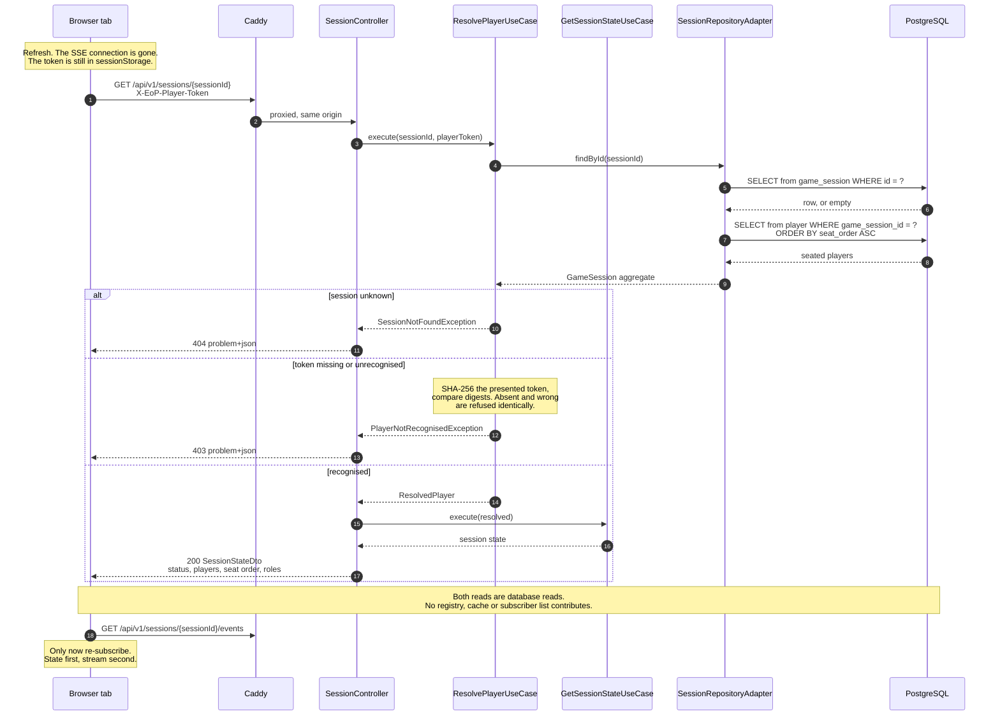

### Why this shape, and what it buys

**The reconnect path and the first-load path are the same request.** There is no
separate recovery endpoint and no recovery-only code. Consequently the recovery path is
exercised by every page load, rather than only when something has already gone wrong —
which is the opposite of how recovery code normally rots. This was the property ADR-014
was aiming at; this sequence is it, made concrete.

**`Last-Event-ID` is deliberately not honoured.** The browser sends it on an automatic
SSE reconnect, and the server ignores it. Honouring it would mean persisting an event
log — a second source of truth alongside the game state it describes — and after a
restart the log would be empty anyway. The EOP-8 spike confirmed the failure directly:
the event counter had reset to zero and the subscriber list was empty, so a client
reconnecting with `Last-Event-ID: 47` was asking for events the server had no memory
of.

**State first, stream second.** The client fetches state and only then subscribes. The
reverse order has a gap: an event arriving between subscribing and the state response
being rendered describes a change the client cannot yet place. Fetching first means the
stream only ever reports changes *after* a known-good baseline. There is still a
narrow window — an event fired between the state read committing and the subscription
being registered is lost — and the cost is bounded precisely because events carry no
state: the client's remedy is another re-read, which is this same sequence.

**Both reads are database reads, on purpose.** `SessionRepositoryAdapter.assemble`
reads the session row and then the player rows. Nothing is served from the emitter
registry or from any cache, which is what makes the first request after a restart
behave exactly like the thousandth request before it.

**403 rather than 401, and identical refusals.** There is no authentication scheme here
— no realm, nothing to retry differently — so a 401 with `WWW-Authenticate` would
advertise a challenge that does not exist. A missing token and a wrong token produce the
same 403, so the endpoint cannot be used to confirm which tokens are real.

### The custody and recovery path — both halves now work

**EOP-11 delivered both halves.** The token is written to `sessionStorage` under
`eop_session` on admission, and `App.tsx` rehydrates straight into the lobby on boot
(after checking the feature flag), so "a player refreshes and resumes" is an observable
behaviour of the product rather than a property of the server exercised only by tests
and `curl -H` (ADR-015).

The *failure* arm also works. The 403 that an expired session produces routinely under
ADR-036's 24-hour TTL is detected by branching on the numeric `status` carried by
`ApiError` — `err instanceof ApiError && (err.status === 403 || err.status === 404)` —
in both the `refreshSession` callback and the SSE subscription error handler in
`LobbyScreen.tsx` (the `onError` callback passed to `subscribeToSession` in `api.ts`;
`api.ts` constructs the `ApiError` and invokes the caller's `onError`, while the status
branching and the `onSessionEnd()` call live in `LobbyScreen`). Either path calls `onSessionEnd()`, which does
`sessionStorage.removeItem(STORAGE_KEY)` and returns the player to the home screen.
The re-read half of "a re-read, never a replay" works; the give-up half works too.

EOP-105 added a **third** route to that same exit, so the two error paths above are no
longer the whole set. `refreshSession` now also gives up when the re-read succeeds but
reports a terminal status: `sessionData.status === 'COMPLETED'` calls `onSessionEnd()`
and returns, before the `IN_PROGRESS` one-shot. That case is not an error — the fetch
returned 200 — which is why it needed its own branch rather than falling out of the
`ApiError` handling. It is reachable whenever the facilitator ends a session while
somebody is still sitting in the lobby: the `game-completed` doorbell arrives, the
lobby re-reads, and the status it gets back is one no lobby view can render. Before
EOP-105 `COMPLETED` was not even in the client's `SessionStatus` union, so that player
was stranded on a screen showing neither a Start button (gated on `LOBBY`) nor a "game
has started" notice (gated on `IN_PROGRESS`).

So the count to carry forward is **three** `onSessionEnd()` triggers in `LobbyScreen`,
not two: the `COMPLETED` branch, the 403/404 branch in `refreshSession`'s `catch`, and
the 403/404 branch in the SSE `onError`. `ABANDONED` deliberately has no branch — the
expiry sweep sets it and deletes the row in the same transaction, so the next fetch is
a 404 and the second route already covers it (see `SessionStatus`'s javadoc for why
that is a property of the only path that writes it today, not of the state itself).

**EOP-108 gave an HTTP `200` a new way to fail, and routed it to an outcome that already
existed rather than adding a fourth `onSessionEnd()` trigger — and that routing is the whole
point.** Be precise about what is new: the *outcome* (message rendered, player stays put) is not,
since any non-403/404 failure — a `500`, a dropped connection — has always reached the same
`catch`, hit `setError` and fallen through the 403/404 test. What EOP-108 added is a new **cause**
able to reach it, and an unprecedented one: a response the server considers successful. Since ADR-045 every
response body is parsed rather than asserted, so a `200` whose body is out of contract now
throws `ContractViolationError extends ApiError` with a synthetic `status = 502` instead of
flowing into React state. That reaches the same `catch`, and because `setError(message)` runs
*before* the `err.status === 403 || err.status === 404` test, a `502` renders the message
through the GOV.UK error summary and then falls through: the player stays in the lobby with
the previously validated state still rendered beneath the error, rather than being ejected.

Keeping it out of the give-up set is the correct call, and for a reason the three existing
triggers do not share. Those three are all judgements that *the session is over* — expired,
deleted, or terminal — and discarding the token is the right response to each. A contract
violation says nothing about the session; it says the **server sent something the client
cannot read**, which is very likely transient (a version skew between a deployed bundle and a
deployed API) and is certainly not grounds for destroying a token that may still be perfectly
valid. Calling `onSessionEnd()` here would convert a recoverable read failure into
irrecoverable data loss on the next `getSession` retry.

Two further properties of this outcome, both deliberate: the lifecycle transitions
(`status === 'COMPLETED'` → `onSessionEnd()`, and the `IN_PROGRESS` one-shot) sit *after* the
parse inside the same `try`, so a rejected payload cannot fire one — which is what makes the
"three triggers" count above still exact rather than merely approximately true. And the state
left on screen is stale-but-valid, never partial: ADR-045 explicitly rejected degrading to a
partial render, because dropping the offending field and rendering the rest would reinstate the
exact defect EOP-108 was raised to remove, an out-of-contract value producing a plausible UI.

So: **three** `onSessionEnd()` triggers, and **four** distinguishable outcomes of a
`refreshSession` call. Because the second count was previously asserted without being
enumerated — which makes it uncheckable, the defect this document exists to avoid — here it
is in full:

1. **Re-read succeeds, session live** — `setSession(sessionData)`, lobby re-renders. If the
   status is `IN_PROGRESS` the one-shot `onGameStarted` handoff fires as part of this outcome;
   it advances the view rather than ending the session, so it is not a fourth trigger.
2. **Re-read succeeds, status terminal** — `COMPLETED` calls `onSessionEnd()`. Trigger 1.
3. **Re-read fails with 403/404** — expired or deleted; `catch` calls `onSessionEnd()`.
   Trigger 2. (Trigger 3 is the same test in the SSE `onError`, not in this handler.)
4. **Re-read fails any other way** — a `500`, a transport error, or since EOP-108 a `200`
   whose body is out of contract: message rendered, token kept, player stays put.

Anyone extending this handler should keep the two counts separate, and should extend the
enumeration above rather than incrementing a bare number.

One asymmetry is worth stating plainly, because it is a consequence of the client
holding its own lifecycle rather than reading the server's. `COMPLETED` reaches the
client two ways and they land in different places. Observed by `GameScreen`, it arrives
through the `onGameOver` callback and `App.tsx` moves to `game-over`, which shows the
leaderboard. Observed by `LobbyScreen`, it goes to `onSessionEnd()` and thence to
`home`, discarding the stored token. That is intentional rather than an oversight: a
player still in the lobby never entered the game and has no score on the leaderboard,
so there is nothing for `game-over` to show them. The rule, stated in full as ADR-009
Decision 4, is that `view.screen` is the client's own state machine and the only thing
that decides which screen renders; `session.status` is consulted for two purposes and no
others — to *gate* what a screen renders while it is mounted (`LobbyScreen.tsx:267`
gates the Start button on `LOBBY`, `:279` gates the started-notice on `IN_PROGRESS`), and
to *leave* a screen the server has moved past. It is never the subject of a lookup that
maps a server state onto a screen name. Note that leaving a screen necessarily names
where you land — the lobby's `IN_PROGRESS` exit reaches `game`, though only when
`VITE_GAME_SCREEN_ENABLED` is `true`, since `App.tsx` gates that `setView` on the flag and
the container default is `false` (`ui/Dockerfile`); with the flag off the read leaves
nothing and `:279`'s gate shows the started-notice instead. Either way that is the same
transition seen from the other side, not a violation.

---

## 2. The SSE stream — subscribe, heartbeat, publish

Three interleaved lifecycles on one connection. The ordering in the first four steps is
the part worth being precise about.

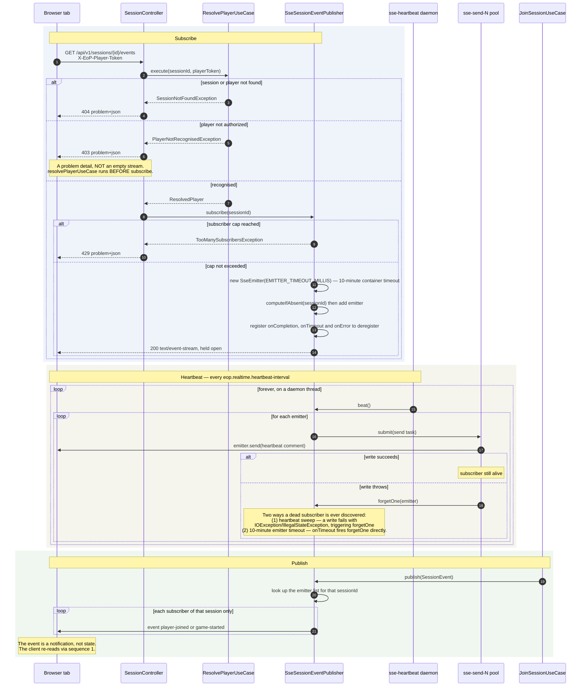

### Why `resolvePlayerUseCase` runs before `subscribe`

The handler body is two statements, in this order, and the order is the design:

```java
resolvePlayerUseCase.execute(sessionId, playerToken);
return sessionEventPublisher.subscribe(sessionId);
```

Subscribing first and authorising afterwards would mean the response had already
committed as `200 text/event-stream` before the refusal was known. The only remaining
way to reject would be to complete the stream with an error — or worse, to leave it open
and never write to it. An unrecognised caller would receive **an empty stream that looks
like a quiet lobby**, which is indistinguishable from a working connection to a session
where nothing is happening. That is the single most confusing failure this endpoint
could have.

Resolving first means the refusal happens while the response is still a normal HTTP
exchange, so it goes through `GlobalExceptionHandler` and arrives as an RFC 9457
problem detail with a 403 — the same refusal every other endpoint gives.

The credential arrives in the `X-EoP-Player-Token` **header**, and there is no
query-parameter fallback and no code path that would read one. The cost is that the
browser's `EventSource` cannot set headers, so the client must stream with `fetch`; the
alternative was writing a bearer credential into the proxy access log, the browser
history and the address bar of a screen being shared during the very meeting this game
is played in (ADR-019).

### Why the emitter has a 10-minute timeout

`new SseEmitter(EMITTER_TIMEOUT_MILLIS)` sets a 10-minute container timeout (ADR-034). Three reasons:

- **Stale connections are reclaimed.** A client that closes a browser tab without sending a TCP FIN
  (e.g., a laptop lid closed mid-game, a network partition, a crash) is otherwise invisible until
  the heartbeat thread next attempts a write. A 10-minute ceiling means the servlet container also
  closes the async request, returning the file descriptor regardless of whether the heartbeat has
  noticed.

- **Live connections are unaffected.** The heartbeat runs every `eop.realtime.heartbeat-interval`
  (a few seconds). Each successful send resets the container's idle timer, so a well-behaved
  subscriber receiving heartbeats will never reach the 10-minute ceiling.

- **Forced reconnect every 10 minutes is acceptable.** A client that hits the ceiling reconnects
  with `GET /api/v1/sessions/{sessionId}/events`. The `retry:` field written at subscribe time
  tells the browser to wait three seconds before reconnecting, giving a restart-safe reconnect
  without hammering the server.

`spring.mvc.async.request-timeout` is set to `600000` ms so the servlet container's own deadline
matches the emitter timeout exactly. Without this, the container can close the async request before
the emitter fires its own timeout, producing a misleading error log.

### What this sequence cannot do

**A dead subscriber is invisible until the next write or timeout.** The `alt` branch in the
heartbeat block is the *primary* place a broken connection is discovered — the heartbeat
write fails and `forgetOne` is called. The 10-minute emitter timeout provides a backstop:
`onTimeout` fires `forgetOne` directly, without waiting for a heartbeat write to fail.
Between the moment a client disappears and the next heartbeat (or at most ten minutes via
timeout), the registry still lists it. The
subscriber list therefore **over-reports** — measured in the EOP-8 spike, where two
already-dead clients were still counted as two — and must never be used as a presence
list or as an input to a game rule. `connectionStatus` in the state DTO is a display
hint that will sometimes say `CONNECTED` about someone who has gone away.

**A restart drops every subscriber and there is nothing to resume from.** The registry is
in memory and the heartbeat thread is a daemon. On restart both are gone, every client
reconnects, and every reconnect runs sequence 1 from scratch.

**Events are broadcast to a session, not to a player.** Every subscriber of a session
receives every event for it, including the player whose own action caused it. Clients
must tolerate seeing their own change echoed back — once as the HTTP response, once as
the event.

---

## 3. Create, join, start — and where concurrency is actually settled

Included because it is where [ADR-020](../adr/ADR-020-session-concurrency-control.md)
becomes visible, which no other diagram shows.

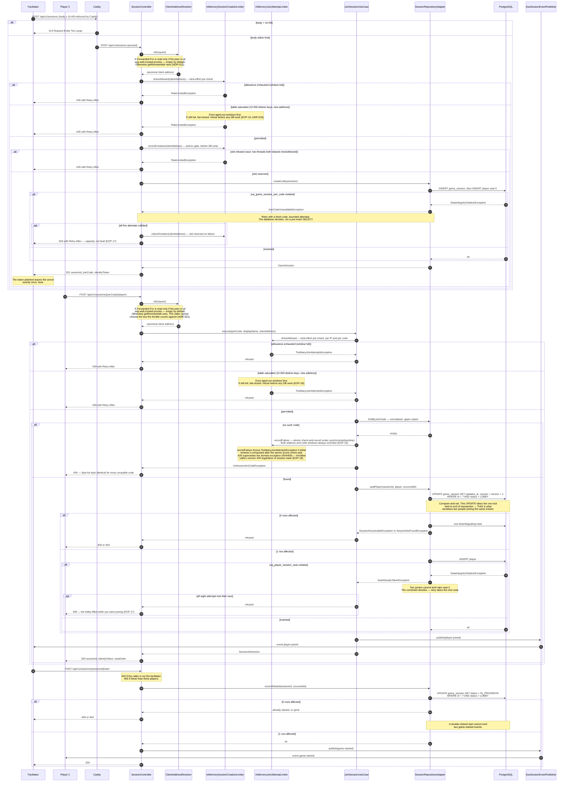

### What to take from this one

**The `UPDATE` before the `INSERT` is not housekeeping.** It looks like it only bumps
`updated_at`. It is in fact the lock acquisition that orders concurrent joiners on the
parent row before any of them inserts a child row, and it is the most
deletable-looking load-bearing statement in the story. Removing it would leave "two
players join while the facilitator starts" as a genuine race.

**Rows affected is the entire protocol.** One means the caller's assumption held; zero
means the world moved. Zero is not a statement failure — it is an answer, disambiguated
into 404 or 409 by one extra read that is only ever paid on a path already failing.

**Two guarantees come from the schema, not from Java.** `uq_game_session_join_code` and
`uq_player_session_seat` make duplicate codes and double-booked seats impossible. The
adapter writes optimistically and interprets the violation. A pre-insert `SELECT` would
narrow the race window without closing it.

**The limiter is checked first, and it is a primary control.** Six Crockford base32
characters is about thirty bits — unguessable only while guessing is slow. The 404 for
an unusable code is byte-for-byte identical whether the code never existed, was
mistyped, or belonged to an abandoned session, so the endpoint is not an oracle. But the
limiter's counters are in process memory, so **immediately after a restart every
attacker starts with a full allowance** (ADR-019).

**And the key it counts against is resolved before it, deliberately.** A throttle whose
bucket the caller can choose is not a throttle. Until EOP-26 `X-Forwarded-For` was
believed from anyone, so rotating it once per request gave a fresh empty window every
time; the header is now read only from a peer on the `eop.web.trusted-proxies`
allow-list, which is empty unless a deployment says otherwise (ADR-021).

**The creation limiter uses the same address resolution and the same reserve-before-work
principle.** `InMemorySessionCreationLimiter` (EOP-19, ADR-033) reserves a slot
*before* the database write and refunds it if the use case fails — so a refused request
never commits a row. The body-size cap (16 KB) is enforced by Caddy before the request
reaches the application; there is no application-side cap (the `max-swallow-size`
property does not cap request bodies and was deliberately not added).

---

## 4. Dealing the hands — a second write that claims the deal

The first of the three sequences EOP-14 Slice C2 owed this document. It begins where
sequence 3 ends: the session is already `IN_PROGRESS`, because
`StartSessionUseCase` committed that transition in a separate request.
[ADR-025](../adr/ADR-025-dealing-is-its-own-use-case.md) argues that seam.

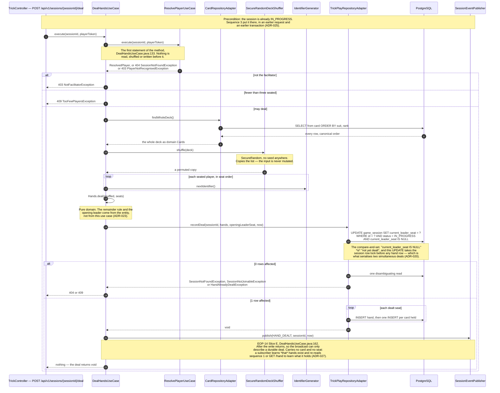

### What this sequence settles, and the window it leaves

**The deal is a second write, and nothing in the diagram hides that.** Between the
`UPDATE` in sequence 3 that sets `status = IN_PROGRESS` and the `UPDATE` here that claims
`current_leader_seat`, there is a state the product has never had before: **started but
undealt**. It is observable — every trick-play read answers `HandNotDealtException` with a
409 — and it is recoverable, because the `current_leader_seat IS NULL` predicate makes a
repeated deal idempotent rather than a double deal. ADR-025 records both, and now also
records that the seam is a *choice* with a stated cost rather than a physical necessity.

**No pre-check guards a state the conditional write already arbitrates.** There is no
"is it started?" read and no "is it already dealt?" read before `recordDeal`. Adding
either would introduce a check-then-act window that the single conditional `UPDATE` does
not have, and would make the refusal depend on a read taken at a different instant from
the write it justifies (ADR-020).

**The shuffle is drawn as a participant because it is a security control.** Deck
composition is published reference data, so a predictable permutation is a predictable
hand. `SecureRandomDeckShuffler` takes no seed in any constructor, and the use case holds
the `DeckShuffler` port rather than a `java.util.Random`, so no caller can weaken the
choice by passing a seeded generator.

**The whole deck is read in one call, deliberately not a page.** `findWholeDeck()` returns
every card in canonical order (suit, then ascending rank); randomising is the use case's
job. A paginated deal would be one forgotten loop away from a truncated deck, and a
canonical order means a test can pin a deal by pinning the shuffler.

**The deal is broadcast, after it is durable.** `DealHandsUseCase` takes a
`SessionEventPublisher` and publishes `HAND_DEALT` at `DealHandsUseCase.java:162`, on the
line after `recordDeal` returns. The ordering is the decision: a broadcast that preceded
the write could announce a deal that then rolled back, and a publisher that threw could
fail a request whose write had already succeeded. What the event does *not* carry is any
part of the deal — no seat, no card, no count — so a subscriber still re-reads to learn
what it holds, which is what keeps a per-player hand off a fan-out transport
([ADR-027](../adr/ADR-027-singleton-subresource-naming.md)). Slice D minted the name in the
contract; Slice E published it, closing the first half of decision 8 of
[ADR-025](../adr/ADR-025-dealing-is-its-own-use-case.md), which is amended in place to say
so.

---

## 5. Playing a card — build the play, then open the trick

The ordering in the "build, then write" block is the whole point of this sequence, and it
is what commit `fcb6fd5` fixed: the candidate `TrickPlay` is constructed **before**
`openTrick` commits a trick row, so a play that the domain will refuse for a bad note or
a bad component name cannot leave an open trick behind it.

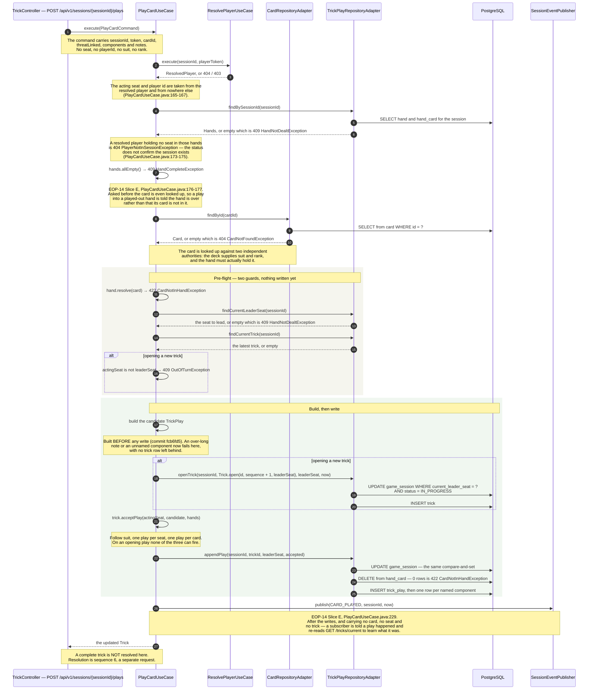

### Why the pre-flight duplicates the domain, and why that is not belt-and-braces

**The two pre-flight guards buy ordering, not safety.** `Trick.acceptPlay` and `Hand`
already refuse a card the seat does not hold and a play out of turn; checking first
changes nothing about what is *permitted*. What it changes is what is *left behind*.
Without the turn-order guard, an out-of-turn opening play would commit a trick row and
only then be refused, leaving an open trick nobody may play into. Without
`hand.resolve(card)`, a play of a card the seat does not hold would surface as an
`IllegalStateException` and a 500 instead of a 422. Slice E added a third guard above the
rect, `hands.allEmpty()` at `PlayCardUseCase.java:176-177`, for the same reason one step
earlier: a play into a hand that has been played out now answers 409 `HandCompleteException`
rather than reporting that some particular card is not held, which was the only answer
available before the end of a hand had a name.

**The leader seat always comes from the read, never from the caller.** It is the
compare-and-set witness of ADR-020: `openTrick`, `appendPlay` and `recordResolution` all
compare `current_leader_seat` against the value this use case read, so a stale request
loses the race rather than overwriting it. A caller-supplied witness would let a client
choose which race it wins.

**The window that remains, and what closes it.** `openTrick` still commits before
`acceptPlay` runs, so a refusal from `acceptPlay` on an *opening* play would still orphan
a trick row. That path is argued closed by exhaustion over `Trick.acceptPlay`'s current
refusals — on an opening play there is no led suit to follow and the trick is empty, so the
duplication invariants in `Trick`'s constructor have nothing to duplicate; `NotYourSeatException`
is inexpressible because the candidate is built with the acting seat itself; `PlayerMismatchException`
cannot fire because the seat-to-player map is frozen once the session leaves `LOBBY`; and the
remainder are pre-flighted above. The
argument is only as good as that list: **any refusal added to `acceptPlay` or to `Trick`'s
constructor reopens
the window**, which is why ADR-025 records the reasoning rather than only the conclusion — as a
table, row by row against the method, in its decision 9.

**The play is broadcast, after the writes.** `PlayCardUseCase` takes a
`SessionEventPublisher` and publishes `CARD_PLAYED` at `PlayCardUseCase.java:229`, once
`appendPlay` has returned. The event names the session and nothing else: not the card,
not the seat, not the trick. That is what makes it safe on a fan-out transport where
every subscriber of a session receives every event — the other players learn *that* the
table moved and re-read `GET /tricks/current` to learn whose turn it now is, and a
per-player hand never crosses the stream ([ADR-027](../adr/ADR-027-singleton-subresource-naming.md)).
This closes the second half of decision 8 of
[ADR-025](../adr/ADR-025-dealing-is-its-own-use-case.md), amended in place to say so.
Delivery is not ordered and not guaranteed, so a client that missed an event is in
exactly the position it was in before Slice E: it re-reads.

---

## 6. Resolving a trick — mechanical, and open to any member

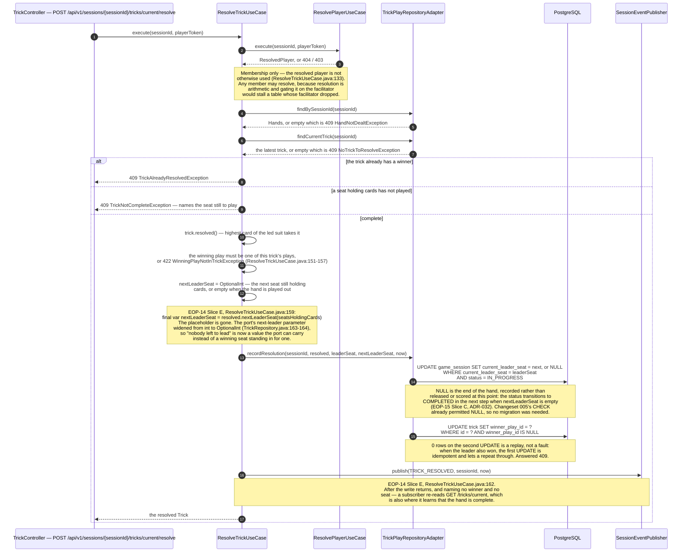

### What this sequence says about authority and about end of hand

**Two different authorisation answers, on purpose.** Dealing is facilitator-only;
resolving is open to any member. The difference is that dealing chooses something —
who holds what — while resolving computes something that is already determined by the
cards on the table. Requiring the facilitator to resolve would add a way for a table to
stop making progress without adding a way for it to be cheated.

**`TrickNotCompleteException` discloses a seat number, and that is deliberate.** The
refusal names the seat still to play so a client can say whose turn it is without a
second request. A seat ordinal is not a secret — the state DTO already lists every seat
to every member — and the refusal is only reachable by a caller already resolved as a
member of that session (ADR-005 for the problem-detail shape).

**End of hand is recognised here, and the placeholder is gone.** When no seat holds a
card, `Trick.nextLeaderSeat(seatsHoldingCards)` returns an empty `OptionalInt` and
`ResolveTrickUseCase.java:159` passes it straight through, because
`TrickRepository.recordResolution`'s next-leader parameter widened from `int` to
`OptionalInt` (`TrickRepository.java:163-164`). `advanceLeaderSeat` then writes
`current_leader_seat = NULL`. No migration was needed: changeset `005`'s CHECK already
permitted null. Before Slice E the same situation wrote the winning seat as a stand-in,
which was harmless only because nobody could play — it was a placeholder rather than a
meaning, and [ADR-025](../adr/ADR-025-dealing-is-its-own-use-case.md)'s consequences
pinned it to that one line, now amended in place to record its deletion.

**What that NULL costs, and what it does not buy.** The column now carries two meanings —
"not yet dealt" and "played out, nobody leads" — so it is no longer the whole deal-once
gate on its own; a second deal into a played-out session is refused one statement later by
`uq_hand_session_seat`, as the same 409, and
[ADR-020](../adr/ADR-020-session-concurrency-control.md) is amended with both that
narrowing and the sixth answer `sessionMoved` gained to tell the two null states apart.
What the NULL does *not* do on its own is finish the game: the session status stays
`IN_PROGRESS` until `ResolveTrickUseCase` calls `SessionRepository.recordCompleted` in the
same execution, after `recordResolution` returns. A client learns the hand is over from
`handComplete` on `GET .../tricks/current` — `GetTrickStateUseCase.java:114`, computed from
`Hands.allEmpty()` — or from a 409 `HandCompleteException` if it tries to play anyway. The
`COMPLETED` transition and the `GAME_COMPLETED` event are sequence 8 below;
[ADR-032](../adr/ADR-032-end-of-game-transitions.md) records the design choices and the
two-transaction race that the auto-complete branch tolerates.

---

## 7. Reading the score — derived on every read, gated by nothing but membership

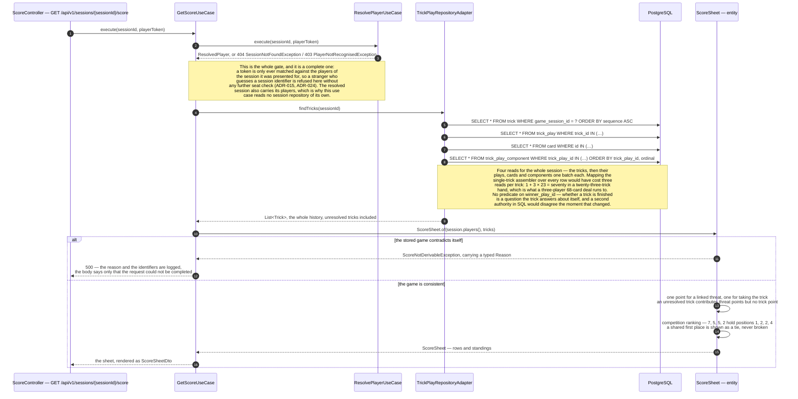

### What this sequence settles, and what it deliberately does not

**Nothing is accumulated, so nothing can drift.** The score is a pure function of the plays
and each trick's winner, recomputed on every read. There is no counter to increment on the
play path, so there is no second transaction to fail independently and no total that can be
wrong with no read able to detect it. The cost is bounded by the rules of the game rather than
by a limit in code — a 68-card deck is at most 68 rows and at most six standings — which is
why ADR-030 accepts the recomputation and declines to cache it.

**There is no 409 on this path, and its absence is the interesting part.** Every other read
in this document can be asked before the state it reports exists: `GET /tricks/current` answers
`HandNotDealtException` before the deal, because there is no state of play to report. A score
before the deal is different — everybody on nothing is a *true* answer, not a missing one. That
is why this use case reaches neither `HandRepository` nor the session's status: it has nothing
to refuse. `GetScoreUseCaseTest` pins it, and so does the HTTP test that reads a score from a
started table before a card is played.

**A contradiction is a server fault, not the caller's mistake.** The eight refusals inside
`ScoreSheet` and `ScoredPlay` all mean the stored game disagrees with itself — a play attributed
to a seat nobody occupies, two tricks claiming one sequence number. None is actionable by any
caller, so all eight became one `ScoreNotDerivableException` mapped to 500 with a body
byte-identical to the no-tampering-card fault. Before slice B they were `IllegalArgumentException`,
which the global handler answers **400 with the message echoed** — so a data contradiction would
have been reported as a bad request and would have echoed a player identifier back to whoever
guessed the session. The reason survives in the log, where it is useful; nothing survives in the
response, where it would only be a hint.

**This sequence does not end the game.** Reading a score changes no state and moves no session
out of `IN_PROGRESS` or `COMPLETED`. Sequence 6 records the end of a *hand* by writing a NULL
leader seat; this one reports what that hand was worth. Sequence 8 below shows how the session
reaches `COMPLETED` — automatically when the last trick resolves, or early via the facilitator's
`POST /end`.

---

## 8. Ending the game — automatic on last trick, or early by the facilitator

Two paths lead to `COMPLETED`. The automatic path fires inside `ResolveTrickUseCase` when
`nextLeaderSeat` is empty (sequence 6 above). The facilitator path is a separate HTTP call.
Both are gated on `eop.features.trick-play`.

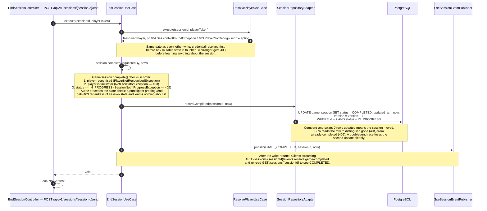

### Automatic path (inside sequence 6)

When `nextLeaderSeat` is empty after `recordResolution` commits, `ResolveTrickUseCase`
calls `recordCompleted` and publishes `GAME_COMPLETED` in the same execution — but in a
**second, separate transaction**. If a facilitator's `POST /end` wins the `advanceStatus`
race in the window between the two commits, `recordCompleted` finds zero rows and would
throw `SessionNotInProgressException`. The session is already `COMPLETED` — the desired
outcome — so the auto-complete branch catches that exception and treats it as success.
The trick resolution was already durably committed and `TRICK_RESOLVED` already published;
the caller receives the resolved trick normally. ADR-032 records this choice.

### What this sequence settles

**Authz precedes state.** `GameSession.complete()` checks facilitator status before
checking `IN_PROGRESS`, so a participant probing `/end` gets 403 regardless of session
state and learns nothing about it.

**Score is still readable after early end.** `GET /score` is status-agnostic; it returns
the score of the plays made, which may be a partial game. The facilitator ends early
because the group has reached a conclusion, not because the score is meaningless.

**`GAME_COMPLETED` carries no payload.** Consistent with ADR-014: the event names the
session and the time; a subscriber re-reads `GET /sessions/{sessionId}` to see `COMPLETED`
and `GET /sessions/{sessionId}/score` for the final standings.

### What the client does with `COMPLETED` (EOP-105)

The sequence above stops at the doorbell, which is where the server's responsibility
ends but not where the flow does. Two different clients re-read and take two different
actions, and which one a given player gets depends on the screen they were on when the
facilitator ended the session:

| Player was on | Re-read happens in | Destination |
|---|---|---|
| `GameScreen` (playing) | the trick/`game-completed` handling | `game-over` — leaderboard and final standings |
| `LobbyScreen` (never joined the play) | `refreshSession`, on the same doorbell | `home`, via `onSessionEnd()`, which clears the stored token |

That divergence is deliberate. A player still in the lobby has no plays and therefore no
row worth showing on a leaderboard, so returning them to the front door is the honest
outcome rather than a score screen full of zeroes. The governing rule, stated in full in
"The custody and recovery path" above and as ADR-009 Decision 4: `view.screen` is the
client's own state machine and the only thing deciding which screen renders, and
`session.status` is read to *gate* what a mounted screen shows and to *leave* a screen
the server has moved past — never as a lookup mapping a server state onto a screen name.

Before EOP-105 the lobby had no branch at all here, because `COMPLETED` was missing from
the client's `SessionStatus` union — so this doorbell left that player on a lobby screen
with neither a Start button nor a "game has started" notice, indefinitely.

---

## Sequence 9 — Expired-session sweep (EOP-22)

**Precondition:** `eop.features.session-lifecycle=true` (flag off → `ExpiredSessionSweepScheduler`
bean absent, sweep never fires). One or more sessions have `expires_at < now`.

**Actors:** `ExpiredSessionSweepScheduler` (Spring `@Scheduled` adapter), `SweepExpiredSessionsUseCase`,
`SessionRepositoryAdapter`, PostgreSQL.

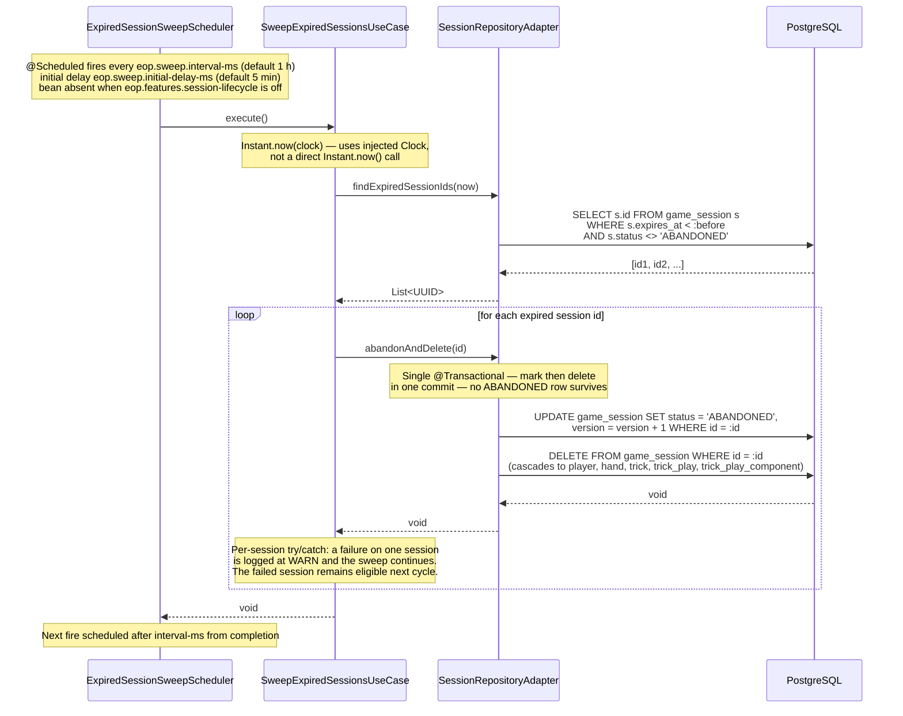

### What this sequence settles

**The sweep is a background driver, not a domain rule.** `SweepExpiredSessionsUseCase` owns the
policy (which sessions to delete, how to handle per-session failures); `ExpiredSessionSweepScheduler`
owns only the trigger. The use case is testable without Spring; the scheduler is a thin adapter.

**Expiry is enforced at the `ResolvePlayerUseCase` boundary.** `ResolvePlayerUseCase` rejects any
request whose session has `expiresAt < now(clock)` with 403 `"Session expired"`. The sweep then
removes the row so it does not accumulate indefinitely. The two checks are independent: the guard
fires on every authenticated request; the sweep fires on a schedule.

**Accepted limitation — the join path is not guarded.** `JoinSessionUseCase` does not check
`session.expiresAt()`. A player can join an expired `LOBBY` session via join code and receive a
token; that token will be rejected by `ResolvePlayerUseCase` on the next call. The gap is
documented in ADR-036 and deferred to a future story.

**The ABANDONED write is not observable.** `markAbandoned` and `deleteById` share a transaction, so
no row ever commits with `status = ABANDONED`. The UPDATE exists to bump the version column (optimistic
locking) and to make the intent legible in the code; the net committed effect is the delete. The
`LOG.info` line in `SweepExpiredSessionsUseCase` is the only audit record that a session was swept.

**Single-instance assumption.** Two replicas sweeping the same ID set concurrently will both attempt
the same deletes; the second attempt is silently ignored — `deleteById` on a missing row is a no-op
(`findById(id).ifPresent(this::delete)`), so no exception is thrown and no warning is logged. The
application is deployed as a single container (ADR-012, ADR-016), so this is not a current concern,
but it is an unstated precondition for any future multi-instance deployment. ADR-036 records the
assumption and defers distributed coordination to a future story.

**Clock authority.** `expires_at` is set by the domain at `openLobby()` time using the injected
`Clock` (`GameSession.java:106`). The database column carries a `defaultValueComputed` expression
only as a fallback for rows inserted outside the domain (e.g. test fixtures via raw JDBC). The
sweep compares against the same application JVM `Clock`. Under clock skew between the JVM and the
database, the DB default may produce a slightly different expiry than the domain would — but the
domain path is authoritative for all production inserts. ADR-036 §2 records this as a known
limitation.

## Sequence 10 — Browser play-a-card round trip (EOP-60)

The `GameScreen` component (behind `VITE_GAME_SCREEN_ENABLED`) uses the SSE doorbell
pattern from ADR-014: the event carries no payload; the client re-fetches authoritative
state on every notification. This sequence shows one complete card-play cycle from the
player's gesture to the re-rendered table.

**Precondition:** session is `IN_PROGRESS`, hands have been dealt, it is the player's
turn (`seatToPlay` matches the player's seat).

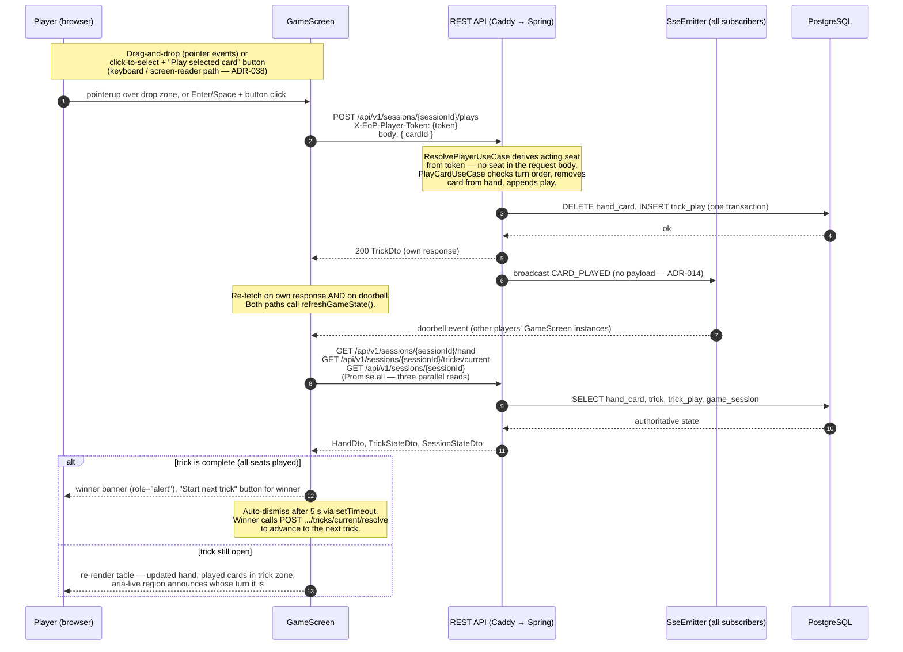

### What this sequence settles

**The client never trusts its own play.** The `200 TrickDto` from the POST is used only
to trigger a re-fetch; the re-fetch is what drives the render. This means the table
always reflects the database, not an optimistic local state.

**The doorbell is the same mechanism as the lobby.** `subscribeToSession` in `api.ts`
uses `fetch` + `AbortController` (not `EventSource`) so the player token can travel as a
header rather than a query parameter — the same reasoning as ADR-015 and ADR-019.

**Turn enforcement is server-side.** The client disables cards and hides the play button
when `seatToPlay` does not match the player's seat, but this is a UX convenience only.
`PlayCardUseCase` derives the acting seat from the resolved token and throws
`OutOfTurnException` (409) if it does not match the current leader seat. A caller cannot
name a seat it does not hold — `PlayCardRequest` carries no seat field.

**The winner banner fires on `trickState.complete`, not on a client-side count.** The
`complete` flag on `TrickStateDto` is computed by `GetTrickStateUseCase` from
`Hands.allEmpty()` and the trick's play count; the client reads it, never derives it.

---

## Sequence 11 — Game-over leaderboard (EOP-65)

`GET /api/v1/sessions/{sessionId}/leaderboard` — available only when `eop.features.game-over=true`.

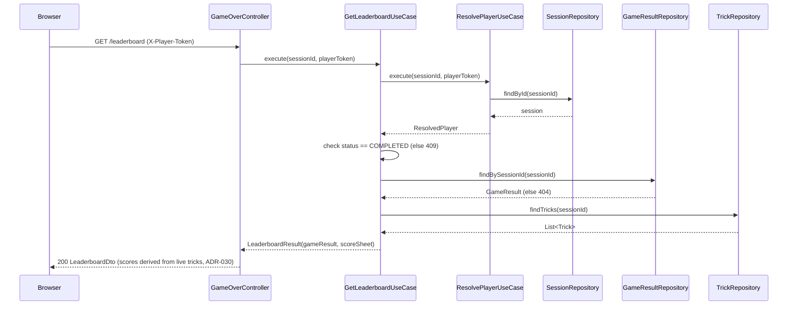

**Scores are always derived from the live trick history** (ADR-030). The `GameResult` row is used
only to confirm a result was recorded; `ScoreSheet.standings()` and
`ScoreSheet.capturedBySuitByPlayer()` compute the actual numbers.

---

## Sequence 12 — New-game reset (EOP-65)

`POST /api/v1/sessions/{sessionId}/new-game` — facilitator only, COMPLETED sessions only.
Non-atomic four-step sequence (ADR-039).

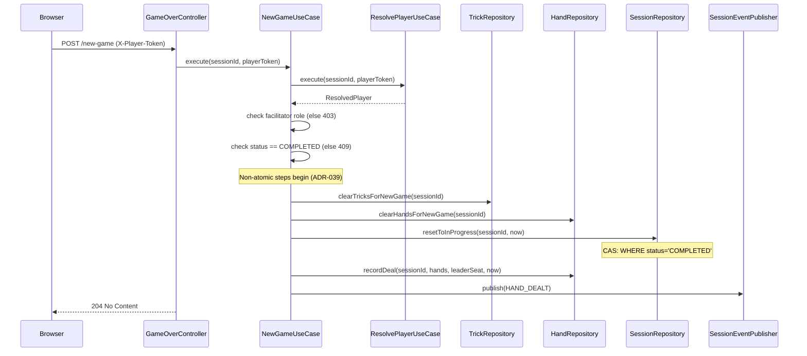

**Non-atomicity:** the four steps (clear tricks, clear hands, reset status, re-deal) are separate
port calls. A partial failure leaves the session in an inconsistent state, but the facilitator can
retry — the CAS on `resetToInProgress` prevents a double-reset. See ADR-039 for the accepted
trade-off.

---

## Related

- [`C4-Diagrams.md`](C4-Diagrams.md) — the containers and components these sequences move through
- [ADR-014](../adr/ADR-014-realtime-transport.md) — SSE, the mandatory heartbeat, and why reconnection re-reads
- [ADR-019](../adr/ADR-019-session-lifecycle-and-join-codes.md) — the five routes, header-only stream auth, and the join code
- [ADR-020](../adr/ADR-020-session-concurrency-control.md) — compare-and-set on `status`, the row lock, and the unique constraints
- [ADR-021](../adr/ADR-021-trusted-proxy-forwarded-for.md) — how `clientAddress` is decided, and why the header is ignored by default
- [ADR-015](../adr/ADR-015-player-identity.md) — the token, its digest, and the client half that is not built yet
- [ADR-005](../adr/ADR-005-error-handling-strategy.md) — where every refusal above becomes a problem detail
- [ADR-023](../adr/ADR-023-deal-remainder-and-turn-order.md) — the remainder rule, turn order, and what the schema deliberately does not enforce
- [ADR-024](../adr/ADR-024-trick-play-persistence-boundary.md) — the trick-play ports, and why authorisation is the use case's job
- [ADR-025](../adr/ADR-025-dealing-is-its-own-use-case.md) — why dealing is its own use case, and the started-but-undealt window
- [ADR-027](../adr/ADR-027-singleton-subresource-naming.md) — why a hand is read per player, which is why no broadcast above carries one
- [ADR-028](../adr/ADR-028-end-of-hand-without-release-or-score.md) — why the end of a hand is reported but neither released nor scored, and why the flag stays off
- [ADR-030](../adr/ADR-030-scoring-is-derived-not-accumulated.md) — scores are always derived from tricks, never read from stored standings
- [ADR-032](../adr/ADR-032-end-of-game-transitions.md) — end-of-game design choices: auto-complete placement, no new DB column, two-transaction race, facilitator-only early end
- [ADR-036](../adr/ADR-036-session-expiry-and-sweep.md) — session expiry TTL, the sweep scheduler, and the single-instance deployment assumption
- [ADR-039](../adr/ADR-039-new-game-reset.md) — new-game reset: COMPLETED→IN_PROGRESS via non-atomic multi-step sequence
- [`docs/api/openapi.yml`](../api/openapi.yml) — the authored contract for all seven trick-play routes
