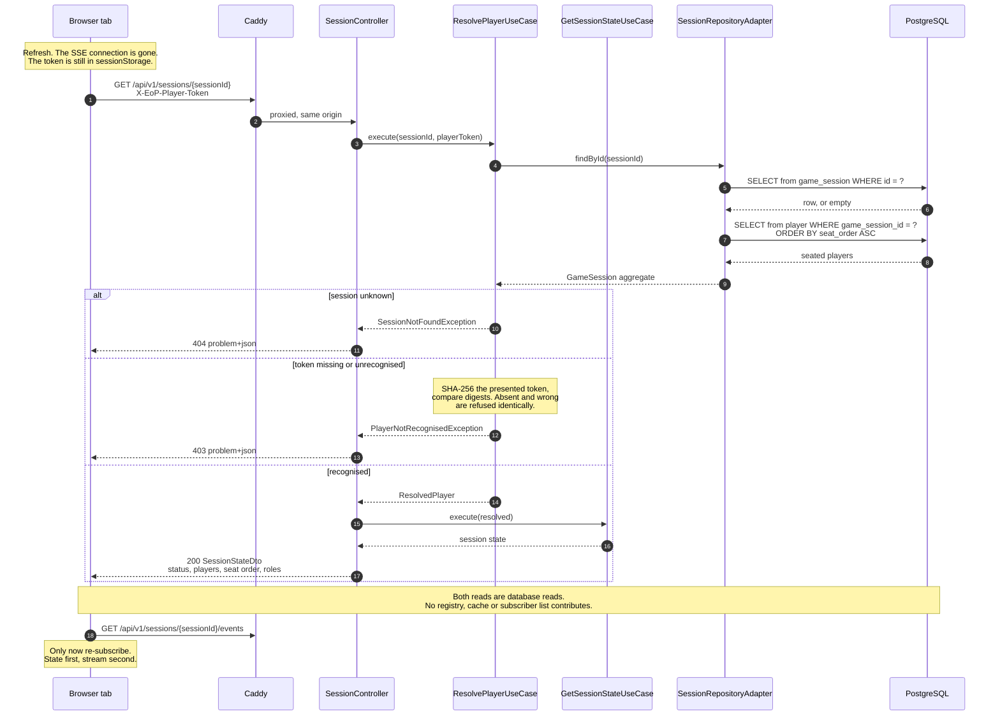
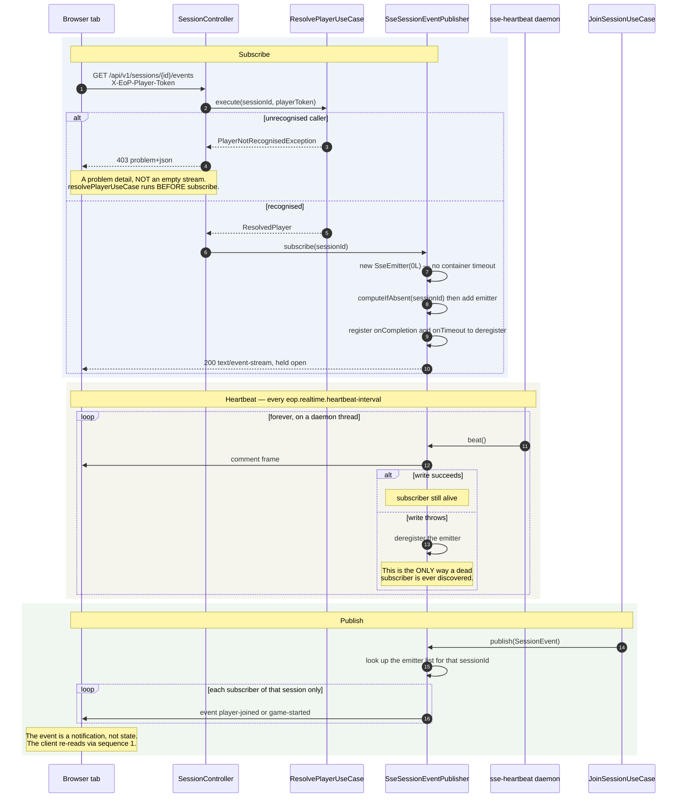
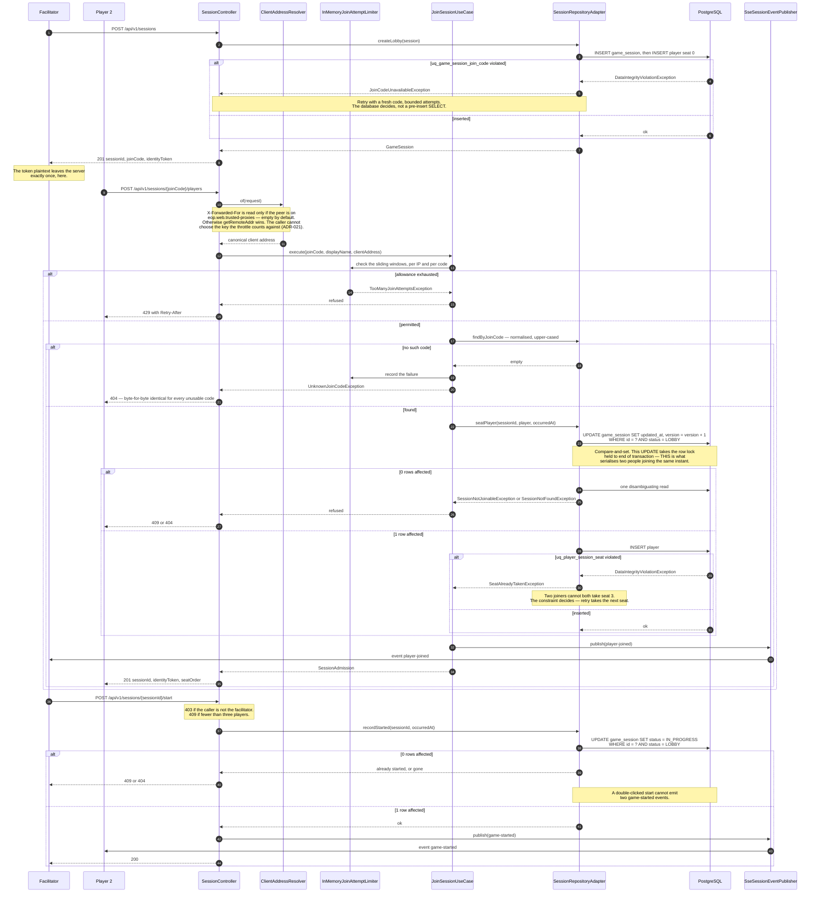

# Runtime View

Dynamic behaviour of the session lifecycle, in Mermaid `sequenceDiagram` form. The
static counterpart — what exists and how it is wired — is
[`C4-Diagrams.md`](C4-Diagrams.md).

Everything here reflects the code as it stands after **EOP-14 Slice B** (the trick-play schema,
Liquibase changeset `004`), including the client-address resolution from EOP-26 (ADR-021). The
sequences themselves are still the EOP-10 session lifecycle, and that is not staleness: **Slice B
changes no sequence in this document and adds none.** It is schema-only — five tables created,
`game_session` altered, one unique constraint added to `player`, six unique constraints and ten
foreign keys in total — with no use case, controller, adapter or endpoint touched, so there is no
new runtime interaction to draw. Dealing a hand and playing a card have no sequence here because
no code performs them yet; Slice C is where that behaviour, and the diagrams for it, arrive. The
one thing Slice B does change about runtime behaviour is the *failure mode* of writes that already
have sequences below: a forged seat and a ghost player are now rejected by the database rather
than reaching it, which [ADR-023](../adr/ADR-023-deal-remainder-and-turn-order.md) records — in
the second and fourth of the four Slice C obligations under *What changeset `004` deliberately
does not enforce* — as still owing a use-case-level rejection, so the caller sees a 403-shaped
refusal rather than a constraint violation. Those obligations now name the refusal: 403 with
`NotYourSeatException` for a member at a seat it does not hold, and 404 with
`PlayerNotInSessionException` for a caller outside the session, the 404 chosen so the status does
not itself disclose that the session exists. If a future slice adds or alters an interaction, this
sentence is the first thing to correct — the previous version of it claimed EOP-10 two stories
after that stopped being the whole truth.

Where a sequence has a weakness, the prose says so rather than leaving the diagram to imply
everything is fine.

---

## 1. The reconnect path — a re-read, never a replay

This is the most important sequence in the application, and the one whose absence from
the documentation was most costly: it is load-bearing in **both** ADR-014 and ADR-019,
and neither ADR draws it.

A player refreshes, or their laptop wakes, or the container was rebuilt underneath
them. They call `GET /api/v1/sessions/{sessionId}` and get the complete current state
back. **No events are replayed, because none were ever kept.**



### Why this shape, and what it buys

**The reconnect path and the first-load path are the same request.** There is no
separate recovery endpoint and no recovery-only code. Consequently the recovery path is
exercised by every page load, rather than only when something has already gone wrong —
which is the opposite of how recovery code normally rots. This was the property ADR-014
was aiming at; this sequence is it, made concrete.

**`Last-Event-ID` is deliberately not honoured.** The browser sends it on an automatic
SSE reconnect, and the server ignores it. Honouring it would mean persisting an event
log — a second source of truth alongside the game state it describes — and after a
restart the log would be empty anyway. The EOP-8 spike confirmed the failure directly:
the event counter had reset to zero and the subscriber list was empty, so a client
reconnecting with `Last-Event-ID: 47` was asking for events the server had no memory
of.

**State first, stream second.** The client fetches state and only then subscribes. The
reverse order has a gap: an event arriving between subscribing and the state response
being rendered describes a change the client cannot yet place. Fetching first means the
stream only ever reports changes *after* a known-good baseline. There is still a
narrow window — an event fired between the state read committing and the subscription
being registered is lost — and the cost is bounded precisely because events carry no
state: the client's remedy is another re-read, which is this same sequence.

**Both reads are database reads, on purpose.** `SessionRepositoryAdapter.assemble`
reads the session row and then the player rows. Nothing is served from the emitter
registry or from any cache, which is what makes the first request after a restart
behave exactly like the thousandth request before it.

**403 rather than 401, and identical refusals.** There is no authentication scheme here
— no realm, nothing to retry differently — so a 401 with `WWW-Authenticate` would
advertise a challenge that does not exist. A missing token and a wrong token produce the
same 403, so the endpoint cannot be used to confirm which tokens are real.

### The weakness in this path today

The token has to come from somewhere, and **on the client it currently comes from
nowhere.** `ui/` holds only a health-check shell; `sessionStorage` appears nowhere in
it. So the sequence above is fully implemented server-side and cannot yet be executed by
the real front end — it is exercised by tests and by `curl -H`. EOP-11 delivers the
custody half. Until then, "a player refreshes and resumes" is a property of the server,
not an observable behaviour of the product (ADR-015).

---

## 2. The SSE stream — subscribe, heartbeat, publish

Three interleaved lifecycles on one connection. The ordering in the first four steps is
the part worth being precise about.



### Why `resolvePlayerUseCase` runs before `subscribe`

The handler body is two statements, in this order, and the order is the design:

```java
resolvePlayerUseCase.execute(sessionId, playerToken);
return sessionEventPublisher.subscribe(sessionId);
```

Subscribing first and authorising afterwards would mean the response had already
committed as `200 text/event-stream` before the refusal was known. The only remaining
way to reject would be to complete the stream with an error — or worse, to leave it open
and never write to it. An unrecognised caller would receive **an empty stream that looks
like a quiet lobby**, which is indistinguishable from a working connection to a session
where nothing is happening. That is the single most confusing failure this endpoint
could have.

Resolving first means the refusal happens while the response is still a normal HTTP
exchange, so it goes through `GlobalExceptionHandler` and arrives as an RFC 9457
problem detail with a 403 — the same refusal every other endpoint gives.

The credential arrives in the `X-EoP-Player-Token` **header**, and there is no
query-parameter fallback and no code path that would read one. The cost is that the
browser's `EventSource` cannot set headers, so the client must stream with `fetch`; the
alternative was writing a bearer credential into the proxy access log, the browser
history and the address bar of a screen being shared during the very meeting this game
is played in (ADR-019).

### Why the emitter has no timeout

`new SseEmitter(0L)` disables the servlet container's own timeout entirely. That is safe
**only** because the heartbeat exists. A lobby waiting for a third player is idle by
nature, sometimes for minutes; a container timeout would close healthy connections and
present as a flaky server. So detecting a dead peer is deliberately this class's job
rather than the container's — and the heartbeat is the mechanism, not a nicety.

### What this sequence cannot do

**A dead subscriber is invisible until the next write.** The `alt` branch in the
heartbeat block is the *only* place a broken connection is ever discovered. Between the
moment a client disappears and the next heartbeat, the registry still lists it. The
subscriber list therefore **over-reports** — measured in the EOP-8 spike, where two
already-dead clients were still counted as two — and must never be used as a presence
list or as an input to a game rule. `connectionStatus` in the state DTO is a display
hint that will sometimes say `CONNECTED` about someone who has gone away.

**A restart drops every subscriber and there is nothing to resume from.** The registry is
in memory and the heartbeat thread is a daemon. On restart both are gone, every client
reconnects, and every reconnect runs sequence 1 from scratch.

**Events are broadcast to a session, not to a player.** Every subscriber of a session
receives every event for it, including the player whose own action caused it. Clients
must tolerate seeing their own change echoed back — once as the HTTP response, once as
the event.

---

## 3. Create, join, start — and where concurrency is actually settled

Included because it is where [ADR-020](../adr/ADR-020-session-concurrency-control.md)
becomes visible, which no other diagram shows.



### What to take from this one

**The `UPDATE` before the `INSERT` is not housekeeping.** It looks like it only bumps
`updated_at`. It is in fact the lock acquisition that orders concurrent joiners on the
parent row before any of them inserts a child row, and it is the most
deletable-looking load-bearing statement in the story. Removing it would leave "two
players join while the facilitator starts" as a genuine race.

**Rows affected is the entire protocol.** One means the caller's assumption held; zero
means the world moved. Zero is not a statement failure — it is an answer, disambiguated
into 404 or 409 by one extra read that is only ever paid on a path already failing.

**Two guarantees come from the schema, not from Java.** `uq_game_session_join_code` and
`uq_player_session_seat` make duplicate codes and double-booked seats impossible. The
adapter writes optimistically and interprets the violation. A pre-insert `SELECT` would
narrow the race window without closing it.

**The limiter is checked first, and it is a primary control.** Six Crockford base32
characters is about thirty bits — unguessable only while guessing is slow. The 404 for
an unusable code is byte-for-byte identical whether the code never existed, was
mistyped, or belonged to an abandoned session, so the endpoint is not an oracle. But the
limiter's counters are in process memory, so **immediately after a restart every
attacker starts with a full allowance** (ADR-019).

**And the key it counts against is resolved before it, deliberately.** A throttle whose
bucket the caller can choose is not a throttle. Until EOP-26 `X-Forwarded-For` was
believed from anyone, so rotating it once per request gave a fresh empty window every
time; the header is now read only from a peer on the `eop.web.trusted-proxies`
allow-list, which is empty unless a deployment says otherwise (ADR-021).

---

## Related

- [`C4-Diagrams.md`](C4-Diagrams.md) — the containers and components these sequences move through
- [ADR-014](../adr/ADR-014-realtime-transport.md) — SSE, the mandatory heartbeat, and why reconnection re-reads
- [ADR-019](../adr/ADR-019-session-lifecycle-and-join-codes.md) — the five routes, header-only stream auth, and the join code
- [ADR-020](../adr/ADR-020-session-concurrency-control.md) — compare-and-set on `status`, the row lock, and the unique constraints
- [ADR-021](../adr/ADR-021-trusted-proxy-forwarded-for.md) — how `clientAddress` is decided, and why the header is ignored by default
- [ADR-015](../adr/ADR-015-player-identity.md) — the token, its digest, and the client half that is not built yet
- [ADR-005](../adr/ADR-005-error-handling-strategy.md) — where every refusal above becomes a problem detail
- [`docs/api/openapi.yml`](../api/openapi.yml) — the authored contract for all five routes
